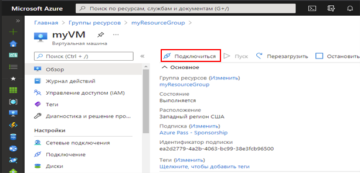
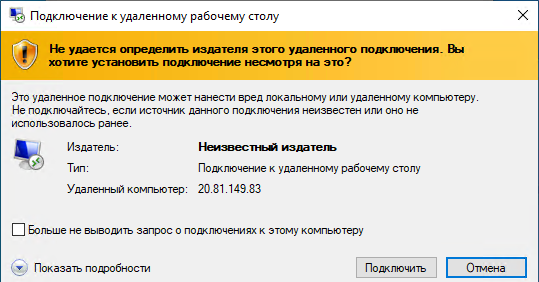
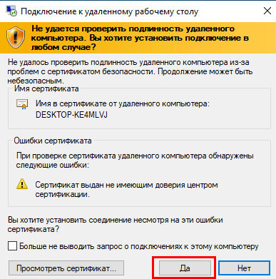

## Задачи лабораторной работы
* Создать виртуальную машину под управлением операционной системы Windows Server
* Настроить веб-сервер и проверить, что он доступен из публичной сети интернет

## Создание виртуальной машины на портале Azure
1. Войдите на портал Azure: **https://portal.azure.com**

3. В колонке **Все службы** в меню «Портал», найдите и выберите элемент **Виртуальные машины**, а затем щелкните **+Добавить, +Создать, +Новый** и выберите **Виртуальная машина** в раскрывающемся списке.

4. На вкладке **Основные** укажите следующие сведения (для остальных параметров оставьте значения по умолчанию):

    | Параметры | Значения |
    |  -- | -- |
    | Подписка | **Использовать предоставленное по умолчанию** |
    | Группа ресурсов | **rg-lab01-######** |
    | Имя виртуальной машины | **myVM** |
    | Регион | **(США) Восточная часть США**|
    | Параметры доступности | Избыточность параметров инфраструктуры не требуется|
    | Образ | **Windows Server 2019 Datacenter, пок. 2**|
    | Размер | **Standard D2s v3**|
    | Имя пользователя учетной записи администратора | **azureuser** |
    | Пароль учетной записи администратора (внимательно следите за правильностью ввода!) | **Pa$$w0rd1234**|
    | Правила входящего порта - | **Разрешить выбранные порты**|
    | Выбрать входящие порты | **RDP (3389)** и **HTTP (80)**|

5. Перейдите на вкладку **Сетевые подключения**, чтобы убедиться, что выбраны порты **HTTP (80) и RDP (3389)** в разделе **Выбрать входящие порты**.

6. Перейдите на вкладку **Управление** и в разделе **Мониторинг** выберите следующий параметр:

    | Параметры | Значения |
    | -- | -- |
    | Диагностика загрузки | **Отключить**|

7. Для остальных параметров оставьте значения по умолчанию и нажмите кнопку **Просмотр и создание** в нижней части страницы.

8. После прохождения проверки нажмите кнопку **Создать**. Развертывание виртуальной машины может занять от пяти до семи минут.

9. Вы будете получать сведения о ходе выполнения на странице развертывания и в области **Уведомления** (значок колокольчика в верхней строке меню).

## Подключение к виртуальной машине

В рамках этой задачи мы подключимся к новой виртуальной машине по протоколу удаленного рабочего стола RDP (Remote Desktop Protocol).

1. Щелкните значок колокольчика на верхней синей панели инструментов и после успешного завершения развертывания выберите «Перейти к ресурсу».

    **Примечание.** Можно также воспользоваться ссылкой **Перейти к ресурсу** на странице развертывания

2. В колонке **Обзор** виртуальной машины нажмите кнопку **Подключить** и выберите **RDP** в раскрывающемся списке.

    

    **Примечание.** Приведенные ниже указания помогут вам подключиться к виртуальной машине с компьютера под управлением Windows. На Mac вам потребуется клиент RDP, например Remote Desktop Client из Mac App Store, а на компьютере с Linux можно использовать клиент RDP с открытым кодом.

2. На странице **Подключение к виртуальной машине** оставьте параметры по умолчанию для подключения к общедоступному IP-адресу через порт 3389 и щелкните элемент **Скачать RDP-файл**. Файл будет загружен в нижнюю левую часть экрана.

3. Откройте загруженный RDP-файл (находится в нижней левой области вашего лабораторного компьютера) и щелкните **Подключить** после вывода соответствующего предложения.

    

4. В окне **Безопасность Windows** выполните вход с помощью учетных данных администратора, использованных вами при создании вашей ВМ **azureuser**, и пароля **Pa$$w0rd1234**.

5. Во время входа в систему может появиться предупреждение о сертификате. Нажмите кнопку **Да**, чтобы создать подключение и подключиться к развернутой виртуальной машине. Подключение должно пройти успешно.

    

Новая виртуальная машина (myVM) будет запущена внутри вашего практического занятия. Закройте всплывающие окна диспетчера серверов и панели мониторинга (щелкните значок «x» вверху справа). Вы должны увидеть синий фон вашей виртуальной машины. **Поздравляем!** Вы выполнили развертывание и подключение к виртуальной машине под управлением Windows Server.

## Установка роли веб-сервера и проверка доступности

В рамках этой задачи вы установите роль веб-сервера на сервере на только что созданной вами виртуальной машине и убедитесь, что будет отображаться стандартная страница приветствия IIS.

1. На вновь открытой виртуальной машине запустите PowerShell, выполнив поиск **PowerShell** в строке поиска, а когда этот элемент будет найден, щелкните правой кнопкой мыши **Windows PowerShell**, чтобы выполнить **Запуск от имени администратора**.

    

2. В PowerShell установите компонент **Веб-сервер** на виртуальной машине, выполнив следующую команду.

    ```PowerShell
    Install-WindowsFeature -name Web-Server -IncludeManagementTools
    ```

3. После завершения ее выполнения появится командная строка с сообщением **Успешно**, для которого указано значение **True**. Перезапускать виртуальную машину для завершения установки не требуется. Закройте подключение RDP к ВМ, щелкнув **x** в центре синей верхней панели вашей виртуальной машины. Его можно также свернуть, щелкнув значок **-** на синей панели, расположенной в центре верхней области экрана.

    

4. Вернитесь на портал, перейдите обратно в колонку **Обзор** виртуальной машины myVM, нажмите кнопку **Копировать в буфер обмена**, чтобы скопировать общедоступный IP-адрес виртуальной машины myVM, откройте новую вкладку в браузере, вставьте этот адрес в текстовое поле URL-адреса и нажмите клавишу **Ввод** для перехода.

    

5. Отобразится страница приветствия веб-сервера IIS.

    

**Поздравляем!** Вы создали новую ВМ, работающую под управлением веб-сервера, к которому можно обратиться по общедоступному IP-адресу. Если у вас есть веб-приложение для размещения, можно развернуть его файлы на виртуальной машине и разместить их для общего доступа на развернутой виртуальной машине. 

Скопируйте URL-адрес веб-сервера, вернитесь на портал обучения и вставьте его в поле для ответов. 
