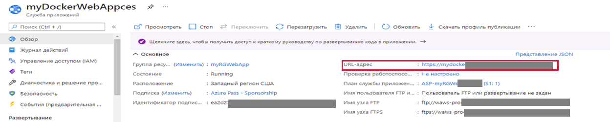
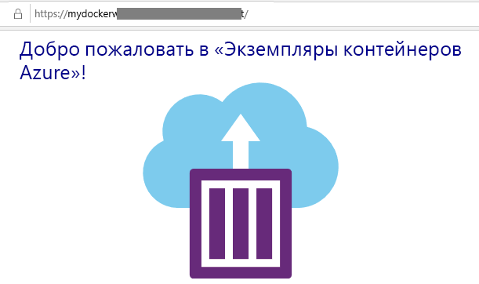

## Описание сценария

Служба приложений Azure фактически представляет собой набор из четырех служб, каждая из которых упрощает размещение и выполнение веб-приложений. Эти четыре службы (веб-приложения, мобильные приложения, приложения API и Logic Apps) выглядят по-разному, однако в работе довольно похожи друг на друга. В данном сценарии системный администратор тестирует возможности создания веб-приложений средствами портала облачного провайдера. 

## Задачи лабораторной работы

* Создать веб-приложения
* Проверить работоспособность веб-приложения

## Создание веб-приложения

В рамках этой задачи вы создадите веб-приложение службы приложений Azure.

1. Войдите на [портал Azure](http://portal.azure.com/).

2. В колонке **Все службы** найдите и выберите элемент **Службы приложений**, а затем щелкните **+ Добавить, + Создать, + Новый**.

3. На вкладке **Основные** колонки **Веб-приложение** укажите следующие параметры (замените **xxxx** в имени веб-приложения буквами и цифрами, чтобы имя было глобально уникальным). Для остальных параметров, включая "План службы приложений", оставьте значения по умолчанию.

    | Параметр | Значение |
    | -- | -- |
    | Подписка | **Использовать предоставленное по умолчанию** |
    | Группа ресурсов | **rg-lab02-######**|
    | Имя | **myDockerWebAppxxxx** |
    | Публикация | **Контейнер Docker** |
    | Операционная система | **Linux** |
    | Регион | **Восточная часть США** |
    |App Service Plan| **F1**|

    **Примечание.** Не забудьте заменить символы **xxxx**, чтобы имя веб-приложения было уникальным.

4. Щелкните **Далее > Docker** и настройте сведения о контейнере.

    | Параметр | Значение |
    | -- | -- |
    | Параметры | **Один контейнер** |
    | Источник образа | **Docker Hub** |
    | Тип доступа | **Общедоступный** |
    | Образ и тег | **mcr.microsoft.com/azuredocs/aci-helloworld** |

    **Примечание.** Команда запуска является необязательной и не требуется в данном упражнении.

5. Нажмите кнопку **Просмотр и создание**, а затем кнопку **Создать**.

## Тестирование веб-приложения

В рамках этой задачи вы протестируете веб-приложение.

1. Дождитесь развертывания веб-приложения.

2. В области **Уведомления** щелкните **Перейти к ресурсу**.

3. В колонке **Обзор** найдите **URL-адрес**. Скопируйте этот URL-адрес в буфер обмена.

    

4. В новом окне браузера вставьте URL-адрес и нажмите клавишу ВВОД. Отобразится приветственное сообщение «Добро пожаловать в экземпляры контейнеров Azure!».

    

5. Перейдите обратно в колонку **Обзор** своего веб-приложения и выполните прокрутку вниз. Вы увидите несколько диаграмм, отслеживающих входящие и исходящие данные и запросы. Если несколько раз повторить шаг 4, вы увидите, как на диаграммах отображаются соответствующие данные телеметрии, включая число запросов и среднее время ответа.

**Поздравляем!** Вы успешно создали службу приложений Azure!

Скорпируйте URL-адрес приложения в буфер обмена, вернитесь на портал обучения и вставьте его в поле для ответов.
