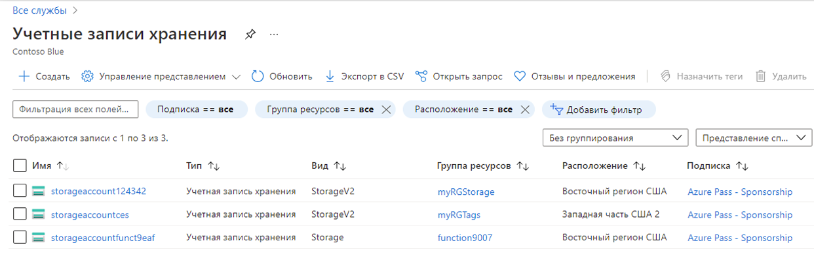
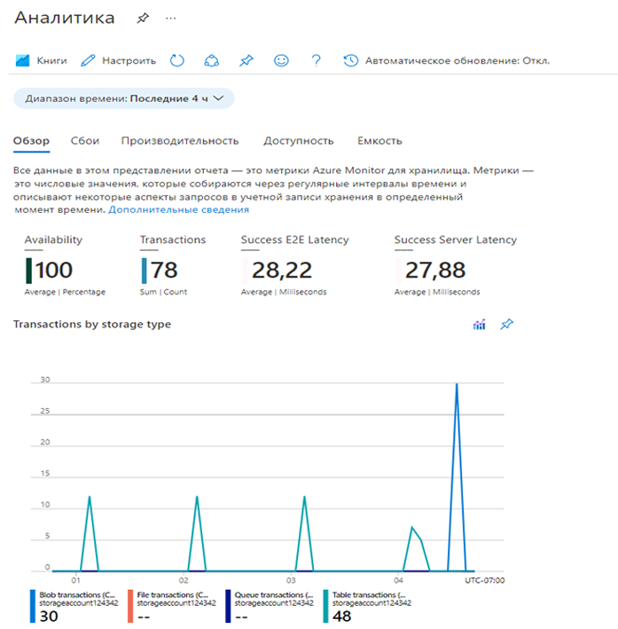

## Задачи лабораторной работы
* Создать учетную запись хранения
* Загрузить BLOB-объект в хранилище
* Ознакомиться с возможностями мониторинга учетной записи хранения

## Создание учетной записи хранения

В рамках этой задачи вы создадите учетную запись хранения.

1. Войдите на портал Azure по адресу <a href="https://portal.azure.com" target="_blank">https://portal.azure.com</a>

2. В колонке **Все службы** найдите и выберите элемент **Учетные записи хранения**, а затем нажмите **+ Добавить, + Создать, + Новый**.

3. На вкладке **Основные** в колонке **Создание учетной записи хранения** укажите следующие сведения (замените **xxxx** в имени учетной записи хранения буквами и цифрами, чтобы имя было глобально уникальным). Для остальных параметров оставьте значения по умолчанию.

    | Параметр | Значение |
    | --- | --- |
    | Подписка | **Оставьте предоставленные значения по умолчанию** |
    | Группа ресурсов | **rg-lab05-######** |
    | Имя учетной записи хранения | **storageaccountxxxxx** |
    | Расположение | **(США) Восточная часть США**  |
    | Производительность | **Стандартный** |
    | Избыточность | **Локально избыточное хранилище (LRS)** |

    **Примечание.** Не забудьте заменить символы **xxxxx**, чтобы **Имя учетной записи хранения** стало уникальным.

5. Нажмите **Просмотр и создание**, чтобы просмотреть параметры учетной записи хранения и разрешить Azure проверить конфигурацию.

6. После проверки нажмите кнопку **Создать**. Дождитесь уведомления об успешном создании учетной записи.

7. На домашней странице найдите и выберите элемент **Учетные записи хранения** и убедитесь, что ваша новая учетная запись хранения присутствует в списке.

    

## Работа с хранилищем BLOB-объектов

В рамках этой задачи вы создадите контейнер BLOB-объектов и отправим файл BLOB-объектов.

1. Нажмите на имя новой учетной записи хранения, перейдите к разделу **Хранилище данных** в левом меню и нажмите **Контейнеры**.

2. Нажмите **+ Контейнер** и укажите информацию. Используйте значки информации для получения дополнительных сведений. Когда закончите, нажмите кнопку **Создать**.

    | Параметр | Значение |
    | --- | --- |
    | Имя | **container1**  |
    | Общедоступный уровень доступа| **Частный (без анонимного доступа)** |

    

4. Откройте новое окно браузера и выполните поиск **Bing** для изображения цветка. Нажмите правой кнопкой мыши это изображение и сохраните его на вашей ВМ.

6. Снова на портале нажмите **container1**, а затем выберите **Отправка**.

5. Найдите файл изображения, который вы только что сохранили на своем локальном компьютере. Выберите его, а затем выберите его отправку.

6. Нажмите стрелку **Дополнительно**, оставьте значения по умолчанию, но просмотрите доступные параметры, а затем нажмите **Отправить**.

    **Примечание.** Таким способом вы можете отправить любое число BLOB-объектов. Новые BLOB-объекты будут перечислены в контейнере.

7. После отправки файла нажмите его правой кнопкой мыши и обратите внимание на параметры, включая "Просмотреть или изменить", "Скачать", "Свойства" и "Удалить".

8. Если у вас будет время, просмотрите параметры для файлов, таблиц и очередей.

## Мониторинг учетной записи хранения

1. Вернитесь в колонку учетной записи хранения и нажмите **Диагностика и решение проблем**.

2. Изучите некоторые из наиболее распространенных проблем с хранилищем. Обратите внимание, что здесь имеется несколько средств устранения неполадок.

3. В колонке учетной записи хранения прокрутите вниз до раздела **Мониторинг** и нажмите **Аналитика**. Обратите внимание, что доступна информация о сбоях, производительности, доступности и емкости. Ваша информация будет отличаться.

    

**Поздравляем!** Вы создали учетную запись хранения и поработали с BLOB-объектами в хранилище.
