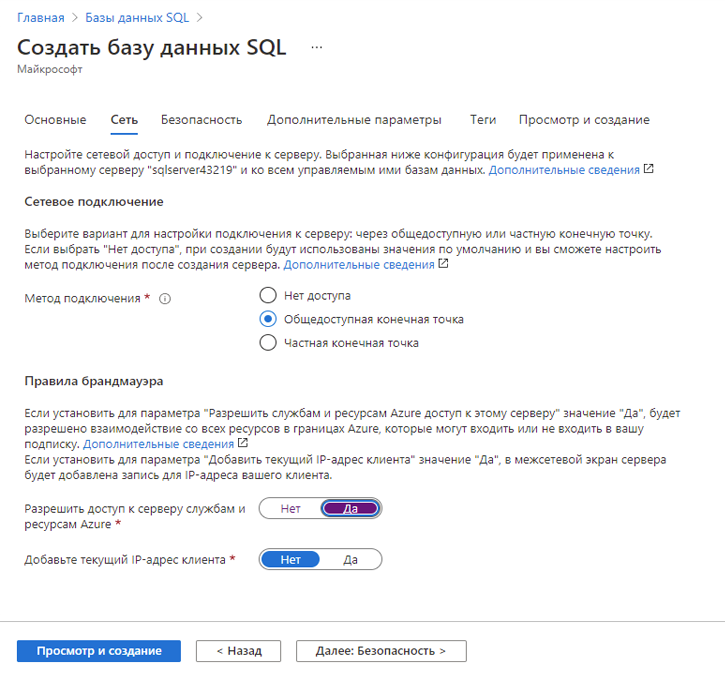
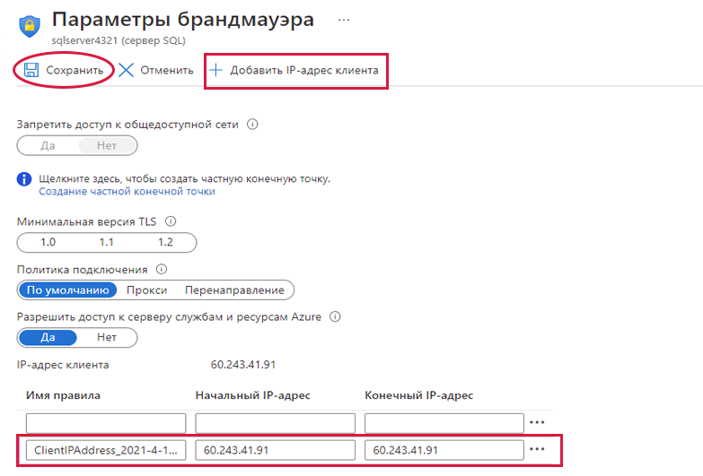
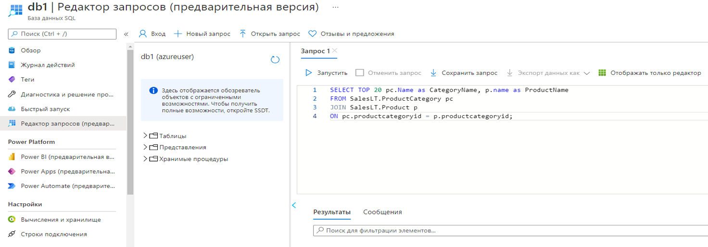
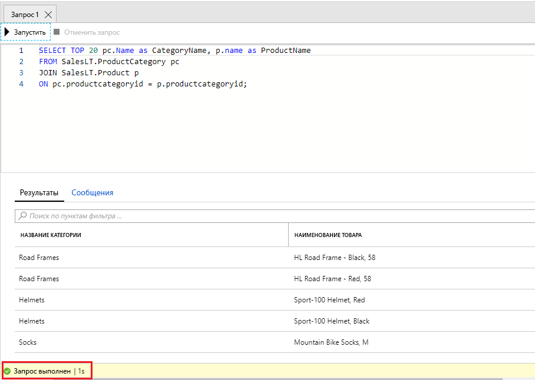

# Создание базы данных SQL

В этом пошаговом руководстве мы создадим базу данных SQL в Azure, а затем запросим данные в этой базе данных.

## Задача 1. Создание базы данных

В рамках этой задачи мы создадим базу данных SQL на основе образца базы данных AdventureWorksLT.

1. Войдите на портал Azure по адресу [**https://portal.azure.com**](https://portal.azure.com).

2. В колонке **Все службы** найдите и выберите элемент **Базы данных SQL**, а затем щелкните **+ Добавить, + Создать, + Новый**.

3. На вкладке **Основные** введите следующие сведения.

    | Параметр | Значение |
    | --- | --- |
    | Подписка | **Использовать предоставленное по умолчанию** |
    | Группа ресурсов | **rg-lab06-#####** |
    | Имя базы данных| **db1** |
    | Сервер | Выберите **Создать** (справа откроется новая боковая панель)|
    | Имя сервера | **sqlserverxxxx** (должно быть уникальным) |
    | Имя для входа администратора сервера | **sqluser** |
    | Пароль | **Pa$$w0rd1234** |
    | Расположение | **(США) Восточная часть США** |
    | Нажмите  | **ОК** |

   

4. Перейдите на вкладку **Сети** и настройте следующие параметры (оставьте значения по умолчанию для других параметров).

    | Параметр | Значение |
    | --- | --- |
    | Метод подключения | **Общедоступная конечная точка** |
    | Разрешить доступ к серверу службам и ресурсам Azure | **Да** |
    | Добавьте текущий IP-адрес клиента | **Нет** |

   

5. На вкладке **Безопасность**.

    | Параметр | Значение |
    | --- | --- |
    | Azure Defender для SQL| **Не сейчас** |

6. Перейдите на вкладку **Дополнительные параметры**. Мы будем использовать пример базы данных AdventureWorksLT.

    | Параметр | Значение |
    | --- | --- |
    | Использование существующих данных | **Пример** |

    

7. Щелкните **Просмотр и создание** и затем **Создать**, чтобы развернуть и подготовить группу ресурсов, сервер и базу данных. Развертывание может занять примерно 2–5 минут.


## Задача 2. Тестирование базы данных.

В рамках этой задачи мы настроим SQL Server и выполним SQL-запрос.

1. После завершения развертывания щелкните «Перейти к ресурсу» в колонке развертывания. Или же в колонке **Все ресурсы** найдите и выберите элемент **Базы данных**, затем элемент **Базы данных SQL** и убедитесь, что новая база данных создана. Возможно, вам потребуется **Обновить** страницу.

    

2. Щелкните запись **db1**, представляющую созданную вами базу данных SQL. В колонке db1 blade щелкните **Редактор запросов (предварительная версия)**.

3. Войдите в систему как **sqluser** с паролем **Pa$$w0rd1234**.

4. Вы не сможете выполнить вход. Внимательно прочитайте ошибку и запишите IP-адрес, который должен быть разрешен в брандмауэре.

    

5. Снова в колонке **db1** щелкните **Обзор**.

    

6. В колонке db1 **Обзор** щелкните элемент **Настройка брандмауэра для сервера**, расположенный в центре верхней области экрана обзора.

7. Щелкните **+ Добавить IP-адрес клиента** (верхняя строка меню), чтобы добавить IP-адрес, упомянутый в ошибке. (Он может быть уже автоматически вставлен — если нет, вставьте его в поля IP-адреса). Не забудьте **Сохранить** изменения.

    

8. Вернитесь в свою базу данных SQL (сдвиньте нижнюю панель переключателя влево) и щелкните **Редактор запросов (предварительная версия)**. Еще раз попробуйте войти в систему как **sqluser** с паролем **Pa$$w0rd1234**. На этот раз все должно получиться. Обратите внимание, что для развертывания нового правила брандмауэра может потребоваться несколько минут.

9. После успешного входа появится панель запросов. Введите в панели редактора приведенный ниже запрос.

    ```SQL
    SELECT TOP 20 pc.Name as CategoryName, p.name as ProductName
    FROM SalesLT.ProductCategory pc
    JOIN SalesLT.Product p
    ON pc.productcategoryid = p.productcategoryid;
    ```

    

10. Щелкните **Запустить**, а затем просмотрите результаты запроса в области **Результаты**. Запрос должен выполниться успешно.

    

Поздравляем! Вы создали базу данных SQL в Azure и успешно запросили данные в этой базе данных.
