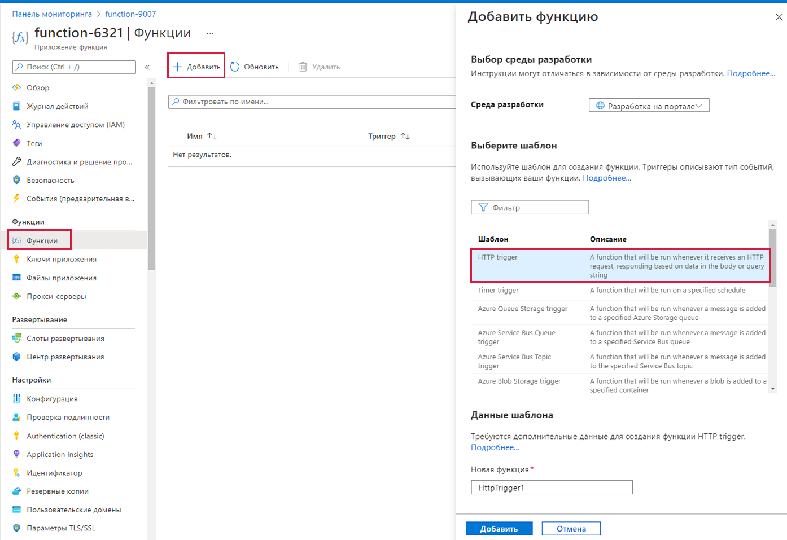

# Реализация функций Azure

В этом пошаговом руководстве мы создадим приложение-функцию для отображения приветственного сообщения Hello при выполнении HTTP-запроса.

## Задача 1. Создание приложения-функции

В рамках этой задачи мы создадим приложение-функцию.

1. Войдите на [портал Azure](https://portal.azure.com).

2. На панели **Поиск** в верхней части портала найдите и выберите элемент **Приложение-функция**, а затем в колонке **Приложение-функция** щелкните **+ Добавить**, **+ Создать**, **+ Новый**.

3. На вкладке **Основные** в колонке **Приложение-функция** укажите следующие параметры (замените **xxxx** в имени приложения-функции буквами и цифрами, чтобы имя было глобально уникальным, а для остальных параметров оставьте значения по умолчанию).

    | Параметры | Значение |
    | -- | --|
    | Подписка | **Сохранить предоставленное по умолчанию** |
    | Группа ресурсов | **rg-lab08-#####** |
    | Имя приложения-функции | **function-xxxx** |
    | Опубликовать | **Код** |
    | Стек времени выполнения | **.NET** |
    | Версия | **3.1** |
    | Регион | **Восточная часть США** |

    **Примечание.** -  Не забудьте заменить символы **xxxx**, чтобы **Имя приложения-функции** стало уникальным.

4. Щелкните **Просмотр и создание** и после успешной проверки нажмите кнопку **Создать**, чтобы начать подготовку и развертывание нового приложения-функции Azure.

5. Дождитесь уведомления о создании ресурса.

6. После завершения развертывания щелкните «Перейти к ресурсу» в колонке развертывания. Или же перейдите в колонку **Приложение-функция**, нажмите кнопку **Обновить** и убедитесь, что вновь созданное приложение-функция имеет состояние **Выполняется**.

    

## Задача 2. Создание функции, активируемой HTTP, и тест

В рамках этой задачи мы будем использовать функцию "Веб-перехватчик + API" для отображения сообщения при выполнении HTTP-запроса.

1. В колонке **Приложение-функция** щелкните созданное приложение-функцию.

2. В колонке приложения-функции в разделе **Функции** щелкните **Функции**, а затем нажмите кнопку **+ Добавить**, **+ Создать**, **+ Новый**.

    

3. Справа появится всплывающее окно **Добавить функцию**. В разделе **Выберите шаблон** щелкните **Триггер HTTP**. Нажмите **Добавить**.

    

4. В колонке **HttpTrigger1** в разделе **Для разработчиков** щелкните **Код и тестирование**.

5. В колонке **Код и тест** просмотрите автоматически сгенерированный код и обратите внимание на то, что код предназначен для выполнения HTTP-запроса и регистрации информации. Также обратите внимание, что функция возвращает сообщение Hello с именем.

    

6. Нажмите кнопку **Получить URL-адрес функции** в верхней части редактора функций.

7. Задайте в раскрывающемся списке **Клавиша** значение **по умолчанию** и нажмите кнопку **Копировать**, чтобы скопировать URL-адрес функции.

    

8. Откройте в браузере новую вкладку и вставьте скопированный URL-адрес функции в адресную строку. При запросе страницы запускается функция. Обратите внимание на возвращенное сообщение о том, что функции требуется имя в тексте запроса.

    

9. Добавьте **&name=*ваше_имя*** в конец URL-адреса.

    **Примечание**. Например, если ваше имя Cindy, итоговый URL-адрес будет сходен со следующим: `https://azfuncxxx.azurewebsites.net/api/HttpTrigger1?code=X9xx9999xXXXXX9x9xxxXX==&name=cindy`

    

10. При нажатии клавиши ВВОД ваша функция будет запускаться с выполнением трассировки каждого вызова. Чтобы просмотреть трассировки, вернитесь на портал в колонку **HttpTrigger1 \| Код и тест** и щелкните **Отслеживание**. **Настройте** Application Insights, выбрав нужную функцию и регион. Нажмите кнопку **Создать**.

    

Поздравляем! Вы создали приложение-функцию для отображения приветственного сообщения Hello при выполнении HTTP-запроса.

Cкопируйте URL-адрес функции в буфер обмена, вернитесь на портал обучения и вставьте его в поле для ответов.
