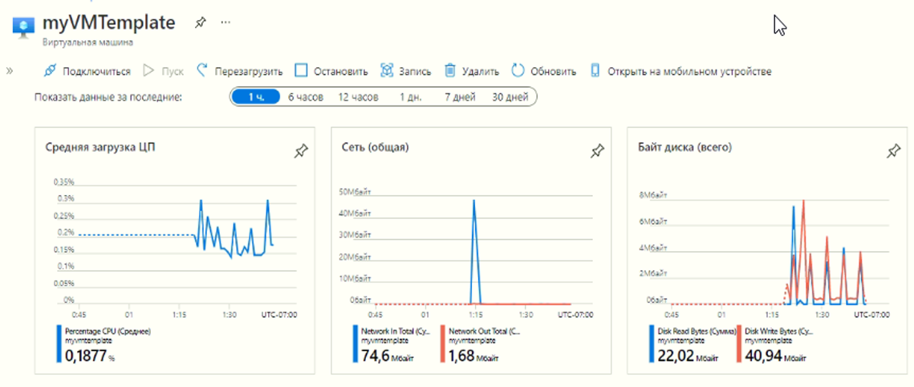
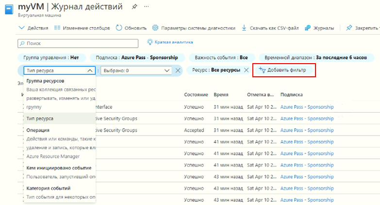

## Задачи лабораторной работы
* Изучить галерею шаблонов
* Настроить шаблон и развернуть из него виртуальную машину

## Изучение галерею QuickStart и определение местоположение шаблона

В рамках этой задачи вы просмотрите коллекцию шаблонов быстрого запуска Azure и развернем шаблон, создающий виртуальную машину.

1. Откройте в лабораторной среде новое окно браузера и введите https://azure.microsoft.com/en-us/resources/templates/?azure-portal=true. Там вы увидите ряд популярных и недавно обновленных шаблонов. Они автоматизируют развертывание ресурсов Azure, включая установку популярных программных пакетов. Просмотрите разные типы шаблонов, которые вам доступны.

3. Выберите **Развертывание простой ВМ Windows/Deploy a simple Windows VM**

4. Нажмите кнопку **Развернуть в Azure**. Ваш сеанс браузера будет автоматически перенаправлен на [портал Azure](http://portal.azure.com/).

    **Примечание**. Нажав кнопку **Развертывание в Azure**, можно развернуть шаблон через портал Azure. Во время такого развертывания вам будет доступен лишь небольшой набор параметров конфигурации.

5. При появлении соответствующего предложения выполните вход в свою подписку Azure.

6. В колонке **Настраиваемое развертывание** нажмите **Изменить шаблон**. В качестве формата шаблона Resource Manager используется формат JSON. Просмотрите параметры и переменные.  После этого найдите параметр для имени виртуальной машины. Измените имя на **myVMTemplate**. **Сохраните** изменения. Вы возвращаетесь в колонку **Настраиваемое развертывание** на портале Azure.

    

7. В колонке **Настраиваемое развертывание** настройте параметры, необходимые шаблону (замените ***xxxx*** в префиксе DNS-метки буквами и цифрами, чтобы имя было глобально уникальным). Для остальных параметров оставьте значения по умолчанию.

    | Параметр| Значение|
    |----|----|
    | Подписка | **Сохранить предоставленное по умолчанию**|
    | Группа ресурсов | **rg-lab09-#####** |
    | Регион | Сохранить по умолчанию |
    | Имя администратора | **azureuser** |
    | Пароль администратора | **Pa$$w0rd1234** |
    | Префикс DNS-метки | **myvmtemplatexxxx** |
    | Версия ОС | **2019-Datacenter** |
    |Размер ВМ| **Standard_D2s_v3**|

9. Нажмите **Просмотр и создание**.

10. Следите за развертыванием.

## Проверка и мониторинг развертывания виртуальной машины

В рамках этой задачи вы проверите правильность развертывания виртуальной машины.

1. В колонке **Все службы** найдите и выберите элемент **Виртуальные машины**.

2. Убедитесь, что виртуальная машина создана.

    

3. Выберите свою виртуальную машину и в области **Обзор** выберите вкладку **Отслеживание**, прокрутите вниз, чтобы просмотреть данные мониторинга.

    **Примечание.** Временной интервал мониторинга можно регулировать в пределах от одного часа до 30 дней.

4. Просмотрите различные представленные диаграммы, включая **Средняя загрузка ЦП**, **Сеть (общая)** и **Байт диска (всего)**.

    

5. Нажмите любую диаграмму. Обратите внимание, что можно **Добавить метрику** и изменить тип диаграммы.

6. Вернитесь в колонку **Обзор**. (сдвиньте панель переключателя влево)
7. Нажмите **Журнал действий** (на левой панели). Журналы действий регистрируют такие события, как создание или изменение ресурсов.

8. Нажмите **Добавить фильтр** и поэкспериментируйте с поиском различных типов событий и операций.

    

**Поздравляем!** Вы успешно создали ресурс из шаблона и выполнили развертывание этого шаблона в Azure.
