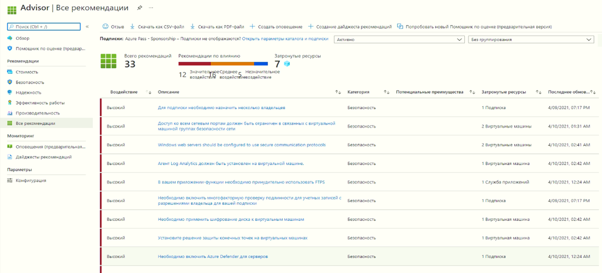

## Задачи лабораторной работы
* Настроить оболочку CloudShell
* Создать виртуальную машину с помощью сценария PowerShell
* Изучить команды PowerShell для управления состояния виртуальных машин

## Настройка Cloud Shell

В рамках этой задачи вы настриваете Cloud Shell.

1. Войдите на [портал Azure](https://portal.azure.com). **Вы можете найти свои учетные данные для входа на вкладке ресурсов (непосредственно рядом с этой вкладкой инструкций!)**
2. На портале Azure откройте **Azure Cloud Shell**, щелкнув значок в правом верхнем углу портала Azure.

    

3. Когда будет предложено выбрать **Bash** или **PowerShell**, выберите **PowerShell**.

4. На экране **У вас нет подключенного хранилища** выберите **Показать дополнительные настройки**, а затем введите приведенную ниже информацию

    | Параметры | Значения |
    |  -- | -- |
    | Группа ресурсов | **rg-lab10-#####** |
    | Учетная запись хранения (создайте новую учетную запись, используя глобальное уникальное имя (напр.: cloudshellstoragemystorage)) | **cloudshellxxxxxxx** |
    | Общая папка (создайте новую) | **shellstorage** |

5. Выберите **Создать хранилище**.

## Создание виртуальной машины

В этой задаче вы будете использовать PowerShell для создания виртуальной машины.

1. Выберите **PowerShell** в верхнем левом раскрывающемся меню на панели Cloud Shell.

2. Проверьте группу ресурсов, запустив следующую команду в окне Powershell. Нажмите клавишу **ВВОД** для запуска команды.

    ```PowerShell
    Get-AzResourceGroup | Format-Table
    ```

3. Создайте виртуальную машину, вставив следующую команду в окно терминала.

    ```PowerShell
    New-AzVm `
    -ResourceGroupName "rg-lab10-#####" `
    -Name "myVMPS" `
    -Location "East US" `
    -VirtualNetworkName "myVnetPS" `
    -SubnetName "mySubnetPS" `
    -SecurityGroupName "myNSGPS" `
    -PublicIpAddressName "myPublicIpPS"
    ```

4. При появлении запроса укажите имя пользователя (**azureuser**) и пароль (**Pa$$w0rd1234**), которые будут настроены в качестве учетной записи локального администратора на этих виртуальных машинах.azureadmin

5. После создания ВМ закройте панель Cloud Shell сеанса PowerShell.

6. На портале Azure выполните поиск элемента **Виртуальные машины** и убедитесь, что **myVMPS** выполняется. Это может занять несколько минут.

    

7. Получите доступ к новой виртуальной машине и просмотрите параметры "Обзор" и "Сеть", чтобы убедиться, что ваша информация была развернута правильно.

## Выполнение команд в Cloud Shell

В рамках этой задачи вы практируете выполнения команд PowerShell из Cloud Shell.

1. На портале Azure откройте **Azure Cloud Shell**, щелкнув значок в правом верхнем углу портала Azure.

2. Выберите **PowerShell** в верхнем левом раскрывающемся меню на панели Cloud Shell.

3. Извлеките информацию о вашей виртуальной машине, включая имя, группу ресурсов, расположение и состояние. Обратите внимание, что состояние питания имеет значение **Выполняется**.

    ```PowerShell
    Get-AzVM -name myVMPS -status | Format-Table -autosize
    ```

4. Остановите виртуальную машину с помощью следующей команды.

    ```PowerShell
    Stop-AzVM -ResourceGroupName myRGPS -Name myVMPS
    ```
5. При появлении запроса подтвердите действие («Да»). Подождите до отображения состояния **Успешно выполнено**.

6. Проверьте состояние вашей виртуальной машины. Теперь состояние питания должно иметь значение **Освобождено**. Вы также можете проверить состояние виртуальной машины на портале. Закройте Cloudshell.

    ```PowerShell
    Get-AzVM -name myVMPS -status | Format-Table -autosize
    ```

## Ознакомление с рекомендациями Помощника по Azure

**Примечание.** Эта же задача приведена в задании "Создание виртуальной машины с использованием Azure CLI".

В рамках этой задачи вы рассмотрите рекомендации Помощника по Azure для нашей виртуальной машины.

1. В колонке **Все службы** найдите и выберите элемент **Помощник**.

2. В колонке **Помощник** выберите **Обзор**. Рекомендации сгруппированы по категориям "Высокая доступность", "Безопасность", "Производительность" и "Стоимость".

    

3. Выберите **Все рекомендации** и уделите время просмотру каждой рекомендации и предлагаемых действий.

    **Примечание.** В зависимости от ваших ресурсов рекомендации будут различаться.

    

4. Обратите внимание, что вы можете скачать рекомендации в виде файла CSV или PDF.

5. Обратите внимание, что вы можете создавать оповещения.

6. Если у вас есть время, продолжайте экспериментировать с Azure PowerShell.

**Поздравляем!** Вы настроили Cloud Shell, создали виртуальную машину с помощью PowerShell, попрактиковались с командами PowerShell и просмотрели рекомендации Помощника.
