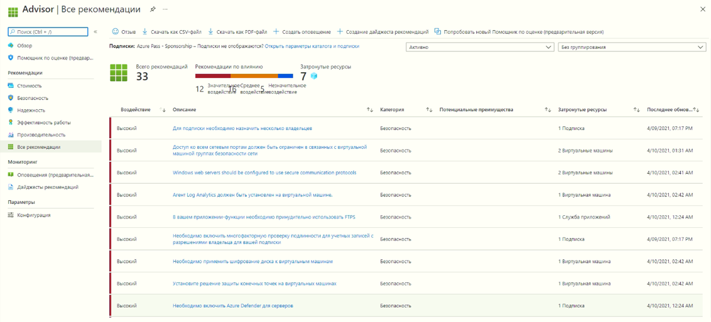

## Задачи лабораторной работы
* Настроить оболочку CloudShell
* Создать виртуальную машину с помощью сценария Azure CLI
* Изучить команды Azure CLI для управления состояния виртуальных машин

## Настройка Cloud Shell 

В этой задаче вы настроете **Cloud Shell**, а затем используете **Azure CLI** для создания группы ресурсов и виртуальной машины.  

1. Войдите на [портал Azure](https://portal.azure.com).

2. На портале Azure откройте **Azure Cloud Shell**, щелкнув значок в правом верхнем углу портала Azure.

    
   
3. В диалоговом окне приветствия Azure Cloud Shell при выводе приглашения выбрать **Bash** либо **PowerShell** выберите **Bash**. 

4. Откроется новое окно с сообщением **У вас нет подключенного хранилища**. Выберите **дополнительные параметры**.

5. На экране дополнительных параметров заполните следующие поля, а затем нажмите «Создать хранилище:
    - Регион Cloud Shell **Восточная часть США**
    - Группа ресурсов: **rg-lab11-#####** (использовать существующую)
    - Учетная запись хранения. Создайте новую учетную запись, используя глобальное уникальное имя **cloudshellxxxxxxx** (напр.: cloudshellxyzstorage)
    - Общая папка: Создайте новую папку и назовите ее **cloudshellfileshare**.

## Использование CLI для создания виртуальной машины

В этой задаче вы будете использовать **Azure CLI** для создания группы ресурсов и виртуальной машины.

1. Выберите **Bash** в верхнем левом раскрывающемся меню на панели **Cloud Shell**.

    


2. Проверьте используемую вами группу ресурсов, введя следующую команду.

    ```cli
    az group list --output table
    ```

4. Введите в **Cloud Shell** приведенную ниже команду и убедитесь, что после каждой строки, кроме последней, стоит символ обратной косой черты (`\`). Если вы вводите всю команду на одной строке, не используйте символы обратной косой черты. 

    ```cli
    az vm create \
    --name myVMCLI \
    --resource-group rg-lab11-##### \
    --image UbuntuLTS \
    --location EastUS \
    --admin-username azureuser \
    --admin-password Pa$$w0rd1234
    --size Standard_D2s_v3
    ```

    **Примечание.** Если вы используете командную строку на компьютере с Windows, замените обратную косую черту (`\`) символом крышки (`^`).

    **Примечание.** Выполнение команды займет от 2 до 3 минут. Команда создаст виртуальную машину и различные связанные с ней ресурсы, такие как ресурсы хранилища, сети и безопасности. Не переходите к следующему шагу, пока развертывание виртуальной машины не будет завершено. 

5. Когда команда завершит выполнение, закройте панель **Cloud Shell** в окне браузера.

6. На портале Azure выполните поиск элемента **Виртуальные машины** и убедитесь, что **myVMCLI** выполняется.

    


## Выполнение команд в Cloud Shell

В рамках этой задачи вы будете практиковаться в выполнении команд CLI из **Cloud Shell**. 

1. На портале Azure откройте **Azure Cloud Shell**, щелкнув значок в правом верхнем углу портала Azure.

2. Выберите **Bash** в верхнем левом раскрывающемся меню на панели **Cloud Shell**.

3. Извлеките информацию о подготовленной вами виртуальной машине, включая имя, группу ресурсов, расположение и состояние. Обратите внимание, что состояние питания имеет значение **Выполняется**.

    ```cli
    az vm show --resource-group rg-lab11-##### --name myVMCLI --show-details --output table 
    ```

4. Остановите виртуальную машину. Обратите внимание на сообщение о том, что выставление счетов продолжается до тех пор, пока виртуальная машина не будет освобождена. 

    ```cli
    az vm stop --resource-group rg-lab11-##### --name myVMCLI
    ```

5. Проверьте состояние вашей виртуальной машины. Теперь состояние питания должно иметь значение **Остановлено**.

    ```cli
    az vm show --resource-group rg-lab11-##### --name myVMCLI --show-details --output table 
    ```

## Ознакомление с рекомендациями Помощника по Azure

В рамках этой задачи вы рассмотрите рекомендации **Помощника по Azure**.

   **Примечание.** Если вы завершили предыдущее задание ("Создание виртуальной машины с помощью PowerShell"), значит, вы уже выполнили эту задачу. 

1. В колонке **Все службы** найдите и выберите элемент **Помощник**. 

2. В колонке **Помощник** выберите **Обзор**. Рекомендации сгруппированы по категориям "Высокая доступность", "Безопасность", "Производительность" и "Стоимость". 

    

3. Выберите **Все рекомендации** и уделите время просмотру каждой рекомендации и предлагаемых действий. 

    **Примечание.** В зависимости от ваших ресурсов рекомендации будут различаться. 

    

4. Обратите внимание, что вы можете скачать рекомендации в виде файла CSV или PDF. 

5. Обратите внимание, что вы можете создавать оповещения. 

6. Если у вас есть время, продолжайте экспериментировать с **Azure CLI**. 

**Поздравляем!** Вы настроили **Cloud Shell**, создали виртуальную машину с помощью Azure CLI, попрактиковались с командами Azure CLI и просмотрели рекомендации Помощника.
