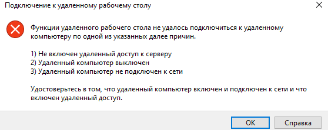

## Задачи лабораторной работы
* Создать виртуальную машины
* Создать группу сетевой безопасности
* Настроить правила для входящего и исходящего сетевого трафика

## Создание виртуальной машины

В рамках этой задачи вы создадите виртуальную машину Windows Server 2019 Datacenter.

1. Войдите на [портал Azure](https://portal.azure.com).

2. В колонке **Все службы** найдите и выберите элемент **Виртуальные машины**, а затем нажмите **+ Добавить, + Создать, + Новый** для виртуальной машины.

3. На вкладке **Основные** укажите следующие сведения (для остальных параметров оставьте значения по умолчанию):

    | Параметры | Значения |
    |  -- | -- |
    | Подписка | **Использовать предоставленное по умолчанию** |
    | Группа ресурсов | **rg-lab13-#####** |
    | Имя виртуальной машины | **SimpleWinVM** |
    | Регион | **(США) Восточная часть США**|
    | Образ | **Windows Server 2019 Datacenter, пок. 1**|
    | Размер | **Standard D2s v3**|
    | Имя пользователя учетной записи администратора | **azureuser** |
    | Пароль учетной записи администратора | **Pa$$w0rd1234**|
    | Правила входящего порта | **Нет**|

4. Перейдите на вкладку **Сеть** и настройте следующие параметры:

    | Параметры | Значения |
    | -- | -- |
    | Группа безопасности сети сетевого адаптера | **Нет**|

5. Перейдите на вкладку **Управление** и в разделе **Мониторинг** выберите следующий параметр:

    | Параметры | Значения |
    | -- | -- |
    | Диагностика загрузки | **Отключить**|

6. Для остальных параметров оставьте значения по умолчанию и нажмите кнопку **Просмотр и создание** в нижней части страницы.

7. После прохождения проверки нажмите кнопку **Создать**. Развертывание виртуальной машины может занять около пяти минут.

8. Следите за развертыванием. Создание группы ресурсов и виртуальной машины может занять несколько минут.

9. В колонке развертывания или области уведомлений нажмите **Перейти к ресурсу**.

10. В колонке виртуальной машины **SimpleWinVM** нажмите **Сеть**, просмотрите вкладку **Правила входящего порта** и обратите внимание на то, что нет группы безопасности сети, связанной с сетевым интерфейсом виртуальной машины или подсетью, к которой подключен сетевой интерфейс.

    **Примечание.** Определите имя сетевого интерфейса. Оно понадобится вам в следующей задаче.

## Создание группы безопасности сети

В рамках этой задачи вы создадите группу безопасности сети и свяжете ее с сетевым интерфейсом.

1. В колонке **Все службы** найдите и выберите элемент **Группы безопасности сети**, а затем нажмите **+ Добавить, + Создать, + Новый**.

2. На вкладке **Основные** в колонке **Создание группы безопасности сети** укажите следующие параметры.

    | Параметр | Значение |
    | -- | -- |
    | Подписка | **Использовать подписку по умолчанию** |
    | Группа ресурсов | **rg-lab13-#####** |
    | Имя | **myNSGSecure** |
    | Регион | **(США) Восточная часть США**  |

3. Нажмите кнопку **Просмотр и создание**, а затем после проверки нажмите кнопку **Создать**.

4. После создания группы безопасности сети нажмите **Перейти к ресурсу**.

5. В разделе **Параметры** нажмите **Сетевые интерфейсы** и затем **+ Привязать**.

6. Выберите сетевой интерфейс, указанный в предыдущей задаче.

## Настройка правила входящего порта безопасности для разрешения RDP

В рамках этой задачи вы разрешите трафик RDP на виртуальную машину, настроив правило входящего порта безопасности.

1. На портале Azure перейдите к колонке виртуальной машины **SimpleWinVM**.

2. На панели **Обзор** нажмите **Подключить**.

3. Попытайтесь подключиться к виртуальной машине, выбрав RDP, загрузив RDP-файл и запустив его. По умолчанию группа безопасности сети не разрешает использовать RDP. Закройте окно ошибки.

    

4. В колонке виртуальной машины прокрутите вниз до раздела **Параметры**, нажмите **Сеть** и обратите внимание, что правила для входящего трафика для группы безопасности сети **myNSGSecure (подключено к сетевому интерфейсу: myVMNic)** запрещают весь входящий трафик, кроме трафика в виртуальной сети и проб подсистемы балансировки нагрузки.

5. На вкладке **Правила входящего порта** нажмите **Добавить правило входящего порта**. По завершении нажмите кнопку **Добавить**.

    | Параметр | Значение |
    | -- | -- |
    | Источник | **Любой**|
    | Диапазоны исходных портов | **\*** |
    | Назначение | **Любой** |
    | Диапазоны портов назначения | **3389** |
    | Протокол | **TCP** |
    | Действие | **Разрешить** |
    | Приоритет | **300** |
    | Имя | **AllowRDP** |

6. Выберите **Добавить** и подождите, пока не будет предоставлено правило, а затем снова попытайтесь воспользоваться RDP для подключения к виртуальной машине, вернувшись к элементу **Подключить**. На этот раз данная процедура должна пройти успешно. Помните, что используются имя пользователя **azureuser** и пароль **Pa$$w0rd1234**.

## Настройка правила исходящего порта безопасности для запрета доступа в Интернет

В рамках этой задачи вы создадите правило исходящего порта NSG, которое запретит доступ в Интернет, а затем протестируете его, чтобы убедиться, что правило работает.

1. Продолжите работу в сеансе RDP виртуальной машины.

2. После запуска компьютера откройте браузер **Internet Explorer**.

3. Убедитесь, что у вас есть доступ к адресу **https://www.bing.com**, а затем закройте Internet Explorer. Вам потребуется пройти через всплывающие окна системы усиленной безопасности Internet Explorer.

    **Примечание.** Теперь вы настроите правило для запрета исходящего доступа в Интернет.

4. Вернитесь на портал Azure в колонку виртуальной машины **SimpleWinVM**.

5. В разделе **Параметры** нажмите **Сеть** и затем **Правила исходящего порта**.

6. Обратите внимание на правило **AllowInternetOutbound**. Оно используется по умолчанию, и его невозможно удалить.

7. Нажмите **Добавить правило исходящего порта** справа от группы безопасности сети **myNSGSecure (подключено к сетевому интерфейсу: myVMNic)** и настройте новое правило безопасности для исходящего трафика с более высоким приоритетом, которое запретит интернет-трафик. По завершении нажмите кнопку **Добавить**.

    | Параметр | Значение |
    | -- | -- |
    | Источник | **Любой**|
    | Диапазоны исходных портов | **\*** |
    | Назначение | **Тег службы** |
    | Тег службы назначения | **Интернет** |
    | Диапазоны портов назначения | **\*** |
    | Протокол | **TCP** |
    | Действие | **Запретить** |
    | Приоритет | **4000** |
    | Имя | **DenyInternet** |

8. Нажмите **Добавить**. Вернитесь на виртуальную машину, для которой использовался RDP.

9. Перейдите по адресу **https://www.microsoft.com**. Страница не должна отображаться. Возможно, вам потребуется пройти через дополнительные всплывающие окна системы усиленной безопасности Internet Explorer.

**Поздравляем!** Вы научились создавать и настривать группы безопасности.
