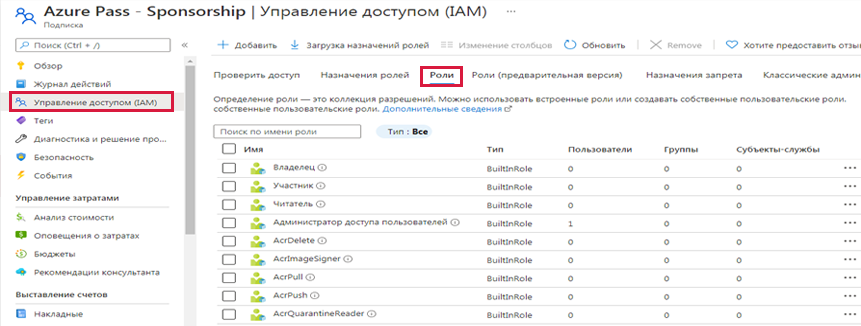
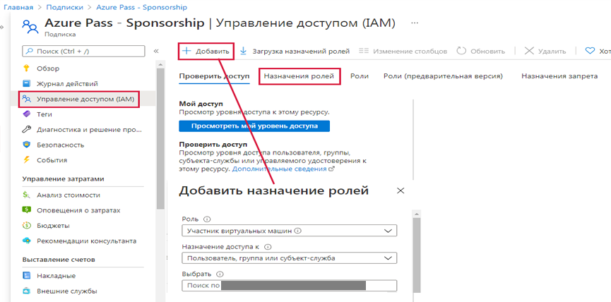

# Управление доступом с помощью RBAC

В этом пошаговом руководстве мы назначим ресурсам роли с разрешениями и просмотрим журналы.

## Задача 1. Просмотр и назначение ролей

В рамках этой задачи мы назначим роль участника виртуальных машин.

1. Войдите на [портал Azure](https://portal.azure.com).

2. На портале Azure перейдите к группе ресурсов **rg-lab14-#####**.

3. Щелкните колонку **Управление доступом (IAM)**, а затем перейдите на вкладку **Роли**. Прокрутите большое количество доступных определений ролей. Используйте информационные значки, чтобы узнать о разрешениях каждой роли. Обратите внимание, что также доступна информация о количестве пользователей и групп, назначенных каждой роли.

    

4. Перейдите на вкладку **Назначения ролей** в колонке **Управление доступом (IAM)**, щелкните **+ Добавить** и затем **Добавить назначение ролей**. Назначьте роль участника виртуальных машин своей учетной записи, а затем нажмите кнопку **Сохранить**.

    | Параметр | Значение |
    | -- | -- |
    | Роль | **Участник виртуальных машин** |
    | Назначение доступа | **Пользователь, группа или субъект-служба** |
    | Выберите | **Выбор членов и выберите свою учетную запись** |

    **Примечание.** Роль участника виртуальных машин позволяет вам управлять виртуальными машинами, но не позволяет получить доступ к их операционной системе или управлять виртуальной сетью и учетной записью хранения, к которым они подключены.

    

5. **Обновите** страницу назначения ролей и убедитесь, что теперь вы указаны как "Участник виртуальных машин".

    **Примечание**. Это назначение фактически не дает вам никаких дополнительных привилегий, так как ваша учетная запись уже имеет роль "Владелец", которая включает в себя все привилегии, связанные с ролью "Участник".

## Задача 2. Отслеживание назначений ролей

В рамках этой задачи мы просмотрим журнал действий, чтобы проверить назначение ролей.

1. В колонке группы ресурсов **rg-lab14-#####** щелкните **Журнал действий**.

2. Щелкните **Добавить фильтр**, выберите **Операция**, а затем **Создать назначение роли**.

    

3. Убедитесь, что в журнале действий отображается ваше назначение ролей.

Поздравляем! Вы назначили роль доступа вашей учетной записи и просмотрели журналы действий вашей группы ресурсов.
