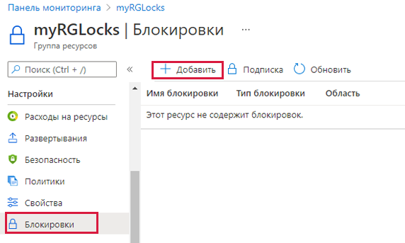
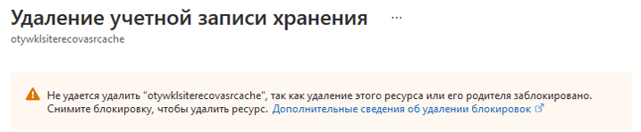

## Задачи лабораторной работы
* Добавить блокировку для группы ресурсов и проверить возможность удаления ресурсов
* Снять блокировку для группы ресурсов и проверить возможность удаления ресурсов

## Добавление блокировки для группы ресурсов и проверка возможность удаления

В рамках этой задачи вы добавите блокировку ресурса для группы ресурсов и проверите удаление этой группы ресурсов.

1. Войдите на [портал Azure](https://portal.azure.com).

2. На портале Azure перейдите к группе ресурсов **rg-lab15-#####**.

3. Вы можете применить блокировку к подписке, группе ресурсов или отдельному ресурсу, чтобы предотвратить случайное удаление или изменение критически важных ресурсов.

4. В разделе **Параметры** нажмите **Блокировки**, а затем нажмите **+ Добавить**.

    

5. Настройте новую блокировку. Закончив, нажмите кнопку **ОК**.

    | Параметр | Значение |
    | -- | -- |
    | Имя блокировки | **RGLock** |
    | Тип блокировки | **Удалить** |

6. Нажмите **Обзор** и **Удалить группу ресурсов**. Введите имя группы ресурсов и нажмите кнопку **ОК**. Отображается сообщение об ошибке, где сказано, что группа ресурсов заблокирована и не может быть удалена.

    

## Проверка удаления члена группы ресурсов

В рамках этой задачи вы проверите, защищает ли блокировка ресурса учетную запись хранения в группе ресурсов.

1. В колонке **Все службы** найдите и выберите элемент **Учетные записи хранения**, а затем нажмите **+ Добавить, + Создать или + Новый**.

2. В колонке **+Добавить +Новый +Создать** на странице **Учетные записи хранения** укажите следующие сведения (замените **xxxx** в имени учетной записи хранения буквами и цифрами, чтобы имя было глобально уникальным). Для остальных параметров оставьте значения по умолчанию.

    | Параметр | Значение |
    | --- | --- |
    | Подписка | **Выберите свою подписку** |
    | Группа ресурсов | **rg-lab15-#####** |
    | Имя учетной записи хранения | **storageaccountxxxx** |
    | Расположение | **(США) Восточная часть США**  |
    | Производительность | **Standard** |
    | Тип учетной записи | **StorageV2 (учетная запись общего назначения версии 2)** |
    | Репликация | **Локально избыточное хранилище (LRS)** |
    | Уровень доступа (по умолчанию) | **Горячий** |

3. Нажмите **Просмотр и создание**, чтобы просмотреть параметры учетной записи хранения и разрешить Azure проверить конфигурацию.

4. После проверки нажмите кнопку **Создать**. Дождитесь уведомления об успешном создании учетной записи.

5. Дождитесь уведомления об успешном создании учетной записи хранения.

6. Откройте новую учетную запись хранения и на панели **Обзор** нажмите **Удалить**. Отображается сообщение об ошибке, где сказано, что ресурс или его родительский объект имеют блокировку удаления.

    

    **Примечание.** Хотя вы не создавали блокировку специально для учетной записи хранения, вы создали блокировку на уровне группы ресурсов, которая содержит эту учетную запись хранения. Таким образом, эта блокировка *родительского* уровня не позволяет нам удалить ресурс, а учетная запись хранения наследует блокировку от родительского объекта.

## Снятие блокировки ресурса

В рамках этой задачи вы снимаете блокировку ресурса и проводите проверку.

1. Вернитесь к колонке группы ресурсов **rg-lab15-#####** и в разделе **Параметры** нажмите **Блокировки**.

2. Нажмите ссылку **Удалить**, которая является крайней справа от записи **rg-lab15-#####** и находится справа от элемента **Изменить**.

    

3. Вернитесь в колонку учетной записи хранения и подтвердите, что теперь ресурс можно удалить.

**Поздравляем!** Вы добавили блокировку для группы ресурсов и проверили удаление группы ресурсов, затем проверили удаление ресурса в группе ресурсов и сняли блокировку ресурса.
