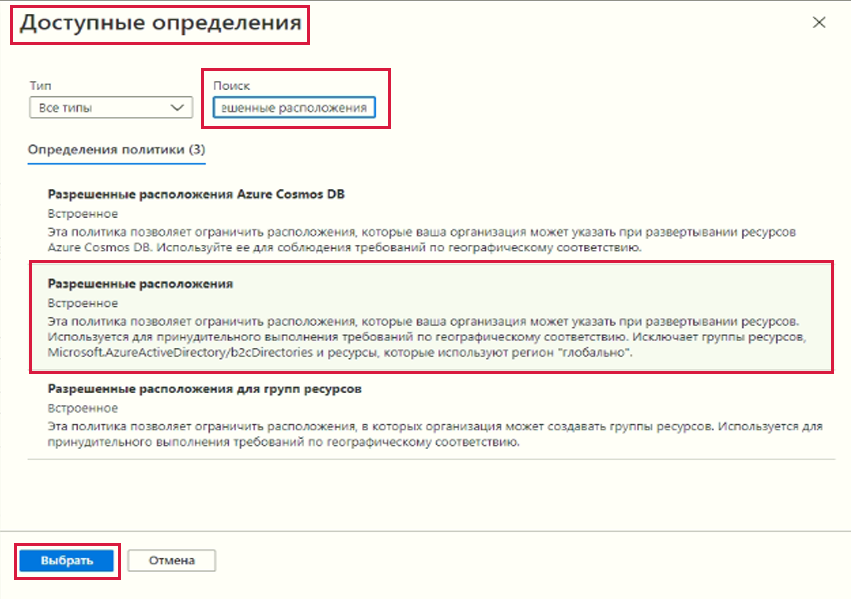

# Создание политики Azure

В этом пошаговом руководстве мы создадим политику Azure, чтобы ограничить развертывание ресурсов Azure определенным расположением.

## Задача 1. Создание назначения политики 

В рамках этой задачи мы настроим политику разрешенного расположения и назначим ее своей подписке. 

1. Войдите на [портал Azure](https://portal.azure.com).

2. На портале Azure перейдите к группе ресурсов **rg-lab16-#####**.

3. Далее перейдите к элементу **Политики** в разделе **Настройки**, а затем в разделе **Разработка** щелкните **Определения**.  Уделите время изучению списка встроенных определений политик. Например, в раскрывающемся списке **Категория** выберите только **Вычисление**. Обратите внимание, что определение **Разрешенные размеры номеров SKU виртуальных машин** позволяет указать набор номеров SKU виртуальных машин, которые может развертывать ваша организация.

3. Далее перейдите в разделе **Разработка** в **Назначения**. Назначение — это политика, которая назначена в рамках определенной области. Например, определение может быть назначено области действия подписки. 

4. Щелкните **Назначить политику** вверху страницы **Политика — назначения**.

5. На странице **Назначить политику** сохраните область по умолчанию.

      | Параметр | Значение | 
    | --- | --- |
    | Область| **Использовать выбранное по умолчанию**|
    | Определение политики | Щелкните многоточие, затем выполните поиск **Разрешенные расположения**, а затем нажмите **Выбрать** |
    | Имя назначения | **Разрешенные расположения** |
    
    
6. На вкладке **Параметры** выберите **Западная Япония**. Нажмите кнопку **Просмотр и создание**, а затем кнопку **Создать**.

    **Примечание**. Область определяет, к каким ресурсам или группе ресурсов применяется назначение политики. В нашем случае вы назначаете эту политику определенной группе ресурсов. 

    **Примечание**. Это определение политики **Разрешенные расположения** определяет расположение, в котором должны быть развернуты все ресурсы. Если выбрано другое расположение, развертывание будет запрещено. Дополнительные сведения см. на странице [Примеры политик Azure](https://docs.microsoft.com/ru-ru/azure/governance/policy/samples/index).

   

9. Назначение политики **Разрешенные расположения** теперь указано на панели **Политика — назначения** и действует, применяя политику на заданном нами уровне области действия (уровне подписки).

## Задача 2. Проверка политики разрешенных расположений

В рамках этой задачи мы протестируем политику разрешенных расположений. 

1. На портале Azure в колонке **Все службы** найдите и выберите элемент **Учетные записи хранения**, а затем щелкните **+Создать**.

2. Настройте учетную запись хранения (замените **xxxx** в имени учетной записи хранения буквами и цифрами так, чтобы имя было глобально уникальным). Для остальных параметров оставьте значения по умолчанию. 

    | Параметр | Значение | 
    | --- | --- |
    | Подписка | **Использование предоставленного по умолчанию** |
    | Группа ресурсов | **rg-lab16-#####**  |
    | Имя учетной записи хранения | **storageaccountxxxx** |
    | Расположение | **(США) Восточная часть США** |

3. Нажмите кнопку **Просмотр и создание**, а затем кнопку **Создать**. 

4. Вы получите сообщение об ошибке **Сбой развертывания**, в котором сказано, что ресурс был запрещен политикой, включая имя политики **Разрешенные расположения**.

5. Попробуйте создать другую учетную запись хранения в с расположением **Западная Япония**.

    **Примечание**. К типичным сценариям, в которых может пригодиться политика **Разрешенные расположения**, относятся следующие: 
    - *Отслеживание затрат*: вы можете использовать разные подписки для разных регионов. Политика обеспечит развертывание всех ресурсов в предполагаемом регионе, чтобы упростить отслеживание затрат. 
    - *Обеспечение соответствия для места расположения данных и безопасности*: вы также можете предъявлять требования к месту расположения данных, создавать подписки для каждого клиента или конкретных рабочих нагрузок, а также определять, что все ресурсы должны быть развернуты в конкретном центре обработки данных, чтобы удовлетворить требования по соответствию для данных и безопасности.

Поздравляем! Вы назначили политику Azure, чтобы ограничить развертывание ресурсов Azure определенным центром обработки данных.
