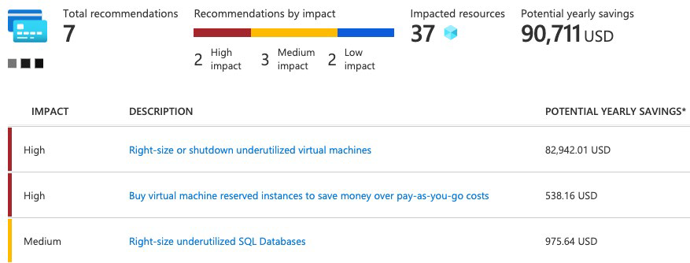
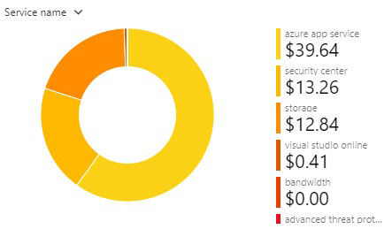

## Приобретение служб Azure и использование калькулятора цен 

Важно знать, как формируются затраты в Azure, чтобы вы могли понять, как ваши решения о покупке и проектировании решений могут повлиять на конечную стоимость.
 
### Какие типы подписок Azure можно использовать?

Вы, наверное, знаете, что подписка Azure предоставляет доступ к ресурсам Azure, таким как виртуальные машины, хранилища и базы данных. Типы ресурсов, которые вы используете, влияют на ваш ежемесячный счет.

Azure предлагает как бесплатные, так и платные варианты подписки в соответствии с вашими потребностями. Это: 

- **Бесплатная пробная версия** Бесплатная пробная подписка предоставляет вам 12 месяцев популярных бесплатных служб, кредит на изучение любой службы Azure в течение 30 дней и более 25 служб которые всегда бесплатны. Службы Azure отключаются по окончании пробной версии или по истечении срока действия кредита на платные продукты, если вы не перейдете на платную подписку.

- **Оплата по мере использования** Подписка с оплатой по мере использования позволяет вам оплачивать то, что вы используете, прикрепляя кредитную или дебетовую карту к своей учетной записи. Организации могут подать заявку на оптовые скидки и предоплаченное выставление счетов. 

- **Участник предлагает** существующее членство в определенных продуктах и службах Microsoft, которые могут предоставить вам кредиты для вашей учетной записи Azure и сниженные тарифы на службы Azure. Например, предложения участников доступны подписчикам Visual Studio, участникам партнерской сети Microsoft, участникам Microsoft for Startups и участникам Microsoft Imagine. 

### Как приобрести службы Azure?

Существует три основных способа приобретения служб в Azure. Это: 

- **Через соглашение Enterprise** Крупные клиенты, известные как корпоративные клиенты, могут подписать соглашение с корпорацией Microsoft. Это соглашение обязывает их тратить заранее определенную сумму на службы Azure в течение трех лет. Сервисный сбор обычно оплачивается ежегодно. Как клиент Соглашения Enterprise, вы получите индивидуальный подход на цены, в зависимости от видов и объемов услуг, которые вы планируете использовать.

- **Непосредственно из Интернета** Здесь вы приобретаете службы Azure непосредственно на веб-сайте портала Azure и платите стандартные цены. Счет выставляется ежемесячно, как оплата кредитной картой или через счет. Этот метод покупки называется Web Direct.

- **Через поставщика облачных решений** Поставщик облачных решений (CSP) — это партнер Microsoft, который помогает создавать решения на основе Azure. CSP выставляет счет за использование Azure по цене, которую они определяют. Они также отвечают на ваши вопросы поддержки и по мере необходимости переходят в корпорацию Microsoft. 

Вы можете вызвать или подготовить ресурсы Azure на портале Azure или из командной строки. Портал Azure упорядочивает продукты и службы по категориям. Вы выбираете услуги, которые соответствуют вашим потребностям. Счет за вашу учетную запись выставляется в соответствии с моделью Azure "оплата за то, что вы используете". 

Ниже приведен пример, портал Azure. 
 

В конце каждого месяца вам выставляется счет за то, что вы использовали. В любое время вы можете проверить страницу управления затратами и выставления счетов на портале Azure, чтобы получить сводку о текущем использовании и просмотреть предыдущие счета-фактуры за конкретные месяцы.

### Какие факторы влияют на стоимость?

Общие факторы использования ресурсов, тип подписки и цены от сторонних поставщиков. Давайте кратко рассмотрим каждый из них.

#### Тип ресурса

На стоимость ресурсов Azure влияет ряд факторов. Они зависят от типа ресурса или от того, как вы его настраиваете. 

Например, с помощью учетной записи хранения вы указываете тип (например, блочное хранилище BLOB-объектов или хранилище таблиц), уровень производительности (стандартный или расширенный) и уровень доступа (горячий, холодный или архивный). Эти варианты представляют разные затраты.

#### Измерители использования

При подготовке ресурса Azure создает счетчики для отслеживания использования этого ресурса. Azure использует эти счетчики для создания записи об использовании, которая в последствии будет использоваться для расчета счета.

Подумайте о счетчиках использования, похожих на то, как вы используете электричество или воду в своем доме. Вы можете платить базовую цену каждый месяц за электричество или водоснабжение, но ваш окончательный счет основан на общей сумме, которую вы потребили.

Давайте рассмотрим одну виртуальную машину в качестве примера. Следующие виды счетчиков имеют отношение к отслеживанию его использования:

- Общее время процессора. 

- Время, проведенное с публичным IP-адресом. 

- Входящий и исходящий сетевой трафик в виртуальной машине и из нее. 

- Размер диска и количество операций чтения и записи диска.
 
Каждый метр отслеживает определенный тип использования. Например, измеритель может отслеживать использование полосы пропускания (входящий или исходящий сетевой трафик в битах в секунду), количество операций или его размер (емкость хранилища в байтах).

Использование, которое отслеживает счетчик, коррелирует с количеством оплачиваемых единиц. Эти единицы списываются с вашей учетной записи за каждый расчетный период. Тариф за оплачиваемую единицу зависит от типа ресурса, который вы используете.

#### Использование ресурсов

В Azure плата всегда взимается в зависимости от того, что вы используете. В качестве примера рассмотрим, как это выставление счетов применяется к освобождению виртуальной машины.

В Azure можно удалить или освободить виртуальную машину. Удаление виртуальной машины означает, что она вам больше не нужна. Виртуальная машина удаляется из подписки, а затем подготавливается для другого клиента. 

Ограждающая виртуальная машина означает, что она больше не работает. Но связанные жесткие диски и данные по-прежнему хранятся в Azure. Виртуальная машина не назначается ЦП или сети в центре обработки данных Azure, поэтому она не создает затраты, связанные с временем вычислений или IP-адресом виртуальной машины. Поскольку диски и данные по-прежнему хранятся, а ресурс присутствует в подписке Azure, вам по-прежнему выставляется счет за дисковое хранилище.

Выключение виртуальной машины, когда вы не планируете использовать ее в течение некоторого времени, является лишь одним из способов минимизации затрат. Например, вы можете освободить виртуальные машины, используемые для тестирования в выходные дни, когда ваша команда тестирования их не использует. Вы узнаете больше о способах минимизации затрат позже в этом модуле.

#### Типы подписок Azure

Некоторые типы подписок Azure также включают квоты на использование, которые влияют на затраты.

Например, бесплатная пробная подписка Azure предоставляет доступ к ряду продуктов Azure, которые являются бесплатными в течение 12 месяцев. Он также включает в себя кредит, который можно потратить в течение первых 30 дней после регистрации. И вы получаете доступ к более чем 25 продуктам, которые всегда бесплатны (в зависимости от наличия ресурса и региона). 

#### Azure Marketplace

Вы также можете приобрести решения и службы на основе Azure у сторонних поставщиков через Azure Marketplace. Примерами могут быть управляемые сетевые брандмауэры или соединители со сторонними службами резервного копирования. Структуры выставления счетов устанавливаются поставщиком. 

### Влияет ли местоположение или сетевой трафик на стоимость?

При подготовке ресурса в Azure необходимо определить расположение (известное как регион Azure), в котором он будет развернут. Давайте разберемся, почему это решение может иметь последствия для затрат. 

#### Местоположение

Инфраструктура Azure распределена по всему миру, что позволяет развертывать службы централизованно или размещать службы ближе всего к тому месту, где их используют ваши клиенты. 

Разные регионы могут иметь разные связанные цены. Поскольку географические регионы могут влиять на то, где проходит сетевой трафик, сетевой трафик также влияет на стоимость. 

#### Зоны для тарификации сетевого трафика

Зоны выставления счетов являются фактором, определяющим стоимость некоторых служб Azure. 

[Bandwidth](https://azure.microsoft.com/pricing/details/bandwidth?azure-portal=true) относится к данным, перемещаемым в центры обработки данных Azure и из него. Некоторые входящие передачи данных (данные, идущие в центры обработки данных Azure) бесплатны. Для исходящей передачи данных (данные, выходящие из центров обработки данных Azure) цены на передачу данных основаны на зонах. 

 

Зона — это географическая группировка регионов Azure для выставления счетов. Следующие зоны включают в себя некоторые регионы, как показано здесь:

- Зона 1: Центральная Австралия, Запад США, Восток США, Западная Канада, Западная Европа, Центральная Франция и другие

- Зона 2: Восточная Австралия, Западная Япония, Центральная Индия, Южная Корея и другие

- Зона 3: Южная Бразилия, Южная Африка Север, Южная Африка Запад, ОАЭ Центральный, ОАЭ Север

- DE Зона 1: Центральная Германия, Северо-Восток Германии

### Как оценить общую стоимость?

Как вы узнали, точная оценка затрат учитывает все предыдущие факторы. К счастью, калькулятор цен Azure поможет вам в этом процессе.

Калькулятор цен отображает продукты Azure в категориях. Вы добавляете эти категории в свою оценку и настраиваете в соответствии с вашими конкретными требованиями. Затем вы получаете консолидированную оценочную стоимость с подробной разбивкой затрат, связанных с каждым ресурсом, добавленным в решение. Вы можете экспортировать или поделиться этой оценкой или сохранить ее для последующего использования. Можно загрузить сохраненную оценку и изменить ее в соответствии с обновленными требованиями. 

Вы также можете получить доступ к сведениям о ценах, сведениям о продукте и документации по каждому продукту из калькулятора цен. 
 

 
Параметры, которые можно настроить в калькуляторе цен, различаются в зависимости от продукта, но они могут включать:

- **Регион** Регион — это географическое положение, в котором вы можете предоставлять услугу. Юго-Восточная Азия, Центральная Канада, Западная часть Соединенных Штатов и Северная Европа являются несколькими примерами.

- **Уровни** уровня, такие как уровень "Бесплатный" или Базовый, имеют разные уровни доступности или производительности и различные связанные с этим затраты.

- **Параметры выставления счетов** Параметры выставления счетов выделяют различные способы оплаты услуги. Параметры могут варьироваться в зависимости от типа клиента и типа подписки и могут включать параметры для экономии затрат.

- **Варианты поддержки** Эти опции позволяют выбрать дополнительные варианты ценообразования поддержки для определенных услуг.

- **Программы и предложения** Ваш клиент или тип подписки может позволить вам выбирать из определенных программ лицензирования или других предложений.

- **Цены на разработку и тестирование Azure** Этот параметр отображает доступные цены на рабочие нагрузки разработки и тестирования. Цены на разработку и тестирование применяются при запуске ресурсов в рамках подписки Azure, основанной на предложении разработки и тестирования. 

Имейте в виду, что калькулятор ценообразования предоставляет оценки, а не фактические ценовые предложения. Фактические цены могут варьироваться в зависимости от даты покупки, валюты платежа, которую вы используете, и типа клиента Azure, которым вы являетесь.

## Калькулятор совокупной стоимости владения

Наличие твердого понимания того, где находится компания сегодня, даст ей большее представление о том, что означает миграция в облако с точки зрения стоимости. 

В этом устройстве вы увидите, как калькулятор совокупной стоимости владения (TCO) может помочь вам сравнить стоимость работы в центре обработки данных с работой в Azure.

### Что такое калькулятор совокупной стоимости владения?

[Калькулятор совокупной стоимости владения](https://azure.microsoft.com/pricing/tco/calculator?azure-portal=true) помогает оценить экономию средств при эксплуатации решения в Azure с течением времени, а не в локальном центре обработки данных. 

Термин общая стоимость владения обычно используется в финансах. Может быть трудно увидеть все скрытые затраты, связанные с эксплуатацией технологической возможности локально. Лицензии на программное обеспечение и оборудование являются дополнительными расходами.

С помощью калькулятора совокупной стоимости владения вы вводите сведения о локальных рабочих нагрузках. Затем вы просматриваете предлагаемые средние затраты по отрасли (которые вы можете скорректировать) для связанных эксплуатационных расходов. Эти затраты включают в себя электроэнергию, обслуживание сети и ИТ-трудозатраты. Затем вам будет представлен параллельный отчет. С помощью отчета можно сравнить эти затраты с теми же рабочими нагрузками, которые выполняется в Azure.

На следующем рисунке показан один пример. 

 

**Прим.**: Для работы с калькулятором совокупной стоимости владения, подписка Azure не требуется. 

### Как работает калькулятор совокупной стоимости владения?

Работа с калькулятором совокупной стоимости владения включает в себя три этапа:

- Определите свои рабочие нагрузки.
 
- Скорректируйте предположения.

- Просмотрите отчет. 

- Давайте подробнее рассмотрим каждый шаг.

#### Шаг 1. Определение рабочих нагрузок

Сначала необходимо ввести спецификации локальной инфраструктуры в калькулятор совокупной стоимости владения на основе следующих четырех категорий:

- **Серверы** Эта категория включает операционные системы, методы виртуализации, ядра процессора и память (ОЗУ). 

- **Базы данных** Эта категория включает типы баз данных, серверное оборудование и службу Azure, которую вы хотите использовать, которая включает ожидаемое максимальное количество одновременных входов пользователей. 

- **Хранение** Эта категория включает в себя тип хранилища и емкость, которая включает в себя любое резервное или архивное хранилище.

- **Сеть** Эта категория включает в себя пропускную способность сети, которую вы в настоящее время используете в локальной среде. 

#### Шаг 2: Корректировка допущений

Затем укажите, зарегистрированы ли текущие локальные лицензии для [Software Assurance](https://www.microsoft.com/licensing/licensing-programs/software-assurance-default?azure-portal=true), что может сэкономить деньги за счет повторного использования этих лицензий в Azure. Вы также указываете, нужно ли реплицировать хранилище в другой регион Azure для большей избыточности.

Затем вы можете увидеть ключевые предположения об эксплуатационных расходах в нескольких различных областях, которые различаются между командами и организациями. Эти расходы были сертифицированы Nucleus Research, независимой исследовательской компанией. Например, эти расходы включают в себя:

- Цена электроэнергии за киловатт-час (кВт/ч). 

- Почасовая оплата за ИТ-администрирование. 

- Стоимость обслуживания сети в процентах от затрат на сетевое оборудование и программное обеспечение. 

Чтобы повысить точность результатов калькулятора совокупной стоимости владения, необходимо настроить значения таким образом, чтобы они соответствовали затратам текущей локальной инфраструктуры.

#### Шаг 3: Просмотр отчета

Выберите временные рамки от одного до пяти лет. Калькулятор совокупной стоимости владения создает отчет, основанный на введенной вами информации. Вот пример:
 

Для каждой категории (вычислительные ресурсы, центр обработки данных, сети, системы хранения данных и ИТ-трудозатраты) можно также просмотреть параллельное сравнение разбивки затрат на эксплуатацию этих рабочих нагрузок, локальные и работающие с ними в Azure. Вот пример: 

Вы можете загрузить, поделиться или сохранить этот отчет для последующего просмотра. 

## Управление и минимизация общих затрат в Azure

Вот некоторые рекомендуемые практики, которые могут помочь вам минимизировать ваши расходы.

### Понимание предполагаемых затрат перед развертыванием 

Чтобы помочь вам спланировать решение в Azure, тщательно рассмотрите необходимые продукты, службы и ресурсы. Прочитайте соответствующую документацию, чтобы понять, как каждый из ваших вариантов измеряется и оплачивается. 

Рассчитайте прогнозируемые затраты с помощью калькулятора ценообразования и калькулятора совокупной стоимости владения (TCO). Добавляйте только продукты, услуги и ресурсы, необходимые для решения. 

### Использование помощника Azure для мониторинга использования

В идеале вы хотите, чтобы подготовленные ресурсы соответствовали вашему фактическому использованию.

Советник Azure выявляет неиспользуемые или недостаточно используемые ресурсы и рекомендует неиспользуемые ресурсы, которые можно удалить. Эти сведения помогут настроить ресурсы в соответствии с фактической рабочей нагрузкой.

На следующем рисунке показаны некоторые примеры рекомендаций от помощника Azure:
 

Рекомендации сортируются по воздействию: высокое, среднее или низкое. В некоторых случаях советник Azure может автоматически устранить или исправить основную проблему. Другие проблемы, которые перечислены как высокоэффективные, требуют вмешательства человека. 

### Используйте лимиты расходов, чтобы ограничить свои расходы

Если у вас есть бесплатная пробная версия или подписка Azure на основе кредита, вы можете использовать лимиты расходов, чтобы предотвратить случайное переполнение.

Например, когда вы тратите все кредиты, включенные в бесплатную учетную запись Azure, развернутые ресурсы Azure удаляются из рабочей среды и виртуальных машин Azure (виртуальные машины останавливаются и освобождаются ресурсы). Данные в учетных записях хранения доступны только для чтения. На этом этапе вы можете обновить бесплатную пробную подписку до подписки с оплатой по мере установки. 

Если у вас есть подписка на основе кредита и вы достигли настроенного лимита расходов, Azure приостанавливает подписку до начала нового расчетного периода. 

Связанной концепцией является квоты или ограничения на количество аналогичных ресурсов, которые можно подготовить в рамках подписки. Например, можно выделить до 25 000 виртуальных машин на регион. Эти ограничения в основном помогают Microsoft планировать емкость своего центра обработки данных. 

### Использование резерваций Azure для предоплаты

Службы бронирования Azure предлагают скидки на определенные службы Azure. Резервации Azure могут сэкономить до 72 процентов по сравнению с оплатой по графику (например, ежемесячно). Чтобы получить скидку, вы резервируете услуги и ресурсы, оплатив заранее.

Например, можно внести предоплату за один или три года использования виртуальных машин, вычислительной емкости базы данных, пропускной способности базы данных и других ресурсов Azure. 

В следующем примере показана предполагаемая экономия на виртуальных машинах. В этом примере вы экономите примерно 72 процента, взяв на себя обязательство на трехлетний срок.

 
Резервации Azure доступны клиентам с соглашением Enterprise, поставщиками облачных решений и подписками с оплатой по мере поступления.

### Выбирайте недорогие локации и регионы

Стоимость продуктов, службы ресурсов Azure может варьироваться в зависимости от расположения и региона. Если возможно, вы должны использовать их в тех местах и регионах, где они стоят дешевле.

Но помните, что некоторые ресурсы измеряются и оплачиваются в зависимости от того, сколько исходящей способности чистой работы они потребляют. Следует подготовить подключенные ресурсы с лимитом ширины полосы в одном регионе Azure, чтобы уменьшить исходящий трафик между ними. 

### Изучите доступные предложения по экономии средств

Будьте в курсе последних предложений клиентов и подписок Azure и переключайтесь на предложения, которые обеспечивают наибольшую экономию средств. 

### Использование Azure Управление затратами + Выставление счетов для контроля расходов

Azure Cost Management + Billing — это бесплатная служба, которая помогает проанализировать счет Azure, позволяет управлять учетной записью и подписками, отслеживать и контролировать расходы Azure, а также оптимизировать использование ресурсов.

На следующем рисунке показано текущее использование с разбивкой по службам: 
 

 
В этом примере служба приложений Azure, служба размещения веб-приложений, генерирует наибольшую стоимость.

Функции управления затратами и выставления счетов Azure включают в себя:

- **Отчетность** Используйте накопленные данные для создания отчетов и прогнозирования будущего использования и расходов.

- **Обогащение данных** Повышение подотчетности путем категоризации ресурсов с тегами, которые соответствуют реальным бизнес-подразделениям и организационным подразделениям.

- **Бюджеты** Создание и управление бюджетами затрат и использования путем мониторинга тенденций спроса на ресурсы, темпов потребления и моделей затрат. 

- **Оповещения** Получайте оповещения на основе ваших затрат и бюджетов использования. 

- **Рекомендации** Получите рекомендации по устранению простаивающего использования ресурсов и оптимизации ресурсов Azure, которые вы предоставляете. 

### Применение тегов для идентификации владельцев затрат

Теги помогают управлять расходами, связанными с различными группами продуктов и ресурсов Azure. Вы можете применять теги к группам ресурсов Azure для организации платежных данных.

 Например, если вы запускаете несколько виртуальных машин для разных групп, вы можете использовать теги для категоризации затрат, например по отделу кадров, маркетингу или финансам, или по рабочей среде (например, тест на производительность).

Теги упрощают определение групп, которые генерируют наибольшие затраты на Azure, что может помочь вам соответствующим образом скорректировать расходы. 

На следующем рисунке показан годовой период использования с разбивкой по тегам на странице Azure "Управление затратами + выставление счетов". 
 

### Изменяйте размер недостаточно используемых виртуальных машин

В разделе Azure Cost Management + Billing и Azure Advisor рекомендуется изменить размер или завершить работу виртуальных машин, которые недостаточно используются или простаивают.

В качестве примера предположим, что у вас есть виртуальная машина размером Standard_D4_v4, тип виртуальной машины общего назначения с четырьмя виртуальными процессорами и 16 ГБ памяти. Вы можете обнаружить, что эта виртуальная машина простаивает 90 процентов времени. 

Затраты на виртуальные машины являются линейными и удваиваются для каждого размера, большего в той же серии. Таким образом, в этом случае, если вы уменьшите размер виртуальной машины с Standard_D4_v4 до Standard_D2_v4, т.е. сделаете на размер меньше, вы уменьшите свои вычислительные затраты на 50 процентов.

На следующем рисунке показана эта идея: 

Имейте в виду, что изменение размера виртуальной машины требует ее остановки, изменение размера и последующего перезапуска. Этот процесс может занять несколько минут в зависимости от того, на сколько значительным является изменение размера. Убедитесь, что вы правильно планируете сбой или переместите трафик на другой экземпляр во время выполнения операций по изменению размера. 

### Останавливайте виртуальные машины в нерабочее время 

Напомним, что освободить виртуальную машину означает больше не запускать виртуальную машину, а сохранить связанные жесткие диски и данные в Azure.

Если у вас есть рабочие нагрузки виртуальных машин, которые используются только в определенные периоды, например, вы запускаетесь на 1 час каждый день, вы тратите деньги впустую. Эти виртуальные машины являются отличными кандидатами для завершения работы, когда они не используются, и запуска обратно, когда они вам нужны. Экономьте вычислительные расходы, пока виртуальная машина не используется.

Такой подход является отличной стратегией для сред разработки и тестирования, где виртуальные машины нужны только в рабочее время. Azure даже предоставляет способ автоматического запуска и остановки виртуальных машин по расписанию. 

### Удаление неиспользуемых ресурсов

Эта рекомендация может показаться очевидной, но если вы не используете ресурс, вы должны закрыть его. Нередко можно найти непроизводственные или концептуальные системы, которые больше не нужны после завершения проекта.

Регулярно проверяйте свою среду и работайте над идентификацией этих систем. Отключение этих систем может иметь двойное преимущество, экономя на затратах на инфраструктуру и потенциальной экономии на лицензировании и эксплуатационных расходах.
 
### Миграция с IaaS на службы PaaS 

По мере перемещения рабочих нагрузок в облако естественная эволюция заключается в том, чтобы начать с сервисов инфраструктуры как услуги (IaaS), поскольку они более соотносятся с концепциями и операции, с которыми вы уже знакомы. 

Со временем одним из способов снижения затрат является постепенное перемещение рабочих нагрузок IaaS для запуска на платформе как услуги (PaaS). IaaS предоставляет прямой доступ к вычислительной инфраструктуре, PaaS предоставляет готовые среды разработки и развертывания, управляемые для вас.

В качестве примера предположим, что SQL Server запускается на виртуальной машине, работающей в Azure. Эта конфигурация требует управления базовой операционной системой, настройки лицензии SQL Server, управления программным обеспечением, обновлениями безопасности и т.д. Вы также платите за виртуальную машину независимо от того, обрабатывает ли база данных запросы. Одним из способов потенциальной экономии затрат является перемещение базы данных с SQL Server на виртуальной машине в Базу данных SQL Azure. База данных SQL Azure основана на SQL Server.

Мало того, что службы PaaS, такие как, База данных SQL Azure, часто дешевле в запуске, но поскольку они управляются для вас, вам не нужно беспокоиться об обновлениях программного обеспечения, исправления безопасности или оптимизация физического хранилища для операций чтения и записи. 

### Экономия на лицензионных расходах

Лицензирование — это еще одна область, которая может существенно повлиять на ваши расходы на облако. Давайте рассмотрим некоторые способы снижения затрат на лицензирование. 

#### Выбирайте экономичные операционные системы

Многие службы Azure предоставляют возможность запуска в Windows или Linux. В некоторых случаях стоимость зависит от того, какую ОС вы выберете. Когда у вас есть выбор, и ваше приложение не зависит от базовой операционной системы, полезно сравнить цены, чтобы увидеть, можете ли вы сэкономить деньги.

#### Использование преимущества гибридного использования Azure для перепрофилирования лицензии на программное обеспечение в Azure

Если вы приобрели лицензии для Windows Server или SQL Server и на ваши лицензии распространяется [Software Assurance](https://www.microsoft.com/licensing/licensing-programs/software-assurance-default?azure-portal=true), вы можете перепрофилировать эти лицензии на виртуальных машинах в Azure.

Некоторые детали различаются между Windows Server или SQL Server. В конце этого модуля мы предоставим ресурсы, где вы сможете узнать больше.
