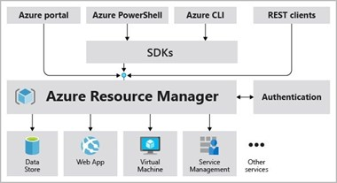
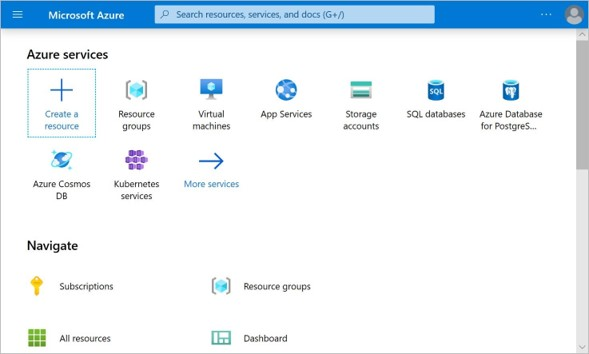
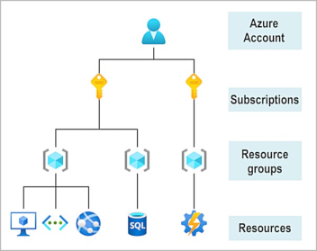
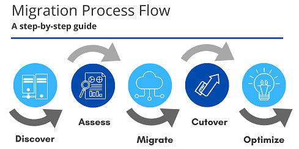

# Основные архитектурные компоненты Azure

Организация структуры для ресурсов в Azure имеет четыре уровня: группы управления, подписки, группы ресурсов и ресурсы.


- **Ресурсы** — это экземпляры создаваемых служб, таких как виртуальные машины, хранилища или базы данных SQL.
- Ресурсы объединяются в **группы ресурсов**, которые выступают в качестве логического контейнера, в котором развертываются и управляются такие ресурсы Azure, как веб-приложения, базы данных и учетные записи хранилищ. 
- **Подписка** группирует учетные записи пользователей и ресурсы, которые были созданные этими учетными записями пользователей. Для каждой подписки существуют лимиты или квоты на сумму ресурсы, которые можно создавать и использовать. Организации могут использовать подписки для управления затратами и ресурсы, созданные пользователями, группами или проектами.
- **Группы управления** помогают управлять доступом, политиками и соответствием требованиям для нескольких подписки. Все подписки в группе управления автоматически наследуют условия, применяемые к группе управления.

## Регионы Azure, зоны доступности и пары регионов

Azure состоит из центров обработки данных, расположенных по всему миру. При использовании службы или создании ресурса,
например, базы данных SQL или виртуальной машина (ВМ), вы используете физическое оборудование в одной или нескольких локациях.
Эти конкретные центры обработки данных не доступны пользователям напрямую. Вместо этого Azure организует их в *регионы*.

### Регионы Azure

Регион — это географическая область на планете, которая содержит по крайней мере один, но потенциально несколько центров обработки данных, которые находятся поблизости и объединены в сеть с низкой задержкой. Azure интеллектуально назначает и контролирует ресурсы в каждом регионе, чтобы обеспечить надлежащую сбалансированность рабочих нагрузок.

При развертывании ресурса в Azure часто требуется выбрать регион, в котором вы хотите развернуть ресурс.

***Важно***: Некоторые службы или функции виртуальных машин доступны только в определенных регионах, например определенных размеров виртуальных машин или типов хранилищ. Существуют также некоторые глобальные службы Azure, которые не требуют выбора определенного региона, например Azure Active Directory, диспетчер трафика Azure и Azure DNS.

Несколько примеров регионов: Запад США, Центральная Канада, Западная Европа, Восточная Австралия и Западная Япония.

Вот представление всех доступных регионов по состоянию на июнь 2020 года.


#### Почему регионы важны?

Azure имеет больше глобальных регионов, чем любой другой поставщик облачных услуг. Эти регионы позволяют гибко подводить приложения к пользователям независимо от того, где они находятся. Глобальные регионы обеспечивают лучшую масштабируемость и избыточность. Они также сохраняют резидентность данных для ваших услуг.

#### Специальные регионы Azure

В Azure есть специализированные регионы, которые вы, возможно, захотите использовать при создании приложений в соответствии с требованиями или в юридических целях. В качестве примера можно привести следующие:

- **Центральное правительство США, Правительство США в Вирджинии, Правительство США в Айове и другие**: эти регионы являются физическими и логическими сетевыми изолированными экземплярами Azure для правительственных учреждений и партнеров США. Эти центры обработки данных управляются проверенным персоналом США и включают дополнительные сертификаты соответствия.

- **Китай Восток, Китай Север и другие**: Эти регионы доступны благодаря уникальному партнерству между Microsoft и 21Vianet, в соответствии с которым Microsoft не поддерживает центры обработки данных напрямую.

Регионы — это то, что вы используете для определения местоположения ваших ресурсов. Есть два других термина, о которых вы также должны знать: география и зоны доступности.

### Зоны доступности Azure

Вам необходимо чтобы ваши службы и данные были избыточны, чтобы вы могли защитить свою информацию в случае сбоя. При размещении инфраструктуры для настройки собственной избыточности требуется создать дубликаты аппаратных сред. Azure может помочь сделать ваше приложение высокодоступным через зоны доступности.

#### Что такое зона доступности?

Зоны доступности — это физически отдельные центры обработки данных в регионе Azure. Каждая зона доступности состоит из одного или нескольких центров обработки данных, оснащенных независимым питанием, охлаждением и сетью. Зона доступности настроена как граница изоляции. Если одна зона опускается, другая продолжает работать. Зоны доступности соединены через высокоскоростные частные волоконно-оптические сети.


#### Поддерживаемые регионы

Не каждый регион поддерживает зоны доступности. См. [регионы, поддерживающие зоны доступности в Azure](https://docs.microsoft.com/azure/availability-zones/az-region?azure-portal=true).

#### Использование зон доступности в приложениях

Зоны доступности можно использовать для запуска критически важных приложений и создания высокой доступности в архитектуре приложения путем совместного размещения вычислительных ресурсов, ресурсов хранения, сети и данных в пределах зоны и репликации в других зонах. Имейте в виду, что дублирование служб и передача данных между зонами могут стоить дорого.
 
Зоны доступности предназначены в основном для виртуальных машин, управляемых дисков, подсистем балансировки нагрузки и баз данных SQL. Службы Azure, поддерживающие зоны доступности, делятся на две категории:

- **Зональные службы**: вы закрепляете ресурс в определенной зоне (например, виртуальные машины, управляемые диски, IP-адреса).

- **Службы с резервированием зон**: платформа автоматически реплицируется между зонами (например, хранилище зон с повторным резервированием, база данных SQL).

Ознакомьтесь с документацией, чтобы определить, какие элементы архитектуры можно связать с зоной доступности.

### Пары регионов Azure

Зоны доступности создаются с помощью одного или нескольких центров обработки данных. В одном регионе есть как минимум три зоны. Вполне возможно, что крупная катастрофа может привести к отключению, достаточно большому, чтобы повлиять даже на два центра обработки данных. Вот почему Azure также создает пары регионов.

#### Что такое пара регионов?

Каждый регион Azure всегда сопряжен с другим регионом в пределах той же географии (например, США, Европы или Азии), расположенным на расстояние не менее 300 миль. Этот подход позволяет выполнять репликацию ресурсов (например, хранилища виртуальных машин) по всей географии, что помогает снизить вероятность прерывания работы из-за таких событий, как стихийные бедствия, гражданские беспорядки, перебои в электроснабжении или перебои в работе физической сети, которые влияют на оба региона одновременно. Например, если регион в паре пострадал от стихийного бедствия, службы автоматически дублируются в другой регион в своей паре регионов.

Примерами пар регионов в Azure являются Западная часть США в паре с Восточной частью США и Юго-Восточная Азия в паре с Восточной Азией.


Поскольку пара регионов напрямую связана и находится достаточно далеко друг от друга, чтобы быть изолированной от региональных бедствий, их можно использовать для предоставления надежных услуг и избыточности данных. Некоторые сервисы предлагают автоматическое геоизбыточное хранилище с помощью пар регионов.

Дополнительные преимущества пар регионов:

- При возникновении обширного сбоя Azure приоритет отдается одному региону из каждой пары, чтобы обеспечить скорейшее восстановление хотя бы одного для приложений, размещенных в этой паре регионов.

- Запланированные обновления Azure развертываются в парных регионах по одному региону за раз, чтобы свести к минимуму время простоя и риск простоя приложения.

- Данные продолжают находиться в той же географии, что и их пара (за исключением Южной Бразилии) для целей налоговой и правоохранительной юрисдикции.
 
Наличие широко распределенного набора центров обработки данных позволяет Azure предоставлять высокую гарантию доступности.

## Ресурсы Azure, группы ресурсов и диспетчер повторных источников Azure

Определим термины:

- **Ресурс**: управляемый элемент, доступный через Azure. Виртуальные машины (ВМ), счетчики ресурсов хранилища, веб-приложения, базы данных и виртуальные сети являются примерами ресурсов.

- **Группа ресурсов**: контейнер, в котором хранятся связанные ресурсы для решения Azure. Группа ресурсов включает ресурсы, которыми требуется управлять как группой. Вы решаете, какие ресурсы принадлежат к группе ресурсов, исходя из того, что имеет наибольший смысл для вашей организации.

### Группы ресурсов Azure

Группы ресурсов являются фундаментальным элементом платформы Azure. Группа ресурсов — это логический содержатель ресурсов, развернутых в Azure. Эти ресурсы — это все, что вы создаете в подписке Azure, например виртуальные машины, экземпляры шлюза приложений Azure и экземпляры Azure Cosmos DB. Все ресурсы должны в составе группы ресурсов, а ресурс может быть только членом одной группы ресурсов. Многие ресурсы можно перемещать между группами ресурсов, причем некоторые службы имеют определенные ограничения или требования для перемещения. Группы ресурсов не могут быть вложенными. Перед подготовкой любого ресурса необходимо создать группу ресурсов для его размещения.

#### Логическая группировка

Группы ресурсов существуют для управления ресурсами Azure и их организации. Размещая ресурсы аналогичного использования, типа или расположения в группе ресурсов, вы можете обеспечить порядок и организацию ресурсов, созданных в Azure. Логическая группировка — это аспект, который вас больше всего интересует здесь, потому что среди наших ресурсов много беспорядка.


#### Жизненный цикл
 

При удалении группы ресурсов также удаляются все ресурсы, содержащиеся в ней. Организация ресурсов по жизненному циклу может быть полезна в непроизводственных средах, где можно попробовать эксперимент, а затем избавиться от него. Группы ресурсов упрощают удаление набора ресурсов одновременно.
 
#### Авторизация

Группы ресурсов также являются областью для применения разрешений управления доступом на основе ролей (RBAC). Применяя разрешения RBAC к группе ресурсов, можно упростить администрирование и ограничить доступ, чтобы разрешить только то, что необходимо.

### Azure Resource Manager

Диспетчер ресурсов Azure — это служба развертывания и управления для Azure. Он предоставляет уровень управления, который позволяет создавать, обновлять и удалять ресурсы в учетной записи Azure. Функции управления, такие как контроль доступа, блокировки и теги, используются для защиты и организации ресурсов после развертывания.

Когда пользователь отправляет запрос из любого из средств Azure, API или пакетов SDK, resource Manager получает запрос. Он аутентифицирует и авторизует запрос. Диспетчер ресурсов отправляет запрос в службу Azure, которая предпринимает запрошенное действие. Поскольку все запросы обрабатываются через один и тот же API, вы видите согласованные результаты и возможности во всех различных инструментах.

На следующем рисунке показана роль диспетчера ресурсов в обработке запросов Azure.



Все возможности, доступные на портале Azure, также доступны через PowerShell, Azure CLI, REST API и клиентские пакеты SDK. Функциональность, первоначально выпущенная через API, будет представлена на портале в течение 180 дней с первой версии.

#### Преимущества использования диспетчера ресурсов

С помощью диспетчера ресурсов вы можете:

- Управлять своей инфраструктурой с помощью декларативных шаблонов, а не скриптов. Шаблон Resource Manager — это JSON-файл, который определяет, что вы хотите развернуть в Azure.

- Развертывать, управлять и производить мониторинг всех ресурсов для вашего решения как группы, а не обрабатывать эти ресурсы по отдельности.

- Повторно разворачивать решение на протяжении всего жизненного цикла разработки и быть уверенным в том, что ваши ресурсы развернуты в согласованном состоянии.

- Определять зависимости между ресурсами, чтобы они были развернуты в правильном порядке.

- Применять контроль доступа ко всем сервисам, поскольку RBAC изначально интегрирован в форму управления.

- Применять теги к ресурсам, чтобы логически организовать все ресурсы в вашей подписке.
 
- Уточнять выставление счетов вашей организации, просмотрев затраты на группу ресурсов, которые используют один и тот же тег.

## Подписки Azure и группы управления

Ресурс Azure — это управляемый элемент, доступный через Azure. Виртуальные машины (ВМ), учетные записи хранения, веб-приложения, базы данных и виртуальные сети — все это примеры ресурсов.

### Подписки Azure

Для использования Azure требуется подписка Azure. Подписка предоставляет доступ к продуктам и службам Azure с проверкой подлинности и авторизацией. Он также позволяет подготавливать ресурсы. Подписка Azure — это логическая единица служб Azure, которая связана с учетной записью Azure, которая является удостоверением в Azure Active Directory (Azure AD) или в каталоге, которому доверяет Azure AD.


Учетная запись может иметь одну подписку или несколько подписок с разными моделями выставления счетов и к которым применяются разные политики управления доступом. Подписки Azure можно использовать для определения границ продуктов, служб и ресурсов Azure. Существует два типа подписок, которые можно использовать:

- **Граница выставления счетов**: этот тип подписки определяет способ выставления счета учетной записи Azure за использование Azure. Можно создать несколько подписок для различных типов требований к выставлению счетов. Azure создает отдельные отчеты о выставлении счетов и счета для каждой подписки, чтобы вы могли упорядочить расходы и управлять ими.

- **Граница управления доступом**: Azure применяет политики управления доступом на уровне подписки, и вы можете создавать отдельные подписки, чтобы отразить различные организационные структуры. Например, в рамках компании существуют разные отделы, к которым применяются различные политики подписки Azure. Эта модель выставления счетов позволяет управлять и контролировать доступ к ресурсам, которые пользователи подготавливают с определенными подписками.
 
#### Создание дополнительных подписок Azure

Возможно, вам нужно создать дополнительные подписки для управления ресурсами или выставлением счетов. Например, можно создать дополнительные подписки для разделения:

- **Среды**: при управлении ресурсами вы можете создавать подписки для настройки отдельных сред для разработки и тестирования, безопасности или для изоляции данных по соображениям соответствия. Эта конструкция особенно полезна, поскольку управление доступом к ресурсам происходит на уровне подписки.

- **Организационные структуры**: вы можете создавать подписки, чтобы отражать различные организационные структуры. Например, можно ограничить команду более дешевыми ресурсами, предоставляя ИТ-отделу полный спектр. Такая конструкция позволяет управлять и контролировать доступ к ресурсам, которые пользователи подготавливют в рамках каждой подписки.

- **Выставление счетов**: вы также можете создать дополнительные подписки для выставления счетов. Поскольку затраты сначала агрегируются на уровне подписки, может потребоваться создать подписки для управления и отслеживания затрат в зависимости от ваших потребностей. Например, может потребоваться создать одну подписку для рабочих нагрузок производства и другую подписку для рабочих нагрузок разработки и тестирования.

Вам также могут потребоваться дополнительные подписки из-за:

- **Ограничения подписки**: подписки связаны с некоторыми жесткими ограничениями. Например, максимальное количество каналов Azure ExpressRoute на подписку составляет 10. Эти ограничения следует учитывать при создании подписок на свою учетную запись. Если в определенных сценариях необходимо преодолеть эти ограничения, могут потребоваться дополнительные подписки.

#### Настройка выставления счетов в соответствии с вашими потребностями

Если у вас несколько подписок, вы можете организовать их в разделы счетов-фактур. Каждый раздел счета-фактуры представляет собой строку в счете-фактуре, в которую показаны расходы, понесенные в этом месяце. Например, может потребоваться один счет-фактура для вашей организации, но вы хотите упорядочить расходы по отделам, командам или проектам.

В зависимости от ваших потребностей вы можете настроить несколько счетов в одной учетной записи выставления счетов. Для этого создайте дополнительные платежные профили. Каждый платежный профиль имеет свой собственный ежемесячный счет и способ оплаты.

На следующей схеме показан обзор структуры выставления счетов. Если вы ранее зарегистрировались в Azure или у вашей организации есть соглашение Enterprise, выставление счетов может быть настроено по-другому.



### Группы управления Azure

Если в организации много подписок, может потребоваться способ эффективного управления доступом, политиками и соответствием требованиям для этих подписок. Группы управления Azure предоставляют уровень области действия выше подписок.
Подписки организуются в контейнеры, называемые группами управления, и применяются условия управления к группам управления. Все подписки в группе управления автоматически наследуют условия, применяемые к группе управления. Группы управления позволяют управлять корпоративным уровнем в больших масштабах независимо от того, какой тип подписок у вас может быть. Все подписки в одной группе управления должны доверять одному и тому же клиенту Azure AD.

Например, можно применить политики к группе управления, которая ограничивает регионы, доступные для создания виртуальных машин. Эта политика будет применяться ко всем группам управления, подпискам и ресурсам в этой группе управления, разрешая создавать виртуальные машины только в этом регионе.

#### Иерархия групп управления и подписок

Можно создать гибкую структуру групп управления и подписок, чтобы организовать ресурсы в иерархию для унифицированного управления политиками и доступом. На следующей схеме показан пример создания иерархии для управления с помощью групп управления.


Можно создать иерархию, которая применяет политику. Например, можно ограничить расположение виртуальных машин Западным регионом США в группе с именем Production. Эта политика будет наследоваться для всех соглашений Enterprise, которые являются потомками этой группы управления, и будет применяться ко всем виртуальным машинам в этих подписках. Эта политика безопасности не может быть изменена владельцем ресурса или подписки, что позволяет осуществлять гибкое управление.

Другой сценарий, в котором будут использоваться группы управления, заключается в предоставлении пользователям доступа к нескольким скриптовым сценариям. Переместив несколько подписок в эту группу управления, можно создать одно назначение управления доступом на основе ролей (RBAC) в группе управления, которое будет наследовать этот доступ ко всем подпискам. Одно назначение в группе управления может позволить пользователям иметь доступ ко всему, что им нужно, вместо написания сценариев RBAC для разных подписок.

#### Важные факты о группах управления

- 10 000 групп управления могут поддерживаться в одном каталоге.

- Дерево групп управления может поддерживать до шести уровней глубины. Это ограничение не включает корневой уровень или уровень подписки.

- Каждая группа управления и подписка могут поддерживать только одного родителя.

- Каждая группа управления может иметь много подгрупп.


## Основные продукты Azure

### Обзор вычислительных служб Azure
 
Вычисления Azure — это вычислительная служба по требованию для запуска облачных приложений. Она предоставляет вычислительные ресурсы, такие как диски, процессоры, память, сеть и операционные системы.
 
Ресурсы доступны по запросу и обычно могут быть получены за считанные минуты или даже секунды. Вы платите только за ресурсы, которые вы используете, и только до тех пор, пока вы их используете.

Azure поддерживает широкий спектр вычислительных решений для разработки и тестирования, запуска приложений и расширения центра обработки данных. Служба поддерживает Linux, Windows Server, SQL Server, Oracle, IBM и SAP. Azure также имеет множество служб, которые могут запускать виртуальные машины (ВМ). Каждая услуга предоставляет различные опции в зависимости от ваших требований. Некоторые из наиболее известных услуг:

- Виртуальные машины Azure
- Экземпляры контейнеров Azure
- Служба приложений Azure
- Функции Azure (или бессерверные вычисления)


#### Виртуальные машины

Виртуальные машины — это программные эмуляции физических компьютеров. К ним относятся виртуальный процессор, память, хранилище и сетевые ресурсы. На виртуальных машинах размещена операционная система, и вы можете устанавливать и запускать программное обеспечение так же, как на физическом компьютере. При использовании клиента удаленного рабочего стола вы можете использовать виртуальную машину и управлять ею, как если бы вы сидели перед ней.

С помощью [виртуальных машин Azure](https://azure.microsoft.com/services/virtual-machines/?azure-portal=true), можно создавать и использовать виртуальные машины в облаке. Виртуальные машины предоставляют инфраструктуру как услугу (IaaS) и могут использоваться по-разному. Если вам нужен полный контроль над операционной системой и средой, виртуальные машины являются идеальным выбором. Как и физический компьютер, можно настроить все программное обеспечение, работающее на виртуальной машине. Эта возможность полезна при запуске пользовательского программного обеспечения или пользовательских конфигураций хостинга.
 
#### Масштабируемые наборы виртуальных машин

Масштабируемые [наборы виртуальных машин](https://azure.microsoft.com/services/virtual-machine-scale-sets?azure-portal=true) — это вычислительный ресурс Azure, который можно использовать для развертывания набора идентичных виртуальных машин и управления ими. Если все виртуальные машины настроены одинаково, масштабируемые наборы виртуальных машин предназначены для поддержки автомасштабирования. Предварительная подготовка виртуальных машин не требуется. На этой основе проще создавать крупномасштабные сервисы, ориентированные на большие вычисления, большие данные и контейнерные рабочие нагрузки. По мере повышения спроса можно добавлять дополнительные экземпляры виртуальных машин. По мере снижения спроса экземпляры виртуальных машин могут быть удалены. Процесс может быть ручным, автоматизированным или комбинацией обоих.
 
#### Контейнеры и Kubernetes

[Экземпляры контейнеров](https://azure.microsoft.com/services/container-instances?azure-portal=true) и служба [Azure Kubernetes](https://azure.microsoft.com/services/kubernetes-service?azure-por-tal=true) — это вычислительные ресурсы Azure, которые можно использовать для развертывания контейнеров и управления ими. Контейнеры — это легкие виртуализированные среды приложений. Они предназначены для быстрого создания, горизонтального масштабирования и динамической остановки. Можно запустить несколько экземпляров контейнерного приложения на одном хост-компьютере.
 
#### Служба приложений
С помощью [службы приложений Azure](https://azure.microsoft.com/services/app-service?azure-portal=true) вы можете быстро создавать, развертывать и масштабировать веб-приложения, мобильные приложения и приложения API корпоративного уровня, работающие на любой платформе. Вы можете соответствовать строгим требованиям к производительности, масштабируемости, безопасности и соответствию требованиям, используя полностью управляемую платформу для обслуживания инфраструктуры. Служба приложений — это предложение PaaS (платформа как услуга).
 
#### Функции

[Функции](https://azure.microsoft.com/services/functions?azure-por-tal=true)  идеальны, когда вас интересует только код, на котором выполняется ваш сервис, а не базовая платформа или инфраструктура. Они обычно используются, когда вам нужно выполнить работу в ответ на событие (часто с помощью запроса REST), таймера или сообщения от другой службы Azure, и когда эта работа может быть выполнена быстро, в течение нескольких секунд или меньше.

### Использование виртуальных машин Azure

С помощью виртуальных машин Azure можно создавать и использовать виртуальные машины в облаке. Виртуальные машины предоставляют инфраструктуру как услугу (IaaS) в виде виртуализированного сервера и могут использоваться многими способами. Как и физический компьютер, можно настроить все программное обеспечение, работающее на виртуальной машине. Виртуальные машины являются идеальным выбором, когда вам нужны:

- Полный контроль над операционной системой (ОС).
- Возможность запуска пользовательского программного обеспечения.
- Использовать пользовательские конфигурации хостинга.

Виртуальная машина Azure обеспечивает гибкость виртуализации без необходимости покупать и обслуживать физическое оборудование, на котором работает виртуальная машина. Вам по-прежнему необходимо настраивать, обновлять и обслуживать программное обеспечение, которое выполняется на виртуальной машине.

Вы можете создать и подготовить виртуальную машину за минуты при выборе предварительно настроенного образа виртуальной машины. Выбор образа — одно из наиболее важных решений, которые необходимо принять при создании виртуальной машины. Образ — это шаблон, используемый для создания виртуальной машины. Эти шаблоны уже включают ОС и часто другое программное обеспечение, такое как инструменты разработки или среды веб-хостинга.

#### Примеры использования виртуальных машин

- **Во время тестирования и разработки**. Виртуальные машины предоставляют быстрый и простой способ создания различных конфигураций ОС и приложений. Сотрудники по тестированию и разработке могут легко удалить виртуальные машины, когда они им больше не нужны.
- **При запуске приложений в облаке**. Возможность запуска определенных приложений в публичном облаке в отличие от создания традиционной инфраструктуры для их запуска может обеспечить существенные экономические выгоды. Например, приложению может потребоваться обрабатывать колебания спроса. Завершение работы виртуальных машин, когда они вам не нужны, или быстрый запуск их для удовлетворения внезапного увеличения спроса означает, что вы платите только за ресурсы, которые вы используете.
- **При расширении центра обработки данных в облако**. Организация может расширить возможности своей локальной сети, создав виртуальную сеть в Azure и добавив виртуальные машины в эту виртуальную сеть. Такие приложения, как SharePoint, могут выполняться на виртуальной машине Azure, а не локально. Такое расположение упрощает или обходится дешевле в развертывании, чем в локальной среде.
- **Во время аварийного восстановления**. Как и при запуске определенных типов приложений в облаке и расширении локальной сети в облако, вы можете получить значительную экономию средств, используя подход к аварийному восстановлению на основе IaaS. В случае сбоя основного центра обработки данных можно создать виртуальные машины, работающие в Azure, для запуска критически важных приложений, а затем завершить их работу, когда основной центр обработки данных снова начнет функционировать.

#### Переход в облако с виртуальными машинами

Виртуальные машины также являются отличным выбором при переходе с физического сервера в облако (также известное как подъем и сдвиг). Вы можете создать образ физического сервера и разместить его на виртуальной машине с небольшим количеством изменений или без него. Как и физический локальный сервер, необходимо обслуживать виртуальную машину. Вы обновляете установленную ОС и программное обеспечение, которое она запускает.
 
## Масштабирование виртуальных машин в Azure

Вы можете запускать отдельные виртуальные машины для тестирования, разработки или второстепенных задач. Или вы можете сгруппировать виртуальные машины вместе, чтобы обеспечить высокую доступность, масштабируемость и избыточность. Независимо от требований к времени безотказной работы, Azure имеет несколько функций, которые могут им соответствовать. Эти функции включают в себя:

- Наборы масштабирования виртуальных машин
- Azure Batch

### Масштабируемые наборы виртуальных машин

Масштабируемые наборы виртуальных машин позволяют создавать и управлять группой идентичных виртуальных машин с балансировкой нагрузки. Представьте, что вы используете веб-сайт, который позволяет ученым загружать астрономические изображения, которые необходимо обработать. Если вы дублировали виртуальную машину, обычно необходимо настроить дополнительную службу для маршрутизации запросов между несколькими экземплярами веб-сайта. Масштабируемые наборы виртуальных машин могут сделать эту работу за вас.

Масштабируемые наборы позволяют централизованно управлять, настраивать и обновлять большое количество виртуальных машин за минутные минуты для обеспечения высокодоступных приложений. Количество экземпляров виртуальных машин может автоматически увеличиваться или уменьшаться в ответ на спрос или определенное расписание. С помощью масштабируемых наборов виртуальных машин можно создавать крупномасштабные службы для таких областей, как вычислительные ресурсы, большие данные и контейнерные рабочие нагрузки.

### Azure Batch

Azure Batch обеспечивает выполнение крупномасштабных пакетных заданий параллельных и высокопроизводительных вычислений (HPC) с возможностью масштабирования до десятков, сотен или тысяч виртуальных машин.

Когда вы будете готовы к запуску задания, пакетная обработка выполнит следующие действия.

- Запускает пул вычислительных виртуальных машин для вас.
- Устанавливает приложения и промежуточные данные.
- Запускает задания с таким количеством задач, сколько у вас есть.
- Выявляет сбои.
- Перепланирует работы.
- Сокращает пул по мере завершения работы.

Могут возникнуть ситуации, в которых вам нужна вычислительная мощность или вычислительная мощность на уровне суперкомпьютера. Azure предоставляет эти возможности.

## Условия использования службы приложений Azure

Служба приложений позволяет создавать и размещать веб-приложения, фоновые задания, мобильные серверные части и API RESTful на выбранном языке программирования без управления инфраструктурой. Она предлагает автоматическое масштабирование и высокую доступность. Служба приложений поддерживает Windows и Linux и обеспечивает автоматическое развертывание из GitHub, Azure DevOps или любого репозитория Git для поддержки модели непрерывного развертывания.

Это среда PaaS (платформа как услуга), позволяет сосредоточиться на логике веб-сайта и API, в то время как Azure обрабатывает инфраструктуру для запуска и масштабирования веб-приложений.

### Затраты на службу приложений Azure

Вы платите за вычислительные ресурсы Azure, которые использует ваше приложение при обрабатывает запросы на основе выбранного вами плана службы приложений. План службы приложений определяет, сколько оборудования выделено для узла. Например, план определяет, является ли оно выделенным или общим оборудованием и сколько памяти зарезервировано для него. Есть даже уровень бесплатного пользования, который вы можете использовать для размещения небольших сайтов с низким трафиком.

### Типы служб приложений

С помощью службы приложений вы можете размещать наиболее распространенные службы приложений, такие как:

- Веб-приложения

- Приложения API

- Веб-задания
 
- Мобильные приложения

Служба приложений обрабатывает большинство инфраструктурных решений при размещении веб-приложений.

- Развертывание и управление интегрированы в платформу.

- Конечные точки могут быть защищены.

- Сайты могут быть быстро масштабированы для обработки высоких нагрузок трафика.

- Встроенная балансировка нагрузки и диспетчер трафика обеспечивают высокую доступность.

Все эти типы приложений размещаются в одной инфраструктуре и имеют общие преимущества. Такая гибкость делает службу приложений идеальным выбором для размещения веб-ориентированных приложений.

### Веб-приложения

Служба приложений включает полную поддержку размещения веб-приложений с помощью ASP.NET, ASP.NET Core, Java, Ruby, Node.js, PHP или Python. Вы можете выбрать Windows или Linux в качестве хост-операционной системы.

### Приложения API

Подобно размещению веб-сайта, вы можете создавать веб-API на основе REST, используя выбранный вами язык и платформу. Вы получаете полную поддержку Swagger и возможность упаковывать и публиковать API в Azure Marketplace. Созданные приложения можно использовать из любого клиента на основе HTTP или HTTPS.

### Веб-задания

Функцию веб-заданий можно использовать для запуска программы (.exe, Java, PHP, Python или Node.js) или сценария (CMD, .bat, PowerShell или Bash) в том же контексте, что и веб-приложение, приложение API или мобильное приложение. Они могут быть спланированы или запущены триггером. Веб-задания часто используются для выполнения фоновых задач как части логики приложения.

### Мобильные приложения

Используйте функцию мобильных приложений службы приложений, чтобы быстро создать бэкенд для приложений iOS и Android. Всего несколькими щелчками мыши на портале Azure вы сможете:

- Хранить данные мобильного приложения в облачной базе данных SQL.

- Аутентифицировать клиентов из обычных социальных провайдеров, таких как MSA, Google, Twitter и Facebook.

- Отправлять push-уведомления.

- Выполнять пользовательскую серверную логику в C# или Node.js.

Что касается мобильных приложений, есть поддержка SDK для нативных приложений iOS и Android, Xamarin и React.

## Использование служб контейнеров Azure

Хотя виртуальные машины являются отличным способом снижения затрат по сравнению с инвестициями, необходимыми для физического оборудования, они по-прежнему ограничены одной операционной системой на виртуальную машину. Если вы хотите запустить несколько экземпляров приложения на одном хост-компьютере, контейнеры являются отличным выбором.

### Что такое контейнеры?

Контейнеры — это среда виртуализации. Подобно запуску нескольких виртуальных машин на одном физическом узле, можно запускать несколько контейнеров на одном физическом или виртуальном узле. В отличие от виртуальных машин, вы не управляете операционной системой для контейнера. Виртуальные машины представляются экземпляром операционной системы, к которой можно подключаться и управлять, но контейнеры являются легкими и предназначены для динамического создания, горизонтального масштабирования и остановки. Хотя можно создавать и развертывать виртуальные машины по мере увеличения спроса на приложения, контейнеры предназначены для того, чтобы вы могли реагировать на изменения при де-mand. С контейнерами вы можете быстро перезагрузиться в случае сбоя или прерывания оборудования. Одним из самых популярных механизмов контейнеров является Docker, который поддерживается Azure.

### Управление контейнерами

Контейнеры управляются с помощью оркестратора контейнеров, который может запускать, останавливать и масштабировать экземпляры приложений по мере необходимости. Существует два способа управления контейнерами Docker и Microsoft в Azure: экземпляры контейнеров Azure и служба Azure Kubernetes (AKS).

#### Экземпляры контейнеров Azure

[Экземпляры контейнеров Azure](https://azure.microsoft.com/services/container-instances?azure-portal=true)  предлагают самый быстрый и простой способ запуска контейнера в Azure без необходимости управления виртуальными машинами или внедрения каких-либо дополнительных служб. Это платформа как услуга (PaaS), которая позволяет загружать ваши контейнеры, которые он запускает для вас.

#### Azure Kubernetes Service

Задача автоматизации, управления и взаимодействия с большим количеством контейнеров известна как оркестровка. [Служба Azure Kubernetes](https://azure.microsoft.com/services/kubernetes-service?azure-portal=true)  — это полная служба оркестрации для контейнеров с распределенными архитектурами и большими объемами контейнеров.

### Использование контейнеров в решениях

Контейнеры часто используются для создания решений с использованием архитектуры микрослужб. В этой архитектуре вы разбиваете решения на более мелкие, независимые части. Например, вы можете разделить веб-сайт на контейнер, в котором размещается ваш интерфейс, другой, в котором размещается ваша бэк-энд, и третий для хранения. Это разделение позволяет разделить части приложения на логические разделы, которые можно поддерживать, масштабировать или обновлять независимо друг от друга.

Представьте, что бэк-энд вашего сайта достиг пика емкости, но интерфейс и хранилище не подвергаются стрессу.

Вы можете:

- Масштабировать бэк-энд отдельно для повышения производительности.

- Решить использовать другую службу хранения.

- Заменить контейнер для хранения, не влияя на остальную часть приложения.

## Использование функций Azure

*Бессерверные  вычисления* — это абстракция серверов, инфраструктуры и операционных систем. Благодаря бессерверным вычислениям Azure заботится об управлении серверной инфраструктурой, а также о распределении и распределении ресурсов в зависимости от спроса. Инфраструктура не является вашей ответственностью. Масштабирование и производительность обрабатываются автоматически. Вам выставляется счет только за те ресурсы, которые вы используете. Нет необходимости даже резервировать мощности.

Бессерверные вычисления включают абстракцию серверов, масштабирование, управляемое событиями, и микро-биллинг:

- **Абстракция серверов**: Бессерверные вычисления абстрагирует серверы, на которых вы работаете. Вы никогда явно не резервируете экземпляры сервера. Платформа управляет этим за вас. Выполнение каждой функции может выполняться на отдельном вычислительном экземпляре. Этот контекст выполнения прозрачен для кода. С помощью бессерверной архитектуры вы развертываете код, который затем выполняется с высокой доступностью.

- **Масштабирование, управляемое событиями**: бессерверные вычисления отлично подходят для рабочих нагрузок, которые реагируют на входящие события. События включают триггеры:

  - Таймеры, например, если функция должна запускаться каждый день в 10:00 am UTC.

  - HTTP, например, сценарии API и веб-перехвата.

  - Очереди, например, с обработкой заказов.

  - И многое другое.

  Вместо того, чтобы писать целое приложение, разработчик пишет функцию, которая содержит как код, так и метаданные о его триггерах и привязках. Платформа автоматически планирует выполнение функции и масштабирует количество вычислительных экземпляров в зависимости от скорости входящих событий. Триггеры определяют способ вызова функции. Привязки предоставляют декларативный способ подключения к службам из кода.

- **Микро-биллинг**: традиционные вычислительные счета за блок времени, такие как ежемесячная или годовая ставка за хостинг веб-сайтов. Этот метод выставления счетов удобен, но не всегда экономически эффективен. Даже если веб-сайт пользовательского клиента получает только один хит в день, он все равно платит за полный день доступности. С бессерверными вычислениями они платят только за время выполнения своего кода. Если выполнение активных функций не происходит, она не взимается. Например, если код выполняется один раз в день в течение двух минут, взимается плата за одно выполнение и две минуты вычислительного времени.

## Бессерверные вычисления в Azure

Azure имеет две реализации бессерверных вычислений:

- **Функции Azure**: Функции могут выполнять код практически на любом современном языке.

- **Azure Logic Apps**: приложения логики разрабатываются в веб-конструкторе и могут выполнять логику, запускаемую службами Azure, без написания кода.

### Функции Azure

Если вы беспокоитесь только о коде, на котором выполняется служба, а не о базовой платформе или инфраструктуре, использование Функций Azure является идеальным. Функции обычно используются, когда необходимо выполнить работу в ответ на событие (часто через запрос REST), таймер или сообщение от другой службы Azure, и когда эта работа может быть выполнена быстро, в течение нескольких секунд или меньше.

Функции автоматически масштабируются в зависимости от спроса, поэтому они являются надежным выбором, когда спрос является переменным. Например, вы можете получать сообщения от решения IoT, которое используется для мониторинга парка транспортных средств доставки. Скорее всего, в рабочее время будет поступать больше данных.

Используя подход, основанный на виртуальных машинах, вы понесете расходы, даже если виртуальная машина простаивает. С помощью функций Azure запускает код, когда он активируется, и автоматически освобождает ресурсы после завершения функции. В этой модели взимается плата только за время ЦП, используемое во время выполнения функции.

Функции могут быть как без состояния, так и с статом. Когда они не являются состоянием (по умолчанию), они ведут себя так, как будто они перезапускаются каждый раз, когда реагируют на событие. Когда они говорят о состоянии (называемые устойчивыми функциями), через функцию передается контекст для отслеживания предыдущих действий.

Функции являются ключевым компонентом бессерверных вычислений. Они также являются общей вычислительной платформой для выполнения любого типа кода. Если потребности приложения разработчика изменяются, вы можете развернуть проект в среде, которая не является бессерверной. Такая гибкость позволяет управлять масштабированием, работать в виртуальных сетях и даже полностью изолировать функции.

### Azure Logic Apps

Приложения логики похожи на функции. Оба позволяют запускать логику на основе события. Там, где функции выполняют код, приложения логики выполняют рабочие процессы,  предназначенные для автоматизации бизнес-сценариев и построенные из предопределенных логических блоков.

Каждый рабочий процесс приложения логики Azure начинается с триггера, который срабатывает при возникновении определенного события или при соблюдении новых доступных данных определенных критериев. Многие триггеры включают базовые возможности планирования, поэтому разработчики могут указать, насколько регулярно будут выполняться их рабочие нагрузки. Каждый раз при срабатывании триггера ядро Logic Apps создает экземпляр приложения логики, который выполняет действия в рабочем процессе. Эти действия также могут включать преобразования данных и элементы управления потоком, такие как условные операторы, операторы switch, циклы и ветвление.

Рабочие процессы приложения логики создаются с помощью визуального конструктора на портале Azure или в Visual Studio. Рабочие процессы сохраняются в виде JSON-файла с известной схемой рабочего процесса.

Azure предоставляет более 200 различных соединителей и блоков обработки для взаимодействия с различными службами. К этим ресурсам относятся самые популярные корпоративные приложения. Вы также можете создавать пользовательские соединители и шаги рабочего процесса, если служба, с которыми вам нужно взаимодействовать, не охвачена. Затем визуальный конструктор используется для связывания соединителей и блоков вместе. Вы передаете данные через рабочий процесс для выполнения пользовательской обработки, часто без написания кода.

### Сравнение функций и приложений логики

Функции и приложения логики могут создавать сложные оркестровки. Оркестровка — это набор функций или шагов, выполняемых для выполнения сложной задачи.

- С помощью функций вы пишете код для завершения каждого шага.

- С Logic Apps вы используете графический интерфейс для определения действий и того, как они связаны друг с другом.

Службы можно смешивать и сопоставлять при построении оркестровки, вызывая функции из приложений логики и вызывая приложения логики из функций. Вот некоторые общие различия между ними.

| | Функции | Приложения логики |
|---|---|---|
| Состояние | Обычно без состояния, но есть функции с отслеживанием состояния | С отслеживанием состояния | 
| Разработка | Code-first (императивный подход) | Designer-first (декларативный подход) |
| Связь | Около десятка встроенных типов связи. Написание кода для нового типа связи. | Большая коллекция соединителей. Корпоративный пакет интеграции для сценариев B2B. Разработка собственных соединителей. |
| Действия | Каждое действие является функцией Azure. Реализация функции требует написания кода. | Большая коллекция готовых действий |
| Контроль | Azure Application Insights | Портал Azure, Log Analytics |
| Управление | REST API, Visual Studio | Портал Azure, REST API, Power-Shell, Visual Studio |
| Контекст выполнения | Может работать локально или в облаке. | Запускается только в облаке. |

## Использование виртуального рабочего стола Windows
 
Наем удаленных работников обычно требует настройки нескольких новых компьютеров со всеми необходимыми инструментами разработки. Затем вам нужно будет отправить их соответствующим разработчикам по всей стране. Время на приобретение, настройку и доставку каждого из этих компьютеров будет дорогостоящим. Кроме того, у всех ваших новых разработчиков есть свои собственные вычислительные устройства, которые работают под управлением операционных систем Windows, Android и macOS.

### Что такое виртуальный рабочий стол Windows?

Виртуальный рабочий стол Windows в Azure — это служба виртуализации рабочих столов и приложений, которая работает в облаке. Это позволяет пользователям использовать облачную версию Windows из любого места. Виртуальный рабочий стол Windows работает на таких устройствах, как Windows, Mac, iOS, Android и Linux. Он работает с приложениями, которые вы можете использовать для доступа к удаленным рабочим столам и приложениям. Вы также можете использовать большинство современных браузеров для доступа к виртуальным рабочим столам Windows.

### Почему следует использовать виртуальный рабочий стол Windows?

#### Обеспечьте наилучшее взаимодействие с пользователем

Пользователи могут свободно подключаться к виртуальному рабочему столу Windows с любого устройства через Интернет. Они используют клиент виртуального рабочего стола Windows для подключения к опубликованному рабочему столу и приложениям Windows. Этот клиент может быть либо собственным приложением на устройстве, либо веб-клиентом HTML5 виртуального рабочего стола Windows.

Вы можете убедиться, что виртуальные машины (ВМ) на узле сеанса работают рядом с приложениями и службами, которые подключаются к центру обработки данных или облаку. Таким образом, ваши пользователи остаются продуктивными и не сталкиваются с длительным временем загрузки.

Вход пользователя в виртуальный рабочий стол Windows происходит быстро, поскольку профили пользователей контейнеризируются с помощью FSLogix. При входе контейнер профиля пользователя динамически присоединяется к вычислительной среде. Профиль пользователя сразу же доступен и отображается в системе точно так же, как собственный профиль пользователя.

Вы можете предоставить индивидуальное владение через личные (постоянные) рабочие столы. Например, может потребоваться предоставить персональные удаленные рабочие столы для членов инженерной группы. Затем они могут добавлять или удалять программы, не влияя на других пользователей на этом удаленном рабочем столе.

#### Повышение безопасности

Виртуальный рабочий стол Windows обеспечивает централизованное управление безопасностью рабочих столов пользователей с помощью Azure Active Directory (Azure AD). Можно включить многофакторную проверку подлинности для защиты входа пользователей. Можно также защитить доступ к данным, назначив пользователям детализированные элементы управления доступом на основе ролей (RBACs).
 
В виртуальном рабочем столе Windows данные и приложения отделены от локального оборудования. Виртуальный рабочий стол Windows запускает их на удаленном сервере. Снижается риск оставления конфиденциальных данных на персональном устройстве.

Сеансы пользователей изолированы как в односеансовых, так и в многосессионных средах.

Виртуальный рабочий стол Windows также повышает безопасность за счет использования технологии обратного подключения. Этот тип подключения является более безопасным, чем протокол удаленного рабочего стола. Он не открывает входящие порты для виртуальных машин узла сеанса.

### Каковы некоторые ключевые функции виртуального рабочего стола Windows?

#### Упрощенное управление

Виртуальный рабочий стол Windows — это служба Azure, поэтому она будет знакома администраторам Azure. Вы используете Azure AD и RBACs для управления доступом к ресурсам. С помощью Azure вы также получаете средства для автоматизации развертывания виртуальных машин, управления обновлениями виртуальных машин и обеспечения аварийного восстановления. Как и другие службы Azure, виртуальный рабочий стол Windows использует Azure Monitor для мониторинга и оповещений. Эта стандартизация позволяет администраторам выявлять проблемы через единый интерфейс.

#### Управление эффективностью

Виртуальный рабочий стол Windows предоставляет параметры балансировки нагрузки пользователей в пулах узлов виртуальных машин. Пулы узлов  — это коллекции виртуальных машин с одинаковой конфигурацией, назначенной нескольким пользователям. Для достижения наилучшей производительности можно настроить балансировку нагрузки при входе пользователей в систему (режим широты). В режиме широты пользователи последовательно распределяются по пулу узлов для вашей рабочей нагрузки. Чтобы сэкономить средства, вы можете настроить виртуальные машины для балансировки нагрузки в режиме глубины, когда пользователи полностью распределены на одной виртуальной машине перед переходом к следующей. Виртуальный рабочий стол Windows предоставляет средства для автоматической подготовки дополнительных виртуальных машин, когда входящий спрос превышает указанное пороговое значение.

#### Многосеансное развертывание Windows 10

Виртуальный рабочий стол Windows позволяет использовать многосеансовый режим Windows 10 Корпоративная, единственную операционную систему Windows на основе интерфейса пользователя, которая позволяет использовать несколько одновременных пользователей на одной виртуальной машине. Виртуальный рабочий стол Windows также обеспечивает более согласованное взаимодействие с более широкой поддержкой приложений по сравнению с операционными системами на базе Windows Server.

### Как можно сократить расходы с помощью виртуального рабочего стола Windows?

#### Использование собственных лицензии

Виртуальный рабочий стол Windows доступен вам без дополнительной платы, если у вас есть соответствующие лицензии Microsoft 365. Просто заплатите за ресурсы Azure, используемые виртуальным рабочим столом Windows.

- Используйте свою лицензию Windows или Microsoft 365, чтобы получить рабочие столы и приложения Windows 10 Корпоративная и Windows 7 Корпоративная без дополнительной платы.

- Если вы являетесь правомочным клиентом клиентской лицензии служб удаленных рабочих столов Майкрософт, рабочие столы и приложения служб удаленных рабочих столов Windows Server доступны без дополнительной платы.
 
#### Экономия на вычислительных расходах

Приобретите зарезервированные экземпляры виртуальных машин Azure сроком на один или три года, чтобы сэкономить до 72 процентов по сравнению с оплатой по мере использования. Вы можете оплатить бронирование заранее или ежемесячно. Резервации предоставляют скидку на выставление счетов и не влияют на состояние ресурсов во время выполнения.

## Введение в сетевые службы Azure

### Основы виртуальной сети Azure

#### Что такое виртуальная сеть Azure?

Виртуальные сети Azure позволяют ресурсам Azure, таким как виртуальные машины, веб-приложения и базы данных, взаимодействовать друг с другом, с пользователями в Интернете и с локальными клиентскими компьютерами. Сеть Azure можно представить как набор ресурсов, которые связывают другие ресурсы Azure.
 
Виртуальные сети Azure предоставляют следующие ключевые сетевые возможности.

- Изоляция и сегментация

- Интернет-коммуникации

- Взаимодействие между ресурсами Azure

- Взаимодействие с локальными ресурсами

- Маршрутизация сетевого трафика

- Фильтрация сетевого трафика

- Подключение виртуальных сетей

#### Изоляция и сегментация

Виртуальная сеть позволяет создавать несколько изолированных виртуальных сетей. При настройке виртуальной сети пространство частных IP-адресов определяется с помощью диапазонов общедоступных или частных IP-адресов. Это пространство IP-адресов можно разделить на подсети и выделить часть определенного адресного пространства для каждой имено названной подсети.

Для разрешения имен можно использовать службу разрешения имен, встроенную в Azure. Можно также настроить виртуальную сеть на использование внутреннего или внешнего DNS-сервера.

#### Интернет-коммуникации

Виртуальная машина в Azure может подключаться к Интернету по умолчанию. Входящие подключения из Интернета можно включить, определив общедоступный IP-адрес или общедоступный балансировщик нагрузки. Для управления виртуальными машинами можно подключаться через Azure CLI, протокол удаленного рабочего стола или secure shell.

#### Взаимодействие между ресурсами Azure

Вы захотите разрешить ресурсам Azure безопасно взаимодействовать друг с другом. Это можно сделать одним из двух способов:

- **Виртуальные сети**. Виртуальные сети могут подключать не только виртуальные машины, но и другие ресурсы Azure, такие как среда службы приложений для Power Apps, служба Azure Kubernetes и масштабируемые наборы виртуальных машин Azure.

- **Конечные точки служб**. Можно использовать конечные точки служб для подключения к другим типам ресурсов Azure, таким как базы данных SQL Azure и учетные записи хранения. Этот подход позволяет связать несколько ресурсов Azure с виртуальными сетями для повышения безопасности и обеспечения оптимальной маршрутизации между ресурсами.
 
#### Взаимодействие с локальными ресурсами

Виртуальные сети Azure позволяют связывать ресурсы в локальной среде и в рамках подписки Azure. По сути, вы можете создать сеть, которая охватывает как локальную, так и облачную среду. Существует три механизма для достижения этой возможности подключения:

- **Виртуальные частные сети точка-сеть**. Типичный подход к подключению к виртуальной частной сети (VPN) — это подключение с компьютера за пределами вашей организации, обратно в вашу корпоративную сеть. В этом случае клиентский компьютер инициирует зашифрованное VPN-подключение для подключения этого компьютера к виртуальной сети Azure.

- **Виртуальные частные сети типа "сеть-сеть"**. VPN связывает локальное VPN-устройство или шлюз с VPN-шлюзом Azure в виртуальной сети. По сути, устройства в Azure могут отображаться как наявляющиеся в локальной сети. Соединение зашифровано и работает через Интернет.

- **Azure ExpressRoute**. Для сред, где требуется большая пропускная способность и еще более высокий уровень безопасности, Azure ExpressRoute является лучшим подходом. ExpressRoute предоставляет выделенное частное подключение к Azure, которое не распространяется через Интернет. (Дополнительные сведения о ExpressRoute в отдельном блоке см. далее в этом модуле.)

#### Маршрутизация сетевого трафика

По умолчанию Azure маршрутизирует трафик между подсетями в любых подключенных виртуальных сетях, локальной сети и Интернете. Вы также можете управлять маршрутизацией и переопределять эти параметры следующим образом:

- **Таблицы маршрутов**. Таблица маршрутов позволяет определить правила о том, как должен быть направлен трафик. Можно создавать пользовательские таблицы маршрутизации, которые управляют маршрутизацией пакетов между подсетями.

- **Протокол пограничного шлюза**. BGP работает с VPN-шлюзами Azure или ExpressRoute для распространения локальных маршрутов BGP в виртуальные сети Azure.

#### Фильтрация сетевого трафика

Виртуальные сети Azure позволяют фильтровать трафик между подсетями с помощью следующих подходов.

- **Группы безопасности сети**. Группа безопасности сети — это ресурс Azure, который может содержать несколько правил безопасности для входящих и исходящих подключений. Эти правила можно определить для разрешения или блокировки трафика на основе таких факторов, как IP-адрес источника и назначения, порт и протокол.

- **Сетевые виртуальные устройства** Сетевое виртуальное устройство — это специализированная виртуальная машина, которую можно сравнить с усиленным сетевым устройством. Виртуальное сетевое устройство выполняет определенную сетевую функцию, например запуск брандмауэра или оптимизацию глобальной сети (WAN).

#### Подключение виртуальных сетей

Виртуальные сети можно связать вместе с помощью пиринга виртуальной сети. Пиринг позволяет ресурсам в каждой виртуальной сети взаимодействовать друг с другом. Эти виртуальные сети могут находиться в отдельных регионах, что позволяет создавать глобальную взаимосвязанную сеть через Azure.

Определяемый пользователем пользовательский идентификатор маршрутизации. UDR является значительным обновлением виртуальных сетей Azure, поскольку он позволяет сетевым администраторам управлять таблицами маршрутизации между подсетями внутри виртуальной сети, а также между виртуальными сетями, что позволяет лучше контролировать поток сетевого трафика.
 


### Параметры виртуальной сети Azure

Вы можете создавать и настраивать экземпляры виртуальной сети Azure на портале Azure, Azure PowerShell на локальном компьютере или Azure Cloud Shell.

#### Создание виртуальной сети

При создании виртуальной сети Azure настраивается ряд основных параметров. У вас будет возможность настроить дополнительные параметры, такие как несколько подсетей, защита от распределенного отказа в обслуживании (DDoS) и конечные точки службы.


Необходимо настроить следующие параметры для базовой виртуальной сети:

- **Сетевое имя**. Имя сети должно быть уникальным в вашей подписке, но оно не обязательно должно быть глобально уникальным. Сделайте имя описательным, которое легко запомнить и идентифицировать из других виртуальных сетей.

- **Адресное пространство**. При настройке виртуальной сети вы определяете внутреннее адресное пространство в формате бесклассовой междоменной маршрутизации (CIDR). Это адресное пространство должно быть уникальным в рамках вашей подписки и любых других сетей, к которым вы подключаетесь. Предположим, вы выбрали адресное пространство 10.0.0.0/24 для своей первой виртуальной сети. Адреса, определенные в этом адресном пространстве, варьируются от 10.0.0.1 до 10.0.0.254. Затем создается вторая виртуальная сеть и выбирается адресное пространство 10.0.0.0/8. Адреса в этом адресном пространстве варьируются от 10.0.0.1 до 10.255.255.254. Некоторые из адресов перекрываются и не могут использоваться для двух виртуальных сетей. Но вы можете использовать 10.0.0.0/16 с адресами, которые варьируются от 10.0.0.1 до 10.0.255.254 и 10.1.0.0/16, с адресами, которые варьируются от 10.1.0.1 до 10.1.255.254. Эти адресные пространства можно назначить виртуальным сетям, поскольку адреса не перекрываются.
  **Прим.**: Вы можете добавить адресные пространства после создания виртуальной сети.

- **Подписка**. Эта опция применяется только в том случае, если у вас есть несколько подписок на выбор.

- **Группа ресурсов**. Как и любой другой ресурс Azure, виртуальная сеть должна существовать в группе ресурсов. Можно выбрать существующую группу ресурсов или создать новую.

- **Местоположение**. Выберите место, где вы хотите, чтобы виртуальная сеть существовала.

- **Подсеть**. В каждом диапазоне адресов виртуальной сети можно создать одну или несколько подсетей, которые разбивающие адресное пространство виртуальной сети. Маршрутизация между подсетями будет зависеть от маршрутов трафика по умолчанию. Вы также можете определить пользовательские маршруты. Кроме того, можно определить одну подсеть, которая охватывает все диапазоны адресов виртуальных сетей.
  **Примечание**: Имена подсетей должны начинаться с буквы или цифры и заканчиваться буквой, цифрой или подчеркиванием. Они могут содержать только буквы, цифры, подчеркивания, точки или дефисы.

- **Защита от DDoS-защиты**. Вы можете выбрать базовую или стандартную защиту от DDoS. Стандартная защита от DDoS — это услуга премиум-класса.

- **Конечные точки службы**. Здесь вы включаете конечные точки службы. Затем выберите из списка, какие конечные точки службы Azure вы хотите включить. К таким параметрам относятся Azure Cosmos DB, служебная шина Azure, хранилище ключей Azure и т. д.

После настройки этих параметров выберите **Создать**.

#### Определение дополнительных параметров

После создания виртуальной сети можно определить дополнительные параметры. К ним относятся:

- **Группа безопасности сети**. Сетевые группы безопасности имеют правила безопасности, которые позволяют фильтровать тип сетевого трафика, который может поступать и выходить из подсетей и сетевых интерфейсов виртуальной сети. Группа безопасности сети создается отдельно. Затем вы связываете его с виртуальной сетью.

- **Таблица маршрутизации**. Azure автоматически создает таблицу маршрутов для каждой подсети в виртуальной сети Azure и добавляет в нее системные маршруты по умолчанию. Можно добавить пользовательские таблицы маршрутов для изменения трафика между виртуальными сетями.

Можно также изменить конечные точки службы.


#### Настройка виртуальных сетей

После создания виртуальной сети можно изменить любые дополнительные параметры на панели Виртуальная сеть  на портале Azure. Кроме того, можно использовать команды PowerShell или команды в Cloud Shell для внесения изменений.


Затем можно просмотреть и изменить настройки в других подобласти. Эти параметры включают в себя:

- **Адресные пространства**: Вы можете добавить дополнительные адресные пространства к первоначальному определению.

- **Подключенные устройства**: используйте виртуальную сеть для подключения машин.

- **Подсети**: Вы можете добавить дополнительные подсети.

- **Пиринги**: связывание виртуальных сетей в пиринговых соглашениях.

Можно также отслеживать и устранять неполадки виртуальных сетей. Кроме того, можно создать сценарий автоматизации для создания текущей виртуальной сети.

Виртуальные сети — это мощные и настраиваемые механизмы подключения сущностей в Azure. Вы можете подключать ресурсы Azure друг к другу или к ресурсам, которые у вас есть локально. Вы можете изолировать, фильтровать и маршрутизировать сетевой трафик. Azure позволяет повысить безопасность там, где вы чувствуете, что это необходимо.
 
### Основы VPN-шлюза Azure

VPN используют зашифрованный туннель в другие сети. Они обычно развертываются для подключения двух или более доверенных частных сетей друг к другу через недоверенную сеть (обычно общедоступный Интернет). Трафик шифруется во время перемещения по ненадежной сети, чтобы предотвратить подслушивание или другие атаки.

#### VPN-шлюзы

VPN-шлюз — это тип шлюза виртуальной сети. Экземпляры VPN-шлюза Azure развертываются в экземплярах виртуальной сети Azure и обеспечивают следующие подключения:

- Подключение локальных центров обработки данных к виртуальным сетям через подключение "сеть-сеть".  

- Подключение отдельных устройств к виртуальным сетям через подключение точка-сеть.

- Подключение виртуальных сетей к другим виртуальным сетям через сетевое  подключение.


Все передаваемые данные шифруются в частном туннеле, когда они пересекают Интернет. В каждой виртуальной сети можно развернуть только один VPN-шлюз, но можно использовать один шлюз для подключения к нескольким расположениям, включая другие виртуальные сети или локальные центры обработки данных.

При развертывании VPN-шлюза указывается тип VPN: на основе политики или на основе маршрута. Основное различие между этими двумя типами VPN заключается в том, как указывается трафик, который должен быть зашифрован. В Azure оба типа VPN-шлюзов используют предварительный ключ в качестве единственного метода проверки подлинности. Оба типа также полагаются на обмен ключами Интернета (IKE) в версии 1 или версии 2 и безопасность протокола Интернета (IPSec). IKE используется для настройки сопоставления безопасности (соглашения о шифровании) между двумя конечными точками. Затем эта связь передается в пакет IPSec, который шифрует и расшифровывает пакеты данных, инкапсулированные в VPN-туннеле.

#### VPN на основе политик

VPN-шлюзы на основе политик статически определяют IP-адреса пакетов, которые должны быть зашифрованы через каждый туннель. Этот тип устройства оценивает каждый пакет данных по этим наборам IP-адресов, чтобы выбрать туннель, через который этот пакет будет отправлен.

Ниже представлены ключевые особенности VPN-шлюзов на основе политик в Azure.

- Поддержка только IKEv1.

- Использование *статической маршрутизации*, где комбинации префиксов адресов из обеих сетей контролируют, как трафик шифруется и расшифровывается через VPN-туннель. Источник и назначение туннельных сетей объявляются в политике и не должны объявляться в таблицах маршрутизации.
 
- VPN на основе политик должны использоваться в конкретных сценариях, которые требуют их, например, для совместимости с устаревшими локальными VPN-устройствами.

#### VPN на основе маршрутов

Если определение IP-адресов за каждым туннелем является слишком громоздким, можно использовать шлюзы на основе маршрутов. С помощью шлюзов на основе маршрутов туннели IPSec моделируются как сетевой интерфейс или интерфейс виртуального туннеля. IP-маршрутизация (статические маршруты или протоколы динамической маршрутизации) решает, какой из этих туннельных интерфейсов использовать при отправке каждого пакета. VPN на основе маршрутов являются предпочтительным методом подключения для локальных устройств. Они более устойчивы к изменениям топологии, таким как создание новых подсетей.

Используйте VPN-шлюз на основе маршрутов, если вам требуется любой из следующих типов подключения:

- Соединения между виртуальными сетями

- Соединения точка-сеть

- Многосайтовые соединения

- Сосуществование со шлюзом Azure ExpressRoute

Ниже представлены ключевые функции VPN-шлюзов на основе маршрутов в Azure.

- Поддержка IKEv2

- Использует селекторы трафика «любой-к-любому» (подстановочные знаки)

- Может использовать протоколы динамической маршрутизации, где таблицы маршрутизации / пересылки направляют трафик в различные туннели IPSec В этом случае исходная и конечная сети не определяются статически, как в VPN на основе политик или даже в VPN на основе маршрутов со статической маршрутизацией. Вместо этого пакеты данных шифруются на основе таблиц сетевой маршрутизации, которые создаются динамически с использованием протоколов маршрутизации, таких как протокол пограничного шлюза (BGP).

#### Размеры VPN-шлюзов

Возможности VPN-шлюза определяются номером SKU или размером развертываемого VPN-шлюза. В этой таблице показаны основные возможности каждого доступного SKU.

| SKU | Туннели Site-to-site/Network-to-network | Сравнение совокупной пропускной способности | Поддержка BGP |
|---|---|---|---|
| Базовый | Максимум: 10 | 100 Мбит/с | Не поддерживается |
| VpnGw1/Az | Максимум: 30 | 650 Мбит/с | Поддерживается |
| VpnGw2/Az | Максимум: 30 | 1 Гбит/с | Поддерживается |
| VpnGw3/Az | Максимум: 30 | 1,25 Гбит/с | Поддерживается |

**Прим.**: Базовый VPN-шлюз следует использовать только для рабочих нагрузок разработки и тестирования. Кроме того, не поддерживается переход с базового на номера VPNGW1/2/3/Az SKU в более позднее время без необходимости удаления шлюза и повторного использования.

#### Развертывание VPN-шлюзов

Перед развертыванием VPN-шлюза вам понадобятся некоторые ресурсы Azure и локальные ресурсы.
 
#### Необходимые ресурсы Azure

Перед развертыванием действующего VPN-шлюза вам понадобятся следующие ресурсы Azure.

- **Виртуальная сеть**. Разверните виртуальную сеть с достаточным адресным пространством для дополнительной подсети, которая потребуется для VPN-шлюза. Адресное пространство для этой виртуальной сети не должно перекрываться с локальной сетью, к которую вы будете подключаться. В виртуальной сети можно развернуть только один VPN-шлюз.

- **GatewaySubnet**. Разверните подсеть с именем GatewaySubnet для VPN-шлюза. Используйте по крайней мере маску адреса /27,  чтобы убедиться, что в подсети достаточно IP-адресов для будущего роста. Вы не можете использовать эту подсеть для других служб.

- **Публичный IP-адрес**. Создайте динамический общедоступный IP-адрес с номером Basic, если вы используете шлюз, не основе которого не учитывает зоны. Этот адрес предоставляет общедоступный маршрутизируемый IP-адрес в качестве целевого адреса для локального VPN-устройства. Этот IP-адрес является динамическим, но он не изменится, если вы не удалите и не создадите VPN-шлюз заново.

- **Шлюз локальной сети**. Создайте шлюз локальной сети, чтобы определить конфигурацию локальной сети, например, где VPN-шлюз будет подключаться и к чему он будет подключаться. Эта конфигурация включает общедоступный IPv4-адрес локального VPN-устройства и локальную маршрутизируемую сеть. Эта информация используется VPN-шлюзом для маршрутизации пакетов, предназначенных для сетей on-premis-es, через туннель IPSec.

- **Шлюз виртуальной сети**. Создайте шлюз виртуальной сети для маршрутизации трафика между виртуальной сетью и локальным центром обработки данных или другими виртуальными сетями. Шлюз виртуальной сети может быть либо VPN, либо шлюзом ExpressRoute, но это устройство имеет дело только со шлюзами виртуальной сети VPN. (Дополнительные сведения о ExpressRoute в отдельном блоке см. далее в этом модуле.)

- **Подключение**. Создайте ресурс подключения для создания логического подключения между VPN-шлюзом и шлюзом локальной сети.

  - Подключение производится к IPv4-адресу локального VPN-устройства, определенному шлюзом локальной сети.

  - Подключение производится из шлюза виртуальной сети и связанного с ним общедоступного IP-адреса.

  Можно создать несколько подключений.

На следующей схеме показано такое сочетание ресурсов и их связей, чтобы лучше понять, что требуется для развертывания VPN-шлюза.
 


#### Необходимые локальные ресурсы

Чтобы подключить центр обработки данных к VPN-шлюзу, вам понадобятся следующие локальные ресурсы:

- VPN-устройство, поддерживаюющее VPN-шлюзы на основе политик или маршрутов

- Общедоступный (маршрутизируемый через Интернет) IPv4-адрес

### Сценарии высокой доступности

Существует несколько способов обеспечения отказоустойчивой конфигурации.

#### Active/standby

По умолчанию VPN-шлюзы развертываются как два экземпляра в конфигурации "активный"/"резервный", даже если в Azure отображается только один ресурс VPN-шлюза. Когда запланированное обслуживание или незапланированные сбои влияют на активный экземпляр, резервный экземпляр автоматически берет на себя ответственность за подключения без вмешательства пользователя. Соединения прерываются во время этой отработки отказа, но они обычно восстанавливаются в течение нескольких секунд для планового обслуживания и в течение 90 секунд для незапланированных сбоев.


#### Active/active

С введением поддержки протокола маршрутизации BGP вы также можете развертывать VPN-шлюзы в конфигурации «активный/активный». В этой конфигурации каждому экземпляру назначается уникальный общедоступный IP-адрес. Затем создается отдельный туннель от локального устройства к каждому IP-адресу. Вы можете расширить высокую доступность, развернув дополнительное VPN-устройство локально.


#### Отказоустойчивый ExpressRoute
 
Другим вариантом обеспечения высокой доступности является настройка VPN-шлюза в качестве безопасного пути отработки отказа для подключений ExpressRoute. В каналы ExpressRoute встроена отказоустойчивость. Но они не застрахованы от физических проблем, которые влияют на кабели, обеспечивающие подключение, или перебои, которые влияют на полное расположение ExpressRoute. В сценариях высокой доступности, в которых существует риск, связанный с отключением канала ExpressRoute, можно также подготовить VPN-шлюз, использующий Интернет в качестве альтернативного метода подключения. Таким образом, вы можете убедиться, что к виртуальным сетям всегда есть подключение.

#### Шлюзы с резервированием зон

В регионах, поддерживающих зоны доступности, VPN-шлюзы и шлюзы ExpressRoute можно развернуть в конфигурации с избыточностью зон. Эта конфигурация обеспечивает отказоустойчивость, масштабируемость и более высокую доступность шлюзов виртуальной сети. Развертывание шлюзов в зонах доступности Azure физически и логически оценивает шлюзы в пределах региона, защищая локальное сетевое подключение к Azure от сбоев на уровне зоны. Для этих шлюзов требуются разные номера SKU шлюзов, и они используют стандартные общедоступные IP-адреса вместо основных общедоступных IP-адресов.

### Основы ExpressRoute

ExpressRoute позволяет расширить локальные сети в облако Майкрософт через частную связь с помощью поставщика услуг подключения. С помощью ExpressRoute можно устанавливать подключения к облачным службам Майкрософт, таким как Microsoft Azure и Microsoft 365.

Подключение может осуществляться из сети «любой-к-любому» (IP VPN), сети Ethernet типа «точка-точка» или виртуального перекрестного соединения через поставщика услуг подключения на объекте колокейшн. Подключения ExpressRoute не проходят через общедоступный Интернет. Это позволяет подключениям ExpressRoute обеспечить большую надежность, более высокую скорость, согласованные задержки и более высокую безопасность, чем обычные подключения через Интернет. Сведения о подключении сети к майкрософт с помощью ExpressRoute см. в разделе Модели подключения ExpressRoute.


В этом блоке мы сосредоточимся на двух различных уровнях взаимосвязи модели открытых систем (OSI):

- **Уровень 2 (L2)**: Этот уровень является уровнем канала передачи данных, который обеспечивает связь между узлами между двумя узлами в одной сети.

- **Уровень 3 (L3)**: Этот уровень является сетевым уровнем, который обеспечивает адресацию и маршрутизацию между узлами в многоузловой сети.
 
### Возможности и преимущества ExpressRoute

Использование ExpressRoute в качестве службы подключения между Azure и локальными сетями имеет несколько преимуществ.

-Подключение уровня 3 между локальной сетью и Microsoft Cloud через поставщика связи. Подключение может осуществляться из сети «любой-к-любому» (IPVPN), ethernet-соединения «точка-точка» или через виртуальное перекрестное соединение через обмен Ethernet.

- Подключение к облачным службам Microsoft во всех регионах геополитического региона.

- Глобальное подключение к службам Майкрософт во всех регионах с помощью надстройки ExpressRoute Premium.

- Динамическая маршрутизация между вашей сетью и Microsoft через BGP.

- Встроенное резервирование в каждом месте пиринга для более высокой надежности.

- SLA времени безотказной работы соединения.

- Поддержка QoS для Skype для бизнеса.

#### Возможности подключения уровня 3

ExpressRoute обеспечивает подключение уровня 3 (на уровне адреса) между локальной сетью и облаком Майкрософт через партнеров по подключению. Эти соединения могут быть из сети точка-точка или из любой в любую. Они также могут быть виртуальными перекрестными соединениями через биржу.

#### Встроенное резервирование

Каждый поставщик услуг подключения использует избыточные устройства, чтобы обеспечить высокую доступность подключений, установленных с корпорацией Майкрософт. Вы можете настроить несколько каналов, чтобы дополнить эту функцию. Все избыточные подключения настроены с подключением уровня 3 в соответствии с соглашениями об уровне обслуживания.

#### Подключение к облачным службам Майкрософт

ExpressRoute обеспечивает прямой доступ к следующим службам во всех регионах:

- Microsoft Office 365

- Microsoft Dynamics 365

- Вычислительные службы Azure, такие как виртуальные машины Azure

- Облачные службы Azure, такие как Azure Cosmos DB и служба хранилища Azure

Office 365 был создан для безопасного и надежного доступа через Интернет. По этой причине мы повторно рекомендуем использовать ExpressRoute для конкретных сценариев. Раздел "Дополнительные сведения" в конце этого модуля содержит ссылку об использовании ExpressRoute для доступа к Office 365.

#### Локальное подключение с помощью Глобального охвата ExpressRoute

Глобальный охват ExpressRoute можно включить для обмена данными между локальными сайтами, подключив каналы ExpressRoute. Например, предположим, что у вас есть частный центр обработки данных в Калифорнии, подключенный к ExpressRoute в Силиконовой долине. У вас есть еще один частный центр обработки данных в Техасе, подключенный к Express-Route в Далласе. С помощью ExpressRoute Global Reach можно подключать частные центры обработки данных через два канала ExpressRoute. Трафик между центрами обработки данных будет проходить через сеть Майкрософт.
 
#### Динамическая маршрутизация

ExpressRoute использует протокол маршрутизации пограничного шлюза (BGP). BGP используется для обмена маршрутами между локальными сетями и ресурсами, работающими в Azure. Этот протокол обеспечивает динамическую маршрутизацию между локальной сетью и службами, работающими в облаке Майкрософт.

### Модели подключения ExpressRoute

ExpressRoute поддерживает три модели, которые можно использовать для подключения локальной сети к Azure:

- размещение CloudExchange

- Соединение Ethernet точка-точка

- Любое-к-любому соединение


#### Размещение CloudExchange

Совместно расположенные поставщики обычно могут предлагать соединения уровня 2 и уровня 3 между инфраструктурой, которая может быть расположена в объекте колокейшн, и облаком Майкрософт. Например, если центр обработки данных расположен на облачной бирже, такой как поставщик услуг Майкрософт, можно запросить виртуальное перекрестное подключение к облаку Майкрософт.

#### Подключение Ethernet «точка-точка»

Подключения "точка-точка" обеспечивают подключение уровня 2 и уровня 3 между локальным сайтом и Azure. Вы можете подключить свои офисы или центры обработки данных к Azure с помощью ссылок "точка-точка". Например, если у вас есть локальный центр обработки данных, вы можете использовать соединение Ethernet точка-точка для подключения к Майкрософт.

#### Сети «любой-к-любому»

Благодаря подключению «любой-к-любому» вы можете интегрировать глобальную сеть (WAN) с Azure, предоставляя подключения к офисам и центрам обработки данных. Azure интегрируется с подключением к глобальной сети, чтобы обеспечить подключение, подобное тому, которое было бы установлено между центром обработки данных и любыми филиалами.

При наличии соединений «любой-к-любому» все поставщики WAN предлагают подключение уровня 3. Например, если вы уже используете многопротокольный коммутацию меток для подключения к филиалам или другим сайтам в организации, подключение ExpressRoute к Майкрософт ведет себя как любое другое расположение в частной глобальной сети.
 
#### Вопросы безопасности

С ExpressRoute ваши данные не перемещаются через общедоступный Интернет, поэтому они не подвержены потенциальным рискам, связанным с интернет-коммуникациями. ExpressRoute — это частное подключение из собственной инфраструктуры к инфраструктуре Azure. Даже если у вас есть подключение ExpressRoute, DNS-запросы, проверка списка отзыва сертификатов и запросы сети доставки содержимого Azure по-прежнему отправляются через общедоступный Интернет.

## Службы хранилища Azure

### Основы учетной записи хранилища Azure

Чтобы начать использовать службу хранилища Azure, сначала создайте учетную запись хранения Azure для хранения объектов данных. Вы можете создать учетную запись хранения Azure с помощью портала Azure, PowerShell или интерфейса командной строки Azure.


Ваша учетная запись хранения будет содержать все объекты данных службы хранилища Azure, такие как большие двоичные объекты, файлы и диски.

Примечание: Виртуальные машины Azure используют дисковое хранилище Azure для хранения виртуальных дисков. Однако вы не можете использовать дисковое хранилище Azure для хранения диска вне виртуальной машины.
 


Учетная запись хранения предоставляет уникальное пространство имен для данных службы хранилища Azure, доступное из любой точки мира по протоколам HTTP или HTTPS. Данные в этой учетной записи безопасны, высокодоступны, долговечны и масштабируемы.
 
### Основы дискового хранилища

Дисковое хранилище предоставляет диски для виртуальных машин Azure. Приложения и другие службы могут получать доступ к этим дискам и использовать их по мере необходимости, аналогично тому, как это было бы в локальных сценариях. Дисковое хранилище позволяет постоянно хранить данные и получать к ним доступ с подключенного виртуального жесткого диска.

Диски бывают разных размеров и уровней производительности, от твердотельных накопителей (SSD) до традиционных вращающихся жестких дисков (HDD), с различными уровнями производительности. Можно использовать стандартные SSD и HDD диски для менее важных рабочих нагрузок, SSD-диски премиум-класса для критически важных производственных приложений и ультрадиски для рабочих нагрузок с интенсивным использованием данных, таких как SAP HANA, базы данных верхнего уровня и рабочие нагрузки с большим количеством транзакций. Azure последовательно обеспечивает надежность корпоративного уровня для дисков инфраструктуры как услуги (Iaas) с ведущим в отрасли показателем отказов 0% в годовом исчислении.

На следующем рисунке показана виртуальная машина Azure, которая использует отдельные диски для хранения разных данных.
 


### Основы хранилища BLOB-объектов Azure

Хранилище BLOB-объектов Azure — это решение для хранения объектов в облаке. Он может хранить огромные объемы данных, таких как текстовые или двоичные данные. Хранилище BLOB-объектов Azure является неструктурированным, что означает, что нет никаких ограничений на типы данных, которые оно может содержать. Хранилище BLOB-объектов может управлять одновременными загрузками, огромными объемами видеоданных, постоянно растущими файлами журналов и может быть достигнуто из любого места с подключением к Интернету.

Большие двоичные объекты не ограничиваются распространенными форматами файлов. Большой двоичный объект может содержать гигабайты двоичных данных, перемещаемых из научного инструмента, зашифрованное сообщение для другого приложения или данные в пользовательском формате для разрабатываемого приложения. Одним из преимуществ хранилища BLOB-объектов по сравнению с дисковым хранилищем является то, что оно не требует от разработчиков думать о дисках или управлять ими; данные загружаются в виде больших двоичных объектов, и Azure заботится о потребностях в физическом хранилище.

Хранилище BLOB-объектов идеально подходит для:

- Доставка изображений или документов непосредственно в браузер.

- Хранение файлов для распределенного доступа.

- Потоковое видео и аудио.

- Хранение данных для резервного копирования и восстановления, аварийного восстановления и архивирования.

- Хранение данных для анализа локальной службой или службой, размещенной в Azure.

- Хранение до 8 ТБ данных для виртуальных машин.

Вы храните большие двоичные объекты в контейнерах, что помогает организовать большие двоичные объекты в зависимости от потребностей вашего бизнеса.


### Основы файлов Azure

Файлы Azure предлагают полностью управляемые общие файловые ресурсы в облаке, доступные через стандартные протоколы блокировки сообщений сервера и предварительной версии сетевой файловой системы. Файловые ресурсы Azure можно подключать одновременно с помощью облачных или локальных развертываний Windows, Linux и macOS. Приложения, работающие на виртуальных машинах Azure или в облачных службах, могут подключать общую папку хранилища файлов для доступа к файловым данным так же, как классическое приложение подключает обычную общую папку SMB. Любое количество виртуальных машин или ролей Azure может одновременно подключать и получать доступ к общей папке хранилища файлов. Типичными сценариями использования могут быть обмен файлами в любой точке мира, диагностическими данными или данными приложений.

Используйте файлы Azure в следующих ситуациях.

- Многие локальные приложения используют общие файловые ресурсы. Файлы Azure упрощают перенос тех приложения, которые совместно используют данные, в Azure. Если вы подключите общую папку Azure к той же букве диска, которую использует локальное приложение, часть приложения, которая обращается к общей папке, должна работать с минимальными изменениями, если таковые имеются.

- Храните конфигурационные файлы в общей папке и получайте к ним доступ с нескольких виртуальных машин. Инструменты и утилиты, используемые несколькими разработчиками в группе, могут храниться в общей папке, гарантируя, что все смогут их найти и что они используют одну и ту же версию.

- Записывайте данные в общую папку, а затем обрабатывайте или анализируйте данные. Например, это может потребоваться с помощью журналов диагностики, метрик и аварийных дампов.

На следующем рисунке показаны файлы Azure, используемые для обмена данными между двумя географическими лока-тионами. Файлы Azure обеспечивают шифрование данных при передаче, а протокол SMB обеспечивает шифрование данных при передаче.


Одна вещь, которая отличает Файлы Azure от файлов в корпоративном файловом ресурсе, заключается в том, что вы можете получить доступ к файлам из любой точки мира, используя URL-адрес, указывающий на файл. Маркеры подписи общего доступа (SAS) также можно использовать для разрешения доступа к частному ресурсу в течение определенного периода времени.

Ниже приведен пример URI SAS службы, показывающий URI ресурса и маркер SAS:
 


### Общие сведения об уровнях доступа к BLOB-объектам

Данные, хранящиеся в облаке, могут расти экспоненциальными темпами. Чтобы управлять затратами на растущие потребности в хранении, полезно организовать данные на основе таких атрибутов, как частота доступа и запланированный период хранения. Данные, хранящиеся в облаке, могут отличаться в зависимости от того, как они генерируются, обрабатываются и доступны в течение всего срока службы. Некоторые данные активно доступны и изменяются на протяжении всего срока их существования. Доступ к некоторым данным часто осуществляется в начале их существования, при этом доступ резко падает по мере старения данных. Некоторые данные остаются бездействуют в облаке и редко, если вообще когда-либо, доступны после их хранения. Чтобы удовлетворить эти различные потребности в доступе, Azure предоставляет несколько уровней доступа,которые можно использовать для балансировки затрат на хранилище с потребностями в доступе.

Служба хранилища Azure предлагает различные уровни доступа для хранилища BLOB-объектов, помогая хранить объектные данные наиболее экономичным способом. Доступны следующие уровни доступа:

- **Уровень горячего доступа**: оптимизирован для хранения данных, к которым часто обращаются (например, изображений для вашего сайта).

- **Уровень холодного доступа**: оптимизирован для данных, к которым редко обращаются и которые хранятся не менее 30 дней (например, счета для ваших клиентов).

- **Уровень архивного доступа**: подходит для данных, к которым редко обращаются и которые хранятся не менее 180 дней, с гибкими требованиями к задержке (например, долгосрочные резервные копии).

К различным уровням доступа относятся следующие соображения.

- На уровне учетной записи можно установить только горячий и холодный уровни доступа. Уровень доступа к архиву недоступен на уровне учетной записи.

- Горячий, холодный и архивный уровни могут быть установлены на уровне больших двоичных объектов, во время загрузки или после загрузки.

- Данные на уровне холодного доступа могут выдерживать немного более низкую доступность, но по-прежнему требуют высокой надежности, задержки извлечения и характеристик пропускной способности, аналогичных «горячим данным». Для холодных данных несколько более низкое соглашение об уровне обслуживания (SLA) и более высокие затраты на доступ по сравнению с «горячими» данными являются приемлемыми компромиссами для снижения затрат на хранение.

- Архивное хранилище хранит данные в автономном режиме и предлагает самые низкие затраты на хранение, но также и самые высокие затраты на регидратацию и доступ к данным.

На следующем рисунке показан выбор между «горячим» и «холодным» уровнями доступа в учетной записи хранения общего назначения.
 


## Службы баз данных Azure

### Azure Cosmos DB

Azure Cosmos DB — это глобально распределенная служба баз данных с несколькими моделями. Вы можете гибко и неуровно масштабировать пропускную способность и хранилище в любом количестве регионов Azure по всему миру. Вы можете воспользоваться преимуществами быстрого доступа к данным с однозначными миллисекундами, используя любой из нескольких популярных API. Azure Cosmos DB предоставляет комплексные соглашения об уровне обслуживания для обеспечения пропускной способности, задержки, доступности и согласованности.

Azure Cosmos DB поддерживает данные без схемы, что позволяет создавать высокочувствительные приложения для поддержки постоянно изменяющихся данных. Эту функцию можно использовать для хранения данных, которые обновляются и поддерживаются пользователями по всему миру.

Azure Cosmos DB является гибкой. На самом низком уровне Azure Cosmos DB хранит данные в формате ARS. Затем данные абстрагированы и проецируемы в виде API, который указывается при создании базы данных. Вы можете выбрать SQL, MongoDB, Cassandra, Tables и Gremlin. Этот уровень flexibili-ty означает, что при переносе баз данных компании в Azure Cosmos DB ваши разработчики могут использовать API, который им наиболее удобен.

### Azure SQL Database

База данных SQL Azure — это реляционная база данных, основанная на последней стабильной версии ядра СУБД Microsoft SQL Server. База данных SQL — это высокопроизводительная, надежная, полностью управляемая и безопасная база данных. Вы можете использовать его для создания управляемых данными приложений и веб-сайтов на выбранном вами языке программирования без необходимости управления инфраструктурой.

#### Преимущества

База данных SQL Azure — это ядро СУБД как PaaS (платформа как услуга). Он выполняет большинство функций управления базами данных, таких как обновление, исправление, резервное копирование и мониторинг, без участия пользователя. База данных SQL обеспечивает доступность на 99,99 процента. Возможности PaaS, встроенные в базу данных SQL, позволяют сосредоточиться на действиях по администрированию и оптимизации базы данных в зависимости от предметной области, которые имеют решающее значение для вашего бизнеса. База данных SQL — это полностью управляемая служба со встроенной высокой доступностью, резервным копированием и другими распространенными операциями обслуживания. Корпорация Майкрософт обрабатывает все обновления кода SQL и операционной системы. Вам не нужно управлять базовой инфраструктурой.
 
Вы можете создать высокодоступный и высокопроизводительный уровень хранения данных для приложений и решений в Azure. База данных SQL может быть правильным выбором для различных современных облачных приложений, поскольку она позволяет обрабатывать как реляционные данные, так и нереляционные структуры, такие как графы, JSON, пространственные и XML.

Можно использовать расширенные функции обработки запросов, такие как высокопроизводительные технологии в памяти и интеллектуальная обработка запросов. Фактически, новейшие возможности SQL Server выпускаются сначала в базу данных SQL, а затем и в сам SQL Server. Вы получаете новейшие возможности SQL Server без каких-либо накладных расходов на обновления или обновления, протестированные в миллионах баз данных.

#### Миграция

Вы можете перенести существующие базы данных SQL Server с минимальным временем простоя с помощью службы миграции баз данных Azure. Помощник по миграции данных Майкрософт может создавать отчеты об оценке, содержащие рекомендации, помогающие вам выполнить необходимые изменения перед выполнением миграции. После оценки и устранения всех необходимых исправлений можно приступать к началу процесса миграции. Служба миграции баз данных Azure выполняет все необходимые действия. Вы просто изменяете строку подключения в своих приложениях.
 
### База данных Azure для MySQL

База данных Azure для MySQL — это служба реляционной базы данных в облаке, основанная на ядстве СУБД MySQL Community Edition версий 5.6, 5.7 и 8.0. Благодаря этому у вас есть соглашение об уровне обслуживания на 99,99% от Azure, управляемое глобальной сетью центров обработки данных, управляемых корпорацией Майкрософт. Это помогает поддерживать работу приложения 24/7. С каждым сервером базы данных Azure для MySQL вы можете воспользоваться преимуществами встроенной безопасности, отказоустойчивости и защиты данных, которые в противном случае пришлось бы покупать или проектировать, создавать и управлять. С помощью базы данных Azure для MySQL можно использовать восстановление на момент времени для восстановления сервера до более раннего состояния, начиная с 35 дней.

База данных Azure для MySQL обеспечивает:

- Встроенная высокая доступность без дополнительной платы.

- Предсказуемая производительность и инклюзивные цены с оплатой по мере использования.

- Масштабирование по мере необходимости, в течение нескольких секунд.

- Возможность защиты конфиденциальных данных в состоянии покоя и в движении.

- Автоматическое резервное копирование.

- Безопасность и соответствие требованиям корпоративного уровня.

Эти возможности практически не требуют администрирования, и все они предоставляются без дополнительных затрат. Они позволяют сосредоточиться на быстрой разработке приложений и ускорении времени вовлечения в рынок, а не на управлении виртуальными машинами и инфраструктурой. Кроме того, вы можете перенести существующие базы данных MySQL с минимальным временем простоя с помощью службы миграции баз данных Azure. После завершения миграции можно продолжить разработку приложения с помощью выбранных инструментов и платформы с открытым исходным кодом. Вам не нужно изучать новые навыки.
 


База данных Azure для MySQL предлагает несколько уровней служб, и каждый из них обеспечивает различную производительность и возможности для поддержки рабочих нагрузок баз данных с малым и тяжелым весом. Вы можете создать свое первое приложение на небольшой базе данных за несколько долларов в месяц, а затем настроить масштаб в соответствии с потребностями вашего решения.

Динамическая масштабируемость позволяет базе данных прозрачно реагировать на быстро меняющиеся потребности в ресурсах. Вы платите только за те ресурсы, которые вам нужны, и только тогда, когда они вам нужны.

### База данных Azure для PostgreSQL

База данных Azure для PostgreSQL — это служба реляционной базы данных в облаке. Серверное программное обеспечение основано на версии сообщества ядра СУБД PostgreSQL с открытым исходным кодом. Ваше знакомство с инструментами и опыт работы с PostgreSQL применимы при использовании базы данных Azure для PostgreSQL.
 
Кроме того, база данных Azure для PostgreSQL обеспечивает следующие преимущества.

- Встроенная высокая доступность по сравнению с локальными ресурсами. Для того, чтобы ваши приложения всегда были доступны, не требовались дополнительные настройки, репликация или затраты.

- Простое и гибкое ценообразование. Вы получаете предсказуемую производительность на основе выбранной ценовой категории, которая включает исправление программного обеспечения, автоматическое резервное копирование, мониторинг и безопасность.

- Масштабирование вверх или вниз по мере необходимости, в течение нескольких секунд. При необходимости можно масштабировать вычислительные ресурсы или хранилище независимо друг от друга, чтобы адаптировать службу в соответствии с использованием.

- Настраиваемое автоматическое резервное копирование и восстановление на момент времени на срок до 35 дней.

- Безопасность и соответствие требованиям корпоративного уровня для защиты конфиденциальных данных в состоянии покоя и в движении. Эта безопасность охватывает шифрование данных на диске и SSL-шифрование между взаимодействием клиента и сервера.

База данных Azure для PostgreSQL доступна в двух вариантах развертывания: односерверная  и  гипермасштабируемая (Citus).

#### Один сервер

Вариант развертывания с одним сервером обеспечивает:

-Встроенная высокая доступность без дополнительных затрат (99,99% SLA).

- Предсказуемая производительность и цены с оплатой по мере использования.

- Вертикальнное масштабирование по мере необходимости, в течение нескольких секунд.

- Мониторинг и оповещение для оценки работоспособности вашего сервера.

- Безопасность и соответствие требованиям корпоративного уровня.

- Возможность защиты конфиденциальных данных в состоянии хранения и в обработке.

- Автоматическое резервное копирование и восстановление на момент времени на срок до 35 дней.

Все эти возможности почти не требуют администрирования, и все они предоставляются без дополнительных затрат. Вы можете сосредоточиться на быстрой разработке приложений и ускорении времени на рынке, а не на управлении виртуальными машинами и инфраструктурой. Вы можете продолжать разрабатывать свое приложение с помощью инструментов и платформы с открытым исходным кодом по вашему выбору, не изучая новые навыки.

Вариант развертывания с одним сервером предлагает три ценовые категории: базовая, общей целевой и оптимизированная память. Каждый уровень предлагает различные возможности ресурсов для поддержки рабочих нагрузок базы данных. Вы можете создать свое первое приложение на небольшой базе данных за несколько долларов в месяц, а затем настроить масштаб в соответствии с потребностями вашего решения. Динамическая масштабируемость позволяет базе данных прозрачно реагировать на быстро меняющиеся требования к ресурсам. Вы платите только за те ресурсы, которые вам нужны, и только тогда, когда они вам нужны.

#### Гипермасштабирование

Параметр Hyperscale (Citus) горизонтально масштабирует запросы на нескольких компьютерах с помощью сегментирования. Его механизм запросов распараллеливает входящие SQL-запросы на этих серверах для более быстрого ответа на большие наборы данных. Он обслуживает приложения, требующие большего масштабирования и производительности, как правило, рабочие нагрузки, которые приближаются или уже превышают 100 ГБ данных.

Вариант развертывания Hyperscale (Citus) поддерживает мультитенантные приложения, оперативную аналитику в режиме реального времени и транзакционные рабочие нагрузки с высокой пропускной способностью. Приложения, созданные для PostgreSQL, могут выполнять распределенные запросы в Hyperscale (Citus) со стандартными библиотеками подключений и минимальными изменениями.
 
### Управляемый экземпляр SQL Azure

Управляемый экземпляр SQL Azure — это масштабируемая облачная служба данных, которая обеспечивает широчайшую совместимость ядра СУБД SQL Server со всеми преимуществами полностью управляемой платформы как услуги. В зависимости от сценария управляемый экземпляр SQL Azure может предложить дополнительные возможности для нужд базы данных.

#### Преимущества

Как и База данных SQL Azure, управляемый экземпляр SQL Azure — это ядро базы данных PaaS , что означает, что ваша компания сможет воспользоваться лучшими функциями перемещения данных в облако в полностью управляемой среде. Например, вашей компании больше не нужно будет искать и управлять дорогостоящим оборудованием, и вам не придется поддерживать дополнительные накладные расходы на управление локальной инфраструктурой. С другой стороны, ваша компания получит выгоду от функций быстрой подготовки и масштабирования служб Azure, а также автоматического исправления и обновления версий. Кроме того, вы сможете быть уверены, что ваши данные всегда будут там, когда вам это нужно, благодаря встроенным функциям высокой доступности и соглашению об уровне обслуживания (SLA) 99,99% времени безотказной работы. Вы также сможете защитить свои данные с помощью автоматического резервного копирования и настраиваемого периода хранения резервных копий.

База данных SQL Azure и управляемый экземпляр SQL Azure предлагают многие из тех же функций; Однако управляемый экземпляр SQL Azure предоставляет несколько параметров, которые могут быть недоступны для базы данных SQL Azure. Например, Tailwind Traders в настоящее время использует несколько локальных серверов с SQL Server и хотели бы перенести свои существующие базы данных в базу данных SQL, работающую в облаке. Однако некоторые из их баз данных используют кириллические символы для сортировки. В этом сценарии Tailwind Traders следует перенести свои базы данных в управляемый экземпляр SQL Azure, поскольку База данных SQL Azure использует только параметры кодировки сервера ```SQL_Latin1_General_CP1_CI_AS``` по умолчанию.

#### Миграция

Управляемый экземпляр SQL Azure упрощает перенос локальных данных на SQL Server в облако с помощью службы миграции баз данных Azure (DMS) или собственного резервного копирования и восстановления. После того как вы ограждаете все функции, которые использует ваша компания, необходимо оценить, какие локальные экземпляры SQL Server можно перенести в управляемый экземпляр SQL Azure, чтобы узнать, есть ли у вас какие-либо проблемы с блокировкой. Как только Вы решили все проблемы, вы можете перенести данные, а затем перейти с локального SQL Server на управляемый экземпляр SQL Azure, изменив строку подключения в приложениях.



## Знакомство с Azure Marketplace

Azure Marketplace позволяет клиентам находить, пробовать, приобретать и подготавливать приложения и службы от сотен ведущих поставщиков услуг, которые сертифицированы для работы в Azure.

- Контейнерные платформы с открытым исходным кодом.

- Образы виртуальных машин и баз данных.

- Программное обеспечение для сборки и развертывания приложений.

- Инструменты разработчика.

- И многое другое, с более чем 10 000 наименований!

Ответы на часто задаваемые вопросы по Marketplace, доступные на https://azure.microsoft.com/en-us/marketplace/faq/
