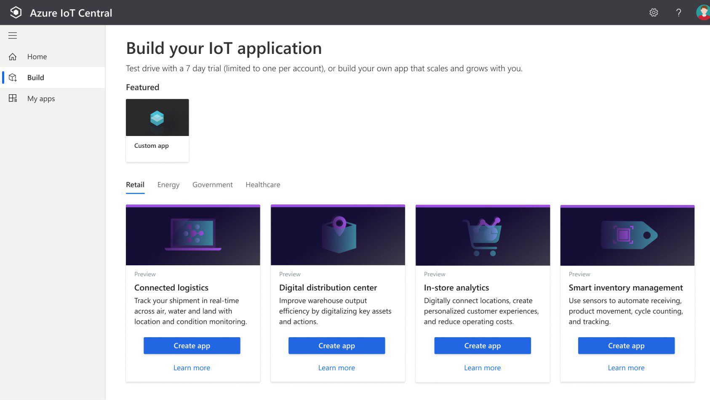
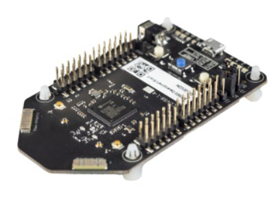
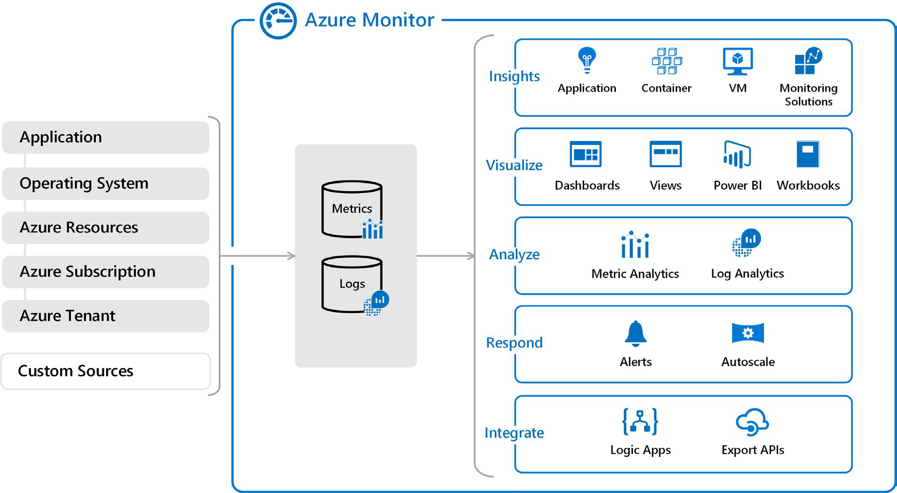

# Основные решения и инструменты управления

## Службы Интернета вещей Azure

IoT соединяет физический и цифровой миры, позволяя устройствам с датчиками и подключением к Интернету взаимодействовать с облачными системами через Интернет.

### Определение параметров продукта 

IoT позволяет устройствам собирать, а затем передавать информацию для анализа данных. Умные устройства оснащены датчиками, которые собирают данные. Несколько распространенных датчиков, которые измеряют атрибуты физического мира, включают:

- Датчики окружающей среды, которые фиксируют уровни температуры и влажности. 

- Сканеры штрих-кодов, QR-кодов или оптического распознавания символов (OCR). 

- Датчики геолокации и приближения. 

- Датчики света, цвета и инфракрасные датчики.

- Звуковые и ультразвуковые датчики.

- Датчики движения и касания. 

- Акселерометр и датчики наклона. 

- Датчики дыма, газа и алкоголя.

- Датчики ошибок для обнаружения, когда есть проблема с устройством. 

- Механические датчики, которые обнаруживают аномалии или деформации.

- Датчики потока, уровня и давления для измерения газов и жидкостей.

Используя службы Azure IoT, устройства, оснащенные такими датчиками и способные подключаться к Интернету, могут отправлять показания своих датчиков в определенную конечную точку. в Azure через сообщение. Затем данные сообщения собираются и агрегируются, и они могут быть преобразованы в отчеты и оповещения. Все устройства могут быть обновлены новым микропрограммным обеспечением для устранения проблем или добавления новых функций путем отправки обновлений программного обеспечения из служб Azure IoT на каждое устройство .

Предположим, ваша компания производит и эксплуатирует умные холодильные торговые автоматы. Какую информацию вы хотите отслеживать? Возможно, вы захотите убедиться, что:

- Каждая машина работает без каких-либо ошибок.

- Машины не были скомпрометированы.

- Холодильные системы машин сохраняют свое содержимое в определенном температурном диапазоне. 

- Вы будете уведомлены, когда продукты достигнут определенного уровня запасов, чтобы вы могли пополнить запасы машин.

Если аппаратное обеспечение ваших торговых автоматов может собирать и отправлять эту информацию в стандартном сообщении, сообщения, которые отправляет каждая машина, могут быть получены, сохранены, организованы, и отображается с помощью служб Интернета вещей Azure .

Данные, собираемые с этих устройств, могут быть объединены со службами Azure AI, чтобы помочь вам прогнозировать:

- Когда машины нуждаются в проактивном обслуживании.

- Когда запасы нужно будет пополнить и заказать новый продукт у поставщиков.

Многие службы могут помогать и управлять комплексными решениями для Интернета вещей в Azure.

#### Azure IoT Hub

[Azure IoT Hub](https://azure.microsoft.com/services/iot-hub/?azure-portal=true) — это управляемая служба, размещенная в облаке и действующая как центр сообщений для двунаправленной связи между приложением Интернета вещей и устройствами, которыми он управляет. Вы можете использовать Azure IoT Hub для создания решений Интернета вещей с надежной и безопасной связью между миллионами устройств Интернета вещей и облачной частью решения. К Azure IoT Hub можно подключить практически любое устройство. 

Служба Azure IoT Hub поддерживает связь как с устройства с облаком, так и из облака с устройством. Он также поддерживает несколько шаблонов обмена сообщениями, таких как телеметрия «устройство-облако», загрузка файлов с устройств и методы запроса-ответа для управления вашими устройствами из облака. После того как Azure IoT Hub получит сообщения от устройства, он сможет направлять это сообщение в другие службы Azure. 

С точки зрения облака и устройства Azure IoT Hub позволяет выполнять команды и управлять. То есть, вы можете иметь как ручное, так и автоматизированное дистанционное управление подключенными устройствами, поэтому вы можете проинструктировать устройство открывать клапаны, устанавливать целевые температуры, перезапускать зависшие устройства и так далее. 

Мониторинг Azure IoT Hub помогает поддерживать работоспособность решения, отслеживая такие события, как создание устройств, сбои устройств и подключенияустройств. 

#### Azure IoT Central

[Azure IoT Central](https://azure.microsoft.com/services/iot-central/?azure-portal=true) построен на основе Azure IoT Hub путем добавления панели мониторинга, которая позволяет подключать, отслеживать и управлять устройствами Интернета вещей. Визуальный пользовательский интерфейс позволяет быстро подключать новые устройства и наблюдать, как они начинают отправлять телеметрию или сообщения об ошибках. Вы можете наблюдать за общей производительностью всех устройств в совокупности, а также настраивать оповещения, которые отправляют уведомления, когда конкретное устройство нуждается в обслуживании. Наконец, вы можете отправить обновления прошивки на устройство.

Чтобы помочь вам быстро приступить к работе, IoT Central предоставляет начальные шаблоны для распространенных сценариев в различных отраслях, таких как розничная торговля, энергетика, здравоохранение и правительство. Затем вы настраиваете начальные шаблоны дизайна непосредственно в пользовательском интерфейсе, выбирая из существующих тем или создавая собственную пользовательскую тему, устанавливая логотип и т. Д. на. С помощью IoT Central вы можете настроить начальные шаблоны для конкретных данных, отправляемых с ваших устройств, отчетов, которые вы хотите видеть, и оповещений, которые вы хотите видеть, и оповещений, которые вы хотите хотите отправить.

Пользовательский интерфейс можно использовать для удаленного управления устройствами. Эта функция позволяет отправить обновление программного обеспечения или изменить свойство устройства. Вы можете отрегулировать желаемую температуру для одного или всех ваших холодильных торговых автоматов непосредственно из IoT Central. 

Ключевой частью IoT Central является использование шаблонов устройств. С помощью шаблона устройства можно подключить устройство без какого-либо кодирования на стороне службы. IoT Central использует шаблоны для создания панелей мониторинга, оповещенийи т. д. Разработчикам устройств по-прежнему необходимо создавать код для запуска на устройствах, и этот код должен соответствовать спецификации шаблона устройства. 

#### Azure Sphere

[Azure Sphere](https://azure.microsoft.com/services/azure-sphere/?azure-portal=true) создает комплексное, высокозащищеное решение Интернета вещей для клиентов, которое охватывает все: от оборудования и операционной системы на устройстве до безопасного метода отправка сообщений с устройства в концентратор сообщений . Azure Sphere имеет встроенные функции связи и безопасности для подключенных к Интернету устройств.

Azure Sphere поставляется в трех частях:

- Первая часть — это блок микроконтроллера Azure Sphere (MCU), который отвечает за обработку операционной системы и сигналов от подключенных датчиков. На следующем рисунке показан микроконтроллер Seeed Azure Sphere MT3620 Development Kit, один из нескольких начальных наборов, доступных для создания прототипов и разработки приложений Azure Sphere.

  

- Вторая часть представляет собой настраиваемую операционную систему (ОС) Linux, которая обрабатывает связь со службой безопасности и может запускать программное обеспечение поставщика. 

- Третья часть — служба безопасности Azure Sphere, также известная как AS3. Его работа заключается в том, чтобы убедиться, что устройство не было злонамеренно скомпрометировано. Когда устройство пытается подключиться к Azure, оно сначала должно пройти проверку подлинности для каждого устройства, что оно и делает с помощью проверки подлинности на основе сертификатов. Если аутентификация прошла успешно,AS3 проверяет, чтобы устройство не было подделано . После того, как он установил безопасный канал связи,AS3 передает на устройство любые обновления ОС или одобренного клиентом программного обеспечения.

После того как система Azure Sphere проверит подлинность устройства и выполнит его авторизацию, устройство сможет взаимодействовать с другими службами Интернета вещей Azure, отправляя данные телеметрии и ошибки. информации.

### Анализ критериев принятия решений

В этом разделе мы проанализируем критерии, которые эксперты используют, когда решают, какой сервис IoT использовать для данной бизнес-потребности. Понимание критериев также может помочь вам лучше понять нюансы различий между каждым продуктом.

#### Важно ли убедиться, что устройство не скомпрометировано? 

Ни один производитель или клиент не хочет, чтобы их устройства были злонамеренно скомпрометированы и использованы в гнусных целях, но более важно обеспечить целостность банкомата, чем, скажем, стиральной машины. Когда безопасность является критически важным фактором при разработке вашего продукта, лучшим вариантом продукта является Azure Sphere, который предоставляет комплексное решение для устройств Интернета вещей.

Как мы упоминали в предыдущем разделе, Azure Sphere обеспечивает безопасный канал связи между устройством и Azure, контролируя все, от работы оборудования до процесса аутентификации. Это гарантирует, что целостность устройства бескомпромиссна. После того, как защищенный канал установлен, сообщения могут быть получены от устройства безопасно, а сообщения или обновления программного обеспечения могут быть отправлены на устройство удаленно.

#### Нужна ли панель мониторинга для создания отчетов и управления?

Вашим следующим решением будет уровень услуг, которые вам требуются от вашего IoT-решения. Если вы просто хотите подключиться к удаленным устройствам для получения телеметрии и иногда отдавать обновления, и вам не нужны какие-либо возможности создания отчетов, вы можете использовать Azure IoT Hub. Программисты по-прежнему могут создавать настраиваемый набор средств управления и отчетов с помощью RESTful API Azure IoT Hub. 

Однако, если вам нужен предварительно созданный настраиваемый пользовательский интерфейс, с помощью которого вы можете просматривать и управлять своими устройствами удаленно, вы можете начать с IoT Central. С помощью этого решения вы можете управлять одним устройством или всеми устройствами одновременно, и вы можете настроить оповещения для определенных условий, таких как сбой устройства.

IoT Central интегрируется со многими различными продуктами Azure, включая Azure IoT Hub, для создания панели мониторинга с отчетами и функциями управления. Панель мониторинга основана на начальных шаблонах для распространенных отраслевых сценариев и сценариев использования. Вы можете использовать панель мониторинга, созданную начальным шаблоном как есть или настроить ее в соответствии с вашими потребностями. Вы можете иметь несколько панелей мониторинга и ориентировать их на различных пользователей.

## Большие данные и аналитика

Когда мы говорим о больших данных, мы имеем в виду большие объемы данных. Данные собираются с многих источники, которые генерируют большие объемы данных. Этот объем данных становится все труднее понять и использовать для решений. Объемы настолько велики, что традиционные формы обработки и анализа больше не уместны.

Кластерные технологии с открытым исходным кодом были разработаны чтобы попытаться справиться с этими большими наборами данных. Microsoft Azure поддерживает широкий спектр технологий и служб для предоставления больших данных и аналитических решений, включая Azure Synapse Analytics, Azure HDInsight, Azure Databricks и Azure Data Lake Analytics.
 
### Azure Synapse Analytics

[Azure Synapse Analytics](https://docs.microsoft.com/azure/sql-data-warehouse/?azure-portal=true) — это неограниченная аналитическая служба, объединяющая корпоративные хранилища данных и аналитику больших данных. Можно запрашивать данные по условиям, используя бессерверные или подготовленные ресурсы в нужном масштабе. У вас есть унифицированный интерфейс для приема, подготовки, управления и обслуживания данных для непосредственных потребностей бизнес-аналитики и машинного обучения. 

### Azure HDInsight

[Azure HDInsight](https://azure.microsoft.com/services/hdin-sight/?azure-portal=true) — это полностью управляемая служба аналитики с открытым исходным кодом для предприятий. Это облачный сервис, который упрощает, ускоряет и экономичнее обрабатывает огромные объемы данных. Вы можете запускать популярные платформы с открытым исходным кодом и создавать типы кластеров, такие как [Apache Spark](https://docs.microsoft.com/azure/hdinsight/spark/apache-spark-overview?azure-portal=true), [Apache Hadoop](https://docs.microsoft.com/azure/hdinsight/hadoop/apache-ha-doop-introduction?azure-portal=true), [Apache Kafka](https://docs.microsoft.com/azure/hdinsight/kafka/apache-kafka-introduction?azure-portal=true), [Apache HBase](https://docs.microsoft.com/azure/hdinsight/hbase/apache-hbase-overview?azure-portal=true), [Apache Storm](https://docs.microsoft.com/azure/hdinsight/storm/apache-storm-overview?azure-portal=true), и [службы машинного обучения](https://docs.microsoft.com/azure/hdinsight/r-server/r-server-overview?azure-portal=true). HDInsight также поддерживает широкий спектр сценариев, таких как извлечение, трансформирование и загрузка (ETL), хранение данных, машинное обучение и IoT.
 
### Azure Databricks

[Azure Databricks](https://azure.microsoft.com/services/data-bricks/?azure-portal=true) помогает получать аналитические сведения обо всех данных и создавать решения для искусственного интеллекта. Вы можете настроить среду Apache Spark за минуту, а затем автоматически масштабировать и совместно работать над общими проектами в интерактивной рабочей области. Azure Databricks поддерживает Python, Scala, R, Java и SQL, а также платформы и библиотеки для обработки и анализа данных, включая TensorFlow, PyTorch и scikit-learn. 

### Azure Data Lake Analytics

[Azure Data Lake Analytics](https://azure.microsoft.com/services/data-lake-analytics/?azure-portal=true) — это служба заданий аналитики по требованию, упрощаем работу с большими данными. Вместо развертывания, настройки и настройки оборудования вы пишете запросы для преобразования данных и извлечения ценных сведений. Служба аналитики может мгновенно обрабатывать задания любого масштаба, установив циферблат для того, сколько энергии вам нужно. Вы платите за свою работу только тогда, когда она работает, что делает ее более экономически эффективной.
 
## Выбор сервиса ИИ

Искусственный интеллект (ИИ) - это категория вычислений, которая адаптирует и улучшает свою способность принимать решения с течением времени на основе своих успехов и неудач. Microsoft Azure предоставляет несколько решений ИИ на выбор, каждое из которых зависит от проблемы, которую вы пытаетесь решить. 

### Определение параметров продукта 

ИИ — это широкая классификация вычислений, которая позволяет программной системе воспринимать окружающую среду и предпринимать действия, которые максимизируют ее шансы на успешное достижение своих целей. ЦельЮ ИИ является создание программной системы, которая способна адаптироваться или изучать что-то самостоятельно, не будучи явно запрограммированной для этого. 

Существует два основных подхода к ИИ. Во-первых, использовать систему глубокого обучения, которая смоделирована на нейронной сети человеческого разума, позволяя ему открывать, учиться и расти через опыт.

Второй подход — машинное обучение, метод обработки и анализа данных, который использует существующие данные для обучения модели, ее тестирования, а затем применения модели к новым данным для прогнозировать будущее поведение, результаты и тенденции.

Прогнозы или прогнозы из машинного обучения могут сделать приложения и устройства умнее. Например, когда вы делаете покупки в Интернете, машинное обучение поддерживает системы рекомендаций продуктов, которые предлагают дополнительные продукты, основанные на том, что вы купили и что купили другие покупатели, которые приобрели аналогичные товары в прошлом.

Машинное обучение также используется для обнаружения мошенничества с кредитными картами путем анализа каждой новой транзакции и использования того, что он узнал из анализа миллионов мошеннических транзакций. 

Практически каждое устройство или программная система, которая собирает текстовые, визуальные и звуковые данные, может питать модель машинного обучения, которая делает это устройство или программную систему умнее для функционирования в будущем.

На высоком уровне есть три основных предложения продуктов от Microsoft, каждое из которых предназначено для определенной аудитории и вариантов использования. Каждый вариант предоставляет разнообразный набор инструментов, служб и программных API. 

### Машинное обучение Azure

[Машинное обучение Azure](https://azure.microsoft.com/services/machine-learning/?azure-portal=true) — это платформа для прогнозирования. Она состоит из инструментов и сервисов, которые позволяют подключаться к данным для обучения и тестирования моделей, чтобы найти ту, которая будет наиболее точно предсказывать будущий результат. После проведения экспериментов по тестированию модели ее можно развернуть и использовать в режиме реального времени через конечную точку веб-API. 

С помощью Машинного обучения Azure вы можете: 

- Создать процесс, который определяет, как получить данные, как обрабатывать отсутствующие или плохие данные, как разделить данные на обучающий набор или тестовый набор, и доставлять данные в процесс обучения.

- Обучение и оценка прогностических моделей с помощью инструментов и языков программирования, знакомых ученым по обработкеи анализу данных. 

- Создание конвейеров, которые определяют, где и когда запускать интенсивные вычисления эксперименты, необходимые для оценки алгоритмов на основе данныхобучения и тестирования. 

- Развертывание наиболее производительного алгоритма в качестве API в конечной точке, чтобы его могли использовать в режиме реального времени другие приложения. 

Выбирайте Машинное обучение Azure, когда вашим ученым по обработке и анализу данных необходим полный контроль над проектированием и обучением алгоритма с использованием собственных данных. 

### Azure Cognitive Services

[Azure Cognitive Services](https://azure.microsoft.com/services/cognitive-services/?azure-portal=true) предоставляет готовые модели машинного обучения, которые позволяют приложениям видеть, слышать, говорить, понимать и даже начинать рассуждать. Используйте Azure Cognitive Services для решения общих проблем, таких как анализ текста на предмет эмоционального тональности или анализ изображений для распознавания объектов или лиц.
 
Вам не нужны специальные знания машинного обучения или науки о данных для использования этих сервисов. Разработчики получают доступ к Azure Cognitive Services через API и могут легко включить эти функции всего в несколько строк кода.

В то время как Машинное обучение Azure требует от вас переноса собственных данных и обучения моделей на этих данных, Azure Cognitive Services, по большей части, предоставляет предварительно обученные модели, чтобы вы могли может принести ваши данные в реальном времени, чтобы получить прогнозы на.

Azure Cognitive Services можно разделить на следующие категории:

- **Языковые службы**: позвольте вашим приложениям обрабатывать естественный язык с помощью готовых сценариев, оценивать тональность и учиться распознавать то, что хотят пользователи. 

- **Речевые службы**: преобразование речи в текст и текста в естественно звучание речи. Переводите с одного языка на другой и обеспечивайте проверку и распознавание говорящего. 

- **Службы машинного зрения**: добавьте возможности распознавания и идентификации при анализе изображений, видео и другого визуального контента.

- Службы принятия решений**: добавьте персонализированные рекомендации для каждого пользователя, которые автоматически улучшаются каждый раз, когда они используются, модерируют контент для мониторинга и удаления оскорбительного или рискованного контента, и обнаружение аномалий в данных временных рядов. 

### Azure Bot Service

[Azure Bot Service](https://azure.microsoft.com/services/bot-service/?azure-portal=true) и Bot Framework — это платформы для создания виртуальных агентов, которые понимают вопросы и отвечают на них так же, как человек. Служба Azure Bot немного отличается от машинного обучения Azure и Azure Cognitive Services тем, что у нее есть конкретный вариант использования. А именно, он создает виртуальный агент, который может разумно общаться с людьми. За кулисами бот, которого вы создаете, использует другие службы Azure, такие как Azure Cognitive Services, чтобы понять, что просят их человеческие коллеги. 

Боты могут использоваться для переноса простых, повторяющихся задач, таких как бронирование ужина или сбор информации о профиле, на автоматизированные системы, которые могут больше не выполняться. требуют непосредственного вмешательства человека. Пользователи общаются с ботом, используя текст, интерактивные карточки и речь. Взаимодействие с ботом может быть быстрым вопросом и ответом, или это может быть сложный разговор, который разумно обеспечивает доступ к услугам.

### Анализ критериев принятия решений

В этом разделе вы проанализируете критерии, которые эксперты используют, когда выбирают сервис ИИ для конкретной бизнес-потребности. Понимание критериев также может помочь вам лучше понять нюансы различий между продуктами. 

#### Вы создаете виртуальный агент, который взаимодействует с людьми на естественном языке?

Используйте службу Azure Bot, когда необходимо создать виртуальный агент для взаимодействия с людьми с помощью естественного языка. Bot Service объединяет источники знаний, обработку естественного языка и форм-факторы, чтобы обеспечить взаимодействие по различным каналам.

Решения Bot Service обычно полагаются на другие сервисы ИИ для таких вещей, как понимание естественного языка или даже перевод для локализации ответов на предпочтительный язык клиента. 

Прежде чем приступить к созданию пользовательского чата с помощью службы ботов, возможно, имеет смысл поискать готовые решения без кода, которые охватывают распространенные сценарии. Например, вы можете использовать QnA Maker, который доступен в Azure Marketplace, для создания, обучения и публикации сложного бота, использующего страницы часто задаваемых вопросов, веб-сайты поддержки, руководства по продуктам, документыSharePoint или редакционный контент с помощью простого в использовании пользовательского интерфейса или REST API.

Аналогичнымо бразом, Power Virtual Agents интегрируется с Microsoft Power Platform, так что вы можете использовать сотни готовых соединителей для ввода данных. Вы можете расширить возможности Виртуальных агентов Power, создавая пользовательские рабочие процессы с помощью Power Automate, и если вы считаете, что готовая возможность слишком ограничена, вы все равно можете создавайте более сложные взаимодействия с Microsoft Bot Framework.

#### Вам нужна услуга, которая может понять содержание и значение изображений, видео или аудио, или которая может перевести полученный текст на другой язык?

Используйте Azure Cognitive Services, когда речь идет о задачах общего назначения, таких как преобразование речи в текст, интеграция с поиском или идентификация объектов в изображении. Azure Cognitive Services предназначена для общего назначения, что означает, что многие различные типы клиентов могут извлечь выгоду из работы, которую Microsoft уже проделала для их обучения и тестирования. модели и предлагают их недорого в масштабе.

#### Вам нужно прогнозировать поведение пользователей или предоставлять пользователям персонализированные рекомендации в вашем приложении? 

Служба Azure Cognitive Services Personalizer следит за действиями пользователей в приложении. Вы можете использовать Personalizer для прогнозирования их поведения и предоставления соответствующего опыта, поскольку он идентифицирует шаблоны использования. Здесь вы можете записывать и хранить поведение пользователей и создавать собственное пользовательское решение машинного обучения Azure для выполнения этих вещей, но этот подход потребует. много усилий и затрат.

#### Будет ли ваше приложение прогнозировать будущие результаты на основе личных исторических данных?

Выбирайте Машинное обучение Azure, когда вам нужно проанализировать данные для прогнозирования будущих результатов. Например, предположим, что вам нужно проанализировать годы финансовых транзакций, чтобы обнаружить новые шаблоны, которые могут помочь вам создать новые продукты и услуги для вашего клиенты компании, а затем предлагают эти новые услуги во время обычных звонков в службу поддержки клиентов. Когда вы работаете с проприетарными данными, вам, вероятно, придется создать более индивидуальную модель машинного обучения. 

#### Вам нужно построить модель, используя свои собственные данные, или выполнить задачу, отличаемую от перечисленных выше? 

Используйте Машинное обучение Azure для максимальной гибкости. Ученые по обработке и анализу данных и инженеры ИИ могут использовать инструменты, с которыми они знакомы, и данные, которые вы предоставляете, для разработки моделей глубокого обучения и машинного обучения, настроенных на Ваши конкретные требования.

## Выбор бессерверной технологии Azure

Бессерверные вычисления — это термин, используемый для описания среды выполнения, которая настроена и управляется для вас. Вы просто указываете, что вы хотите сделать, написав код или подключив и настроив compo-nents в визуальном редакторе, а затем укажите действия, которые запускают функциональные возможности, такие как таймер или HTTP-запрос. Лучше всего, вам никогда не придется беспокоиться о сбое, ваш код может мгновенно масштабироваться для удовлетворения спроса, и вы платите только на основе фактического использования вашего кода.

Ключевая идея заключается в том, что вы не несете ответственности за настройку или обслуживание сервера. Вам не нужно беспокоиться о его масштабировании, когда есть повышенный спрос, и вам не нужно беспокоиться о перебоях. Поставщик облачных услуг позаботится обо всех проблемах обслуживания и масштабирования для вас.

Создается экземпляр службы, а затем добавляется код. Настройка или обслуживание инфраструктуры не требуется или даже не допускается. Вы настраиваете бессерверные приложения для реагирования на события. Событием может быть конечная точка REST, периодический таймер или даже сообщение, полученное от другой службы Azure. Бессерверное приложение запускается только тогда, когда оно вызвано событием . Масштабирование и производительность обрабатываются автоматически, и вам выставляется счет только за используемые ресурсы. Вам даже не нужно резервировать ресурсы.

Бессерверные вычисления обычно используются для обработки серверных сценариев. Другими словами, бессерверные вычисления отвечают за отправку сообщений из одной системы в другую или обработку сообщений, которые были отправлены из других систем. Он не используется для пользовательских систем, а, скорее, он работает в фоновом режиме. 

В этом модуле мы рассмотрим две бессерверные вычислительные службы Azure: Функции Azure и Приложения логики Azure. 

### Функции Azure

С помощью службы [функций Azure](https://azure.microsoft.com/services/functions/?azure-portal=true) можно разместить один метод или функцию с помощью популярного в облаке языка профессиональной граммовки, который запускается в ответ на событие. Примером события может быть HTTP-запрос, новое сообщение в очереди или сообщение по таймеру. 

Из-за своей атомарной природы функции Azure могут служить многим целям при проектировании приложения. Функции могут быть написаны на многих распространенных языках программирования, таких как C#, Python, JavaScript, Typescript,Java и PowerShell.

Функции Azure масштабируются автоматически, а списания начисляются только при срабатывании функции. Эти качества делают Функции Azure надежным выбором, когда спрос является переменным. Например, вы можете получать сообщения от решения IoT, которое отслеживает парк транспортных средств доставки. Скорее всего, у вас будет больше данных, поступающих в рабочее время. Функции Azure можно масштабировать, чтобы приспособиться к этим более загруженным временам. 

Функция Azure — это среда без состояния. Функция ведет себя так, как будто она перезапускается каждый раз, когда она реагирует на событие. Эта функция идеально подходит для обработки входящих данных. А если требуется состояние, функцию можно подключить к учетной записи хранения Azure. 

Функции Azure могут выполнять задачи оркестрации с помощью расширения Durable Functions, которое позволяет разработчикам сцеплять функции вместе, сохраняя состояние .

Решение "Функции Azure" идеально подходит, когда речь идет только о коде, на котором выполняется служба, а не о базовой платформе или инфраструктуре. Функции Azure используются чаще всего, когда вам нужно выполнить работу в ответ на событие. Вы делаете это часто с помощью запроса REST, таймера или mes-sage из другой службы Azure, и когда эта работа может быть выполнена быстро, в течение нескольких секунд или меньше. .

### Azure Logic Apps

[Logic Apps](https://azure.microsoft.com/services/logic-apps/?azure-portal=true) — это платформа разработки с низкимибезкодовым кодом, размещенная в качестве облачной службы. Служба помогает автоматизировать и координировать задачи, бизнес-процессы и рабочие процессы, когда вам нужно интегрировать приложения, данные, системы и службы в предприятия или организации. Logic Apps упрощает проектирование и создание масштабируемых решений, будь то в облаке, локально или в обоих. Это решение охватывает интеграциюприложений, интеграцию данных, системную интеграцию, интеграцию корпоративных приложений (EAI) и интеграциюбизнеса с бизнесом (B2B). 

Azure Logic Apps разработан в веб-конструкторе и может выполнять логику, запускаемую службами Azure, без написания кода. Вы создаете приложение, связывая триггеры с действиями с соединителями. Триггер — это событие (например, таймер), которое вызывает выполнение приложения, а затем отправляет новое сообщение в очередь или HTTP. запрос. Действие — это задача или шаг, который может выполняться. Существуют логические действия, подобные тем, которые вы найдете в большинстве языков программирования. Примеры действий включают работу с varia-bles, операторами и циклами принятия решений, а также задачи, которые анализируют и изменяют данные.

Для создания корпоративных решений интеграции с Azure Logic Apps можно выбрать из растущей коллекции из более чем 200 соединителей. Коллекция включает такие службы, как Salesforce,SAP, Oracle DB и файловые ресурсы.

Если вы не можете найти нужное действие или соединитель, вы можете создать свой собственный с помощью пользовательского кода.

### В чем разница между этими сервисами?

Функции Azure можно вызывать из приложений логики Azure и наоборот. Основное различие между двумя службами заключается в их намерении. Функции Azure — это бессерверная вычислительная служба, а Azure Logic Apps — бессерверная служба оркестрации. Хотя функции Azure можно использовать для оркестровки длительного бизнес-процесса, который включает в себя различные подключения, это не было основным вариантом использования при его проекте. .

Кроме того, две услуги оцениваются по-разному. Цены на Функции Azure основаны на количестве выполнений и времени выполнения каждого выполнения. Цены на Logic Apps основаны на количестве выполнений и типе соединителей, которые они используют. 

### Анализ критериев принятия решений

С двумя жизнеспособными бессерверными вариантами может быть трудно понять, какой из них является лучшим для работы. В этом разделе мы проанализируем критерии, которые эксперты используют, когда они выбирают бессерверную службу для использования для данной бизнес-потребности. Понимание критериев также может помочь вам лучше понять нюансы различий между продуктами. 

#### Вам нужно выполнить оркестровку через известные API?

Как мы отмечали ранее, Azure Logic Apps была разработана с учетом оркестровки, от веб-визуального конфигуратора до модели ценообразования. Logic Apps превосходно подключает большой массив разрозненных служб через свои API для передачи и обработки данных через множество шагов в рабочем процессе.

Можно создать тот же рабочий процесс с помощью Функций Azure, но может потребоваться значительное количество времени, чтобы изучить, какие API вызывать и как вызывать. их. Azure Logic Apps уже компонентизировал эти вызовы API, так что вы предоставляете только несколько сведений, а сведения о вызове необходимых API абстрагированы. 

#### Вам нужно выполнить пользовательские алгоритмы или выполнить специализированный анализ данных и поиск данных? 

С помощью функций Azure можно использовать полную выразительность языка программирования в компактной форме. Это позволяет кратко создавать сложные алгоритмы или операции поиска и синтаксического анализа данных. Вы будете нести ответственность за поддержание кода, отказоустойчивую обработку исключений и т. д.

Хотя Azure Logic Apps может выполнять логику (циклы, решенияи т. д.), если у вас есть интенсивная оркестровка логики, требующая сложного алгоритма, реализующая это алгоритм может быть более подробным и визуально подавляющим.

#### Есть ли у вас существующие автоматизированные задачи, написанные на императивном языке программирования? 

Если оркестровка или бизнес-логика уже выражены на C#, Java, Python или другом популярном языке программирования, может быть проще перенести код в тело приложение для функций Функций Azure, чем повторно создать его с помощью Azure Logic Apps.

#### Вы предпочитаете визуальный (декларативный) рабочий процесс или написание (императивного) кода? 

В конечном счете, ваш выбор сводится к тому, предпочитаете ли вы работать в декларативной среде или императивной среде. Разработчики, имеющие опыт работы с императивным языком программирования, могут предпочесть думать об автоматизации и оркестровке с императивным мышлением. ИТ-специалисты и бизнес-аналитики могут предпочесть работать в более визуальной среде low-code/no-code (декларативная). 

## Инструменты DevOps и GitHub

Современные методы разработки программного обеспечения поддерживаются инструментами, которые охватывают практически каждый аспект жизненного цикла разработки программного обеспечения. Корпорация Майкрософт создала полный набор средств, которые помогают организациям внедрять методы DevOps, разрабатывать решенияи экономить при этом деньги. В этом модулевы узнаете, как выбрать правильные инструменты для поддержки этих практик.

Разработчики программного обеспечения и специалисты по эксплуатации стремятся создавать работающие программные системы, которые удовлетворяют потребности организации. Однако иногда их краткосрочные цели находятся на перекрестных целях, что может привести к техническим проблемам, задержкам и простоям.

DevOps — это новый подход, который помогает согласовать технические команды по мере их работы над достижением общих целей. Для достижения этого выравнивания организации используют методы и процессы, которые стремятся автоматизировать текущую разработку, обслуживание и развертывание программных систем. Их цель состоит в том, чтобы ускорить выпуск изменений программного обеспечения, обеспечить постоянную развертываемость системы и гарантировать, что все изменения соответствуют высокому плану качества. .

При правильном выполнении практики и процессы DevOps затрагивают почти все аспекты компании, не говоря уже о жизненном цикле разработки программного обеспечения, включая планирование, управление проектами. , а также совместное использование разработчиков программного обеспечения друг с другом и с операционными группами и группами обеспечения качества. Инструментарий автоматизирует и обеспечивает соблюдение большинства практик и процессов, что делает его трудным и ненужным для обхода. 

DevOps требует фундаментального изменения мышления сверху вниз. Организации не могут просто устанавливать программные инструменты или внедрять сервисы и надеются получить все преимущества, обещанные DevOps.

На высоком уровне существует три основных предложения, каждое из которых нацелено на определенную аудиторию и вариант использования и предоставляет разнообразный набор инструментов, услуг , программные API и многое другое.

### Azure DevOps Services

Службы Azure DevOps — это набор служб, которые предназначены для каждого этапа жизненного цикла разработки программного обеспечения.

- **Azure Repos** — это централизованный репозиторий исходного кода, где разработчики программного обеспечения, инженеры DevOps и специалисты по документации могут публиковать свой код для просмотра и совместной работы.

- **Azure Boards** — это гибкий пакет управления проектами, который включает в себя доски Kanban, отчеты и отслеживание идей и работы от высокоуровневые эпопеи до рабочих элементов и проблем.

- **Azure Pipelines** — это средство автоматизации конвейера CI/CD. 

- **Azure Artifacts** — это репозиторий для размещения артефактов, таких как скомпилированный исходный код, который может быть включен в этапы тестирования или развертывания. 

- **Планы тестирования Azure** — это средство автоматического тестирования, которое можно использовать в конвейере CI/CD для обеспечения качества перед выпуском программного обеспечения.

- Azure DevOps — это зрелое средство с большим набором функций, которое начиналось как локальное серверное программное обеспечение и превратилось в программное обеспечение как услугу (SaaS), предлагающее корпорацию Майкрософт.

### GitHub и GitHub Actions

GitHub, возможно, является самым популярным в мире репозиторием кода для программного обеспечения с открытым исходным кодом. Git - это децентрализованный инструмент управления исходным кодом, а GitHub - это размещенная версия Git, которая служит основным удаленным . GitHub построен на основе Git для предоставления сопутствующих услуг для координации работы, отчетности и обсуждения вопросов, предоставления документациии многого другого. Он предлагает следующие функциональные возможности:

- Это общий репозиторий исходного кода, включая инструменты, которые позволяют разработчикам выполнять проверку кода, добавляя комментарии и вопросы в веб-представление исходного кода до он может быть объединен в основную кодовую базу.

- Это облегчает управление проектами, включая доски Kanban. 

- Он поддерживает отчеты о проблемах, обсуждение и отслеживание. 

- Он оснащен инструментами автоматизации CI / CD. 

- Он включает в себя вики для совместной документации.

- Его можно запускать из облака или локально

Наиболее актуальным для этого модуля является GitHub Actions, обеспечивающий автоматизацию рабочих процессов с триггерами для многих событий жизненного цикла. Одним из таких примеров может быть автоматизация набора инструментов CI/CD. 

Набор инструментов представляет собой комбинацию программных средств, которые помогают в доставке, разработке и управлении программными приложениями на протяжении всего жизненного цикла разработки системы. Вывод одного инструмента в цепочке инструментов является входом следующего инструмента в цепочке инструментов. Типичные функции инструмента варьируются от выполнения автоматизированных обновлений зависимостей до сборки и настройки программного обеспечения, доставки артефактов сборки в различные места, тестирования и и так далее.

При таком сходстве между многими функциями GitHub и Azure DevOps вы можете задаться вопросом, какой продукт выбрать для вашей организации. К сожалению, ответ может быть не простым.

Хотя и Azure DevOps, и GitHub допускают общедоступные и частные репозитории кода, GitHub имеет долгую историю с публичными репозиториями и ему доверяют десятки тысяч репозиториев с открытым исходным кодом. владельцы проектов. GitHub — это более легкий инструмент, чем Azure DevOps, с акцентом на отдельных разработчиков, вносящих вклад в открытый исходный код. Azure DevOps, с другой стороны, больше ориентирован на корпоративную разработку, с более тяжелыми инструментами управления проектами и планирования, а также более тонким контролем доступа. 

**Прим.**: Ваш выбор не ограничивается службами Azure DevOps или действиями GitHub и GitHub. На практике вы можете смешивать и сочетать эти услуги по мере необходимости. Например, репозитории GitHub можно использовать с досками Azure для отслеживания рабочих элементов. 

### Azure DevTest Labs

Azure DevTest Labs предоставляет автоматизированные средства управления процессом сборки, настройки и демонтажа виртуальных машин (ВМ), содержащих сборки программного обеспечения. проектов. Таким образом, разработчики и тестировщики могут выполнять тесты в различных средах и сборках. И эта возможность не ограничивается виртуальными машинами. Все, что можно развернуть в Azure с помощью шаблона ARM, можно подготовить с помощью DevTest Labs. Подготовка предварительно созданных лабораторных сред с их необходимыми конфигурациями и уже установленными инструментами экономит огромное время для профессионалов и разработчиковпо обеспечению качества. 

Предположим, вам нужно протестировать новую функцию в старой версии операционной системы. Azure DevTest Labs может настроить все автоматически по запросу. После завершения тестирования DevTest Labs может выключить и отключить виртуальную машину, что экономит деньги, когда она не используется. Чтобы контролировать затраты, команда управления может ограничить количество лабораторий, которые могут быть созданы, как долго они работают и т. Д.

## Анализ критериев принятия решений

В этом разделе вы проанализируете критерии, которые эксперты используют при выборе инструментов или служб DevOps для удовлетворения конкретных потребностей бизнеса. Понимание критериев также может помочь вам лучше понять нюансы различий между каждым продуктом.

### Вам нужно автоматизировать и управлять созданием тестовой лаборатории? 

Если ваша цель — автоматизировать создание среды лаборатории тестирования и управление ею, рассмотрите возможность выбора Azure DevTest Labs. Среди трех инструментов и сервисов, которые мы описали, это единственный, который предлагает эту функциональность.

Однако вы можете автоматизировать подготовку новых лабораторий как часть набора инструментов с помощью конвейеров Azure или действий GitHub. 

### Вы создаете программное обеспечение с открытым исходным кодом? 

Хотя Azure DevOps может публиковать общедоступные репозитории кода, GitHub уже давно является предпочтительным узлом для программного обеспечения с открытым исходным кодом. Если вы создаете программное обеспечениес открытым исходным кодом, вы, вероятно, выберете GitHub, если только по его видимости и общему признанию сообществом разработчиков с открытым исходным кодом. .

Остальные критерии принятия решения относятся к выбору между Azure DevOps или GitHub.

**Прим.**: Ваш выбор не ограничивается службами Azure DevOps или действиями GitHub и GitHub. На практике вы можете смешивать и сочетать эти услуги по мере необходимости. Например, репозитории GitHub можно использовать с досками Azure для отслеживания рабочих элементов. 

#### Что касается управления исходным кодом и инструментов DevOps, какой уровень детализации вам нужен для разрешений?

GitHub работает над простой моделью разрешений на чтение/запись для каждой функции. Между тем, Azure DevOps имеет гораздо более детальный набор разрешений, которые позволяют организациям уточнять, кто может выполнять большинство операций по всему набору инструментов. .

#### Что касается управления исходным кодом и инструментов DevOps, насколько сложным должно бытьуправление проектами и отчетность? 

Хотя GitHub имеет рабочие элементы, проблемыи доску Kanban, управление проектами и отчетность — это область, в которой Azure DevOps превосходит. Azure DevOps легко настраивается, что позволяет администратору добавлять настраиваемые поля для захвата метаданных и другой информации вместе с каждым рабочим элементом. В отличие от этого, функция GitHub Issues использует теги в качестве основного средства, помогая команде классифицировать проблемы.

#### Что касается управления исходным кодом и инструментов DevOps, насколько тесно вам нужно интегрироваться со сторонними инструментами?

Хотя мы не даем конкретных рекомендаций относительно сторонних инструментов, для вас важно понимать существующие инвестиции вашей организации в инструменты и услуги и оценивать, как зависимости могут повлиять на ваш выбор. Вполне вероятно, что большинство поставщиков, создаяших средства DevOps, создают перехватчики или API, которые могут использоваться как конвейерами Azure, так и действиями GitHub. Тем неменее, вероятно, стоит приложить усилия, чтобы подтвердить это предположение.

## Инструменты управления

С помощью средств управления Azure администраторы, разработчики и менеджеры могут взаимодействовать с облачной средой для выполнения таких задач, как:

- Развертывание десятков или сотен ресурсов одновременно.

- Настройка отдельных сервисов программным путем.

- Просмотр отчетов по использованию, работоспособности, затратам и многому другому.

Microsoft Azure предоставляет набор параметров средств управления на выбор в зависимости от ситуации. 

На высоком уровне существуют две широкие категории инструментов управления: визуальные инструменты и инструменты на основе кода.

Визуальные инструменты обеспечивают полный, визуально удобный доступ ко всем функциям Azure. Однако визуальные инструменты могут быть менее полезными при попытке настроить большое развертывание ресурсов с взаимозависимостями и параметрами конфигурации. 

Когда вы пытаетесь быстро настроить и настроить ресурсы Azure, лучше всего использовать средство на основе кода. Хотя сначала может потребоваться время, чтобы понять правильные команды и параметры, после того, как они были введены, их можно сохранить в файлы и использовать многократно. по мере необходимости. Кроме того, код, который выполняет установку и настройку, может храниться, версионироваться и поддерживаться вместе с исходным кодом приложения в инструменте управления исходным кодом, таком как как Git. Такой подход к управлению оборудованием и облачными ресурсами, который разработчики используют при написании кода приложения, называется *инфраструктура-как-код*.

Существует два подхода к инфраструктуре как коду: императивный код и декларативный код. Императивный код детализирует каждый отдельный шаг, который должен быть выполнен для достижения желаемого результата. Напротив, декларативный код детализирует только желаемый результат, и он позволяет интерпретатору решить, как наилучшим образом достичь этого результата. Это различие важно, поскольку инструменты, основанные на декларативном коде, могут обеспечить более надежный подход к развертыванию десятков или сотен ресурсов одновременно и надежно.

### Портал Azure 

С помощью портала Azure, веб-интерфейса пользователя, вы можете получить доступ практически ко всем функциям Azure . Портал Azure предоставляет удобный графический пользовательский интерфейс для просмотра всех служб, которые вы используете, создания новых служб, настройки служб и просмотра отчетов. Портал Azure — это то, как большинство пользователей впервые сталкиваются с Azure. Нопо мере роста использования Azure вы, скорее всего, выберете более повторяемый подход к управлению ресурсамиAzure, ориентированный на код. 

### Мобильные приложения Azure

Мобильные приложения Azure предоставляют доступ iOS и Android к ресурсам Azure, когда вы находитесь вдали от компьютера. С егопомощью вы можете: 

- Мониторинг работоспособности и состояния ресурсов Azure.

- Проверьте наличие предупреждений, быстро диагностируйте и устраните проблемы, а также перезапустите веб-приложение или виртуальную машину (VM).

- Выполнение команд Azure CLI или Azure PowerShell для управления ресурсами Azure . 

### Azure PowerShell

Azure PowerShell — это оболочка, с помощью которой разработчики, DevOps и ИТ-специалисты могут выполнять командные командлеты (произносится как command-lets). Эти команды вызовут API rest Azure для выполнения всех возможных задач управления в Azure. Командлеты могут быть выполнены независимо или объединены в файл сценария и выполнены вместе для оркестровки:

- Рутинная настройка, демонтаж и обслуживание одного ресурса или нескольких подключенных ресурсов.

- Развертывание целой инфраструктуры, которая может содержать десятки или сотни ресурсов, из императивного кода.
 
Выполнение команд в скрипте делает процесс повторяемым и автоматизируемым.

Azure PowerShell доступен для Windows, Linux и Mac, и вы можете получить к нему доступ в веб-браузере через Azure Cloud Shell. 

Windows PowerShell помогает ИТ-организациям, ориентированным на Windows, автоматизировать многие из своих локальных операций в течение многих лет, и эти организации создали большой каталог пользовательских сценариев. и командлеты, а также экспертиза.

### Azure CLI

Интерфейс командной строки Azure CLI — это исполняемая программа, с помощью которой разработчик,специалист DevOps или ИТ-специалист может выполнять команды в Bash. Команды вызовут API rest Azure для выполнения всех возможных задач управления в Azure. Команды можно выполнять независимо или в сочетании со сценарием и выполнять их вместе для рутинной настройки, демонтажа и обслуживания одного ресурса или вся среда.

Во многих отношениях Azure CLI почти идентичен Azure PowerShell в том, что вы можете с ним делать. Оба работают на Windows, Linux и Mac и могут быть доступны в веб-браузере через Cloud Shell. Основное различие заключается в синтаксисе, который вы используете . Если вы уже владеете PowerShell или Bash, вы можете использовать предпочитаемое средство .

### Шаблоны ARM

Хотя можно написать императивный код в Azure PowerShell или Azure CLI для настройки и демонтажа одного ресурса Azure или оркестровки инфраструктуры, состоящей из сотен ресурсов, есть лучший способ реализовать эту функциональность.

С помощью шаблонов Azure Resource Manager (шаблонов ARM) можно описать ресурсы, которые вы хотите использовать, в декларативном формате JSON. Преимущество заключается в том, что весь шаблон ARM проверяется перед выполнением любого кода, чтобы убедиться, что ресурсы будут созданы и подключены правильно. Затем шаблон организует создание этих ресурсов параллельно. То есть, если вам нужно 50 экземпляров одного ресурса, все 50 экземпляров создаются одновременно. 

В конечном счете, разработчику, специалисту DevOps или ИТ-специалисту нужно только определить желаемое состояние и конфигурацию каждого ресурса в шаблоне ARM, а также шаблон делает все остальное. Шаблоны могут даже выполнять сценарии PowerShell и Bash до или после настройки ресурса. 

### Анализ критериев принятия решений

В этом разделе вы проанализируете критерии, используемые экспертами, чтобы помочь им решить, какие средства управления Azure использовать для удовлетворения их бизнес-потребностей. Понимание критериев может помочь вам лучше понять нюансы различий между продуктами. 

#### Вам нужно выполнить разовые действия по управлению, администрированию или отчетности? 

Azure PowerShell и Azure CLI — это средства управления Azure, которые позволяют быстро получить IP-адрес развернутой виртуальной машины, перезагрузить виртуальную машину или масштабировать ее. приложение . Возможно, вы захотите сохранить пользовательские сценарии для обоих инструментов под рукой на локальном жестком диске для определенных операций, которые необходимо выполнить несколько раз. 

В отличие от Azure CLI и PowerShell,шаблоны Azure Resource Manager (шаблоны ARM) определяют требования к инфраструктуре в приложении для повторяемых развертываний. Хотя шаблоны ARM не предназначены для разовых сценариев, их можно использовать для этой цели. Однако для одноразовых сценариеввы можете предпочесть более гибкие средства, такие как PowerShell, сценарии Azure CLI или портал Azure. 

Имейте в виду, что шаблоны ARM могут включать как PowerShell, так исценарии Azure CLI, что даст вам возможность использовать сценарии для задач, которые могут не быть возможно с самим шаблоном ARM. Возможность комбинировать средства управления Azure обеспечивает гибкость в выборе правильных инструментовдля ваших конкретных потребностей.

Портал Azure может выполнять большинство, если не все, управленческие и административные действия. Если вы только изучаете Azure и/или вам нужно настраивать ресурсы и управлять ими нечасто (или вы предпочитаете визуальный интерфейс для просмотра отчетов), это имеет смысл , чтобы воспользоваться преимуществами визуальной презентации, которую предлагает портал Azure. 

Однако, если вы находитесь в ролиадминистратора или администратора облака, менее эффективно полагаться исключительно на визуальное сканирование и щелчок. Чтобы быстро найти параметры и сведения, с помощью которых вы хотите работать, Azure CLI или PowerShell обеспеча наибольшую гибкость для повторяемых задач.

Последним инструментом управления для обсуждения является мобильное приложение Azure, к которому вы можете получить доступ через телефон или планшет iOS или Android. Поскольку он полнофункциональный, это, вероятно, лучший выбор, когда ноутбук недоступен, и вам нужно немедленно просмотреть и отортировать проблемы. 

#### Вам нужен способ многократной настройки одного или нескольких повторных источников и обеспечения того, чтобы все зависимости создавались в правильном порядке? 

Шаблоны ARM определяют требования к инфраструктуре приложения для повторяемого развертывания, которое выполняется согласованным образом. Шаг проверки гарантирует, что все ресурсы могут быть созданы в правильном порядке на основе зависимостей, параллельно и идемпотентных.

В отличие от этого, вполне возможно использовать PowerShell или Azure CLI для настройки всех ресурсов для развертывания. Однако в этих инструментах нет шага проверки. Если сценарий сталкивается с ошибкой, ресурсы зависимостей не могут быть легко откатированы, развертывания происходят последовательно, и только некоторые оперные тионы являются идемпотентными. 

#### Когда вы работаете над сценарием, вы имеете опыт работы с рекламой Windows или администрирование Linux? 

Если вы или ваши администраторы облака работаете с опытом администрирования Windows, скорее всего, вы предпочтете PowerShell. Если вы или ваши облачные администраторы имеют опыт администрирования Linux, скорее всего, вы предпочтете Azure CLI. На практикелюбой инструмент может быть использован для выполнения большинства одноразовых задач администрирования. 

## Службы мониторинга Azure

Современные программные системы, работающие в облаке, сложны и получают представление о работоспособности и производительности среды размещения приложений на всех уровнях служб. является сложным. К счастью, есть несколько решений от Microsoft, которые могут помочь вам быстро реагировать на сбои, исследовать периодические проблемы, оптимизировать использование и быть активными. в обработке будущих запланированных простоев.

На высоком уровне существует три основных предложения мониторинга Azure, каждое из которых предназначено для определенной аудитории и вариантов использования и предоставляет разнообразный набор инструментов, служб, программные API и многое другое. 

### Помощник Azure

[Помощник Azure](https://azure.microsoft.com/services/advisor/?azure-portal=true) оценивает ресурсы Azure и дает рекомендации, помогающие повысить надежность, безопасность и производительность, добиться операционного совершенства и сократить расходы. Советник разработан, чтобы помочь вам сэкономить время на облачной оптимизации. Служба рекомендаций включает в себя предлагаемые действия, которые вы можете предпринять сразу, отложить или отклонить.

Рекомендации доступны на портале Azure и в API, и вы можете настроить уведомления, чтобы предупреждать вас о новых рекомендациях. 

Когда вы находитесь на портале Azure, на панели мониторинга Advisor отображаются персонализированные рекомендации для всех ваших подписок, и вы можете использовать фильтры для выбора рекомендаций для конкретных подписки, группы ресурсов или службы. Рекомендации подразделяются на пять категорий:

- **Надежность**: используется для обеспечения и улучшения непрерывности ваших критически важных для бизнеса приложений.

- **Безопасность**: используется для обнаружения угроз и уязвимостей, которые могут привести к нарушениям безопасности. 

- **Производительность**: используется для повышения скорости ваших приложений.

- **Стоимость**: используется для оптимизации и сокращения общих расходов azure.

- **Эксплуатационная эффективность**: используется, чтобы помочь вам достичь эффективности процессов и рабочих процессов, ресурсной персоналии и лучших практик развертывания. 

### Azure Monitor

[Azure Monitor](https://azure.microsoft.com/services/monitor/?azure-portal=true) — это платформа для сбора, анализа, визуализациии потенциального принятия мер на основе метрик и данных журналов из всей Azure и локальной среды. окружающей среды.

На следующей схеме показано, насколько всеобъемлющим является Azure Monitor. 
 

- Слева находится список источников логирования и метрических данных, которые могут быть собраны на каждом уровне архитектуры вашего приложения, от приложения до операционной системы. и сеть.

- В центре вы можете увидеть, как данные журнала и метрик хранятся в центральных репозиториях.

- Справа данные используются несколькими способами. Вы можете просматривать производительность в реальном времени и за всю историю на каждом уровне архитектурыили агрегированную и подробную информацию. Данные отображаются на разных уровнях для разных аудиторий. Высокоуровневые отчеты можно просматривать на панели мониторинга Azure Monitor или создавать пользовательские представления с помощью запросов Power BI и Kusto. 

Кроме того, вы можете использовать данные, чтобы помочь вам реагировать на критические события в режиме реального времени,с помощью предупреждений, доставляемых командам через SMS, электронную почту и так далее. Или можно использовать пороговые значения для запуска функции автоматического масштабирования для масштабирования вверх или вниз в соответствии с требованиями. 

Некоторые популярные продукты, такие как Azure Application Insights, служба для отправки сведений телеметрии из исходного кода приложения в Azure, используют Azure Monitor под капотом. С помощью Application Insights разработчики приложений могут воспользоваться преимуществами мощной платформы анализа данных в Azure Monitor, чтобы получить глубокое представление об операциях приложения и диагностировать ошибки, не дожидаясь, пока пользователи сообщат о них.

### Cлужба работоспособности Azure

[Azure Service Health](https://azure.microsoft.com/features/service-health/?azure-portal=true) предоставляет персонализированное представление работоспособности служб Azure, регионов и ресурсов, накоторые вы полагаетесь. Веб-сайтstatus.azure.com, на котором отображаются только основные проблемы, которые в целом влияют на клиентов Azure, не дает полной картины. Но служба azure Service Health отображает как основные, так и меньшие локализованные проблемы, которые влияют на вас. Проблемы с обслуживанием редки, но важно быть готовым к неожиданностям. Вы можете настроить оповещения, которые помогут вам сортить простои и плановое обслуживание. После отключенияService Health предоставляет официальные отчеты об инцидентах, называемые анализом первопричин (RCA), которыми вы можете поделиться с заинтересованными сторонами.

Service Health помогает следить за несколькими типами событий: 

- **Проблемы со службами** — это проблемы в Azure, такие как сбои, которые влияют на вас прямо сейчас. Вы можете детализировать затронутые службы, регионы, обновления от ваших инженерных команд и найти способы обмена и отслеживания последней информации. 

- **Запланированные события технического обслуживания** могут повлиять на вашу доступность. Вы можете детализировать затронутые службы, регионы и сведения, чтобы показать, как событие повлияет на вас и что вам нужно сделать. Большинство из этих событий происходят без какого-либо влияния на вас и не показаны здесь. В редких случаях, когда требуется перезагрузка, Service Health позволяет выбрать, когда выполнять обслуживание, чтобы свести к минимуму время простоя. 

- **Рекомендации по работоспособности** - это вопросы, которые требуют от вас действий, чтобы избежать прерывания обслуживания, включая выход на пенсию и изменения в работе. Рекомендации по здоровью объявляются заранее, чтобы вы могли планировать .

### Анализ критериев принятия решений

В этом разделе вы проанализируете критерии, используемые экспертами при выборе службы мониторинга Azure для указанной бизнес-потребности. Понимая критерии, вы можете лучше оценить нюансы дифференциалов среди продуктов.

#### Вам нужно проанализировать, как вы используете Azure для снижения затрат? Повысить устойчивость? Упрочили свою безопасность?

Выберите советник Azure, когда вы ищете анализ развернутых ресурсов. Azure Advisor анализирует конфигурацию и использование ресурсов и предоставляет рекомендации по оптимизации надежности, безопасности, производительности, затрат и операции, основанные на лучших практиках экспертов.

#### Вы хотите отслеживать службы Azure или использование Azure?

Если вы хотите следить за самой Azure, особенно за службами и регионами, от которые вы зависите, вы хотите выбрать работоспособность службы Azure. Вы можете просмотреть текущее состояние служб Azure, накоторые вы полагаетесь, предстоящие запланированные простои и службы, которые будут закатом. Вы можете настроить оповещения, которые помогут вам оставаться в курсе инцидентов и предстоящих простоев без необходимости регулярно посещать панель мониторинга. 

Однако, если вы хотите отслеживать производительность или проблемы, связанные с конкретной виртуальной машиной или экземплярами контейнеров, базами данных, приложениями и т. Д., Вы Хотите посетить Azure Monitor и создать отчеты и уведомления, которые помогут вам понять, как работают ваши службы, или диагностировать проблемы, связанные с использованием Azure. 

#### Вы хотите измерять пользовательские события наряду с другими метриками использования? 

Выберите Azure Monitor, если вы хотите измерять пользовательские события вместе с другими собранными данными телеметрии. Пользовательские события, например добавленные в исходный код программных приложений, могут помочь определить и диагностировать, почему ваше приложение ведет себя определенным образом. способ.

#### Вам нужно настроить оповещения о простоях или когда автоматическое масштабирование собирается развернуть новые экземпляры?

Здесь вы снова будете использовать Azure Monitor для настройки оповещений для ключевых событий, связанных с вашими конкретными ресурсами. 
