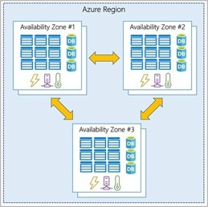

Организация структуры для ресурсов в Azure имеет четыре уровня: группы управления, подписки, группы ресурсов и ресурсы.

- **Ресурсы** — это экземпляры создаваемых служб, таких как виртуальные машины, хранилища или базы данных SQL.
- Ресурсы объединяются в **группы ресурсов**, которые выступают в качестве логического контейнера, в котором развертываются и управляются такие ресурсы Azure, как веб-приложения, базы данных и учетные записи хранилищ. 
- **Подписка** группирует учетные записи пользователей и ресурсы, которые были созданы этими учетными записями пользователей. Для каждой подписки существуют лимиты или квоты на сумму ресурсов, которые можно создавать и использовать. Организации могут использовать подписки для управления затратами и ресурсами, созданными пользователями, группами или проектами.
- **Группы управления** помогают управлять доступом, политиками и соответствием требованиям для нескольких подписок. Все подписки в группе управления автоматически наследуют условия, применяемые к группе управления.

## Регионы Azure, зоны доступности и пары регионов

Azure состоит из центров обработки данных, расположенных по всему миру. При использовании службы или создании ресурса,
например, базы данных SQL или виртуальной машина (ВМ), вы используете физическое оборудование в одной или нескольких локациях.
Эти конкретные центры обработки данных не доступны пользователям напрямую. Вместо этого Azure организует их в *регионы*.

### Регионы Azure

Регион — это географическая область на планете, которая содержит один или несколько центров обработки данных, которые находятся поблизости и объединены в сеть с низкой задержкой. Azure интеллектуально назначает и контролирует ресурсы в каждом регионе, чтобы обеспечить надлежащую сбалансированность рабочих нагрузок.

При развертывании ресурса в Azure часто требуется выбрать регион, в котором вы хотите развернуть ресурс.

***Важно***: Некоторые службы или функции виртуальных машин доступны только в определенных регионах, например, определенные размеры виртуальных машин или типы хранилищ. Существуют также некоторые глобальные службы Azure, которые не требуют выбора определенного региона, например Azure Active Directory, диспетчер трафика Azure и Azure DNS.

Несколько примеров регионов: Запад США, Центральная Канада, Западная Европа, Восточная Австралия и Западная Япония.

Вот представление всех доступных регионов по состоянию на июнь 2020 года.

#### Почему регионы важны?

Azure имеет больше глобальных регионов, чем любой другой поставщик облачных услуг. Эти регионы позволяют гибко подводить приложения к пользователям независимо от того, где они находятся. Глобальные регионы обеспечивают лучшую масштабируемость и избыточность. Они также сохраняют резидентность данных для ваших услуг.

#### Специальные регионы Azure

В Azure есть специализированные регионы, которые вы, возможно, захотите использовать при создании приложений в соответствии с требованиями или в юридических целях. В качестве примера можно привести следующие:

- **Центральное правительство США, Правительство США в Вирджинии, Правительство США в Айове и другие**: эти регионы являются физически и логически сетевыми изолированными экземплярами Azure для правительственных учреждений и партнеров США. Эти центры обработки данных управляются проверенным персоналом США и включают дополнительные сертификаты соответствия.

- **Китай Восток, Китай Север и другие**: Эти регионы доступны благодаря уникальному партнерству между Microsoft и 21Vianet, в соответствии с которым Microsoft не поддерживает центры обработки данных напрямую.

Регионы — это то, что вы используете для определения местоположения ваших ресурсов. Есть два других термина, о которых вы также должны знать: география и зоны доступности.

### Зоны доступности Azure

Вам необходимо чтобы ваши службы и данные были избыточны, чтобы вы могли защитить свою информацию в случае сбоя. При размещении инфраструктуры для настройки собственной избыточности требуется создать дубликаты аппаратных сред. Azure может помочь сделать ваше приложение высокодоступным через зоны доступности.

#### Что такое зона доступности?

Зоны доступности — это физически отдельные центры обработки данных в регионе Azure. Каждая зона доступности состоит из одного или нескольких центров обработки данных, оснащенных независимым питанием, охлаждением и сетью. Зона доступности настроена как граница изоляции. Если одна зона опускается, другая продолжает работать. Зоны доступности соединены через высокоскоростные частные волоконно-оптические сети.

#### Поддерживаемые регионы

Не каждый регион поддерживает зоны доступности. См. [регионы, поддерживающие зоны доступности в Azure](https://docs.microsoft.com/azure/availability-zones/az-region?azure-portal=true).

#### Использование зон доступности в приложениях

Зоны доступности можно использовать для запуска критически важных приложений и создания высокой доступности в архитектуре приложения путем совместного размещения вычислительных ресурсов, ресурсов хранения, сети и данных в пределах зоны и репликации в других зонах. Имейте в виду, что дублирование служб и передача данных между зонами могут стоить дорого.
 
Зоны доступности предназначены в основном для виртуальных машин, управляемых дисков, подсистем балансировки нагрузки и баз данных SQL. Службы Azure, поддерживающие зоны доступности, делятся на две категории:

- **Зональные службы**: вы закрепляете ресурс в определенной зоне (например, виртуальные машины, управляемые диски, IP-адреса).

- **Службы с резервированием зон**: платформа автоматически реплицируется между зонами (например, хранилище зон с повторным резервированием, база данных SQL).

Ознакомьтесь с документацией, чтобы определить, какие элементы архитектуры можно связать с зоной доступности.

### Пары регионов Azure

Зоны доступности создаются с помощью одного или нескольких центров обработки данных. В одном регионе есть как минимум три зоны. Вполне возможно, что крупная катастрофа может привести к отключению, достаточно большому, чтобы повлиять даже на два центра обработки данных. Вот почему Azure также создает пары регионов.

#### Что такое пара регионов?

Каждый регион Azure всегда сопряжен с другим регионом в пределах той же географии (например, США, Европы или Азии), расположенном на расстоянии не менее 300 миль. Этот подход позволяет выполнять репликацию ресурсов (например, хранилища виртуальных машин) по всей географии, что помогает снизить вероятность прерывания работы из-за таких событий, как стихийные бедствия, гражданские беспорядки, перебои в электроснабжении или перебои в работе физической сети, которые влияют на оба региона одновременно. Например, если регион в паре пострадал от стихийного бедствия, службы автоматически дублируются в другой регион в своей паре регионов.

Примерами пар регионов в Azure являются Западная часть США в паре с Восточной частью США и Юго-Восточная Азия в паре с Восточной Азией.

Поскольку пара регионов напрямую связана и находится достаточно далеко друг от друга, чтобы быть изолированной от региональных бедствий, их можно использовать для предоставления надежных услуг и избыточности данных. Некоторые сервисы предлагают автоматическое геоизбыточное хранилище с помощью пар регионов.

Дополнительные преимущества пар регионов:

- При возникновении обширного сбоя Azure приоритет отдается одному региону из каждой пары, чтобы обеспечить скорейшее восстановление хотя бы одного из приложений, размещенных в этой паре регионов.

- Запланированные обновления Azure развертываются в парных регионах по одному региону за раз, чтобы свести к минимуму время простоя и риск простоя приложения.

- Данные продолжают находиться в той же географии, что и их пара (за исключением Южной Бразилии) для целей налоговой и правоохранительной юрисдикции.
 
Наличие широко распределенного набора центров обработки данных позволяет Azure предоставлять высокую гарантию доступности.

## Ресурсы Azure, группы ресурсов и Azure Resource Manager

Определим термины:

- **Ресурс**: управляемый элемент, доступный через Azure. Виртуальные машины (ВМ), счетчики ресурсов хранилища, веб-приложения, базы данных и виртуальные сети являются примерами ресурсов.

- **Группа ресурсов**: контейнер, в котором хранятся связанные ресурсы для решения Azure. Группа ресурсов включает ресурсы, которыми требуется управлять как группой. Вы решаете, какие ресурсы принадлежат к группе ресурсов, исходя из того, что имеет наибольший смысл для вашей организации.

### Группы ресурсов Azure

Группы ресурсов являются фундаментальным элементом платформы Azure. Группа ресурсов — это логический содержатель ресурсов, развернутых в Azure. Эти ресурсы — это все, что вы создаете в подписке Azure, например виртуальные машины, экземпляры шлюза приложений Azure и экземпляры Azure Cosmos DB. Все ресурсы должны быть в составе группы ресурсов, а ресурс может быть только членом одной группы ресурсов. Многие ресурсы можно перемещать между группами ресурсов, причем некоторые службы имеют определенные ограничения или требования для перемещения. Группы ресурсов не могут быть вложенными. Перед подготовкой любого ресурса необходимо создать группу ресурсов для его размещения.

#### Логическая группировка

Группы ресурсов существуют для управления ресурсами Azure и их организации. Размещая ресурсы аналогичного использования, типа или расположения в группе ресурсов, вы можете обеспечить порядок и организацию ресурсов, созданных в Azure. Логическая группировка — это аспект, который вас больше всего интересует здесь, потому что среди наших ресурсов много беспорядка.

#### Жизненный цикл

При удалении группы ресурсов также удаляются все ресурсы, содержащиеся в ней. Организация ресурсов по жизненному циклу может быть полезна в непроизводственных средах, где можно попробовать эксперимент, а затем избавиться от него. Группы ресурсов упрощают удаление набора ресурсов одновременно.
 
#### Авторизация

Группы ресурсов также являются областью для применения разрешений управления доступом на основе ролей (RBAC). Применяя разрешения RBAC к группе ресурсов, можно упростить администрирование и ограничить доступ, чтобы разрешить только то, что необходимо.

### Azure Resource Manager

Диспетчер ресурсов Azure — это служба развертывания и управления для Azure. Он предоставляет уровень управления, который позволяет создавать, обновлять и удалять ресурсы в учетной записи Azure. Функции управления, такие как контроль доступа, блокировки и теги, используются для защиты и организации ресурсов после развертывания.

Когда пользователь отправляет запрос из любого средства Azure, API или пакетов SDK, resource Manager получает запрос. Он аутентифицирует и авторизует запрос. Диспетчер ресурсов отправляет запрос в службу Azure, которая предпринимает запрошенное действие. Поскольку все запросы обрабатываются через один и тот же API, вы видите согласованные результаты и возможности в различных инструментах.

На следующем рисунке показана роль диспетчера ресурсов в обработке запросов Azure.

Все возможности, доступные на портале Azure, также доступны через PowerShell, Azure CLI, REST API и клиентские пакеты SDK. Функциональность, первоначально выпущенная через API, будет представлена на портале в течение 180 дней с первой версии.

#### Преимущества использования диспетчера ресурсов

С помощью диспетчера ресурсов вы можете:

- Управлять своей инфраструктурой с помощью декларативных шаблонов, а не скриптов. Шаблон Resource Manager — это JSON-файл, который определяет, что вы хотите развернуть в Azure.

- Развертывать, управлять и производить мониторинг всех ресурсов для вашего решения как группы, а не обрабатывать эти ресурсы по отдельности.

- Повторно разворачивать решение на протяжении всего жизненного цикла разработки и быть уверенным в том, что ваши ресурсы развернуты в согласованном состоянии.

- Определять зависимости между ресурсами, чтобы они были развернуты в правильном порядке.

- Применять контроль доступа ко всем сервисам, поскольку RBAC изначально интегрирован в форму управления.

- Применять теги к ресурсам, чтобы логически организовать все ресурсы в вашей подписке.
 
- Уточнять выставление счетов вашей организации, просмотрев затраты на группу ресурсов, которые используют один и тот же тег.

## Подписки Azure и группы управления

Ресурс Azure — это управляемый элемент, доступный через Azure. Виртуальные машины (ВМ), учетные записи хранения, веб-приложения, базы данных и виртуальные сети — все это примеры ресурсов.

### Подписки Azure

Для использования Azure требуется подписка Azure. Подписка предоставляет доступ к продуктам и службам Azure с проверкой подлинности и авторизацией. Он также позволяет подготавливать ресурсы. Подписка Azure — это логическая единица служб Azure, которая связана с учетной записью Azure, которая является удостоверением в Azure Active Directory (Azure AD) или в каталоге, которому доверяет Azure AD.

Учетная запись может иметь одну подписку или несколько подписок с разными моделями выставления счетов и к которым применяются разные политики управления доступом. Подписки Azure можно использовать для определения границ продуктов, служб и ресурсов Azure. Существует два типа подписок, которые можно использовать:

- **Граница выставления счетов**: этот тип подписки определяет способ выставления счета учетной записи Azure за использование Azure. Можно создать несколько подписок для различных типов требований к выставлению счетов. Azure создает отдельные отчеты о выставлении счетов и счета для каждой подписки, чтобы вы могли упорядочить расходы и управлять ими.

- **Граница управления доступом**: Azure применяет политики управления доступом на уровне подписки, и вы можете создавать отдельные подписки, чтобы отразить различные организационные структуры. Например, в рамках компании существуют разные отделы, к которым применяются различные политики подписки Azure. Эта модель выставления счетов позволяет управлять и контролировать доступ к ресурсам, которые пользователи подготавливают с определенными подписками.
 
#### Создание дополнительных подписок Azure

Возможно, вам нужно создать дополнительные подписки для управления ресурсами или выставлением счетов. Например, можно создать дополнительные подписки для разделения:

- **Среды**: при управлении ресурсами вы можете создавать подписки для настройки отдельных сред для разработки и тестирования, безопасности или для изоляции данных по соображениям соответствия. Эта конструкция особенно полезна, поскольку управление доступом к ресурсам происходит на уровне подписки.

- **Организационные структуры**: вы можете создавать подписки, чтобы отражать различные организационные структуры. Например, можно ограничить команду более дешевыми ресурсами, предоставляя ИТ-отделу полный спектр. Такая конструкция позволяет управлять и контролировать доступ к ресурсам, которые пользователи подготавливают в рамках каждой подписки.

- **Выставление счетов**: вы также можете создать дополнительные подписки для выставления счетов. Поскольку затраты сначала агрегируются на уровне подписки, может потребоваться создать подписки для управления и отслеживания затрат в зависимости от ваших потребностей. Например, может потребоваться создать одну подписку для рабочих нагрузок производства и другую подписку для рабочих нагрузок разработки и тестирования.

Вам также могут потребоваться дополнительные подписки из-за:

- **Ограничения подписки**: подписки связаны с некоторыми жесткими ограничениями. Например, максимальное количество каналов Azure ExpressRoute на подписку составляет 10. Эти ограничения следует учитывать при создании подписок на свою учетную запись. Если в определенных сценариях необходимо преодолеть эти ограничения, могут потребоваться дополнительные подписки.

#### Настройка выставления счетов в соответствии с вашими потребностями

Если у вас несколько подписок, вы можете организовать их в разделы счетов-фактур. Каждый раздел счета-фактуры представляет собой строку, в которой показаны расходы, понесенные в этом месяце. Например, может потребоваться только одна счет-фактура для вашей организации, но вы хотите упорядочить расходы по отделам, командам или проектам.

В зависимости от ваших потребностей вы можете настроить несколько счетов в одной учетной записи выставления счетов. Для этого создайте дополнительные платежные профили. Каждый платежный профиль имеет свой собственный ежемесячный счет и способ оплаты.

На следующей схеме показан обзор структуры выставления счетов. Если вы ранее зарегистрировались в Azure или у вашей организации есть соглашение Enterprise, выставление счетов может быть настроено по-другому.

### Группы управления Azure

Если в организации много подписок, может потребоваться способ эффективного управления доступом, политиками и соответствием требованиям для этих подписок. Группы управления Azure предоставляют уровень области действия выше подписок.
Подписки организуются в контейнеры, называемые группами управления, и применяются условия управления к группам управления. Все подписки в группе управления автоматически наследуют условия, применяемые к группе управления. Группы управления позволяют управлять корпоративным уровнем в больших масштабах независимо от того, какой тип подписок у вас может быть. Все подписки в одной группе управления должны доверять одному и тому же клиенту Azure AD.

Например, можно применить политики к группе управления, которая ограничивает регионы, доступные для создания виртуальных машин. Эта политика будет применяться ко всем группам управления, подпискам и ресурсам в этой группе управления, разрешая создавать виртуальные машины только в этом регионе.

#### Иерархия групп управления и подписок

Можно создать гибкую структуру групп управления и подписок, чтобы организовать ресурсы в иерархию для унифицированного управления политиками и доступом. На следующей схеме показан пример создания иерархии для управления с помощью групп управления.

Можно создать иерархию, которая применяет политику. Например, можно ограничить расположение виртуальных машин Западным регионом США в группе с именем Production. Эта политика будет наследоваться для всех соглашений Enterprise, которые являются потомками этой группы управления, и будет применяться ко всем виртуальным машинам в этих подписках. Эта политика безопасности не может быть изменена владельцем ресурса или подписки, что позволяет осуществлять гибкое управление.

Другой сценарий, в котором будут использоваться группы управления, заключается в предоставлении пользователям доступа к нескольким скриптовым сценариям. Переместив несколько подписок в эту группу управления, можно создать одно назначение управления доступом на основе ролей (RBAC) в группе управления, которое будет наследовать этот доступ ко всем подпискам. Одно назначение в группе управления может позволить пользователям иметь доступ ко всему, что им нужно, вместо написания сценариев RBAC для разных подписок.

#### Важные факты о группах управления

- 10 000 групп управления могут поддерживаться в одном каталоге.

- Дерево групп управления может поддерживать до шести уровней глубины. Это ограничение не включает корневой уровень или уровень подписки.

- Каждая группа управления и подписка могут поддерживать только одного родителя.

- Каждая группа управления может иметь много подгрупп.
