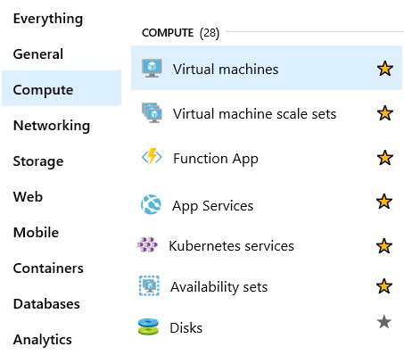
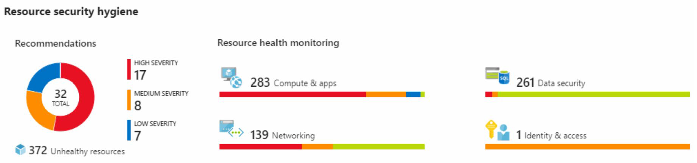
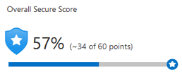
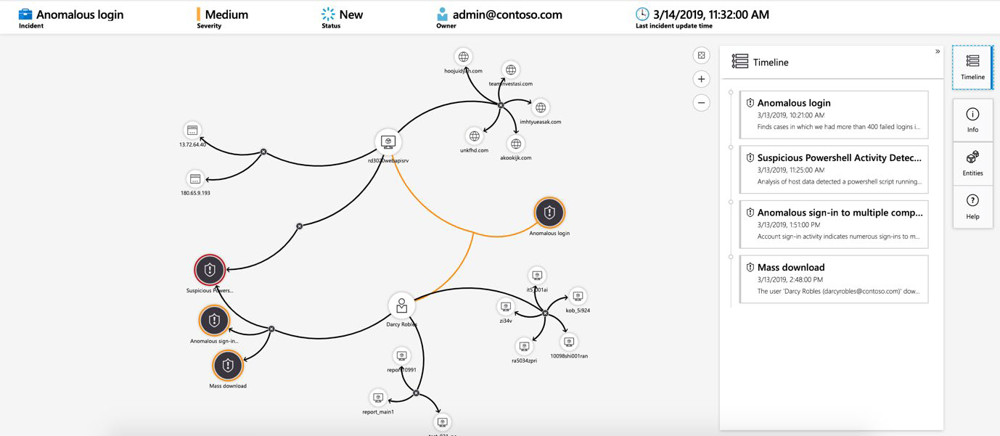
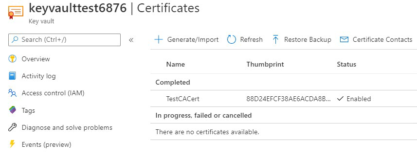
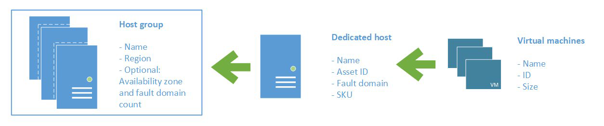
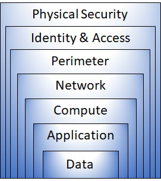
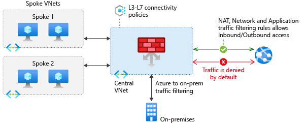
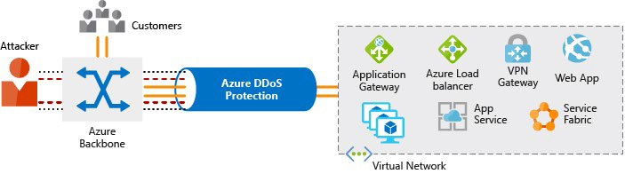

# Общие функции безопасности и сетевая безопасность 

## Средства и функции безопасности

Безопасность - это небольшое слово для значимого понятия. Существует так много факторов, которые следует учитывать, чтобы защитить ваши приложения и ваши данные. Как Azure помогает защитить рабочие нагрузки, которые выполняются в облаке и локальном центре обработки данных?

### Центр безопасности Azure

[Центр безопасности Azure](https://azure.microsoft.com/services/security-center?azure-portal=true) — это служба мониторинга, которая обеспечивает видимость состояния безопасности во всех службах, как в Azure, так и в локальной среде. Термин *безопасность* относится к политикам и средствам управления кибербезопасности, а также к тому, насколько хорошо вы можете прогнозировать, предотвращать и реагировать на угрозы безопасности. 

Центр безопасности позволяет:

- Выполнять мониторинг настроек безопасности в локальных и облачных рабочих нагрузках.

- Автоматически применять необходимые настройки безопасности к новым ресурсам по мере их внесения в Интернет.

- Предоставлять рекомендации по безопасности, основанные на ваших текущих конфигурациях, ресурсах и сетях.

- Постоянно отслеживать свои ресурсы и выполнять автоматическую оценку безопасности для выявления уязвимостей, прежде чем эти уязвимости могут быть использованы.

- Использовать машинное обучение для обнаружения и блокировки вредоносных программ, установленных на виртуальных машинах (ВМ) и других ресурсах. Можно также использовать адаптивные элементы управления приложениями для определения правил, в которых перечислены разрешенные приложения, чтобы гарантировать, что только разрешенные приложения могут запускать.

- Обнаружение и анализ потенциальных входящих атак и расследование угроз и любой деятельности после взлома, которая могла произойти. 

- Обеспечьте контроль доступа точно в срок для сетевых портов. Это уменьшает поверхность атаки, гарантируя, что сеть разрешает только тот трафик, который вам нужен в то время, когда он вам нужен .

#### Понимание вашей безопасности 

Используйте Security Center для получения детального анализа различных компонентов в его окрестностях. Поскольку ресурсы компании анализируются в соответствии с элементами управления любыми назначенными политиками управления, она может просматривать свое общее соответствие нормативным требованиям с помощью безопасность с точки зрения всего из одного места.

Ознакомьтесь со следующим примером того, что вы можете увидеть в центре безопасности Azure.

Предположим, что компания должна соответствовать стандарту безопасности данных индустрии платежных карт (PCI DSS). Этот отчет показывает, что у компании есть ресурсы, которые ей необходимо исправить.
 
В разделе **Гигиена безопасности ресурсов** компания может видеть состояние своих ресурсов с точки зрения безопасности. Чтобы помочь определить приоритеты действий по исправлению, рекомендации классифицируются как низкие, средние и высокие. Вот пример.

#### Что такое оценка безопасности?

[Оценка безопасности](https://docs.microsoft.com/azure/security-center/secure-score-security-controls/?azure-portal=true) — это измерение уровня безопасности организации. 

Оценка безопасности основана на элементах управления безопасностью или группах связанных рекомендаций по безопасности. Оценка основана на проценте элементов управления безопасностью, которым вы удовлетворяете. Чем больше элементов управления безопасностью вы удовлетворяете, тем выше балл, который вы получаете. Оценка улучшается при исправлении всех рекомендаций для одного ресурса в элементе управления.

Вот пример с портала Azure, показывающий оценку 57 процентов, или 34 из 60 баллов.

Следование рекомендациям по безопасной оценке может помочь защитить вашу организацию от угроз. С помощью централизованной панели мониторинга в центре безопасности Azure организации могут отслеживать и работать над безопасностью своих ресурсов Azure, таких как удостоверения, данные, приложения, устройства и инфраструктура.

Безопасная оценка поможет вам:

- Отчет о текущем состоянии безопасности вашей организации. 

- Улучшите свою безопасность, обеспечивая обнаруживаемость, видимость, руководство и контроль. 

- Сравните с бенчмарками и установите ключевые показатели эффективности (KPI). 

#### Защита от угроз

Центр безопасности включает расширенные возможности облачной защиты для виртуальных машин, сетевую безопасность и целостность файлов. 

Давайте рассмотрим некоторые из этих возможностей:

- **Доступ к виртуальной машине точно в срок** настроит «точно в срок» доступ к виртуальным машинам. Этот доступ блокирует трафик по умолчанию к определенным сетевым портам виртуальных машин, но разрешает трафик в течение определенного времени, когда администратор запрашивает и утверждает его.

- **Адаптивное управление приложениями** поможет контролировать, какие приложения разрешено запускать на своих виртуальных машинах. В фоновом режимецентр безопасности использует машинное обучение для просмотра процессов, выполняемых на виртуальной машине. Он создает правила исключений для каждой группы ресурсов, которая содержит виртуальные машины, и предоставляет рекомендации. Этот процесс предоставляет оповещения, которые информируют компанию о неавторизованных приложениях, запущенных на ее виртуальных машинах.

- Центр безопасности **адаптивной защиты сети** может отслеживать шаблоны интернет-трафика виртуальных машин и сравнивать эти шаблоны с текущими настройками группы безопасности сети (NSG) компании. Оттуда центр безопасности может давать рекомендации о том, следует ли дополнительно блокировать ГЯЯ, и предоставлять шаги по исправлению. 

- **Мониторинг целостности файлов** помогает настроить мониторинг изменений важных файлов как в Windows, так и в Linux, настройки реестра, приложения и другие аспекты, которые Может указывать на атаку на безопасность .

### Azure Sentinel

Управление безопасностью в больших масштабах может извлечь выгоду из специализированной системы управления информацией и событиями безопасности (SIEM). Система SIEM агрегирует данные безопасности из множества различных источников (при том, что эти источники поддерживают формат ведения журнала открытого стандарта). Он также предоставляет возможности для обнаружения угроз и реагирования на них.

[Azure Sentinel](https://azure.microsoft.com/services/azure-sentinel/?azure-portal=true) — это облачная SIEM-система Майкрософт. Он использует интеллектуальную аналитику безопасности и анализ угроз. 

#### Возможности Azure Sentinel

Azure Sentinel позволяет: 

- **Сбор облачных данных в масштабе** Сбор данных по всем пользователям, устройствам, приложениям и инфраструктуре,как локально, так и из нескольких облаков.

- **Обнаружение ранее не обнаруженных угроз** Минимизация ложных срабатываний с помощью комплексной аналитики и анализа угроз Microsoft. 

- **Исследуйте угрозы с помощью искусственного интеллекта** Изучайте подозрительные действия в масштабе, используя многолетний опыт кибербезопасности от Microsoft.

 - **Быстрое реагирование на инциденты** Используйте встроенную оркестровку и автоматизацию общих задач.

#### Подключение источников данных

Azure Sentinel поддерживает ряд источников данных, которые он может анализировать на наличие событий безопасности. Эти соединения обрабатываются встроенными соединителями или стандартными отраслевыми форматами журналов и API.

- **Подключение решений Майкрософт** Соединители обеспечивают интеграцию в режиме реального времени для таких служб, как решения Microsoft Threat Protection, источники Microsoft365 (включая Office 365), Azure Active Directory и брандмауэр Защитника Windows.

- **Подключение других сервисов и решений** Коннекторы доступны для распространенных сервисов и решений сторонних производителей, включая AWS CloudTrail,Citrix Analytics (Security), Sophos XG Firewall, VMware Carbon Black Cloud, и ОГОС «Окта». 

- **Подключение стандартных отраслевых источников данных** Azure Sentinel поддерживает данные из других источников, использующих стандартный формат обмена сообщениями CEF, системный журнал или REST API.

#### Обнаружение угроз

**Встроенная аналитика** использует шаблоны, разработанные командой экспертов и аналитиков Microsoft по безопасности на основе известных угроз, общих векторов атак и цепочек эскалации для подозрительной активности . Эти шаблоны можно настраивать и искать в среде любые действия, которые выглядят подозрительно. Некоторые шаблоны используют поведенческую аналитику машинного обучения, основанную на собственных алгоритмах Microsoft. 

**Пользовательская аналитика** — это правила, которые создаются для поиска определенных критериев в среде. Можно просмотреть количество результатов, которые будет генерировать запрос (наоснове прошлых событий журнала), и задать расписание выполнения запроса. Можно также задать пороговое значение оповещения. 

### Расследования и реагирование

Когда Azure Sentinel обнаруживает подозрительные события, tailwind Traders может расследовать определенные оповещения или инциденты (группа связанных оповещений). С помощью графика расследования компания может просматривать информацию от объектов, непосредственно связанных с оповещением, и видеть общие запросы на разведку, чтобы помочь направлять инвестигация.

Ниже приведен пример, в которое показано, как выглядит график расследования в Azure Sentinel.

Компания также будет использовать [Azure Monitor Workbooks](https://docs.microsoft.com/azure/azure-monitor/platform/workbooks-overview/?azure-portal=true) для автоматизации реагирования на угрозы. Например, он может установить оповещение, которое ищет вредоносные IP-адреса, которые обращаются к сети, и создать книгу, которая выполняет следующие действия:

1.	Когда сработает оповещение, откройте тикет в системе IT ticketing. 

2.	Отправьте сообщение в канал операций безопасности в Microsoft Teams или Slack, чтобы убедиться, что аналитики безопасности знают об инциденте. 

3.	Отправьте всю информацию в оповещении старшему сетевому администратору и администратору безопасности. Сообщение электронной почты содержит две пользовательские переключатели: **Блокировать** или **Игнорировать**. 

Когда администратор выбирает **Блокировать**, IP-адрес блокируется в брандмауэре, а пользователь отключается в Azure Active Directory. Если администратор выбирает **Игнорировать**, оповещение закрывается в Azure Sentinel, а инцидент закрывается в системе ИТ-билетов. 

Мастер-файл продолжает выполняться после получения ответа от администраторов.

Мастер-файлы можно запускать вручную или автоматически, когда правило инициирует оповещение. 

### Хранилище ключей Azure

[Azure Key Vault](https://azure.microsoft.com/services/key-vault?azure-portal=true) — это централизованная облачная служба для хранения секретов приложения в едином центральном расположении. Он обеспечивает безопасный доступ к конфиденциальной информации, предоставляя возможности управления доступом и ведения журнала. 
 
#### Что может делать хранилище ключей Azure? 

Хранилище ключей Azure может помочь вам:

- **Управление секретами** Вы можете использовать Key Vault для безопасного хранения и жесткого контроля доступа к токенам, секретным словам, сертификатам,ключамAPI и другим секретам. 

- **Управление ключами шифрования** Вы можете использовать Key Vault в качестве решения дляуправления ключами. Key Vault упрощает создание и управление ключами шифрования, используемыми для шифрования данных.

- **Управление сертификатами SSL/TLS** Хранилище ключей позволяет подготавливать, управлять и развертывать общедоступные и частные сертификаты SSL/TLS для azure ресурсы и ваши внутренние ресурсы.

- **Храните секреты, поддерживаемые аппаратными модулями безопасности (HSM)** Эти секреты и ключи могут быть защищены либо программным обеспечением, либо проверенными HSM FIPS 140-2 level 2. 

Ниже приведен пример сертификата, используемого для тестирования в Key Vault.

#### Каковы преимущества хранилища ключей Azure? 

Преимущества использования Key Vault включают в себя:

- **Централизованные секреты приложений** Централизация хранилища секретов приложений позволяет контролировать их распространение и снижает вероятность случайной утечки секретов. 

- **Безопасно хранимые секреты и ключи** Azure использует стандартные алгоритмы, длины ключей и HSM. Доступ к Key Vault требует надлежащей аутентификации и авторизации.

- **Мониторинг доступа и контроль доступа** С помощью Key Vault вы можете отслеживать и контролировать доступ к секретам вашего приложения. 

- **Упрощенное администрирование секретов приложений** Key Vault упрощает регистрацию и обновление сертификатов из публичных центров сертификации (ЦС). Можно также масштабировать и реплицировать контент в регионах и использовать стандартные средствауправления сертификатами. 

- **Интеграция с другими службами Azure** Вы можете интегрировать Key Vault с учетными записями хранения, реестрами контейнеров, концентраторами событий и многими другими службами Azure. Эти службы могут безопасно ссылаться на секреты, хранящиеся в Key Vault. 
 
### Azure Dedicated Host

В Azure виртуальные машины (ВМ) работают на общем оборудовании, которым управляет корпорация Майкрософт. Несмотря на то, что недостаточно используемое оборудование является общим, рабочие нагрузки виртуальных машин изолированы от рабочих нагрузок, которые выполняют другие клиенты Azure. 

Некоторые организации должны соблюдать нормативные требования, которые требуют, чтобы они были единственным клиентом, использующим физическую машину, на которой размещены их виртуальные машины. [Выделенный узел Azure](https://azure.microsoft.com/services/virtual-machines/dedicated-host/?azure-portal=true) предоставляет выделенные физические серверы для размещения виртуальных машин Azure для Windows и Linux.

Ниже приведена схема, показывающая, как виртуальные машины связаны с выделенными узлами и группами узлов. Выделенный узел сопоставляется с физическим сервером в центре обработки данных Azure. Группа узлов — это коллекция выделенных хостов.

#### Каковы преимущества выделенного узла Azure? 

Выделенный узел Azure:

- Дает вам видимость и контроль над инфраструктурой сервера, в котором работают виртуальные машины Azure. 

- Помогает удовлетворить требования соответствия путем развертывания рабочих нагрузок на изолированном сервере. 

- Позволяет выбрать количество процессоров, возможности сервера, серию виртуальныхмашин и размеры виртуальных машин на одном хосте. 

#### Вопросы доступности для выделенного хоста

После подготовки выделенного узла Azure назначает его физическому серверу в облачном центре обработки данных Майкрософт. 

Для обеспечения высокой доступности можно подготовить несколько узлов в группе узлов и развернуть виртуальные машины в этой группе. Виртуальные машины на выделенных узлах также могут использовать преимущества управления обслуживанием. Эта функция позволяет контролировать, когда происходят регулярные обновления обслуживания в течение 35-дневного скользящего окна.

#### Вопросы ценообразования

Плата взимается за выделенный узел независимо от того, сколько виртуальных машин вы развертываете на нем. Цена узла зависит от семейства виртуальных машин, типа (размера оборудования) и региона.

Лицензирование программного обеспечения, хранение и использование сети оплачиваются отдельно от узла и виртуальных машин. Для получения дополнительной информации. Ознакомьтесь со статьей [Цены на выделенный узел Azure](https://aka.ms/ADHPricing/?azure-portal=true). 

## Безопасность сетевое подключения

Каждое приложение и служба, как локальные, так и облачные, должны быть спроектированы с учетом безопасности. Слишком много риска. Например, атака типа «отказ в обслуживании» может помешать клиентам дать им доступный веб-сайт или службы и заблокировать ведение бизнеса. Иливаш сайт может быть испорчен, что нанесет ущерб вашей репутации. Утечка данных будет еще хуже, потому что она может разрушить с трудом заработанное доверие, нанеся значительный личный и финансовый ущерб.

### Что такое защита в глубину 

Целью глубокой защиты является защита информации и предотвращение ее кражи теми, кто не уполномочен получать к ней доступ. 

Стратегия глубокой защиты использует ряд механизмов для замедления атаки, направленной на получение несанкционированного доступа к данным.

#### Слои обороны в глубине 

Вы можете визуализировать защиту в глубине как набор слоев, с данными, которые должны быть защищены в центре. 

Каждый слой обеспечивает защиту таким образом, что в случае нарушения одного слоя последующий слой уже находится на месте, чтобы предотвратить дальнейшее воздействие. Такой подход устраняет зависимость от какого-либо одного уровня защиты. Он замедляет атаку и предоставляет телеметрию оповещений, на которую группы безопасности могут действовать автоматически или вручную.

Вот краткий обзор роли каждого слоя:

- *Уровень физической безопасности* является первой линией защиты для защиты вычислительного оборудования в центре обработки данных.

- *Уровень идентификации и доступа* контролирует доступ к инфраструктуре и управление изменениями.

- *Уровень периметра* использует распределенную защиту от отказа в обслуживании (DDoS) для фильтрации крупномасштабных атак, прежде чем они могут вызвать отказ в обслуживании для пользователей.

- *Сетевой уровень* ограничивает связь между ресурсами посредством сегментации и доступа. 

- *Вычислительный уровень* защищает доступ к виртуальным машинам.

- *Прикладной уровень* помогает гарантировать, что приложения безопасны и свободны от уязвимостей безопасности.

- *Уровень данных* контролирует доступ к бизнес-данным и данным клиентов, которые вам нужно защитить.
 
Эти уровни помогают принимать решения о конфигурации безопасности на всех уровнях приложений. 

Azure предоставляет средства и функции безопасности на всех уровнях концепции углубленной защиты. Давайте подробнее рассмотрим каждый слой:

#### Физическая безопасность

Физическая защита доступа к зданиям и контроль доступа к вычислительной технике в центре обработки данных являются первой линией обороны.

При физической безопасности цель состоит в том, чтобы обеспечить физическую защиту от доступа к активам. Эти гарантии гарантируют, что другие слои не могут быть обойдены, а потеря или кража обрабатываются соответственно. Корпорация Майкрософт использует различные механизмы физической безопасности в своих облачных центрах обработки данных.

#### Идентификация и доступ

На этом уровне важно: 

- Контроль доступа к инфраструктуре и контроль изменений. 

- Используйте единый вход (SSO) и многофакторную аутентификацию. 

- Аудит событий и изменений.

Уровень идентификации и доступа заключается в обеспечении безопасности удостоверений, доступ предоставляется только к тому, что необходимо, а события входа и изменения регистрируются. 

#### Периметр

На этом уровне важно: 

- Используйте защиту от DDoS-атак для фильтрации крупномасштабных атак, прежде чем они могут повлиять на доступность системы для пользователей.

- Используйте брандмауэры периметра для выявления и оповещения о вредоносных атаках на вашу сеть.

На периметре сети речь идет о защите от сетевых атак на ваши ресурсы. Идентификация этих атак, устранение их воздействия и предупреждение о них, когда они происходят, являются важными способами обеспечения безопасности вашей сети. 
 
#### Сеть

На этом уровне важно: 

- Ограничьте связь между ресурсами.

- Запретить по умолчанию.

- Ограничьте входящий доступ в Интернет и ограничьте исходящий доступ, где appro-priate.

- Реализация безопасного подключения к локальным сетям.

На этом уровне основное внимание уделяется ограничению сетевого подключения ко всем вашим ресурсам, чтобы разрешить только то, что требуется. Ограничивая эту связь, вы снижаете риск распространения атаки на другие системы в вашей сети.

#### Вычисления

На этом уровне важно: 

- Безопасный доступ к виртуальным машинам.

- Реализация защиты конечных точек на устройствах и сохранение систем в актуальном состоянии. 

Вредоносные программы, неисправленные системы и неправильно защищенные системы открывают вашу среду для атак. Основное внимание на этом уровне уделяется обеспечению безопасности вычислительных ресурсов и надлежащих средств управления для минимизации проблем безопасности. 

#### Приложение

На этом уровне важно: 

- Убедитесь, что приложения безопасны и свободны от уязвимостей. 

- Храните конфиденциальные секреты приложений в безопасном носителе данных. 

- Сделайте безопасность требованием к дизайну для всех разработок приложений. 

Интеграция безопасности в жизненный цикл разработки приложений помогает уменьшить количество вульнер-способностей, вводимых в код. Каждая команда разработчиков должна убедиться, что ее приложения безопасны по умолчанию.
 
#### Данные

Практически во всех случаях злоумышленники преследуют данные:

- Хранится в базе данных.

- Хранится на диске внутри виртуальных машин.

- Хранится в программном обеспечении как услуга (SaaS), таких как Office 365.

- Управляется через облачное хранилище.

Те, кто хранит и контролирует доступ к данным, несут ответственность за обеспечение их надлежащей защиты. Часто нормативные требования диктуют условия и процессы, которые должны быть на месте для обеспечения конфиденциальности, целостности и доступности данных.

#### Положения безопасности

У вас есть возможность защиты от угроз безопасности и реагирования на них. Общими принципами, используемыми для определения позиции безопасности, являются конфиденциальность, целостность и доступность, известные как ЦРУ.

- **Конфиденциальность** Принцип наименьших привилегий означает ограничение доступа к информации только для индивидуалов, которым явно предоставлен доступ, только на том уровне, который им необходим для выполнения своих работа. Эта информация включает защиту паролей пользователей, содержимого электронной почты и уровней доступа к приложениям и базовой инфраструктуре.

- **Целостность** Предотвращение несанкционированных изменений информации: 

  - В состоянии покоя: когда он хранится.

  - В пути: когда он переносится из одного места в другое,в том числе с локального компьютера в облако.

  Общий подход, используемый при передаче данных, заключается в том, что отправитель создает уникальный отпечаток данных с помощью одностороннего алгоритма хеширования. Хэш отправляется получателю вместе с данными. Получатель пересчитывает хэш данных и сравнивает его с оригиналом, чтобы убедиться, что данные не были потеряны или изменены при передаче.

- **Доступность** Убедитесь, что сервисы функционируют и могут быть доступны только авторизованным пользователям.

Атаки типа «отказ в обслуживании» предназначены для снижения доступности системы,затрагивая ее пользователей.

### Группы безопасности сети (NSG) 

Хотя брандмауэр Azure и защита от DDoS-серверов Azure могут помочь контролировать трафик, который может поступать из внешних источников, необходимо защитить свой внутренний трафик сетей в Azure.

#### Что такое группы безопасности сети? 

[Группа безопасности сети](https://docs.microsoft.com/azure/virtual-network/security-overview#network-security-groups?azure-portal=true) позволяет фильтровать сетевой трафик в ресурсы Azure и из ресурсов в виртуальной сети Azure. Вы можете думать о NSG как о внутреннем брандмауэре. NSG может содержать несколько правил безопасности для входящих и исходящих подключений, которые позволяют фильтровать трафик в ресурсы и из них по IP-адресу источника и назначения, порту, и протокол.

#### Как указать правила NSG? 

Группа безопасности сети может содержать столько правил, сколько необходимо, в пределах ограничений подписки Azure. Каждое правило определяет следующие свойства:

| Свойство | Описание |
| --- | --- |
| Имя | Уникальное имя для NSG |
| Приоритет | Число от 100 до 4096. Правила обрабатываются в порядке приоритета, с меньшими числами	обрабатывается перед более высокими числами. |
| Источник или назначение | Один IP-адрес или диапазон IP-адресов, служба или группа безопасности приложения |
| Протокол | **TCP**, **UDP** или **Any** |
| Направление | Применяется ли правило к входящему или исходящему трафику |
| Диапазон портов | Один порт или диапазон портов |
| Действие | **Разрешить** или **Запретить** |

При создании группы безопасности сети Azure создает ряд правил по умолчанию для обеспечения базового уровня безопасности . Вы не можете удалить правила по умолчанию, но вы можете переопределить их, создав новые правила с более высокими приоритетами.

### Брандмауэр Azure

Брандмауэр — это устройство сетевой безопасности, которое отслеживает входящий и исходящий сетевой трафик и решает, разрешать или блокировать определенный трафик на основе определенного набора безопасности. правила. Можно создать правила брандмауэра, определяющие диапазоны IP-адресов. Только клиенты, которым предоставлены IP-адреса из этих диапазонов, могут получить доступ к конечному серверу. Правила брандмауэра также могут включать определенные сведения о сетевом протоколе и порте.

[Брандмауэр Azure](https://azure.microsoft.com/services/azure-firewall?azure-portal=true) — это управляемая облачная служба сетевой безопасности, которая помогает защитить ресурсы в виртуальных сетях Azure. Виртуальная сеть похожа на традиционную сеть, в которой вы будете работать в собственном дата-центре. Это фундаментальный строительный блок для вашей частной сети, который позволяет виртуальным машинам и другим вычислительным ресурсам безопасно взаимодействовать друг с другом, Интернетом и локальные сети.

Ниже приведена схема, на которую показана базовая реализация брандмауэра Azure.

Брандмауэр Azure — это брандмауэр с отслеживанием состояния. Брандмауэр с отслеживанием состояния анализирует полный контекст сетевого связующего, а не только отдельный пакет сетевого трафика. Брандмауэр Azure отличается высокой доступностью и нестройкаемой облачной масштабируемостью.

Брандмауэр Azure предоставляет центральное расположение для создания, примененияи регистрации политик приложений и сетевых подключений в подписках и виртуальных сетях. Брандмауэр Azure использует статический (неизменные) общедоступный IP-адрес для ресурсов виртуальной сети, что позволяет внешним брандмауэрам идентифицировать трафик, поступающий от виртуального сеть. Служба интегрирована с Azure Monitor для включения ведения журнала и аналитики.

Брандмауэр Azure предоставляет множество функций, в том числе:

- Встроенная высокая доступность.

- Неограниченная масштабируемость облака. 

- Правила фильтрации входящих и исходящих подключений. 

- Поддержка трансляции входящих сетевых адресов назначения (DNAT). 

- Ведение журнала Azure Monitor .

Обычно брандмауэр Azure развертывается в центральной виртуальной сети для управления общим доступом к сети. 

#### Что можно настроить с помощью брандмауэра Azure? 

С помощью брандмауэра Azure можно настроить:

- Правила приложения, определяющие полные доменные имена (FQDN), к которым можно получить доступ из подсети. 
 
- Сетевые правила, определяющие адрес источника, протокол, порт назначения и адрес назначения.

- Правила преобразования сетевых адресов (NAT), которые определяют IP-адреса и порты назначения для преобразования входящих запросов.

[Шлюз приложений Azure](https://azure.microsoft.com/services/application-gateway?azure-portal=true) также предоставляет брандмауэр, который называется брандмауэром веб-приложений (WAF). WAF обеспечивает централизованную входящую защиту веб-приложений от распространенных эксплойтов и уязвимостей. [Azure Front Door](https://azure.microsoft.com/services/frontdoor/?azure-portal=true) и [Azure Content Delivery Network](https://azure.microsoft.com/services/cdn/?azure-portal=true) также предоставляют службы WAF. 

### Защита от атак DDoS в Azure

Любая крупная компания может стать объектом масштабной сетевой атаки.

Распределенная атака типа [«отказ в обслуживании»](https://azure.microsoft.com/services/ddos-protection?azure-portal=true) пытается перегрузить и исчерпать ресурсы приложения, что делает приложение медленным или не отвечает на запросы законных пользователей. DDoS-атаки могут быть нацелены на любой ресурс, который является общедоступным через Интернет, включая веб-сайты.

#### Что такое защита от DDoS-данных Azure? 

[Защита от DDoS-атак Azure](https://azure.microsoft.com/services/ddos-protection/?azure-portal=true) (стандартная) помогает защитить ресурсы Azure от DDoS-атак. 

Сочетание защиты от DDoS-атак с рекомендуемыми методами проектирования приложений помогает обеспечить защиту от DDoS-атак. Защита от DDoS-атак использует масштабируемость и эластичность глобальной сети Майкрософт, чтобы обеспечить возможности по снижению уровня DDoS в каждом регионе Azure. Служба защиты от DDoS-систем помогает защитить приложения Azure, анализируя и отбрасывая трафик DDoS на границе сети Azure, прежде чем он может повлиять на работу службы. доступность.

На этой схеме показан сетевой трафик, поступающий в Azure как от клиентов, так и от злоумышленника. 

Защита от DDoS-сообщений выявляет попытку злоумышленника перегрузить сеть и блокирует дальнейший трафик от них, гарантируя, что трафик никогда не достигнет ресурсов Azure. Законный трафик от клиентов по-прежнему поступает в Azure без прерывания обслуживания. 

Защита от DDoS-данных также может помочь вам управлять потреблением облака. При локальном запуске имеется фиксированное количество вычислительных ресурсов. Но в облаке эластичные вычисления означают, что вы можете автоматически масштабировать свое развертывание в соответствии с требованиями. Умно спроектированная DDoS-атака может привести к увеличению распределения ресурсов, что лекет за собой ненужные расходы. Стандарт защиты от DDoS-данных помогает гарантировать, что обрабатываемая нагрузка на сеть отражает использование клиентом. Вы также можете получить кредит на любые расходы, начисленные за горизонтально масштабируемые ресурсы во время DDoS-атаки. 

#### Какие уровни служб доступны для защиты от DDoS-данных? 

Защита от DDoS-данных предоставляет следующие уровни обслуживания: 

- **Базовый** Уровень служб "Базовый" автоматически включается бесплатно в рамках подписки Azure. Постоянный мониторинг трафика и смягчение распространенных атак на уровне сети врежиме реального времени обеспечивают ту же защиту, что и онлайн-службы Microsoft. Уровень служб "Базовый" гарантирует, что сама инфраструктура Azure не пострадает во время крупномасштабной DDoS-атаки. Глобальная сеть Azure используется для распределения и смягчения атакующих трафика между регионами Azure. 

- **Стандартный** Уровень служб "Стандартный" предоставляет дополнительные возможности смягчения последствий, которые настроены на указанный вызов ресурсов виртуальной сети Azure. Стандарт защиты от DDoS-систем относительно прост в использовании и не требует изменений в приложениях. Уровень "Стандартный" обеспечивает постоянный мониторинг трафика и предотвращение распространенных атак на уровне сети в режиме реального времени. Он обеспечивает ту же защиту, что и онлайн-службы Microsoft. Политики защиты настраиваются с помощью выделенных алгоритмов мониторинга трафика и машинного обучения. Политики применяются к общедоступным IP-адресам, которые связаны с ресурсами, развернутыми в виртуальных сетях, таких как подсистема балансировки нагрузки Azure и шлюз приложений. Глобальная сеть Azure используется для распределения и смягчения атакующих трафика между регионами Azure. 

#### Какие виды атак может помочь предотвратить защита от DDoS-атак? 

Уровень служб "Стандартный" помогает предотвратить:

- **Объемные атаки** Целью этой атаки является наводнение сетевого слоя значительным количеством, казалось бы, законного трафика.

- **Протокольные атаки** Эти атаки делают цель недоступной, используя слабость в стеке протоколов уровня 3 и уровня 4. 

- **Атаки ресурсного уровня (прикладного уровня) (только с брандмауэром веб-приложения)** Эти атаки нацелены на пакеты веб-приложений, чтобы нарушить передачу данных между хостами. Для защиты от атак L7 необходим брандмауэр веб-приложений (WAF). Стандарт защиты от DDoS защищает WAF от объемных и протокольных атак.

### Объединение служб Azure для создания комплексного решения для сетевой безопасности 
 
Когда вы рассматриваете решение безопасности Azure, подробно рассмотрите все элементы защиты. 

Ниже приведены некоторые рекомендации по объединению служб Azure для создания полного решения для сетевой безопасности. 

#### Защита уровня периметра 

Уровень периметра предназначен для защиты ресурсов организации от сетевых атак. Выявление этих атак, оповещение соответствующих групп безопасности и устранение их воздействия важны для обеспечения безопасности вашей сети. Для этого:

- Используйте защиту от DDoS-атак Azure для фильтрации крупномасштабных атак, прежде чем они могут привести к отказу в обслуживании для пользователей.

- Используйте брандмауэры периметра с брандмауэром Azure firewall для выявления и оповещения о вредоносных атаках на вашу сеть.

#### Защита сетевого уровня

На этом уровне основное внимание уделяется ограничению сетевого подключения ко всем вашим ресурсам, чтобы разрешить только то, что требуется. Сегментируйте ресурсы и используйте элементы управления сетевого уровня, чтобы ограничить обмен данными только тем, что необходимо.

Ограничивая возможности подключения, вы снижаете риск бокового перемещения по всей сети от атаки. Используйте группы безопасности сети для создания правил, определяющих разрешенные входящие и исходящие сообщения на этом уровне. Вот некоторые рекомендуемые практики:

- Ограничьте связь между ресурсами, сегментиировка вашей сети и настройка доступа. 

- Запретить по умолчанию.

- Ограничьте входящий доступ в Интернет и ограничьте исходящий доступ, где это необходимо.

- Реализация безопасного подключения к локальным сетям.

#### Комбинирование сервисов

Вы можете комбинировать службы сети и безопасности Azure для управления сетевой безопасностью и обеспечения многоуровневой защиты. Вот два способа объединения услуг:

- **Группы безопасности сети и брандмауэр Azure** Брандмауэр Azure дополняет функциональность групп безопасности сети. Вместе они обеспечивают лучшую защиту в глубине сетевой безопасности. Группы безопасности сети обеспечивают распределенную фильтрацию трафика на сетевом уровне для ограничения трафика к ресурсам в виртуальных сетях в каждой подписке. Брандмауэр Azure — это полностью статированный сетевой брандмауэр как услуга. Он обеспечивает защиту на уровне сети и приложений для различных подписок и виртуальных сетей. 

- **Брандмауэр веб-приложений шлюза приложений Azure и брандмауэр веб-приложений** брандмауэр Azure (WAF) — это функция шлюза приложений Azure, которая предоставляет веб-приложениям централизованный входящий трафик. защита от распространенных эксплойтов и уязвимостей. Брандмауэр Azure предоставляет следующие услуги:

  - Входящая защита для протоколов, не являющихся HTTP/S (например, RDP, SSH и FTP). 

  - Защита на уровне исходящей сети для всех портов и протоколов.

  - Защита на уровне приложения для исходящих HTTP/S.

Их объединение обеспечивает больше уровней защиты.

