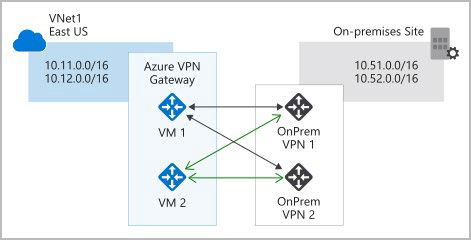

# Введение в сетевые службы Azure

## Основы виртуальной сети Azure

### Что такое виртуальная сеть Azure?

Виртуальные сети Azure позволяют ресурсам Azure, таким как виртуальные машины, веб-приложения и базы данных, взаимодействовать друг с другом, с пользователями в Интернете и с локальными клиентскими компьютерами. Сеть Azure можно представить как набор ресурсов, которые связывают другие ресурсы Azure.

Виртуальные сети Azure предоставляют следующие ключевые сетевые возможности.

- Изоляция и сегментация

- Интернет-коммуникации

- Взаимодействие между ресурсами Azure

- Взаимодействие с локальными ресурсами

- Маршрутизация сетевого трафика

- Фильтрация сетевого трафика

- Подключение виртуальных сетей

### Изоляция и сегментация

Виртуальная сеть позволяет создавать несколько изолированных виртуальных сетей. При настройке виртуальной сети пространство частных IP-адресов определяется с помощью диапазонов общедоступных или частных IP-адресов. Это пространство IP-адресов можно разделить на подсети и выделить часть определенного адресного пространства для каждой имено названной подсети.

Для разрешения имен можно использовать службу разрешения имен, встроенную в Azure. Можно также настроить виртуальную сеть на использование внутреннего или внешнего DNS-сервера.

### Интернет-коммуникации

Виртуальная машина в Azure может подключаться к Интернету по умолчанию. Входящие подключения из Интернета можно включить, определив общедоступный IP-адрес или общедоступный балансировщик нагрузки. Для управления виртуальными машинами можно подключаться через Azure CLI, протокол удаленного рабочего стола или secure shell.

### Взаимодействие между ресурсами Azure

Вы захотите разрешить ресурсам Azure безопасно взаимодействовать друг с другом. Это можно сделать одним из двух способов:

- **Виртуальные сети**. Виртуальные сети могут подключать не только виртуальные машины, но и другие ресурсы Azure, такие как среда службы приложений для Power Apps, служба Azure Kubernetes и масштабируемые наборы виртуальных машин Azure.

- **Конечные точки служб**. Можно использовать конечные точки служб для подключения к другим типам ресурсов Azure, таким как базы данных SQL Azure и учетные записи хранения. Этот подход позволяет связать несколько ресурсов Azure с виртуальными сетями для повышения безопасности и обеспечения оптимальной маршрутизации между ресурсами.

### Взаимодействие с локальными ресурсами

Виртуальные сети Azure позволяют связывать ресурсы в локальной среде и в рамках подписки Azure. По сути, вы можете создать сеть, которая охватывает как локальную, так и облачную среду. Существует три механизма для достижения этой возможности подключения:

- **Виртуальные частные сети точка-сеть**. Типичный подход к подключению к виртуальной частной сети (VPN) — это подключение с компьютера за пределами вашей организации, обратно в вашу корпоративную сеть. В этом случае клиентский компьютер инициирует зашифрованное VPN-подключение для подключения этого компьютера к виртуальной сети Azure.

- **Виртуальные частные сети типа "сеть-сеть"**. VPN связывает локальное VPN-устройство или шлюз с VPN-шлюзом Azure в виртуальной сети. По сути, устройства в Azure могут отображаться как наявляющиеся в локальной сети. Соединение зашифровано и работает через Интернет.

- **Azure ExpressRoute**. Для сред, где требуется большая пропускная способность и еще более высокий уровень безопасности, Azure ExpressRoute является лучшим подходом. ExpressRoute предоставляет выделенное частное подключение к Azure, которое не распространяется через Интернет. (Дополнительные сведения о ExpressRoute в отдельном блоке см. далее в этом модуле.)

### Маршрутизация сетевого трафика

По умолчанию Azure маршрутизирует трафик между подсетями в любых подключенных виртуальных сетях, локальной сети и Интернете. Вы также можете управлять маршрутизацией и переопределять эти параметры следующим образом:

- **Таблицы маршрутов**. Таблица маршрутов позволяет определить правила о том, как должен быть направлен трафик. Можно создавать пользовательские таблицы маршрутизации, которые управляют маршрутизацией пакетов между подсетями.

- **Протокол пограничного шлюза**. BGP работает с VPN-шлюзами Azure или ExpressRoute для распространения локальных маршрутов BGP в виртуальные сети Azure.

### Фильтрация сетевого трафика

Виртуальные сети Azure позволяют фильтровать трафик между подсетями с помощью следующих подходов.

- **Группы безопасности сети**. Группа безопасности сети — это ресурс Azure, который может содержать несколько правил безопасности для входящих и исходящих подключений. Эти правила можно определить для разрешения или блокировки трафика на основе таких факторов, как IP-адрес источника и назначения, порт и протокол.

- **Сетевые виртуальные устройства** Сетевое виртуальное устройство — это специализированная виртуальная машина, которую можно сравнить с усиленным сетевым устройством. Виртуальное сетевое устройство выполняет определенную сетевую функцию, например запуск брандмауэра или оптимизацию глобальной сети (WAN).

### Подключение виртуальных сетей

Виртуальные сети можно связать вместе с помощью пиринга виртуальной сети. Пиринг позволяет ресурсам в каждой виртуальной сети взаимодействовать друг с другом. Эти виртуальные сети могут находиться в отдельных регионах, что позволяет создавать глобальную взаимосвязанную сеть через Azure.

Определяемый пользователем пользовательский идентификатор маршрутизации. UDR является значительным обновлением виртуальных сетей Azure, поскольку он позволяет сетевым администраторам управлять таблицами маршрутизации между подсетями внутри виртуальной сети, а также между виртуальными сетями, что позволяет лучше контролировать поток сетевого трафика.
 

## Управление виртуальными сетями Azure

Вы можете создавать и настраивать экземпляры виртуальной сети Azure на портале Azure, Azure PowerShell на локальном компьютере или Azure Cloud Shell.

### Создание виртуальной сети

При создании виртуальной сети Azure настраивается ряд основных параметров. У вас будет возможность настроить дополнительные параметры, такие как несколько подсетей, защита от распределенного отказа в обслуживании (DDoS) и конечные точки службы.

Необходимо настроить следующие параметры для базовой виртуальной сети:

- **Сетевое имя**. Имя сети должно быть уникальным в вашей подписке, но оно не обязательно должно быть глобально уникальным. Сделайте имя описательным, которое легко запомнить и идентифицировать из других виртуальных сетей.

- **Адресное пространство**. При настройке виртуальной сети вы определяете внутреннее адресное пространство в формате бесклассовой междоменной маршрутизации (CIDR). Это адресное пространство должно быть уникальным в рамках вашей подписки и любых других сетей, к которым вы подключаетесь. Предположим, вы выбрали адресное пространство 10.0.0.0/24 для своей первой виртуальной сети. Адреса, определенные в этом адресном пространстве, варьируются от 10.0.0.1 до 10.0.0.254. Затем создается вторая виртуальная сеть и выбирается адресное пространство 10.0.0.0/8. Адреса в этом адресном пространстве варьируются от 10.0.0.1 до 10.255.255.254. Некоторые из адресов перекрываются и не могут использоваться для двух виртуальных сетей. Но вы можете использовать 10.0.0.0/16 с адресами, которые варьируются от 10.0.0.1 до 10.0.255.254 и 10.1.0.0/16, с адресами, которые варьируются от 10.1.0.1 до 10.1.255.254. Эти адресные пространства можно назначить виртуальным сетям, поскольку адреса не перекрываются.
  **Прим.**: Вы можете добавить адресные пространства после создания виртуальной сети.

- **Подписка**. Эта опция применяется только в том случае, если у вас есть несколько подписок на выбор.

- **Группа ресурсов**. Как и любой другой ресурс Azure, виртуальная сеть должна существовать в группе ресурсов. Можно выбрать существующую группу ресурсов или создать новую.

- **Местоположение**. Выберите место, где вы хотите, чтобы виртуальная сеть существовала.

- **Подсеть**. В каждом диапазоне адресов виртуальной сети можно создать одну или несколько подсетей, которые разбивающие адресное пространство виртуальной сети. Маршрутизация между подсетями будет зависеть от маршрутов трафика по умолчанию. Вы также можете определить пользовательские маршруты. Кроме того, можно определить одну подсеть, которая охватывает все диапазоны адресов виртуальных сетей.
  **Примечание**: Имена подсетей должны начинаться с буквы или цифры и заканчиваться буквой, цифрой или подчеркиванием. Они могут содержать только буквы, цифры, подчеркивания, точки или дефисы.

- **Защита от DDoS-защиты**. Вы можете выбрать базовую или стандартную защиту от DDoS. Стандартная защита от DDoS — это услуга премиум-класса.

- **Конечные точки службы**. Здесь вы включаете конечные точки службы. Затем выберите из списка, какие конечные точки службы Azure вы хотите включить. К таким параметрам относятся Azure Cosmos DB, служебная шина Azure, хранилище ключей Azure и т. д.

После настройки этих параметров выберите **Создать**.

### Определение дополнительных параметров

После создания виртуальной сети можно определить дополнительные параметры. К ним относятся:

- **Группа безопасности сети**. Сетевые группы безопасности имеют правила безопасности, которые позволяют фильтровать тип сетевого трафика, который может поступать и выходить из подсетей и сетевых интерфейсов виртуальной сети. Группа безопасности сети создается отдельно. Затем вы связываете его с виртуальной сетью.

- **Таблица маршрутизации**. Azure автоматически создает таблицу маршрутов для каждой подсети в виртуальной сети Azure и добавляет в нее системные маршруты по умолчанию. Можно добавить пользовательские таблицы маршрутов для изменения трафика между виртуальными сетями.

Можно также изменить конечные точки службы.

### Настройка виртуальных сетей

После создания виртуальной сети можно изменить любые дополнительные параметры на панели Виртуальная сеть  на портале Azure. Кроме того, можно использовать команды PowerShell или команды в Cloud Shell для внесения изменений.

Затем можно просмотреть и изменить настройки в других подобласти. Эти параметры включают в себя:

- **Адресные пространства**: Вы можете добавить дополнительные адресные пространства к первоначальному определению.

- **Подключенные устройства**: используйте виртуальную сеть для подключения машин.

- **Подсети**: Вы можете добавить дополнительные подсети.

- **Пиринги**: связывание виртуальных сетей в пиринговых соглашениях.

Можно также отслеживать и устранять неполадки виртуальных сетей. Кроме того, можно создать сценарий автоматизации для создания текущей виртуальной сети.

Виртуальные сети — это мощные и настраиваемые механизмы подключения сущностей в Azure. Вы можете подключать ресурсы Azure друг к другу или к ресурсам, которые у вас есть локально. Вы можете изолировать, фильтровать и маршрутизировать сетевой трафик. Azure позволяет повысить безопасность там, где вы чувствуете, что это необходимо.

## Основы VPN-шлюза Azure

VPN используют зашифрованный туннель в другие сети. Они обычно развертываются для подключения двух или более доверенных частных сетей друг к другу через недоверенную сеть (обычно общедоступный Интернет). Трафик шифруется во время перемещения по ненадежной сети, чтобы предотвратить подслушивание или другие атаки.

### VPN-шлюзы

VPN-шлюз — это тип шлюза виртуальной сети. Экземпляры VPN-шлюза Azure развертываются в экземплярах виртуальной сети Azure и обеспечивают следующие подключения:

- Подключение локальных центров обработки данных к виртуальным сетям через подключение "сеть-сеть".  

- Подключение отдельных устройств к виртуальным сетям через подключение точка-сеть.

- Подключение виртуальных сетей к другим виртуальным сетям через сетевое  подключение.

Все передаваемые данные шифруются в частном туннеле, когда они пересекают Интернет. В каждой виртуальной сети можно развернуть только один VPN-шлюз, но можно использовать один шлюз для подключения к нескольким расположениям, включая другие виртуальные сети или локальные центры обработки данных.

При развертывании VPN-шлюза указывается тип VPN: на основе политики или на основе маршрута. Основное различие между этими двумя типами VPN заключается в том, как указывается трафик, который должен быть зашифрован. В Azure оба типа VPN-шлюзов используют предварительный ключ в качестве единственного метода проверки подлинности. Оба типа также полагаются на обмен ключами Интернета (IKE) в версии 1 или версии 2 и безопасность протокола Интернета (IPSec). IKE используется для настройки сопоставления безопасности (соглашения о шифровании) между двумя конечными точками. Затем эта связь передается в пакет IPSec, который шифрует и расшифровывает пакеты данных, инкапсулированные в VPN-туннеле.

### VPN на основе политик

VPN-шлюзы на основе политик статически определяют IP-адреса пакетов, которые должны быть зашифрованы через каждый туннель. Этот тип устройства оценивает каждый пакет данных по этим наборам IP-адресов, чтобы выбрать туннель, через который этот пакет будет отправлен.

Ниже представлены ключевые особенности VPN-шлюзов на основе политик в Azure.

- Поддержка только IKEv1.

- Использование *статической маршрутизации*, где комбинации префиксов адресов из обеих сетей контролируют, как трафик шифруется и расшифровывается через VPN-туннель. Источник и назначение туннельных сетей объявляются в политике и не должны объявляться в таблицах маршрутизации.
 
- VPN на основе политик должны использоваться в конкретных сценариях, которые требуют их, например, для совместимости с устаревшими локальными VPN-устройствами.

### VPN на основе маршрутов

Если определение IP-адресов за каждым туннелем является слишком громоздким, можно использовать шлюзы на основе маршрутов. С помощью шлюзов на основе маршрутов туннели IPSec моделируются как сетевой интерфейс или интерфейс виртуального туннеля. IP-маршрутизация (статические маршруты или протоколы динамической маршрутизации) решает, какой из этих туннельных интерфейсов использовать при отправке каждого пакета. VPN на основе маршрутов являются предпочтительным методом подключения для локальных устройств. Они более устойчивы к изменениям топологии, таким как создание новых подсетей.

Используйте VPN-шлюз на основе маршрутов, если вам требуется любой из следующих типов подключения:

- Соединения между виртуальными сетями

- Соединения точка-сеть

- Многосайтовые соединения

- Сосуществование со шлюзом Azure ExpressRoute

Ниже представлены ключевые функции VPN-шлюзов на основе маршрутов в Azure.

- Поддержка IKEv2

- Использует селекторы трафика «любой-к-любому» (подстановочные знаки)

- Может использовать протоколы динамической маршрутизации, где таблицы маршрутизации / пересылки направляют трафик в различные туннели IPSec В этом случае исходная и конечная сети не определяются статически, как в VPN на основе политик или даже в VPN на основе маршрутов со статической маршрутизацией. Вместо этого пакеты данных шифруются на основе таблиц сетевой маршрутизации, которые создаются динамически с использованием протоколов маршрутизации, таких как протокол пограничного шлюза (BGP).

### Размеры VPN-шлюзов

Возможности VPN-шлюза определяются номером SKU или размером развертываемого VPN-шлюза. В этой таблице показаны основные возможности каждого доступного SKU.

| SKU | Туннели Site-to-site/Network-to-network | Сравнение совокупной пропускной способности | Поддержка BGP |
|---|---|---|---|
| Базовый | Максимум: 10 | 100 Мбит/с | Не поддерживается |
| VpnGw1/Az | Максимум: 30 | 650 Мбит/с | Поддерживается |
| VpnGw2/Az | Максимум: 30 | 1 Гбит/с | Поддерживается |
| VpnGw3/Az | Максимум: 30 | 1,25 Гбит/с | Поддерживается |

**Прим.**: Базовый VPN-шлюз следует использовать только для рабочих нагрузок разработки и тестирования. Кроме того, не поддерживается переход с базового на номера VPNGW1/2/3/Az SKU в более позднее время без необходимости удаления шлюза и повторного использования.

### Развертывание VPN-шлюзов

Перед развертыванием VPN-шлюза вам понадобятся некоторые ресурсы Azure и локальные ресурсы.

### Необходимые ресурсы Azure

Перед развертыванием действующего VPN-шлюза вам понадобятся следующие ресурсы Azure.

- **Виртуальная сеть**. Разверните виртуальную сеть с достаточным адресным пространством для дополнительной подсети, которая потребуется для VPN-шлюза. Адресное пространство для этой виртуальной сети не должно перекрываться с локальной сетью, к которую вы будете подключаться. В виртуальной сети можно развернуть только один VPN-шлюз.

- **GatewaySubnet**. Разверните подсеть с именем GatewaySubnet для VPN-шлюза. Используйте по крайней мере маску адреса /27,  чтобы убедиться, что в подсети достаточно IP-адресов для будущего роста. Вы не можете использовать эту подсеть для других служб.

- **Публичный IP-адрес**. Создайте динамический общедоступный IP-адрес с номером Basic, если вы используете шлюз, не основе которого не учитывает зоны. Этот адрес предоставляет общедоступный маршрутизируемый IP-адрес в качестве целевого адреса для локального VPN-устройства. Этот IP-адрес является динамическим, но он не изменится, если вы не удалите и не создадите VPN-шлюз заново.

- **Шлюз локальной сети**. Создайте шлюз локальной сети, чтобы определить конфигурацию локальной сети, например, где VPN-шлюз будет подключаться и к чему он будет подключаться. Эта конфигурация включает общедоступный IPv4-адрес локального VPN-устройства и локальную маршрутизируемую сеть. Эта информация используется VPN-шлюзом для маршрутизации пакетов, предназначенных для сетей on-premis-es, через туннель IPSec.

- **Шлюз виртуальной сети**. Создайте шлюз виртуальной сети для маршрутизации трафика между виртуальной сетью и локальным центром обработки данных или другими виртуальными сетями. Шлюз виртуальной сети может быть либо VPN, либо шлюзом ExpressRoute, но это устройство имеет дело только со шлюзами виртуальной сети VPN. (Дополнительные сведения о ExpressRoute в отдельном блоке см. далее в этом модуле.)

- **Подключение**. Создайте ресурс подключения для создания логического подключения между VPN-шлюзом и шлюзом локальной сети.

  - Подключение производится к IPv4-адресу локального VPN-устройства, определенному шлюзом локальной сети.

  - Подключение производится из шлюза виртуальной сети и связанного с ним общедоступного IP-адреса.

  Можно создать несколько подключений.

На следующей схеме показано такое сочетание ресурсов и их связей, чтобы лучше понять, что требуется для развертывания VPN-шлюза.
 

### Необходимые локальные ресурсы

Чтобы подключить центр обработки данных к VPN-шлюзу, вам понадобятся следующие локальные ресурсы:

- VPN-устройство, поддерживаюющее VPN-шлюзы на основе политик или маршрутов

- Общедоступный (маршрутизируемый через Интернет) IPv4-адрес

## Сценарии высокой доступности

Существует несколько способов обеспечения отказоустойчивой конфигурации.

### Active/standby

По умолчанию VPN-шлюзы развертываются как два экземпляра в конфигурации "активный"/"резервный", даже если в Azure отображается только один ресурс VPN-шлюза. Когда запланированное обслуживание или незапланированные сбои влияют на активный экземпляр, резервный экземпляр автоматически берет на себя ответственность за подключения без вмешательства пользователя. Соединения прерываются во время этой отработки отказа, но они обычно восстанавливаются в течение нескольких секунд для планового обслуживания и в течение 90 секунд для незапланированных сбоев.

### Active/active

С введением поддержки протокола маршрутизации BGP вы также можете развертывать VPN-шлюзы в конфигурации «активный/активный». В этой конфигурации каждому экземпляру назначается уникальный общедоступный IP-адрес. Затем создается отдельный туннель от локального устройства к каждому IP-адресу. Вы можете расширить высокую доступность, развернув дополнительное VPN-устройство локально.

### Отказоустойчивый ExpressRoute
 
Другим вариантом обеспечения высокой доступности является настройка VPN-шлюза в качестве безопасного пути отработки отказа для подключений ExpressRoute. В каналы ExpressRoute встроена отказоустойчивость. Но они не застрахованы от физических проблем, которые влияют на кабели, обеспечивающие подключение, или перебои, которые влияют на полное расположение ExpressRoute. В сценариях высокой доступности, в которых существует риск, связанный с отключением канала ExpressRoute, можно также подготовить VPN-шлюз, использующий Интернет в качестве альтернативного метода подключения. Таким образом, вы можете убедиться, что к виртуальным сетям всегда есть подключение.

### Шлюзы с резервированием зон

В регионах, поддерживающих зоны доступности, VPN-шлюзы и шлюзы ExpressRoute можно развернуть в конфигурации с избыточностью зон. Эта конфигурация обеспечивает отказоустойчивость, масштабируемость и более высокую доступность шлюзов виртуальной сети. Развертывание шлюзов в зонах доступности Azure физически и логически оценивает шлюзы в пределах региона, защищая локальное сетевое подключение к Azure от сбоев на уровне зоны. Для этих шлюзов требуются разные номера SKU шлюзов, и они используют стандартные общедоступные IP-адреса вместо основных общедоступных IP-адресов.

## Основы ExpressRoute

ExpressRoute позволяет расширить локальные сети в облако Майкрософт через частную связь с помощью поставщика услуг подключения. С помощью ExpressRoute можно устанавливать подключения к облачным службам Майкрософт, таким как Microsoft Azure и Microsoft 365.

Подключение может осуществляться из сети «любой-к-любому» (IP VPN), сети Ethernet типа «точка-точка» или виртуального перекрестного соединения через поставщика услуг подключения на объекте колокейшн. Подключения ExpressRoute не проходят через общедоступный Интернет. Это позволяет подключениям ExpressRoute обеспечить большую надежность, более высокую скорость, согласованные задержки и более высокую безопасность, чем обычные подключения через Интернет. Сведения о подключении сети к майкрософт с помощью ExpressRoute см. в разделе Модели подключения ExpressRoute.

В этом блоке мы сосредоточимся на двух различных уровнях взаимосвязи модели открытых систем (OSI):

- **Уровень 2 (L2)**: Этот уровень является уровнем канала передачи данных, который обеспечивает связь между узлами между двумя узлами в одной сети.

- **Уровень 3 (L3)**: Этот уровень является сетевым уровнем, который обеспечивает адресацию и маршрутизацию между узлами в многоузловой сети.

### Возможности и преимущества ExpressRoute

Использование ExpressRoute в качестве службы подключения между Azure и локальными сетями имеет несколько преимуществ.

-Подключение уровня 3 между локальной сетью и Microsoft Cloud через поставщика связи. Подключение может осуществляться из сети «любой-к-любому» (IPVPN), ethernet-соединения «точка-точка» или через виртуальное перекрестное соединение через обмен Ethernet.

- Подключение к облачным службам Microsoft во всех регионах геополитического региона.

- Глобальное подключение к службам Майкрософт во всех регионах с помощью надстройки ExpressRoute Premium.

- Динамическая маршрутизация между вашей сетью и Microsoft через BGP.

- Встроенное резервирование в каждом месте пиринга для более высокой надежности.

- SLA времени безотказной работы соединения.

- Поддержка QoS для Skype для бизнеса.

### Возможности подключения уровня 3

ExpressRoute обеспечивает подключение уровня 3 (на уровне адреса) между локальной сетью и облаком Майкрософт через партнеров по подключению. Эти соединения могут быть из сети точка-точка или из любой в любую. Они также могут быть виртуальными перекрестными соединениями через биржу.

### Встроенное резервирование

Каждый поставщик услуг подключения использует избыточные устройства, чтобы обеспечить высокую доступность подключений, установленных с корпорацией Майкрософт. Вы можете настроить несколько каналов, чтобы дополнить эту функцию. Все избыточные подключения настроены с подключением уровня 3 в соответствии с соглашениями об уровне обслуживания.

### Подключение к облачным службам Майкрософт

ExpressRoute обеспечивает прямой доступ к следующим службам во всех регионах:

- Microsoft Office 365

- Microsoft Dynamics 365

- Вычислительные службы Azure, такие как виртуальные машины Azure

- Облачные службы Azure, такие как Azure Cosmos DB и служба хранилища Azure

Office 365 был создан для безопасного и надежного доступа через Интернет. По этой причине мы повторно рекомендуем использовать ExpressRoute для конкретных сценариев. Раздел "Дополнительные сведения" в конце этого модуля содержит ссылку об использовании ExpressRoute для доступа к Office 365.

### Локальное подключение с помощью Глобального охвата ExpressRoute

Глобальный охват ExpressRoute можно включить для обмена данными между локальными сайтами, подключив каналы ExpressRoute. Например, предположим, что у вас есть частный центр обработки данных в Калифорнии, подключенный к ExpressRoute в Силиконовой долине. У вас есть еще один частный центр обработки данных в Техасе, подключенный к Express-Route в Далласе. С помощью ExpressRoute Global Reach можно подключать частные центры обработки данных через два канала ExpressRoute. Трафик между центрами обработки данных будет проходить через сеть Майкрософт.

### Динамическая маршрутизация

ExpressRoute использует протокол маршрутизации пограничного шлюза (BGP). BGP используется для обмена маршрутами между локальными сетями и ресурсами, работающими в Azure. Этот протокол обеспечивает динамическую маршрутизацию между локальной сетью и службами, работающими в облаке Майкрософт.

### Модели подключения ExpressRoute

ExpressRoute поддерживает три модели, которые можно использовать для подключения локальной сети к Azure:

- размещение CloudExchange

- Соединение Ethernet точка-точка

- Любое-к-любому соединение

#### Размещение CloudExchange

Совместно расположенные поставщики обычно могут предлагать соединения уровня 2 и уровня 3 между инфраструктурой, которая может быть расположена в объекте колокейшн, и облаком Майкрософт. Например, если центр обработки данных расположен на облачной бирже, такой как поставщик услуг Майкрософт, можно запросить виртуальное перекрестное подключение к облаку Майкрософт.

#### Подключение Ethernet «точка-точка»

Подключения "точка-точка" обеспечивают подключение уровня 2 и уровня 3 между локальным сайтом и Azure. Вы можете подключить свои офисы или центры обработки данных к Azure с помощью ссылок "точка-точка". Например, если у вас есть локальный центр обработки данных, вы можете использовать соединение Ethernet точка-точка для подключения к Майкрософт.

#### Сети «любой-к-любому»

Благодаря подключению «любой-к-любому» вы можете интегрировать глобальную сеть (WAN) с Azure, предоставляя подключения к офисам и центрам обработки данных. Azure интегрируется с подключением к глобальной сети, чтобы обеспечить подключение, подобное тому, которое было бы установлено между центром обработки данных и любыми филиалами.

При наличии соединений «любой-к-любому» все поставщики WAN предлагают подключение уровня 3. Например, если вы уже используете многопротокольный коммутацию меток для подключения к филиалам или другим сайтам в организации, подключение ExpressRoute к Майкрософт ведет себя как любое другое расположение в частной глобальной сети.
 
#### Вопросы безопасности

С ExpressRoute ваши данные не перемещаются через общедоступный Интернет, поэтому они не подвержены потенциальным рискам, связанным с интернет-коммуникациями. ExpressRoute — это частное подключение из собственной инфраструктуры к инфраструктуре Azure. Даже если у вас есть подключение ExpressRoute, DNS-запросы, проверка списка отзыва сертификатов и запросы сети доставки содержимого Azure по-прежнему отправляются через общедоступный Интернет.
