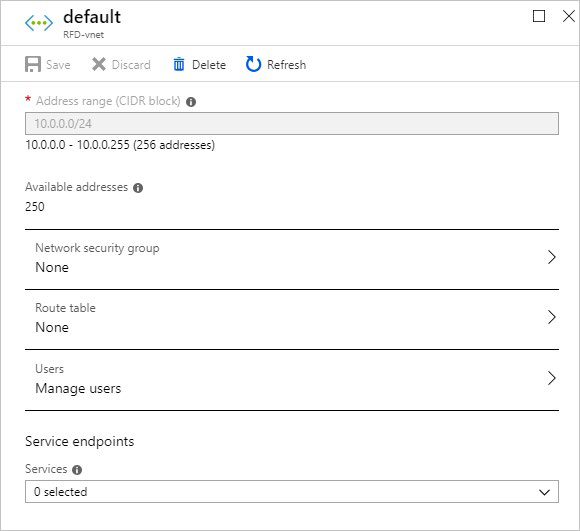
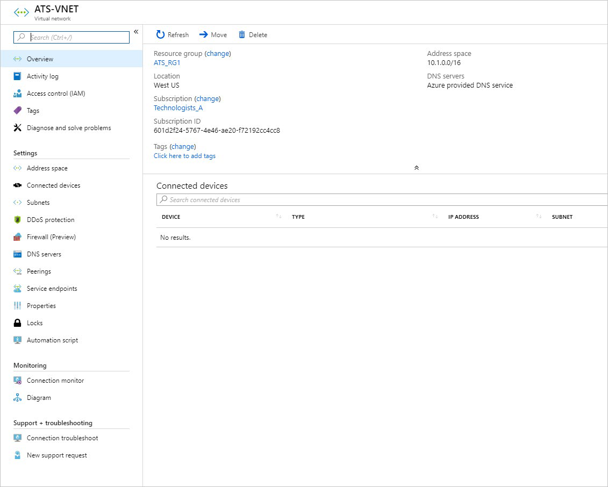
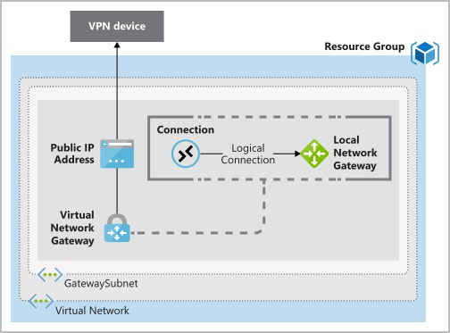
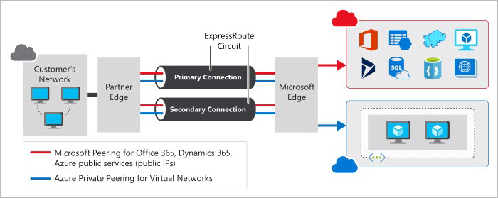
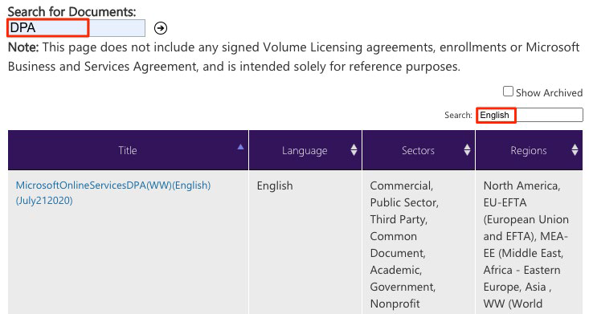

# Функции идентификации, управления, конфиденциальности и соответствия требованиям

## Основные службы идентификации Azure

Традиционно защита доступа к системам и данным включала локальный периметр сети и контроль физического доступа.

Благодаря тому, что люди все чаще могут работать из любого места, а также с ростом стратегий «принеси свое собственное устройство» (BYOD), мобильных приложений и облачных приложений, многие из этих точек доступа теперь находятся за пределами физических сетей компании.

Идентичность стала новой основной границей безопасности. Точное доказательство того, что кто-то является действительным пользователем вашей системы с соответствующим уровнем доступа, имеет решающее значение для поддержания контроля над вашими данными. Этот уровень идентификации теперь чаще становится объектом атаки, чем сеть.

### Сравнение аутентификации и авторизации

Две фундаментальные концепции, которые вам нужно понимать, когда речь идет об идентификации и доступе, — это аутентификация (AuthN) и авторизация (AuthZ).

Аутентификация и авторизация поддерживают все остальное, что происходит. Они происходят последовательно в процессе идентификации и доступа.

#### Что такое аутентификация?

Проверка подлинности — это процесс установления удостоверения человека или службы, которые хотят получить доступ к ресурсу. Он включает в себя акт оспаривания стороной законных учетных данных и обеспечивает основу для создания субъекта безопасности для управления идентификацией и доступом. Он устанавливает, является ли пользователь тем, за кого себя называет.

#### Что такое авторизация?

Аутентификация устанавливает личность пользователя, но авторизация — это процесс установления уровня доступа лица или службы, прошедших проверку подлинности. Он определяет, к каким данным им разрешен доступ и что они могут с этим делать.

#### Как связаны аутентификация и авторизация?

Вот схема, показывающая связь между проверкой подлинности и авторизацией.

Идентификационная карта представляет учетные данные, которые пользователь должен подтвердить свою личность (подробнее о типах учетных данных вы узнаете позже в этом модуле). После проверки подлинности авторизация определяет, к каким типам приложений, ресурсов и данных пользователь может получить доступ.

### Многофакторная аутентификация и условный доступ

Существует два процесса, обеспечивающих безопасную проверку подлинности: Многофакторная идентификация Azure AD и условный доступ. Начнем с краткого взгляда на то, что такое многофакторная аутентификация в целом.

#### Что такое многофакторная аутентификация?

Многофакторная проверка подлинности — это процесс, при котором в процессе входа пользователю предлагается дополнительная форма идентификации. Примеры включают код на их мобильном телефоне или сканирование отпечатков пальцев.

Подумайте о том, как вы входите на веб-сайты, электронную почту или в онлайн-игровые сервисы. В дополнение к вашему имени пользователя и паролю, вам когда-нибудь нужно было ввести код, который был отправлен на ваш телефон? Если это так, вы использовали многофакторную аутентификацию для входа.

Многофакторная проверка подлинности обеспечивает дополнительную безопасность удостоверений, требуя двух или более элементов для полной проверки подлинности.
 
Эти элементы делятся на три категории:

- **Что-то, что пользователь знает** Это может быть адрес электронной почты и пароль.

- **Что-то, что есть у пользователя** Это может быть код, который отправляется на мобильный телефон пользователя.

- **Что-то от пользователя** Это, как правило, какое-то биометрическое свойство, такое как отпечаток пальца или сканирование лица, которое используется на многих мобильных устройствах.

Многофакторная проверка подлинности повышает безопасность удостоверений, ограничивая влияние раскрытия учетных данных (например, украденных имен пользователей и паролей). При включенной многофакторной проверке подлинности злоумышленнику, у которого есть пароль пользователя, также необходимо иметь при себе телефон или отпечаток пальца, чтобы полностью получить доступ.

Сравните многофакторную аутентификацию с однофакторной аутентификацией. При однофакторной проверке подлинности злоумышленнику потребуются только имя пользователя и пароль для проверки подлинности. Многофакторная проверка подлинности должна быть включена везде, где это возможно, поскольку она добавляет огромные преимущества безопасности.

#### Что такое Многофакторная идентификация Azure AD?

Многофакторная идентификация Azure AD — это служба Майкрософт, предоставляющая возможности многофакторной проверки подлинности. Многофакторная идентификация Azure AD позволяет пользователям выбирать дополнительную форму проверки подлинности во время входа, например телефонный звонок или уведомление мобильного приложения.

Эти службы предоставляют возможности многофакторной идентификации Azure AD.

- **Azure Active Directory** Бесплатный выпуск Azure Active Directory предоставляет многофакторную идентификацию Azure AD для администраторов с глобальным уровнем доступа администратора с помощью приложения Microsoft Authentica-tor, телефонного звонка или SMS-кода. Вы также можете применить Многофакторную идентификацию Azure AD для всех пользователей только через приложение Microsoft Authenticator, включив параметры безопасности по умолчанию в клиенте Azure AD. Azure Active Directory Premium (лицензии P1 или P2) обеспечивает комплексную и детальную настройку Многофакторной идентификации Azure AD с помощью политик условного доступа (см. краткое объяснение).

- **Многофакторная проверка подлинности для Office 365** Подмножество возможностей Многофакторной идентификации Azure AD является частью вашей подписки на Office 365.

Дополнительные сведения о лицензиях и возможностях Многофакторной идентификации Azure AD см. в статье [Доступные версии Многофакторной идентификации Azure AD](https://docs.microsoft.com/azure/active-directory/authentication/concept-mfa-licensing#available-versions-of-azure-multi-factor-authentication?azure-portal=true).

#### Что такое условный доступ?

Условный доступ — это средство, которое Azure Active Directory использует для разрешения (или запрета) доступа к ресурсам на основе сигналов удостоверения. Эти сигналы включают в себя, кто является пользователем, где находится пользователь и с какого устройства пользователь запрашивает доступ.

Условный доступ помогает ИТ-администраторам:

- Предоставьте пользователям возможность быть продуктивными, где бы и когда бы они ни находились.

- Защита активов организации.

Условный доступ также обеспечивает более детальную многофакторную проверку подлинности для пользователей. Например, пользователь может не быть оспорен для второго фактора проверки подлинности, если он находится в известном месте. Тем не менее, они могут быть оспорены для второго фактора аутентификации, если их сигналы входа необычны или они находятся в неожиданном месте.

Во время входа в систему условный доступ собирает сигналы от пользователя, принимает решения на основе этих сигналов, а затем обеспечивает выполнение этого решения, разрешая или отклоняя запрос на доступ или оспаривая ответ проверки подлинности multifac-tor.

Вот схема, иллюстрируя этот поток:

Здесь сигналом может быть местоположение пользователя, устройство пользователя или приложение, к которым пользователь пытается получить доступ.

Основываясь на этих сигналах, решение может заключаться в том, чтобы разрешить полный доступ, если пользователь входит в систему из своего обычного местоположения. Если пользователь входит в систему из необычного места или местоположения, которое помечено как место с высоким риском, то доступ может быть полностью заблокирован или, возможно, предоставлен после того, как пользователь предоставит вторую форму подлинности.

Принудительное исполнение - это действие, которое выполняет решение. Например, действие заключается в том, чтобы разрешить доступ или потребовать от пользователя предоставить вторую форму проверки подлинности.

#### Когда можно использовать условный доступ?

Условный доступ полезен, когда необходимо:

- Требуется многофакторная аутентификация для доступа к приложению. Можно настроить, требуется ли многофакторной проверке подлинности всем пользователям или только определенным пользователям, таким как администраторы. Можно также настроить, будет ли многофакторная проверка подлинности использоваться для доступа из всех сетей или только из ненадежных сетей.

- Требовать доступ к услугам только через одобренные клиентские приложения. Например, может потребоваться разрешить пользователям доступ к службам Office 365 с мобильного устройства, если они используют утвержденные клиентские приложения, например мобильное приложение Outlook.

- Требовать, чтобы пользователи обращались к вашему приложению только с управляемых устройств. Управляемое устройство — это устройство, которое соответствует вашим стандартам безопасности и соответствия требованиям.

- Блокировка доступа из ненадежных источников, таких как доступ из неизвестных или неожиданных мест.

Условный доступ поставляется с инструментом «Что если», которое помогает планировать и устранять неполадки политик условного доступа. Это средство можно использовать для моделирования предлагаемых политик условного доступа в ходе недавних попыток входа пользователей, чтобы увидеть, какими были бы последствия, если бы эти политики были включены. Средство «Что если» позволяет протестировать предлагаемые политики условного доступа перед их реализацией.

#### Где доступен условный доступ?

Чтобы использовать условный доступ, вам потребуется лицензия Azure AD Premium P1 или P2. Если у вас есть лицензия Microsoft 365 бизнес премиум, у вас также есть доступ к функциям условного доступа.

### Azure Active Directory (AAD)

Начнем с сравнения Azure AD с Active Directory.

#### Сравнение Azure AD с Active Directory?

Active Directory связана с Azure AD, но у них есть некоторые ключевые отличия.

Корпорация Майкрософт представила Active Directory в Windows 2000, чтобы дать организациям возможность управлять несколькими локальными компонентами инфраструктуры и системами с помощью одного удостоверения для каждого пользователя.

Для локальных сред Active Directory, работающая на Windows Server, предоставляет службу управления удостоверениями и доступом, управляемую вашей организацией. Azure AD — это облачная служба управления удостоверениями и доступом Майкрософт. С помощью Azure AD вы управляете учетными записями удостоверений, но корпорация Майкрософт гарантирует, что служба доступна глобально. Если вы работали с Active Directory, Azure AD будет вам знакома.

При локальной защите удостоверений с помощью Active Directory корпорация Майкрософт не отслеживает вход в систему при искушении. При подключении Active Directory к Azure AD корпорация Майкрософт может защитить вас, обнаружив подозрительные попытки входа без дополнительной платы. Например, Azure AD может обнаруживать попытки входа из неожиданных расположений или с неизвестных устройств.

#### Кто использует Azure AD?

Azure AD предназначен для:

- **ИТ-администраторы** Администраторы могут использовать Azure AD для управления доступом к приложениям и ресурсам в соответствии со своими бизнес-требованиями.

- **Разработчики приложений** Разработчики могут использовать Azure AD, чтобы обеспечить основанный на стандартах подход к добавлению функциональных возможностей в создаваемые ими приложения, например добавление функций единого входа в приложение или предоставление приложению возможности работать с существующими учетными данными пользователя.

- **Пользователи** Пользователи могут управлять своей личностью. Например, самостоятельный сброс пароля позволяет пользователям изменять или сбрасывать свой пароль без участия ИТ-администратора или службы поддержки.

- **Подписчики онлайн-служб** Microsoft 365, Microsoft Office 365, Azure и Microsoft Dynamics CRM Online уже используют Azure AD. Арендатор является представителем организации. A tenant обычно отделен от других клиентов и имеет свою собственную идентичность. Каждый клиент Microsoft 365, Office 365, Azure и Dynamics CRM Online автоматически становится клиентом Azure AD.

Вот снимок экрана, который ИТ-администратор может видеть на портале Azure при работе с Active Directory.

#### Какие службы предоставляет Azure AD?

Azure AD предоставляет такие службы, как:

- **Аутентификация** Включает в себя проверку личности для доступа к приложениям и ресурсам. Он также включает в себя предоставление таких функций, как самостоятельный сброс пароля, многофакторная аутентификация, пользовательский список запрещенных паролей и службы интеллектуальной блокировки.

- **Единый вход** sSO позволяет запомнить только одно имя пользователя и один пароль для доступа к нескольким приложениям. Одно удостоверение привязано к пользователю, что упрощает модель безопасности. Когда пользователи меняют роли или покидают организацию, изменения доступа привязаны к этому удостоверению, что значительно снижает усилия, необходимые для изменения или отключения учетных записей.

- **Управление приложениями** Вы можете управлять облачными и локальными приложениями с помощью Azure AD. Такие функции, как прокси приложения, приложения SaaS, портал My Apps (также называемый панелью доступа) и единый вход обеспечивают лучшее взаимодействие с пользователем.

- **Управление устройствами** Наряду с учетными записями для отдельных пользователей Azure AD поддерживает регистрацию устройств. Регистрация позволяет управлять устройствами с помощью таких средств, как Microsoft Intune. Он также позволяет политикам условного доступа на основе устройств ограничивать попытки доступа только теми, которые поступают с известных устройств, независимо от запрашивающей учетной записи пользователя.

#### Какие типы ресурсов может помочь защитить Azure AD?

Azure AD помогает пользователям получать доступ как к внешним, так и к внутренним ресурсам.

Внешние ресурсы могут включать Microsoft Office 365, портал Azure и тысячи других приложений SaaS .а.).
 
Внутренние ресурсы могут включать приложения в корпоративной и интрасети, а также любые облачные приложения, разработанные в вашей организации.

#### Что такое единый вход?

Единый вход позволяет пользователю выполнять вход один раз и использовать эти учетные данные для доступа к нескольким ресурсам и приложениям от разных поставщиков.

Больше удостоверений означает больше паролей для запоминания и изменения. Политики паролей могут различаться в зависимости от приложения. По мере увеличения требований к сложности пользователям становится все труднее их запоминать. Чем большим количеством паролей пользователь должен управлять, тем выше риск инцидента безопасности, связанного с учетными данными.

Рассмотрим процесс управления всеми этими удостоверениями. Дополнительная нагрузка на службы поддержки, поскольку они имеют дело с блокировкой учетных записей и запросами на сброс пароля. Если пользователь покидает организацию, отслеживание всех этих удостоверений и обеспечение их отключения может быть сложной задачей. Если удостоверение пропущено, это может позволить доступ, когда его следовало бы устранить.

При едином входе необходимо запомнить только один идентификатор и один пароль. Доступ между приложениями предоставляется одному удостоверению, привязанное к пользователю, что упрощает модель безопасности. Когда пользователи меняют роли или покидают организацию, доступ привязан к одному удостоверению. Это изменение значительно сокращает усилия, необходимые для изменения или отключения учетных записей. Использование SSO для учетных записей упрощает пользователям управление своими удостоверениями и повышает возможности безопасности.

#### Как подключить Active Directory к Azure AD?

Подключение Active Directory к Azure AD позволяет обеспечить согласованное взаимодействие с удостоверениями для пользователей.

Существует несколько способов подключения существующей установки Active Directory к Azure AD. Возможно, самым популярным методом является использование Azure AD Connect.

Azure AD Connect синхронизирует удостоверения пользователей между локальной службой Active Directory и Azure AD. Azure AD Connect синхронизирует изменения между обеими системами удостоверений, поэтому вы можете использовать такие функции, как SSO, многофакторная проверка подлинности и самостоятельный сброс пароля в обеих системах. Самостоятельный сброс пароля не позволяет пользователям использовать известные скомпрометированные пароли.

Ниже приведена схема, на которой показано, как Azure AD Connect вписывается между локальной службой Active Directory и Azure AD.
 

## Методологии управления Azure

Термин «управление» описывает общий процесс установления правил и политик и обеспечения соблюдения этих правил и политик.

При работе в облаке стратегия эффективного управления помогает сохранить контроль над приложениями и ресурсами, которыми вы управляете в облаке. Сохранение контроля над средой гарантирует соответствие требованиям:

- Отраслевые стандарты, такие как PCI DSS3.

- Корпоративные или организационные стандарты, такие как обеспечение шифрования сетевых данных.

Управление наиболее выгодно, когда у вас есть:

- Несколько инженерных команд, работающих в Azure.

- Несколько подписок для управления.

- Нормативные требования, которые должны соблюдаться.

- Стандарты, которые должны соблюдаться для всех облачных ресурсов.

### Обзор управления доступом на основе ролей (RBAC)

Если у вас есть несколько ИТ- и инженерных команд, как вы можете контролировать, какой доступ они имеют к ресурсам в вашей облачной среде? Хорошей практикой безопасности является предоставление пользователям только прав, необходимых для выполнения их работы, и только соответствующим ресурсам.

Вместо того, чтобы определять подробные требования к доступу для каждого отдельного человека, а затем обновлять требования к доступу при создании новых ресурсов, Azure позволяет управлять доступом с помощью [управления доступом на основе ролей Azure](https://docs.microsoft.com/azure/role-based-access-control/overview?azure-portal=true) (Azure RBAC).

Azure предоставляет встроенные роли, описывающие общие правила доступа к облачным ресурсам. Вы также можете определить свои собственные роли. Каждая роль имеет связанный набор разрешений доступа, связанных с этой ролью. При назначении отдельным пользователям или группам одной или нескольких ролей они получают все связанные разрешения доступа.

#### Как управление доступом на основе ролей применяется к ресурсам?

Управление доступом на основе ролей применяется к области, которая является ресурсом или набором ресурсов, к которым применяется этот доступ.

Ниже приведена схема, показывавущего связь между ролями и областями.
 

Области применения включают в себя:

- Группа управления (коллекция из нескольких подписок).

- Единая подписка.

- Группа ресурсов.

- Единый ресурс.

*Наблюдатели, Пользователи, управляющие ресурсами, Администраторы и Автоматизированные процессы* иллюстрируют типы пользователей или учетных записей, которым обычно назначается каждая из различных ролей.

При предоставлении доступа к родительской области эти разрешения наследуются всеми дочерними областями. Для экзамена-ple:

- Когда вы назначаете роль [Owner](https://docs.microsoft.com/azure/role-based-access-control/built-in-roles?azure-portal=true#owner) пользователю в области группы управления, этот пользователь может управлять всем во всех подписках в группе управления.

- При назначении роли [Reader](https://docs.microsoft.com/azure/role-based-access-control/built-in-roles?azure-portal=true#reader) группе в области подписки члены этой группы могут просматривать каждую группу ресурсов и ресурс в рамках подписки.

- При назначении роли [Contributor](https://docs.microsoft.com/azure/role-based-access-control/built-in-roles?azure-portal=true#contributor) приложению в области группы ресурсов приложение может управлять ресурсами всех типов в этой группе ресурсов, но не другими группами ресурсов в рамках подписки.

#### Когда следует использовать Azure RBAC?

Используйте Azure RBAC, когда вам нужно:

- Разрешить одному пользователю управлять виртуальными машинами в подписке, а другому — виртуальными сетями.

- Разрешить группе администраторов баз данных управлять базами данных SQL в подписке.

- Разрешить пользователю управлять всеми ресурсами в группе ресурсов, такими как виртуальные машины, веб-сайты и подсети.

- Разрешить приложению доступ ко всем ресурсам в группе ресурсов.

#### Как применяется Azure RBAC?

Azure RBAC применяется к любому действию, инициированное в отношении ресурса Azure, проходящей через диспетчер ресурсов Azure. Resource Manager — это служба управления, которая предоставляет способ организации и защиты облачных ресурсов.

Обычно доступ к диспетчеру ресурсов осуществляется с портала Azure, Azure Cloud Shell, Azure PowerShell и интерфейса командной строки Azure. Azure RBAC не применяет разрешения доступа на уровне приложения или данных. Безопасность приложения должна обрабатываться приложением.

RBAC использует разрешающую модель. Когда вам назначена роль, RBAC позволяет выполнять определенные действия, такие как чтение, запись или удаление. Если одно назначение ролей предоставляет разрешения на чтение группе ресурсов, а другое назначение ролей предоставляет разрешения на запись в одну и ту же группу ресурсов, у вас есть разрешения на чтение и запись в этой группе ресурсов.

#### К кому применяется Azure RBAC?

Вы можете применить Azure RBAC к отдельному лицу или группе. Вы также можете применить Azure RBAC к другим специальным типам удостоверений, таким как субъекты-службы и управляемые удостоверения. Эти типы удостоверений используются приложениями и службами для автоматизации доступа к ресурсам Azure.

Например:

- ИТ-администраторы Эта команда полной собственности на технологические активы, как локально, так и в облаке. Команде требуется полный контроль над всеми ресурсами.

- Резервное копирование и аварийное восстановление Эта команда отвечает за управление работоспособностью регулярных резервных копий и вызов любых данных или восстановления системы.

- Затраты и выставление счетов Люди в этой команде отслеживают и сообщают о расходах, связанных с технологиями. Они также управляют внутренними бюджетами организации.

- Операции безопасности Эта команда отслеживает и реагирует на любые инциденты безопасности, связанные с технологиями.

Группе требуется постоянный доступ к файлам журналов и оповещениям системы безопасности.

#### Как управлять разрешениями RBAC Azure?

Управление разрешениями доступа осуществляется на панели Управление доступом (IAM) на портале Azure. На этой панели показано, кто имеет доступ к какой области и какие роли применяются. Вы также можете предоставить или удалить доступ из этой панели.

На следующем снимке экрана показан пример панели Управления доступом (IAM) для группы ресурсов. В этом примере Алену Шарону назначена роль оператора архивации для этой группы ресурсов.
 
 

### Блокировки ресурсов

[Блокировка ресурсов](https://docs.microsoft.com/azure/azure-resource-manager/management/lock-resources?azure-portal=true) предотвращает случайное удаление или изменение ресурсов.

Даже при наличии политик управления доступом на основе ролей Azure (Azure RBAC) по-прежнему существует риск того, что люди с нужным уровнем доступа могут удалить критически важные облачные ресурсы. Думайте о блокировке ресурса как о системе предупреждений, которая напоминает вам, что ресурс не должен быть удален или изменен.

#### Как управлять блокировками ресурсов?

Блокировками ресурсов можно управлять с помощью портала Azure, PowerShell, интерфейса командной строки Azure или шаблона диспетчера ресурсов Azure.

Чтобы просмотреть, добавить или удалить блокировки на портале Azure, перейдите в раздел Параметры панели Параметры любого ресурса на портале Azure.

Ниже приведен пример, в которого показано, как добавить блокировку ресурсов на портале Azure. Аналогичная блокировка ресурса будет применена в следующей части.

#### Какие уровни блокировки доступны?

Блокировки можно применять к подписке, группе ресурсов или отдельному ресурсу. Можно установить для уровня блокировки значение CanNotDelete или ReadOnly.

- **CanNotDelete** означает, что авторизованные пользователи по-прежнему могут читать и изменять ресурс, но они не могут удалить ресурс без предварительного снятия блокировки.

- **ReadOnly** означает, что авторизованные люди могут читать ресурс, но они не могут удалить или изменить повторный источник. Применение этой блокировки равно, что ограничить всех авторизованных пользователей разрешениями, предоставляемыми ролью читателя в Azure RBAC.
 
#### Как удалить или изменить заблокированный ресурс?

Хотя блокировка помогает предотвратить случайные изменения, вы все равно можете вносить изменения, выполнив двухэтапный процесс.

Чтобы изменить заблокированный ресурс, необходимо сначала снять блокировку. После снятия блокировки можно применить любое действие, на выполнение которого у вас есть разрешения. Этот дополнительный шаг позволяет выполнить действие, но помогает защитить администраторов от выполнения действий, которые они, возможно, не намеревались делать.

Блокировки ресурсов применяются независимо от разрешений RBAC. Даже если вы являетесь владельцем ресурса, вы все равно должны снять блокировку, прежде чем сможете выполнить заблокированное действие.

#### Объединение блокировок ресурсов с помощью схем элементов Azure

Что делать, если администратор облака случайно удаляет блокировку ресурса? Если блокировка ресурса снята, связанные с ней ресурсы могут быть изменены или удалены.

Чтобы сделать процесс защиты более надежным, можно объединить блокировки ресурсов с схемами элементов Azure. Схемы элементов Azure позволяют определить набор стандартных ресурсов Azure, необходимых вашей организации. Например, можно определить схему элементов, указывая, что должна существовать определенная блокировка ресурсов. Схемы элементов Azure могут автоматически заменить блокировку ресурсов, если она будет удалена.

## Теги

По мере роста использования облака становится все более важным оставаться организованным. Хорошая стратегия организации поможет вам понять использование облака и может помочь вам управлять затратами.

Одним из способов организации связанных ресурсов является размещение их в собственных подписках. Группы ресурсов также можно использовать для управления связанными ресурсами. Теги ресурсов — это еще один способ организации ресурсов. Теги предоставляют дополнительную информацию или метаданные о ваших ресурсах. Эти метаданные полезны для:

- **Теги управления ресурсами** позволяют находить ресурсы, связанные с конкретными рабочими нагрузками, средами, бизнес-подразделениями и владельцами, и действовать с ними.

- **Теги управления затратами** и оптимизации позволяют группировать ресурсы, чтобы вы могли отчитываться о затратах, распределять внутренние центры затрат, отслеживать бюджеты и прогнозировать ориентировочные затраты.

- **Теги управления операциями** позволяют группировать ресурсы в соответствии с тем, насколько важна их доступность для вашего бизнеса. Эта группировка помогает формулировать соглашения об уровне обслуживания (SLA). SLA — это гарантия бесперебойной работы или производительности между вами и вашими пользователями.

- **Теги безопасности** позволяют классифицировать данные по уровню безопасности, например, общедоступные или конфиденциальные.

- **Теги соответствия нормативным требованиям** позволяют идентифицировать ресурсы, которые соответствуют требованиям управления или соответствия нормативным требованиям, таким как ISO 27001. Теги также могут быть частью ваших усилий по обеспечению соблюдения стандартов. Например, может потребоваться, чтобы все ресурсы были помечены именем владельца или отдела.

- **Теги оптимизации рабочей нагрузки и автоматизации** могут помочь вам визуализировать все ресурсы, участвующие в сложных развертываниях. Например, можно пометить ресурс соответствующим именем рабочей нагрузки или приложения и использовать программное обеспечение, такое как Azure DevOps, для выполнения автоматизированных задач на этих ресурсах.

#### Как управлять тегами ресурсов?

Вы можете добавлять, изменять или удалять теги ресурсов с помощью PowerShell, Azure CLI, шаблонов Azure Resource Manager, REST API или портала Azure.

Вы также можете управлять тегами с помощью политики Azure. Например, можно применить теги к группе ресурсов, но эти теги не применяются автоматически к ресурсам в этой группе ресурсов. Вы можете использовать политику Azure, чтобы гарантировать, что ресурс наследует те же теги, что и его родительская группа ресурсов. Дополнительные сведения о политике Azure вы узнаете позже в этом модуле.

Вы также можете использовать политику Azure для применения правил и соглашений о тегах. Например, можно потребовать, чтобы определенные теги добавлялись к новым ресурсам по мере их подготовки. Можно также определить правила, которые повторно применяют удаленные теги.

### Политики Azure

Теперь, когда вы определили свои требования к управлению и бизнесу, как вы гарантируете, что ваши ресурсы соответствуют требованиям? Как получить предупреждение, если конфигурация ресурса изменилась?

[Политика Azure](https://azure.microsoft.com/services/azure-policy?azure-portal=true) — это служба в Azure, которая позволяет создавать, назначать и управлять политиками, контролирую или анализируем ресурсы. Эти политики применяют различные правила и эффекты к конфигурациям ресурсов, чтобы эти конфигурации соответствовали корпоративным стандартам.

#### Как политика Azure определяет политики?

Политика Azure позволяет определять как отдельные политики, так и группы связанных политик, называемых инициативами. Политика Azure оценивает ресурсы и выделяет ресурсы, которые не соответствуют созданным вами политикам. Политика Azure также может предотвратить создание ресурсов, несоответствующий этому.

Политика Azure поставляется с рядом встроенных определений политик и инициатив, которые можно использовать в таких категориях, как хранилище, сеть, вычислительные ресурсы, центр безопасности и мониторинг.

Например, предположим, что вы определяете политику, которая позволяет использовать в среде только определенный размер единицы хранения (SKU) виртуальных машин (ВМ). После включения этой политики эта политика применяется при создании новых виртуальных машин или изменения размера существующих виртуальных машин. Политика Azure также оценивает все текущие виртуальные машины в вашей среде.

В некоторых случаях политика Azure может автоматически иссматировать несовместимые ресурсы и конфигурации, чтобы обеспечить целостность состояния ресурсов. Например, если все ресурсы в определенной группе ресурсов должны быть помечены тегом AppName и значением "SpecialOrders", политика Azure может автоматически повторно применить этот тег, если он был удален.

Политика Azure также интегрируется с Azure DevOps, применяя все политики конвейера непрерывной интеграции и доставки, которые применяются к этапам приложений до и после развертывания.

#### Политика Azure в действии

Реализация политики в политике Azure включает в себя следующие три шага.

1. Создайте определение политики.

2. Присвойте определение ресурсам.

3. Просмотрите результаты оценки.

Рассмотрим каждый шаг более подробно.

##### 1. Создание определения политики

Определение политики выражает то, что оценивать и какие действия предпринимать. Например, можно запретить развертывание виртуальных машин в определенных регионах Azure. Вы также можете провести аудит учетных записей хранения, чтобы убедиться, что они принимают подключения только из разрешенных сетей.

Каждое определение политики имеет условия, при которых оно применяется. Определение политики также имеет эффект accompa-nying, который имеет место при выполнении условий. Вот несколько примеров определений политик:

- Разрешенные номера SKU виртуальных машин Эта политика позволяет указать набор номеров SKU виртуальных машин, которые может развертываться вашей организацией.

- Разрешенные расположения Эта политика позволяет ограничить местоположения, которые организация может указать при развертывании ресурсов. Его эффект используется для обеспечения соблюдения ваших требований к географическому соответствию.

- MFA должна быть включена для учетных записей с разрешениями на запись в вашу подписку Эта политика требует, чтобы многофакторная аутентификация (MFA) была включена для всех учетных записей подписки с правами на запись, чтобы предотвратить нарушение учетных записей или ресурсов.

- CORS не должен разрешать каждому ресурсу доступ к вашим веб-приложениям Обмен ресурсами между ресурсами (CORS) — это функция HTTP, которая позволяет веб-приложению, работающему под одним доменом, получать доступ к ресурсам в другом домене. По соображениям безопасности современные веб-браузеры по умолчанию ограничивают межсайтовые сценарии. Эта политика позволяет взаимодействовать с веб-приложением только необходимым доменам.
 
- Системные обновления должны быть установлены на компьютерах Эта политика позволяет центру безопасности Azure рекомендовать отсутствующие обновления системы безопасности на серверах.

##### 2. Присвойте определение ресурсам

Для реализации определений политики ресурсы назначают определения. Назначение политики — это определение политики, которое имеет место в определенной области. Эта область может быть группой управления (коллекция из нескольких подписок), одной подпиской или группой ресурсов.

Назначения политик наследуются всеми дочерними ресурсами в этой области. Если политика применяется к группе повторного источника, эта политика применяется ко всем ресурсам в этой группе ресурсов. Можно исключить подобласти из назначения политики, если есть определенные дочерние ресурсы, которые необходимо исключить из назначения политики.

##### 3. Обзор результатов оценки

При оценке условия по существующим ресурсам каждый ресурс помечается как соответствующий или несоответствующий. Вы можете просмотреть результаты политики несоответствия и предпринять любые необходимые действия.

Оценка политики происходит примерно раз в час. Если вы вносите изменения в определение политики и создаете назначение политики, эта политика оценивается по ресурсам в течение часа.

#### Что такое инициативы политики Azure?

Инициатива политики Azure — это способ группировки связанных политик в один набор. Определение инициативы содержит все определения политик, помогающих отслеживать состояние соответствия для более широкой цели.

Например, политика Azure включает инициативу с именем Включить мониторинг в центре безопасности Azure. Его цель — отслеживать все доступные рекомендации по безопасности для всех типов ресурсов Azure в центре безопасности Azure.

В рамках этой инициативы включены следующие определения политики:

- **Мониторинг незашифрованной базы данных SQL в центре безопасности** Эта политика отслеживает незашифрованные базы данных и серверы SQL.

- **Мониторинг уязвимостей ОС в центре безопасности** Эта политика отслеживает серверы, которые не соответствуют настроенной базовой линии уязвимости ОС.

- **Мониторинг отсутствующей защиты конечных точек в центре безопасности** Эта политика отслеживает серверы, на которых не установлен агент защиты конечных точек.

Фактически, инициатива Включить мониторинг в центре безопасности Azure содержит более 100 отдельных определений политик.

Политика Azure также включает инициативы, поддерживающие соответствие нормативным стандартам, таким как HIPAA и ISO 27001.

#### Как определить инициативу?

Инициативы определяются с помощью портала Azure или средств командной строки. На портале Azure можно выполнить поиск по списку встроенных инициатив, которые уже предоставлены Azure. Можно также создать собственное определение пользовательской политики.

На следующем рисунке показано несколько примеров инициатив политики Azure на портале Azure.
 
 

#### Как назначить инициативу?

Как и назначение политики, назначение инициативы — это определение инициативы, назначенное определенной области группы управления, подписки или группы ресурсов.

Даже если у вас есть только одна политика, инициатива позволяет со временем увеличить количество политик. Поскольку связанная инициатива остается назначенной, проще добавлять и удалять политики без необходимости изменения назначения политики для ресурсов.

### Azure Blueprints

До сих пор вы изучили ряд функций Azure, которые могут помочь вам реализовать решения по управлению, отслеживать соответствие облачных ресурсов, а также контролировать доступ и защищать критически важные ресурсы от случайного удаления.

Что произойдет, если ваша облачная среда начнет расти за пределы одной подписки? Как вы можете масштабировать конфигурацию этих функций, зная, что они должны быть применены для ресурсов в новых подскриптах?

Вместо того, чтобы настраивать такие функции, как политика Azure, для каждой новой подписки, с помощью [Azure Blueprints](https://azure.microsoft.com/services/blueprints?azure-portal=true) вы можете определить повторяемый набор средств управления и стандартных ресурсов Azure, необходимых вашей организации. Таким образом, команды разработчиков могут быстро создавать и развертывать новые среды, зная, что они строят в рамках организационного соответствия с помощью набора встроенных компо-нентов, которые ускоряют этапы разработки и развертывания.

Azure Blueprints организует развертывание различных шаблонов ресурсов и других артефактов, таких как:

- Назначение ролей

- Назначение политики

- Шаблоны диспетчера ресурсов Azure

- Группы ресурсов

#### Схемы элементов Azure в действии

При формировании группы специалистов облачного центра передового опыта или группы хранителей облачных вычислений эта группа может использовать Azure Blueprints для масштабирования своих методов управления в масштабах всей организации.

Реализация схемы элементов в Azure Blueprints включает следующие три этапа.

1. Создайте схему элементов Azure.

2. Назначьте схему.

3. Отслеживайте чертежные задания.

В Azure Blueprints сохраняется связь между определением схемы элементов (что должно быть развернуто) и назначением схемы элементов (то, что было развернуто). Другими словами, Azure создает запись, которая связывает ресурс с схемой элементов, которая его определяет. Это подключение помогает отслеживать и проводить аудит развертываний.

Чертежи также являются версиями. Управление версиями позволяет отслеживать и комментировать изменения в чертеже.

#### Что такое артефакты чертежа?

Каждый компонент в определении схемы элементов называется артефактом.

Артефакты могут не иметь дополнительных параметров (конфигураций). Примером может быть политика Развертывание обнаружения угроз на серверах SQL, которая не требует дополнительной настройки.

Артефакты также могут содержать один или несколько параметров, которые можно настроить. На следующем снимке экрана показана политика Разрешенные расположения. Эта политика включает параметр, указывающий разрешенные расположения.
 

Значение параметра можно указать при создании определения схемы элементов или при назначении определения схемы элементов области. Таким образом, можно поддерживать одну стандартную схему элементов, но иметь гибкий ty для указания соответствующих параметров конфигурации в каждой области, где назначено определение.

### Платформа внедрения облака для Azure

Платформа [Cloud Adoption Framework для Azure](https://docs.microsoft.com/azure/cloud-adoption-framework/?azure-portal=true) предоставляет проверенные рекомендации, которые помогут вам в освоении облака. Cloud Adoption Framework помогает создавать и реализовывать бизнес- и технологические стратегии, необходимые для успеха в облаке.

#### Что такое платформа внедрения облачных технологий?

Платформа Cloud Adoption Framework состоит из инструментов, документации и проверенных практик. Платформа внедрения облака включает в себя следующие этапы:

1. Определите свою стратегию.

2. Составьте план.

3. Подготовьте свою организацию.

4. Примите облако.

5. Управляйте облачными средами и управляйте ими.
 

Этап управления фокусируется на управлении облаком. Вы можете обратиться к платформе Cloud Adoption Framework для получения рекомендуемых рекомендаций при построении стратегии управления облаком.

Чтобы помочь в построении стратегии внедрения, Cloud Adoption Framework разбивает каждый этап на дальнейшие упражнения и шаги. Давайте кратко рассмотрим каждый этап.

#### Определите свою стратегию

Здесь вы отвечаете, почему вы переходите в облако и что вы хотите получить от миграции в облако. Вам нужно масштабироваться, чтобы удовлетворить спрос или выйти на новые рынки? Снизит ли это затраты или повысит гибкость бизнеса?

Вот шаги на этом этапе.

1. **Определите и задокументируйте свои мотивы**: встреча с заинтересованными сторонами и руководством может помочь вам ответить, почему вы переходите в облако.
 
2. **Документируйте бизнес-результаты**: встречайтесь с руководством ваших групп по финансам, маркетингу, продажам и персоналу, чтобы помочь вам задокументировать свои цели.

3. **Разработайте бизнес-кейс**: убедитесь, что переход в облако дает вам правильную отдачу от инвестиций (ROI) за ваши усилия.
 
4. **Выберите правильный первый проект**: выберите проект, который достижим, но также показывает прогресс в достижении ваших целей миграции в облако.

#### Составьте план

Здесь вы строите план, который сопоставляет ваши амбициозные цели с конкретными действиями. Хороший план помогает гарантировать, что ваши усилия соответствуют желаемым бизнес-результатам.

Вот шаги на этом этапе.

1. **Цифровое имущество**: создайте инвентаризацию существующих цифровых активов и рабочих нагрузок, которые планируется перенести в облако.
 
2. **Первоначальное организационное выравнивание**: убедитесь, что в ваших усилиях по миграции участвуют нужные люди, как с технической точки зрения, так и с точки зрения управления облаком.

3. **План готовности к навыкам**: создайте план, который поможет людям развить навыки, необходимые для работы в облаке.
 
4. **План внедрения облака**: создайте комплексный план, объединяющий команды разработчиков, операций и бизнеса для достижения цели внедрения общего облака.

#### Подготовьте свою организацию

Здесь вы создаете зону посадки или среду в облаке, чтобы начать размещение рабочих нагрузок.

Вот шаги на этом этапе.

1. **Руководство по установке Azure**: ознакомьтесь с руководством по настройке Azure, чтобы ознакомиться со средствами и подходами, которые необходимо использовать для создания целевой зоны.
 
2. **Целевая зона Azure**: начните создавать подписки Azure, которые поддерживают каждую из основных областей вашего бизнеса. Зона посадки включает в себя облачную инфраструктуру, а также возможности управления, учета и безопасности.

3. **Расширение зоны посадки**: уточните зону посадки, чтобы она соответствовала вашим потребностям в операциях, управлении и безопасности.
 
4. **Рекомендации**: начните с рекомендуемых и проверенных практик, которые помогут обеспечить масштабируемость и поддержку миграции в облако.

#### Внедрение облака

Здесь вы начнете переносить свои приложения в облако. По пути вы можете найти способы модернизации своих приложений и создания инновационных решений, использующих облачные сервисы.

Cloud Adoption Framework разбивает этот этап на две части: миграция и инновации.

**Миграция**: вот шаги в части миграции на этом этапе.

1. **Перенос первой рабочей нагрузки**: используйте руководство по миграции Azure для развертывания первого проекта в облаке.
 
2. **Сценарии миграции**: используйте дополнительные подробные руководства для изучения более сложных сценариев миграции.

3. **Рекомендации**: ознакомьтесь с контрольным списком рекомендаций по миграции в облако Azure, чтобы убедиться, что вы следуете рекомендациям.
 
4. **Усовершенствования процессов**: определите способы масштабирования процесса миграции, требуя при этом меньших усилий.

**Инновации**: Вот шаги в инновационной части этого этапа.

1. **Консенсус по ценности бизнеса**: убедитесь, что инвестиции в новые инновации повышают ценность бизнеса и отвечают потребностям клиентов.
 
2. **Руководство по инновациям Azure**: используйте это руководство для ускорения разработки и создания минимально жизнеспособного продукта (MVP) для вашей идеи.

3. **Рекомендации**: перед переходом к работе убедитесь, что ход выполнения соответствует рекомендуемым рекомендациям.
 
4. **Петли обратной связи**: часто проверяйте своих клиентов, чтобы убедиться, что вы создаете то, что им нужно.

#### Регулирование облачных сред и управление ими

Здесь вы начинаете формировать свои стратегии управления облаком и управления облаком. По мере изменения облачного имущества с течением времени меняются и процессы и политики управления облаком. Необходимо создавать отказоустойчивые решения, которые постоянно оптимизируются.

**Регулирование**: Вот шаги в управляющей части этого этапа.

1. **Методология**: рассмотрите решение конечного состояния. Затем определите методологию, которая постепенно проведет вас от первых шагов до полного управления облаком.
 
2. **Контрольный показатель**: используйте инструмент сравнения управления (https://cafbaseline.com/?azure-portal=true) для оценки вашего текущего состояния и будущего состояния, чтобы установить видение применения структуры.

3. **Первоначальная основа управления**: создайте MVP, который фиксирует первые шаги вашего плана управления.
 
4. **Улучшите первоначальную основу управления**: итеративно добавьте элементы управления, которые устраняют ощутимые риски по мере продвижения к решению конечного состояния.

**Управление**: Вот шаги в части управления на этом этапе.

1. **Установите базовый уровень управления**: определите свою минимальную приверженность управлению операциями. Базовый уровень управления — это минимальный набор инструментов и процессов, которые должны применяться к каждому активу в среде.

2. **Определение бизнес-обязательств**: документирование поддерживаемых рабочих нагрузок для установления операционных обязательств с бизнесом и согласования инвестиций в управление облаком для каждой рабочей нагрузки.

3. **Разверните базовый уровень управления**: примените рекомендуемые рекомендации для итерации по исходному базовому плану управления.
 
4. **Расширенные принципы работы и проектирования**: для рабочих нагрузок, требующих более высокого уровня бизнес-обязательств, выполните более глубокий анализ архитектуры, чтобы выполнить свои обязательства по отказоустойчивости и надежности.

### Создание стратегии управления подпиской

В начале любой реализации облачного управления вы определяете структуру облачной организации, которая соответствует потребностям вашего бизнеса. Этот шаг часто включает в себя формирование команды облачного центра передового опыта (также называемой командой поддержки облака или командой хранителей облака). Эта группа уполномочена внедрять методы управления из централизованного расположения для всей организации.

Команды часто начинают свою стратегию управления Azure на уровне подписки. При создании подписок и управлении ими необходимо учитывать три основных аспекта: выставление счетов, управление доступом и ограничения подписки.

Рассмотрим каждый из этих аспектов более подробно.

#### Выставления счетов

Для каждой подписки можно создать один отчет о выставлении счетов. Если у вас несколько отделов и вам нужно сделать «возвратный платеж» затрат на облако, одним из возможных решений является организация подписок по отделам или проектам.

Теги ресурсов также могут помочь. Вы изучите теги позже в этом модуле. Определяя, сколько подскриптов вам нужно и как их назвать, учитывайте внутренние требования к выставлению счетов.

#### Управление доступом

Подписка — это граница развертывания ресурсов Azure. Каждая подписка связана с клиентом Azure Active Directory. Каждый клиент предоставляет администраторам возможность задать детальный доступ с помощью определенных ролей с помощью управления доступом на основе ролей Azure.

При проектировании архитектуры подписки учитывайте фактор границ развертывания. Например, нужны ли вам отдельные подписки для разработки и для рабочих сред? С помощью отдельных подписок вы можете управлять доступом к каждой из них отдельно и изолировать их ресурсы от одного анот-ера.
 
#### Лимиты подписки

Подписки также имеют некоторые ограничения ресурсов. Например, максимальное количество сетевых каналов Azure ExpressRoute на подписку составляет 10. Эти ограничения следует учитывать на этапе проектирования. Если вам нужно превысить эти ограничения, вам может потребоваться добавить дополнительные подписки. Если вы достигли максимума жесткого предела, нет никакой гибкости для его увеличения.

Группы управления также доступны для помощи в управлении подписками. Группа управления управляет доступом, политиками и соответствием требованиям для нескольких подписок Azure. Дополнительные сведения о группах управления будут позже в этом модуле.
 
## Стандарты конфиденциальности, соответствия и защиты данных

Если ваша организация является государственным департаментом или агентством или вам необходимо выполнить развертывание в регионах Китая, вы также узнаете о некоторых соображениях, которые не относятся к другим пользователям Azure.

В целом, соблюдение означает соблюдение закона, стандарта или набора руководящих принципов. Соблюдение нормативных требований относится к дисциплине и процессу обеспечения того, чтобы компания соблюдала законы, которые применяют руководящие органы.

### Условия и требования соответствия

В этом блоке вы узнаете о типах предложений соответствия, доступных в Azure.

По мере того, как Tailwind Traders переходит к запуску своих приложений в облаке, он хочет знать, как Azure соблюдает применимые нормативные требования. Компания спрашивает:

- Насколько Azure совместима с обработкой персональных данных?

- Насколько совместимы каждая из отдельных служб Azure?

Веб-службы Microsoft основаны на общем наборе нормативных и нормативных элементов управления. Думайте об элементе управления как о хорошо известном стандарте, с которым можно сравнить свое решение для обеспечения безопасности. Эти мнимые будут учитывать сегодняшние правила и адаптироваться по мере развития нормативных актов.

#### Какие категории соответствия доступны в Azure?

Хотя их гораздо больше, на следующем рисунке показаны некоторые из наиболее популярных предложений соответствия требованиям, доступных в Azure. Эти предложения сгруппированы по четырем категориям: глобальные, правительственные, отраслевые и региональные.
 
 

Чтобы получить представление о разнообразии предложений по обеспечению соответствия требованиям, доступных в Azure, давайте подробнее рассмотрим некоторые из них.

Хотя не все из этих предложений по соответствию будут актуальны для вас или вашей команды, они показывают, что приверженность Micro-soft соответствию является всеобъемлющей, постоянной и независимо проверенной и проверенной.

#### Информационная служба уголовного правосудия

Любое государственное или местное агентство США, которое хочет получить доступ к базе данных Информационных служб уголовного правосудия ФБР (CJIS), обязано придерживаться политики безопасности CJIS.

Azure — единственный крупный поставщик облачных услуг, который по контракту обязуется соблюдать политику безопасности CJIS. Корпорация Майкрософт придерживается тех же требований, которым должны соответствовать правоохранительные органы и органы общественной безопасности.

#### Сертификация STAR Альянса по облачной безопасности

Azure, Intune и Microsoft Power BI получили сертификат STAR Cloud Security Alliance (CSA), который включает в себя строгую независимую оценку состояния безопасности поставщика облачных услуг.

Сертификация STAR основана на получении сертификата Международной организации стандартов / Международной электротехнической комиссии (ISO / IEC) 27001 и соответствии критериям, указанным в Матрице управления облаком (CCM). Эта сертификация демонстрирует, что поставщик облачных услуг:

- Соответствует применимым требованиям ISO/IEC 27001.

- Решены вопросы, критически важные для облачной безопасности, как описано в СКК.

- Была оценена по модели зрелости возможностей STAR для управления деятельностью в контрольных зонах СКК.

#### Типовые положения Европейского союза

Корпорация Майкрософт предлагает клиентам стандартные договорные условия Европейского союза (ЕС), которые предоставляют договорные гарантии в отношении передачи персональных данных за пределы ЕС.
 
Microsoft является первой компанией, получившей совместное одобрение рабочей группы ЕС по статье 29 о том, что договорная защита конфиденциальности, которую Azure предоставляет своим корпоративным облачным клиентам, соответствует текущим позициям ЕС для международной передачи данных. Соответствие этому стандарту гарантирует, что клиенты Azure могут использовать службы Майкрософт для свободного перемещения данных через облако Майкрософт из Европы в остальной мир.

#### Закон о переносимости и подотчетности медицинского страхования

Закон о переносимости и подотчетности медицинского страхования (HIPAA) является федеральным законом США, который регулирует защищенную медицинскую информацию о пациентах (PHI).

Azure предлагает клиентам соглашение HIPAA Business Associate Agreement (BAA), в котором предусматривается соблюдение определенных положений о безопасности и конфиденциальности в HIPAA и Hitech Act. Чтобы помочь клиентам в их индивидуальных усилиях по обеспечению соответствия требованиям, корпорация Майкрософт предлагает клиентам Azure BAA в качестве дополнительного соглашения к контракту.

#### Международная организация стандартов/Международная электротехническая комиссия 27018

Microsoft является первым облачным провайдером, принявщим кодекс практики ISO/IEC 27018, который охватывает обработку личной информации поставщиками облачных услуг.

#### Многоуровневая облачная безопасность Сингапур

После тщательной оценки, проведенной органом по сертификации многоуровневой облачной безопасности (MTCS), облачные службы Майкрософт получили сертификацию MTCS 584:2013 по всем трем классификациям услуг:

- Инфраструктура как услуга (IaaS)

- Платформа как услуга (PaaS)

- Программное обеспечение как услуга (SaaS)

Корпорация Майкрософт является первым глобальным поставщиком облачных решений, получившим эту сертификацию по всем трем классификациям.

#### Элементы управления организации обслуживания 1, 2 и 3

Облачные службы, охватываемые корпорацией Майкрософт, проверяются не реже одного раза в год на соответствие структуре отчетов По контролю организации служб (SOC) независимыми сторонними аудиторами.

Аудит облачных служб Майкрософт охватывает средства управления безопасностью данных, доступностью, целостностью обработки и конфиденциальностью, применимыми к принципам доверия в области для каждой службы.

#### Национальный институт стандартов и технологий Cybersecurity Framework

Национальный институт стандартов и технологий (NIST) Cybersecurity Framework (CSF) является добровольной структурой, которая состоит из стандартов, руководящих принципов и лучших практик для управления рисками, связанными с кибербезопасностью.

Облачные службы Майкрософт прошли независимые сторонние аудиты Федеральной программы управления рисками и авторизацией (FedRAMP) Moderate and High Baseline. Облачные сервисы Microsoft сертифицированы в соответствии со стандартами FedRAMP.
 
Кроме того, благодаря валидированной оценке, проведенной Альянсом доверия медицинской информации (HI-TRUST), ведущей организацией по разработке и аккредитации стандартов безопасности и конфиденциальности, Office 365 сертифицируется для целей, указанных в NIST CSF.

#### G-Cloud для государственных организаций Великобритании

G-Cloud для государственных учреждений Соединенного Королевства (Великобритания) — это сертификация облачных вычислений для услуг, используемых государственными учреждениями в Соединенном Королевстве. Azure получила официальную аккредитацию от правительства Великобритании.

### Заявление о конфиденциальности майкрософт, условия использования веб-служб и дополнительное приложение о защите данных

В этой части вы узнаете, как в Заявлении о конфиденциальности Майкрософт, Условиях использования веб-служб и Дополнительном соглашении о защите данных описываются собираемые корпорацией Майкрософт персональные данные, как корпорация Майкрософт использует их и для каких целей.

#### Что говорится в заявлении о конфиденциальности Майкрософт?

В [заявлении о конфиденциальности майкрософт](https://privacy.microsoft.com/privacystatement?azure-portal=true) объясняется, какие персональные данные собирает корпорация Майкрософт, как корпорация Майкрософт использует их и для каких целей.

Заявление о конфиденциальности распространяется на все службы, веб-сайты, приложения, программное обеспечение, серверы и устройства корпорации Майкрософт. Этот список варьируется от корпоративных и серверных продуктов до устройств, которые вы используете в своем доме, до программного обеспечения, которое учащиеся используют в школе.

Заявление о конфиденциальности Microsoft также содержит информацию, относящуюся к конкретным продуктам, таким как Windows и Xbox.

#### Что есть в условиях использования веб-служб?

[Условия использования веб-служб](https://www.microsoft.com/licensing/terms/product/ForallOnlineServices?azure-portal=true) (OST) — это юридическое соглашение между корпорацией Майкрософт и клиентом. OST детализирует обязательства обеих сторон в отношении обработки и безопасности данных клиентов и персональных данных. OST применяется конкретно к веб-службам Майкрософт, которые вы лицензируете по подписке, включая Azure, Dynamics 365, Office 365 и Bing Maps.

#### Что такое Дополнительное дополнение о защите данных?

В Дополнительном документе по защите данных (DPA) дополнительно определяются условия обработки данных и безопасности для онлайн-сервисов. Эти условия включают в себя:

- Соблюдение законов.

- Раскрытие обработанных данных.

- Безопасность данных, которая включает в себя методы и политики безопасности, шифрование данных, доступ к данным, обязанности клиентов и соблюдение аудита.

- Передача, хранение и удаление данных.

Чтобы получить доступ к DPA:

1. Перейдите к [Условиям лицензирования и документации](https://www.microsoftvolumelicensing.com/DocumentSearch.aspx?azure-portal=true).

2. В строке поиска введите DPA.

3. В результатах поиска найдите ссылку на DPA на предпочитаемом вами языке. Кроме того, в появившейся строке поиска введите предпочитаемый язык для фильтрации результатов. Ниже приведен пример, в который извлекается английская версия DPA.
   

Прозрачность важна, когда речь идет о том, как поставщик облачных услуг сообщает о своей политике конфиденциальности и как он обрабатывает ваши данные. В Заявлении о конфиденциальности Майкрософт, OST и DPA подробно описываются обязательства корпорации Майкрософт по защите данных и конфиденциальности в облаке.

#### Центр управления безопасностью

[Центр управления безопасностью](https://www.microsoft.com/trust-center?rtc=1?azure-portal=true) демонстрирует принципы корпорации Майкрософт по поддержанию целостности данных в облаке, а также то, как корпорация Майкрософт реализует и поддерживает безопасность, конфиденциальность, соответствие требованиям и прозрачность во всех облачных продуктах и службах Майкрософт. Центр управления безопасностью является важной частью инициативы Microsoft Trusted Cloud Initiative и предоставляет поддержку и ресурсы для сообщества юристов и соответствия требованиям.

Центр управления безопасностью обеспечивает:

- Подробные сведения о безопасности, конфиденциальности, предложениях соответствия, политиках, функциях и методах использования облачных продуктов Майкрософт.

- Дополнительные ресурсы по каждой теме.

- Ссылки на блоги о безопасности, конфиденциальности и соответствии требованиям и предстоящие события.

Центр управления безопасностью — это отличный ресурс для других людей в организации, которые могут играть роль в обеспечении безопасности, конфиденциальности и соответствия требованиям. К таким людям относятся бизнес-менеджеры, сотрудники по оценке рисков и конфиденциальности, а также команды по соблюдению правовых норм.

### Документация по соответствию требованиям Azure

Здесь вы узнаете, как получить доступ к подробной документации о правовых и нормативных стандартах и соблюдении нормативных норм в Azure.

Электронная коммерция является важной частью стратегии продаж Tailwind Traders. Его розничный интернет-магазин21 позволяет клиентам легко просматривать и заказывать продукты. Клиенты обычно платят кредитной картой, поэтому Tailwind Traders несет ответственность в соответствии со стандартом безопасности данных индустрии платежных карт (PCI) (DSS). Этот глобальный стандарт, известный как PCI DSS, направлен на предотвращение мошенничества путем усиления контроля над данными кредитных карт. Стандарт применяется к любой организации, которая хранит, обрабатывает или передает платежные данные и данные о держателях карт.

Вам было поручено изучить, будет ли размещение приложения электронной коммерции компании в Azure соответствовать стандарту PCI DSS. Начните с документации по соответствию требованиям Azure.

#### Что такое документация по соответствию требованиям Azure?

[Документация по соответствию требованиям Azure](https://docs.microsoft.com/azure/compliance/?azure-portal=true) содержит подробную документацию о правовых и нормативных стандартах и соответствии требованиям Azure.

Здесь вы найдете предложения по соответствию в следующих категориях:

- Глобальный

- Правительство США

- Финансовые услуги

- Здоровье

- Медиа и производство

- Региональные

Существуют также дополнительные ресурсы соответствия, такие как отчеты об аудите, сведения о конфиденциальности, реализации и сопоставления соответствия, а также технические документы и аналитические отчеты. Конфиденциальность страны и региона также включены руководящие принципы соблюдения. Для доступа к некоторым ресурсам может потребоваться вход в облачную службу.

#### Проверка соответствия стандарту PCI DSS

Команда юристов Tailwind Traders хочет узнать больше о том, как PCI DSS связан с приложением электронной коммерции компании в Azure.

В качестве дополнительного упражнения, здесь вы следуете за ним.

1. [Перейдите к документации по соответствию требованиям Azure](https://docs.microsoft.com/azure/compliance/?azure-portal=true).

2. В разделе Финансовые услуги выберите PCI DSS.

   

   Вот вы видите:

   - Обзор стандарта PCI DSS.

   - Как PCI DSS применяется к Microsoft.

   - Какие облачные сервисы находятся в сфере применения.

   - Обзор цикла аудита.

   - Ответы на часто задаваемые вопросы.

   - Дополнительные ресурсы и официальные документы.

#### Доступ к дополнительным ресурсам по соответствию требованиям

Из [документации по соответствию требованиям Azure](https://docs.microsoft.com/azure/compliance/?azure-portal=true) можно получить доступ к дополнительным ресурсам соответствия требованиям.

Например, в разделе Аудиторские отчеты можно найти ссылку на [аудиторские отчеты для PCI DSS](https://servicetrust.microsoft.com/ViewPage/MSComplianceGuideV3?docTab=7027ead0-3d6b-11e9-b9e1-290b1eb4cdeb_PCI_DSS?azure-portal=true).

Оттуда вы можете получить доступ к нескольким различным файлам, включая отчеты об аттестации соответствия и матрицу общей ответственности PCI DSS.

В разделе Схемы элементов соответствия требованиям вы найдете справочные схемы элементов или определения политик для общих стандартов, которые можно применить к подписке Azure. [Схема элементов PCI DSS](https://docs.microsoft.com/azure/governance/blueprints/samples/pci-dss-3.2.1/?azure-portal=true) развертывает основной набор политик, которые соответствуют требованиям PCI DSS и помогают управлять рабочими нагрузками Azure в соответствии с этим стандартом.

Затем можно увидеть, правильно ли настроены ресурсы Azure в архитектуре приложения для соответствия требованиям PCI DSS или какие ресурсы необходимо исправить.

Поскольку стандарты развиваются, команда Tailwind Traders может периодически проверять отчет аудита, чтобы убедиться, что в Azure есть какие-либо последние изменения.

#### Azure Sovereign Regions (us Government services)

[Azure для государственных организаций](https://azure.microsoft.com/global-infrastructure/government?azure-portal=true) — это отдельный экземпляр службы Microsoft Azure. Он учитывает потребности в безопасности и соответствии требованиям федеральных агентств США, правительств штатов и местных органов власти, а также их поставщиков решений. Azure для государственных организаций предлагает физическую изоляцию от развертываний за пределами США и предоставляет проверенное персоналоем США.

Службы Azure для государственных организаций обрабатывают данные, на которые распространяются определенные правительственные нормативные акты и требования.

- Федеральная программа управления рисками и авторизацией (FedRAMP)

- Национальный институт стандартов и технологий (NIST) 800.171 Оборонная промышленная база (DIB)

- Правила международной торговли оружием (ITAR)

- Служба внутренних доходов (IRS) 1075

- Министерство обороны (DoD) L4

- Информационная служба уголовного правосудия (CJIS)

Чтобы обеспечить высочайший уровень безопасности и соответствия требованиям, Azure для государственных организаций использует физически изолированные центры обработки данных и сети, расположенные только в США. Клиенты Azure для государственных организаций, такие как федеральные, государственные и местные органы власти США или их партнеры, подлежат проверке соответствия требованиям.

Azure для государственных организаций обеспечивает максимально широкое соответствие требованиям и утверждение DoD уровня 5. Azure для государственных организаций доступна в восьми [географических регионах](https://azure.microsoft.com/global-infrastructure/geographies/#geographies?azure-portal=true) и предлагает наибольшее соответствие требованиям любого поставщика облачных услуг.

#### Суверенные регионы Azure (Azure China)

[Azure China 21Vianet](https://docs.microsoft.com/azure/china?azure-portal=true) управляется компанией 21Vianet. Это физически разделенный экземпляр облачных сервисов, расположенных в Китае. Azure China 21Vianet независимо управляется и осуществляется компанией Shanghai Blue Cloud Technology Co., Ltd. («21Vianet»), дочерней компанией Beijing 21Vianet Broadband Data Center Co., Ltd.

Согласно Китайскому регламенту о телекоммуникациях, поставщики облачных услуг, инфраструктуры как услуги (IaaS) и платформы как услуги (PaaS) должны иметь разрешения на телекоммуникации с добавленной стоимостью. Только местные зарегистрированные компании с менее чем 50 процентами иностранных инвестиций имеют право на получение этих разрешений. Для соответствия требованиям

В соответствии с этим правилом служба Azure в Китае управляется 21Vianet на основе технологий, лицензированных корпорацией Майкрософт.

Будучи первым иностранным поставщиком общедоступных облачных услуг, предлагаемым в Китае в соответствии с правительственными нормами, Azure China 21Vianet обеспечивает безопасность мирового класса, как описано в [Центре управления безопасностью](https://www.trustcenter.cn/compliance/default.html?azure-portal=true), в соответствии с требованиями китайских правил для всех систем и приложений, построенных на его архитектуре.

#### Продукты и службы Azure, доступные в Китае

Службы Azure основаны на тех же технологиях Azure, Office 365 и Power BI, которые составляют глобальную облачную службу Майкрософт, с сопоставимыми уровнями обслуживания. Соглашения и контракты Azure в Китае, где это применимо, подписываются между клиентами и 21Vianet.

Azure включает основные компоненты IaaS, PaaS и программного обеспечения как услуги (SaaS). Эти компоненты включают в себя сеть, хранилище, управление данными, управление идентификацией и многие другие службы.

Azure China 21Vianet поддерживает большинство тех же служб, что и глобальная Azure, таких как геосинхронная репликация данных и автоматическое масштабирование. Даже если вы уже используете глобальные службы Azure, для работы в Китае может потребоваться повторное размещение или рефакторинг некоторых или всех приложений или служб.

