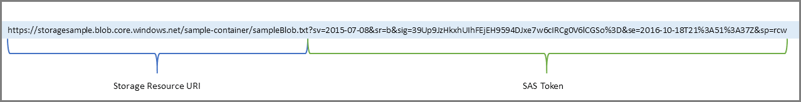

# Службы хранилищ Azure

## Основы учетной записи хранилища Azure

Чтобы начать использовать службу хранилища Azure, сначала создайте учетную запись хранения Azure для хранения объектов данных. Вы можете создать учетную запись хранения Azure с помощью портала Azure, PowerShell или интерфейса командной строки Azure.

Ваша учетная запись хранения будет содержать все объекты данных службы хранилища Azure, такие как большие двоичные объекты, файлы и диски.

Примечание: Виртуальные машины Azure используют дисковое хранилище Azure для хранения виртуальных дисков. Однако вы не можете использовать дисковое хранилище Azure для хранения диска вне виртуальной машины.
 

Учетная запись хранения предоставляет уникальное пространство имен для данных службы хранилища Azure, доступное из любой точки мира по протоколам HTTP или HTTPS. Данные в этой учетной записи безопасны, высокодоступны, долговечны и масштабируемы.

## Основы дискового хранилища

Дисковое хранилище предоставляет диски для виртуальных машин Azure. Приложения и другие службы могут получать доступ к этим дискам и использовать их по мере необходимости, аналогично тому, как это было бы в локальных сценариях. Дисковое хранилище позволяет постоянно хранить данные и получать к ним доступ с подключенного виртуального жесткого диска.

Диски бывают разных размеров и уровней производительности, от твердотельных накопителей (SSD) до традиционных вращающихся жестких дисков (HDD), с различными уровнями производительности. Можно использовать стандартные SSD и HDD диски для менее важных рабочих нагрузок, SSD-диски премиум-класса для критически важных производственных приложений и ультрадиски для рабочих нагрузок с интенсивным использованием данных, таких как SAP HANA, базы данных верхнего уровня и рабочие нагрузки с большим количеством транзакций. Azure последовательно обеспечивает надежность корпоративного уровня для дисков инфраструктуры как услуги (Iaas) с ведущим в отрасли показателем отказов 0% в годовом исчислении.

На следующем рисунке показана виртуальная машина Azure, которая использует отдельные диски для хранения разных данных.
 

## Основы хранилища BLOB-объектов Azure

Хранилище BLOB-объектов Azure — это решение для хранения объектов в облаке. Он может хранить огромные объемы данных, таких как текстовые или двоичные данные. Хранилище BLOB-объектов Azure является неструктурированным, что означает, что нет никаких ограничений на типы данных, которые оно может содержать. Хранилище BLOB-объектов может управлять одновременными загрузками, огромными объемами видеоданных, постоянно растущими файлами журналов и может быть достигнуто из любого места с подключением к Интернету.

Большие двоичные объекты не ограничиваются распространенными форматами файлов. Большой двоичный объект может содержать гигабайты двоичных данных, перемещаемых из научного инструмента, зашифрованное сообщение для другого приложения или данные в пользовательском формате для разрабатываемого приложения. Одним из преимуществ хранилища BLOB-объектов по сравнению с дисковым хранилищем является то, что оно не требует от разработчиков думать о дисках или управлять ими; данные загружаются в виде больших двоичных объектов, и Azure заботится о потребностях в физическом хранилище.

Хранилище BLOB-объектов идеально подходит для:

- Доставка изображений или документов непосредственно в браузер.

- Хранение файлов для распределенного доступа.

- Потоковое видео и аудио.

- Хранение данных для резервного копирования и восстановления, аварийного восстановления и архивирования.

- Хранение данных для анализа локальной службой или службой, размещенной в Azure.

- Хранение до 8 ТБ данных для виртуальных машин.

Вы храните большие двоичные объекты в контейнерах, что помогает организовать большие двоичные объекты в зависимости от потребностей вашего бизнеса.

## Основы файлового хранилища Azure

Файлы Azure предлагают полностью управляемые общие файловые ресурсы в облаке, доступные через стандартные протоколы блокировки сообщений сервера и предварительной версии сетевой файловой системы. Файловые ресурсы Azure можно подключать одновременно с помощью облачных или локальных развертываний Windows, Linux и macOS. Приложения, работающие на виртуальных машинах Azure или в облачных службах, могут подключать общую папку хранилища файлов для доступа к файловым данным так же, как классическое приложение подключает обычную общую папку SMB. Любое количество виртуальных машин или ролей Azure может одновременно подключать и получать доступ к общей папке хранилища файлов. Типичными сценариями использования могут быть обмен файлами в любой точке мира, диагностическими данными или данными приложений.

Используйте файлы Azure в следующих ситуациях.

- Многие локальные приложения используют общие файловые ресурсы. Файлы Azure упрощают перенос тех приложения, которые совместно используют данные, в Azure. Если вы подключите общую папку Azure к той же букве диска, которую использует локальное приложение, часть приложения, которая обращается к общей папке, должна работать с минимальными изменениями, если таковые имеются.

- Храните конфигурационные файлы в общей папке и получайте к ним доступ с нескольких виртуальных машин. Инструменты и утилиты, используемые несколькими разработчиками в группе, могут храниться в общей папке, гарантируя, что все смогут их найти и что они используют одну и ту же версию.

- Записывайте данные в общую папку, а затем обрабатывайте или анализируйте данные. Например, это может потребоваться с помощью журналов диагностики, метрик и аварийных дампов.

На следующем рисунке показаны файлы Azure, используемые для обмена данными между двумя географическими регионами. Файлы Azure обеспечивают шифрование данных при передаче, а протокол SMB обеспечивает шифрование данных при передаче.

Одна вещь, которая отличает Файлы Azure от файлов в корпоративном файловом ресурсе, заключается в том, что вы можете получить доступ к файлам из любой точки мира, используя URL-адрес, указывающий на файл. Маркеры подписи общего доступа (SAS) также можно использовать для разрешения доступа к частному ресурсу в течение определенного периода времени.

Ниже приведен пример URI SAS службы, показывающий URI ресурса и маркер SAS:
 

## Общие сведения об уровнях доступа к BLOB-объектам

Данные, хранящиеся в облаке, могут расти экспоненциальными темпами. Чтобы управлять затратами на растущие потребности в хранении, полезно организовать данные на основе таких атрибутов, как частота доступа и запланированный период хранения. Данные, хранящиеся в облаке, могут отличаться в зависимости от того, как они генерируются, обрабатываются и доступны в течение всего срока службы. Некоторые данные активно доступны и изменяются на протяжении всего срока их существования. Доступ к некоторым данным часто осуществляется в начале их существования, при этом доступ резко падает по мере старения данных. Некоторые данные остаются бездействующими в облаке и редко, если вообще когда-либо, доступны после их хранения. Чтобы удовлетворить эти различные потребности в доступе, Azure предоставляет несколько уровней доступа, которые можно использовать для балансировки затрат на хранилище с потребностями в доступе.

Служба хранилища Azure предлагает различные уровни доступа для хранилища BLOB-объектов, помогая хранить объектные данные наиболее экономичным способом. Доступны следующие уровни доступа:

- **Уровень горячего доступа**: оптимизирован для хранения данных, к которым часто обращаются (например, изображений для вашего сайта).

- **Уровень холодного доступа**: оптимизирован для данных, к которым редко обращаются и которые хранятся не менее 30 дней (например, счета для ваших клиентов).

- **Уровень архивного доступа**: подходит для данных, к которым редко обращаются и которые хранятся не менее 180 дней, с гибкими требованиями к задержке (например, долгосрочные резервные копии).

К различным уровням доступа относятся следующие соображения.

- На уровне учетной записи можно установить только горячий и холодный уровни доступа. Уровень доступа к архиву недоступен на уровне учетной записи.

- Горячий, холодный и архивный уровни могут быть установлены на уровне больших двоичных объектов, во время загрузки или после загрузки.

- Данные на уровне холодного доступа могут выдерживать немного более низкую доступность, но по-прежнему требуют высокой надежности, задержки извлечения и характеристик пропускной способности, аналогичных «горячим данным». Для холодных данных несколько более низкое соглашение об уровне обслуживания (SLA) и более высокие затраты на доступ по сравнению с «горячими» данными являются приемлемыми компромиссами для снижения затрат на хранение.

- Архивное хранилище хранит данные в автономном режиме и предлагает самые низкие затраты на хранение, но также и самые высокие затраты на доступ к данным.

На следующем рисунке показан выбор между «горячим» и «холодным» уровнями доступа в учетной записи хранения общего назначения.
 

