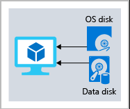
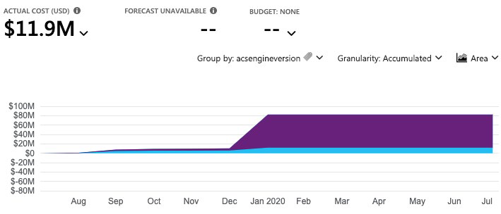

# Цены и жизненный цикл Azure 

## Введение в планирование и управление затратами 

В этом модуле вы узнаете об основных факторах, влияющих на стоимость работы в облаке. По путивы получите практический опыт работы с некоторыми инструментами, которые вы можете использовать для оценки затрат на выполнение рабочих нагрузок в Azure, чтобы помочь обеспечить чтобы вы оставались в рамках бюджета и использовали только то, что вам нужно.

### Приобретение служб Azure и использование калькулятора цен 

В этом блоке вы узнаете, как приобрести службы Azure и получить представление о других факторах, влияющих на стоимость.

Вы встречаетесь со своим финансовым директором и некоторыми руководителями команды. Вы узнаете о некоторых ассумп-тионах, которые вы пропустили. Вы смогли быстро обновить свои общие предполагаемые расходы с помощью калькулятора совокупной стоимости владения (TCO). 

В ходе встречи возникли некоторые новые вопросы, поскольку обсуждение движется в сторону миграции в облако: 

- Какие типы подписок Azure доступны?

- Как мы приобретаем службы Azure? 

- Влияет ли местоположение или сетевой трафик на стоимость?

- Какие еще факторы влияют на конечную стоимость?

- Как мы можем получить более подробную оценку стоимости запуска в Azure?

Важно узнать, как формируются затраты в Azure, чтобы вы могли понять, как ваши решения о покупке и проектировании решений могут повлиять на конечную стоимость. Вы согласны исследовать эти вопросы, поэтому давайте рассмотрим каждый из них более подробно.
 
#### Какие типы подписок Azure можно использовать?

Вы, наверное, знаете, что подписка Azure предоставляет доступ к ресурсам Azure, таким как виртуальные машины (виртуальные машины), хранилище и базы данных. Типы ресурсов, которые вы используете, влияют на ваш ежемесячный счет.

Azure предлагает как бесплатные, так и платные варианты подписки в соответствии с вашими потребностями и требованиями. Это: 

- **Бесплатная пробная версия** Бесплатная пробная подписка предоставляет вам 12 месяцев популярных бесплатных служб, кредит на изучение любой службы Azure в течение 30 дней и более 25 служб которые всегда бесплатны. Службы Azure отключаются по окончании пробной версии или по истечении срока действия кредита на платные продукты, если вы не перейдете на платную подписку.

- **Оплата по мере использования** Подписка с оплатой по мере использования позволяет вам оплачивать то, что вы используете, прикрепляя кредитную или дебетовую карту к своей учетной записи. Организации могут подать заявку на оптовые скидки и предоплаченное выставление счетов. 

- **Участник предлагает** существующее членство в определенных продуктах и службах Майкрософт, которые могут предоставить вам кредиты для вашей учетной записи Azure и сниженные тарифы на службы Azure. Например, предложения участников доступны подписчикам Visual Studio, участникампартнерской сети Майкрософт, участникамMicrosoft for Startups и участникам Microsoft Imagine. 

#### Как приобрести службы Azure?

Существует три основных способа приобретения служб в Azure. Это: 

- **Через соглашение Enterprise** Крупные клиенты, известные как корпоративные клиенты, могут подписать корпоративное соглашение с корпорацией Майкрософт. Это соглашение обязывает их тратить заранее определенную сумму на службы Azure в течение трех лет. Сервисный сбор обычно оплачивается ежегодно. Как клиент Соглашения Enterprise, вы получите лучшие индивидуальные цены в зависимости от видов и объемов услуг, которые вы планируете использовать.

- **Непосредственно из Интернета** Здесьвы приобретаете службы Azure непосредственно на веб-сайте портала Azure и платите стандартные цены. Счет выставляется ежемесячно, как оплата кредитной картой или через счет.. Этот метод покупки называется Web Direct.

- **Через поставщика облачных решений** Поставщик облачных решений (CSP) — это партнер Майкрософт, который помогает создавать решения на основе Azure. CSP выставляет счет за использование Azure по цене, которую они определяют. Они также отвечают на ваши вопросы поддержки и по мере необходимости переходят в корпорацию Майкрософт. 

Вы можете вызвать или подготовить ресурсы Azure на портале Azure или из командной строки. Портал Azure упорядочивает продукты и службы по категориям. Вы выбираете услуги, которые соответствуют вашим потребностям. Счет за вашу учетную запись выставляется в соответствии с моделью Azure "оплата за то, что вы используете". 

Ниже приведен пример, на примере портала Azure. 
 

В конце каждого месяца вам выставляется счет за то, что вы использовали. В любое время вы можете проверить страницу управления затратами и выставления счетов на портале Azure, чтобы получить сводку о текущем использовании и просмотреть предыдущие счета-фактуры. месяцев.

#### Какие факторы влияют на стоимость?

Общие факторы использования ресурсов, тип подписки и цены от сторонних поставщиков. Давайте кратко рассмотрим каждый изних.

##### Тип ресурса

На стоимость ресурсов Azure влияет ряд факторов. Они зависят от типа ресурса или от того, как вы его настраиваете. 

Например, с помощью учетной записи хранения вы указываете тип (например, блочное хранилище BLOB-объектов или хранилище таблиц), уровень производительности (стандартный или расширенный) и уровень доступа (горячий, холодный или архивный). Эти варианты представляют разные затраты.

##### Измерители использования

При подготовке ресурса Azure создает счетчики для отслеживания использования этого ресурса. Azure использует эти счетчики для создания записи об использовании, которая впоследствии будет использоваться для расчета счета.

Подумайте о счетчиках использования, похожих на то, как вы используете электричество или воду в своем доме. Вы можете платить базовую цену каждый месяц за электричество или водоснабжение, но ваш окончательный счет основан на общей сумме, которую вы потребили.

Давайте рассмотрим одну виртуальную машину в качестве примера. Следующие виды счетчиков имеют отношение к отслеживанию его использования:

- Общее время процессора. 

- Время, проведенное с публичным IP-адресом. 

- Входящий (входящий) и исходящий (исходящий) сетевой трафик в виртуальной машине и из нее. 

- Размер диска и количество операций чтения и записи диска.
 
Каждый метр отслеживает определенный тип использования. Например, измеритель может отслеживать использование полосы пропускания (входящий или исходящий сетевой трафик в битах в секунду), количество операций или его размер (емкостьхранилища в байт).

Использование, которое отслеживает счетчик, коррелирует с количеством оплачиваемых единиц. Эти единицы списываются с вашей учетной записи за каждый расчетный период. Тариф за оплачиваемую единицу зависит от типа ресурса, который вы используете .

##### Использование ресурсов

В Azure плата всегда взимается в зависимости от того, что вы используете. В качестве примера рассмотрим, как это выставление счетов применяется к освобождению виртуальной машины.

В Azure можно удалить или освободить виртуальную машину. Удаление виртуальной машины означает, что она вам больше не нужна. Виртуальная машина удаляется из подписки, а затем подготавливается для другого клиента. 

Ограждающая виртуальная машина означает, что она больше не работает. Но связанные жесткие диски и данные по-прежнему хранятся в Azure. Виртуальная машина не назначается ЦП или сети в центре обработки данных Azure, поэтому она не создает затраты, связанные с временем вычислений или IP-адресом виртуальной машины. Поскольку диски и данные по-прежнему хранятся, а ресурс присутствует в подписке Azure, вам по-прежнему выставляется счет за дисковое хранилище.

Оделание виртуальной машины, когда вы не планируете использовать ее в течение некоторого времени, является лишь одним из способов минимизации затрат. Например, вы можете освободить виртуальные машины, используемые для тестирования в выходные дни, когда ваша команда тестирования их не использует. Вы узнаете больше о способах минимизации затрат позже в этом модуле.

##### Типы подписок Azure

Некоторые типы подписок Azure также включают квоты на использование, которые влияют на затраты.

Например, бесплатная пробная подписка Azure предоставляет доступ к ряду продуктов Azure, которые являются бесплатными в течение 12 месяцев. Он также включает в себя кредит, который можно потратить в течение первых 30 дней после регистрации. И вы получаете доступ к более чем 25 продуктам, которые всегда бесплатны (в зависимости от наличия ресурса и региона). 

##### Azure Marketplace

Вы также можете приобрести решения и службы на основе Azure у сторонних поставщиков через Azure Marketplace. Примерами могут быть управляемые сетевые брандмауэры или соединители со сторонними службами резервного копирования. Структуры выставления счетов устанавливаются поставщиком. 

#### Влияет ли местоположение или сетевой трафик на стоимость?

При подготовке ресурса в Azure необходимо определить расположение (известное как регион Azure), в котором он будет развернут. Давайте разберемся, почему это решение может иметь последствия для затрат. 

##### Местоположение

Инфраструктура Azure распределена по всему миру, что позволяет развертывать службы централизованно или размещать службы ближе всего к тому места, где их используют ваши клиенты. 

Разные регионы могут иметь разные связанные цены. Поскольку географические регионы могут влиять на то, где проходит сетевой трафик, сетевой трафик также влияет на стоимость. 

##### Зоны для тарификации сетевого трафика

Зоны выставления счетов являются фактором, определяющим стоимость некоторых служб Azure. 

[Bandwidth](https://azure.microsoft.com/pricing/details/bandwidth?azure-portal=true) относится к данным, перемещаемым в центры обработки данных Azure и из него. Некоторые входящие передачи данных (данные, идущие в центры обработки данных Azure) бесплатны. Для исходящей передачи данных (данные, выходящие из центров обработки данных Azure) цены на передачу данных основаны на зонах. 

 

Зона — это географическая группировка регионов Azure для выставления счетов. Следующие зоны включают в себя некоторые регионы, как показано здесь:

- Зона 1: Центральная Австралия, Запад США, Восток США, Западная Канада, Западная Европа, Центральная Франция и другие

- Зона 2: Восточная Австралия, Западная Япония, Центральная Индия, Южная Корея и другие

- Зона 3: Южная Бразилия, Южная Африка Север, Южная Африка Запад, ОАЭ Центральный, ОАЭ Север

- DE Зона 1: Центральная Германия, Северо-Восток Германии

#### Как я могу оценить общую стоимость?

Как вы узнали, точная оценка затрат учитывает все предыдущие факторы. К счастью, калькулятор цен Azure поможет вам в этом процессе.

Калькулятор цен отображает продукты Azure в категориях. Вы добавляете эти категории в свою оценку и настраиваете в соответствии с вашими конкретными требованиями. Затем вы получаете консолидированную оценочную цену с подробной разбивкой затрат, связанных с каждым ресурсом, добавленным в решение. Вы можете экспортировать или поделиться этой оценкой или сохранить ее для последующего использования. Можно загрузить сохраненную оценку и изменить ее в соответствии с обновленными требованиями. 

Вы также можете получить доступ к сведениям о ценах, сведениям о продукте и документации по каждому продукту из калькулятора цен. 
 

 
Параметры, которые можно настроить в калькуляторе цен, различаются в зависимости от продукта, но они могут включать:

- **Регион** Регион — это географическое положение, в котором вы можете предоставлять услугу. Юго-Восточная Азия, Центральная Канада, Западная часть Соединенных Штатов и Северная Европа являются несколькими примерами.

- **Уровни** уровня, такие как уровень "Бесплатный" или Базовый, имеют разные уровни доступности или производительности и различные связанные с этим затраты.

- **Параметры выставления счетов** Параметры выставления счетов выделяют различные способы оплаты услуги. Параметры могут варьироваться в зависимости от типа клиента и типа подписки и могут включать параметры для экономии затрат.

- **Варианты поддержки** Эти опции позволяют выбрать дополнительные варианты ценообразования поддержки для определенных услуг.

- **Программы и предложения** Ваш клиент или тип подписки может позволить вам выбирать из определенных программ лицензирования или других предложений.

- **Цены на разработку и тестирование Azure** Этот параметр отображает доступные цены на рабочие нагрузки разработки и тестирования. Ценына разработку и тестирование применяются при запуске ресурсов в рамках подписки Azure, основанной на предложении разработкии тестирования. 

Имейте в виду, что калькулятор ценообразования предоставляет оценки, а не фактические ценовые предложения. Фактические цены могут варьироваться в зависимости от даты покупки, валюты платежа, которую вы используете, и типа клиента Azure, которым вы являетесь.

### Калькулятор совокупной стоимости владения

Наличие твердого понимания того, где находится компания сегодня, даст ей большее представление о том, что означает миграция в облако с точки зрения стоимости. 

В этом устройствевы увидите, как калькулятор совокупной стоимости владения (TCO) может помочь вам сравнить стоимость работы в центре обработки данных с работой в Azure .

#### Что такое калькулятор совокупной стоимости владения?

[Калькулятор совокупной стоимости владения](https://azure.microsoft.com/pricing/tco/calculator?azure-portal=true) помогает оценить экономию средств при эксплуатации решения в Azure с течением времени, а не в локальном центре обработки данных. 

Термин общая стоимость владения обычно используется в финансах. Может быть трудно увидеть все скрытые затраты, связанные с эксплуатацией технологической возможности локально. Лицензии на программное обеспечение и оборудование являются дополнительными расходами.

С помощью калькулятора совокупной стоимости владения вы вводите сведения о локальных рабочих нагрузках. Затем вы просматриваете предлагаемые средние затраты по отрасли (которые вы можете скорректировать) для связанных эксплуатационных расходов. Эти затраты включают в себя электроэнергию, обслуживание сети и ИТ-труд. Затем вам будет представлен параллельный отчет. С помощью отчета можно сравнить эти затраты с теми же рабочими нагрузками, которые выполняется в Azure.

На следующем рисунке показан один пример. 

 

**Прим.**: Для работы с калькулятором совокупной стоимости владения подписка Azure не требуется. 

#### Как работает калькулятор совокупной стоимости владения?

Работа с калькулятором совокупной стоимости владения включает в себя три этапа:

- Определите свои рабочие нагрузки.
 
- Скорректируйте предположения.

- Просмотр отчета. 

- Давайте подробнее рассмотрим каждый шаг.

##### Шаг 1. Определение рабочих нагрузок

Сначала необходимо ввести спецификации локальной инфраструктуры в калькулятор совокупной стоимости владения на основе следующих четырех категорий:

- **Серверы** Эта категория включает операционные системы, методы виртуализации, ядрапроцессора и память (ОЗУ). 

- **Базы данных** Эта категория включает типы баз данных, серверное оборудование и службу Azure, которую вы хотите использовать, которая включает ожидаемое максимальное количество одновременных входов пользователей. 

- **Хранение** Эта категория включает в себя тип хранилища и емкость, которая включает в себя любое резервное или архивное хранилище.

- **Сеть** Эта категория включает в себя пропускную способность сети, которую вы в настоящее время используете в локальной среде. 

##### Шаг 2: Корректировка допущений

Затем укажите, зарегистрированы ли текущие локальные лицензии для [Software Assurance](https://www.microsoft.com/licensing/licensing-programs/software-assurance-default?azure-portal=true), что может сэкономить деньги за счет повторного использования этих лицензий в Azure. Вы также указываете, нужно ли реплицировать хранилище в другой регион Azure для большей избыточности.

Затем вы можете увидеть ключевые предположения об эксплуатационных расходах в нескольких различных областях, которые различаются между командами и организациями. Эти расходы были сертифицированы Nucleus Research, независимой исследовательской компанией. Например, эти расходы включают в себя:

- Цена электроэнергии за киловатт-час (кВт-ч). 

- Почасовая оплата за ИТ-администрирование. 

- Стоимость обслуживания сети в процентах от затрат на сетевое оборудование и программное обеспечение. 

Чтобы повысить точность результатов калькулятора совокупной стоимости владения, необходимо настроить значения таким образом, чтобы они соответствовали затратам текущей локальной инфраструктуры.

##### Шаг 3: Просмотр отчета

Выберите временные рамки от одного до пяти лет. Калькулятор совокупной стоимости владения создает отчет, основанный на введенной вами информации. Вот пример:
 

Для каждой категории (вычислительные ресурсы, центр обработки данных, сети, системы хранения данных и ИТ-трудозатраты) можно также просмотреть параллельное сравнение разбивки затрат на эксплуатацию этих рабочих нагрузок. локальные и работающие с ними в Azure. Вот пример: 

Вы можете загрузить, поделиться или сохранить этот отчет для последующего просмотра. 

### Управление и минимизация общих затрат в Azure

Вот некоторые рекомендуемые практики, которые могут помочь вам минимизировать ваши расходы.

#### Понимание предполагаемых затрат перед развертыванием 

Чтобы помочь вам спланировать решение в Azure, тщательно рассмотрите необходимые продукты, службы и ресурсы. Прочитайте соответствующую документацию, чтобы понять, как каждый из ваших вариантов измеряется и оплачивается. 

Рассчитайте прогнозируемые затраты с помощью калькулятора ценообразования и калькулятора совокупной стоимости владения (TCO). Добавляйте только продукты, услуги и ресурсы, необходимые для решения. 

#### Использование помощника Azure для мониторинга использования

В идеале вы хотите, чтобы подготовленные ресурсы соответствовали вашему фактическому использованию.

Советник azure выявляет неиспользуемые или недостаточно используемые ресурсы и рекомендует неиспользуемые ресурсы, которые можно удалить. Эти сведения помогут настроить ресурсы в соответствии с фактической рабочей нагрузкой.

На следующем рисунке показаны некоторые примеры рекомендаций от помощника Azure:
 

Рекомендации сортируются по воздействию: высокое, среднее или низкое. В некоторых случаяхсоветник Azure может автоматически устранить или исправить основную проблему. Другие проблемы, такие как два, которые перечислены как высокоэффективные, требуют вмешательства человека. 

#### Используйте лимиты расходов, чтобы ограничить свои расходы

Если у вас есть бесплатная пробная версия или подписка Azure на основе кредита, вы можете использовать лимиты расходов, чтобы предотвратить случайное переполнение.

Например, когда вы тратите все кредиты, включенные в бесплатную учетную запись Azure, развернутые ресурсы Azure удаляются из рабочей среды и виртуальных машин Azure. (Виртуальные машины) останавливаются и освобождается. Данные в учетных записях хранения доступны только для чтения. На этом этапе вы можете обновить бесплатную пробную подписку до подпискис оплатой по мере установки. 

Если у вас есть подписка на основе кредита и вы достигли настроенного лимита расходов, Azure приостанавливает подписку до началанового расчетного периода. 

Связанной концепцией является квоты или ограничения на количество аналогичных ресурсов, которые можно подготовить в рамках подписки. Например, можно выделить до 25 000 виртуальных машин на регион. Эти ограничения в основном помогают Microsoft планировать емкость своего центра обработки данных. 

#### Использование резерваций Azure для предоплаты

Службы бронирования Azure предлагают скидки на определенные службы Azure. Резервации Azure могут сэкономить до 72 процентов по сравнению с ценами с оплатой по мере службы. Чтобы получить скидку, вы резервируете услуги и ресурсы, оплатив заранее.

Например, можно внести предоплату за один или три года использования виртуальных машин, вычислительной емкостибазы данных, пропускной способности базы данных и других ресурсов Azure. 

В следующем примере показана предполагаемая экономия на виртуальных машинах. В этом примере вы экономите примерно 72 процента, взяв на себя обязательство на трехлетний срок.

 
Резервации Azure доступны клиентам с соглашением Enterprise, поставщиками облачных решений и подпискамис оплатой по мере поступления.

#### Выбирайте недорогие локации и регионы

Стоимость продуктов, служби ресурсов Azure может варьироваться в зависимости от расположения и региона. Если возможно, вы должны использовать их в тех местах и регионах, где они стоят дешевле.

Но помните, что некоторые ресурсы измеряются и оплачиваются в зависимости от того, сколько исходящей (исходящей) пропускной способности чистой работы они потребляют. Следует подготовить подключенные ресурсы с лимитом ширины полосы в одном регионе Azure, чтобы уменьшить исходящий трафик между ними. 

#### Изучите доступные предложения по экономии средств

Будьте в курсе последних предложений клиентов и подписок Azure и переключайтесь на предложения, которые обеспечивают наибольшую экономию средств. 

#### Использование Azure Управление затратами + Выставление счетов для контроля расходов

Azure Cost Management + Billing — это бесплатная служба, которая помогает понять счетAzure, управлять учетной записью и подписками, отслеживать и контролировать расходыAzure, а также оптимизировать использованиересурсов.

На следующем рисунке показано текущее использование с разбивкой по службам: 
 

 
В этом примере служба приложений Azure, служба размещения веб-приложений, генерирует наибольшую стоимость.

Функции управления затратами и выставления счетов Azure включают в себя:

- **Отчетность** Используйте исторические данные для создания отчетов и прогнозирования будущего использования и расходов.

- **Обогащение данных** Повышение подотчетности путем категоризации ресурсов с тегами, которые соответствуют реальным бизнес-подразделениям и организационным подразделениям.

- **Бюджеты** Создание и управление бюджетами затрат и использования путем мониторинга тенденций спроса на ресурсы, темпов потребления и моделей затрат. 

- **Оповещения** Получайте оповещения на основе ваших затрат и бюджетов использования. 

- **Рекомендации** Получите рекомендации по устранению простаивающего использования ресурсов и оптимизации ресурсов Azure, которые вы предоставляете. 

#### Применение тегов для идентификации владельцев затрат

Теги помогают управлять расходами, связанными с различными группами продуктов и ресурсов Azure. Вы можете применять теги к группам ресурсов Azure для организации платежных данных.

 Например, если вы запускаете несколько виртуальных машин для разных групп,вы можете использовать теги для категоризации затрат по отсещению, например по отделу кадров, маркетингу или финансам, или по среде. , например Тест или Производство.

Теги упрощают определение групп, которые генерируют наибольшие затраты наAzure, что может помочь вам соответствующим образом скорректировать свои расходы. 

На следующем рисунке показан годовой период использования с разбивкой по тегам на странице Azure "Управление затратами + выставление счетов". 
 

#### Измечайте размер недостаточно используемых виртуальных машин

В разделе Azure Cost Management + Billing и Azure Advisor рекомендуется изменить размер или завершить работу виртуальных машин, которые недостаточно используются или простаивают.

В качестве примера предположим, что у вас есть виртуальная машина размером Standard_D4_v4, тип виртуальной машины общего назначения с четырьмя виртуальными процессорами и 16 ГБ памяти. Вы можете обнаружить, что эта виртуальная машина простаивает 90 процентов времени. 

Затраты на виртуальные машины являются линейными и удваиваются для каждого размера, большего в той же серии. Таким образом, в этом случае, если вы уменьшите размер виртуальной машины с Standard_D4_v4 до Standard_D2_v4, что на следующий размер меньше, вы уменьшите свои вычислительные затраты на 50 процентов.

На следующем рисунке показана эта идея: 

Имейте в виду, что изменение размера виртуальной машины требует ее остановки, изменение размера и последующего перезапуска. Этот процесс может занять несколько минут в зависимости от того, насколько значительным является изменение размера. Убедитесь, что вы правильно спланируете сбой или переместите трафик на другой экземпляр во время выполнения операций по изменению размера. 

#### Ополкомите виртуальные машины в нерабочее время 

Напомним, что освободить виртуальную машину означает больше не запускать виртуальную машину, а сохранить связанные жесткие диски и данные в Azure.

Если у вас есть рабочие нагрузки виртуальных машин, которые используются только в определенные периоды, но вы запускаете их каждый час каждого дня, вы тратите деньги впустую. Эти виртуальные машины являются отличными кандидатами для завершения работы, когда они не используются, и запуска обратно, когда они вам нужны, экономя вычислительные расходы, пока виртуальная машина освобождена.

Такой подход является отличной стратегией для сред разработки и тестирования, где виртуальные машины нужны только в рабочее время. Azure даже предоставляет способ автоматического запуска и остановки виртуальных машин по расписанию. 

#### Удаление неиспользуемых ресурсов

Эта рекомендация может показаться очевидной, но если вы не используете ресурс, вы должны закрыть его. Нередко можно найти непроизводственные или концептуальные системы, которые больше не нужны после завершения проекта.

Регулярно проверяйте свою среду и работайте над идентификацией этих систем. Отключение этих систем может иметь двойное преимущество, экономя на затратах на инфраструктуру и потенциальной экономии на лицензировании и эксплуатационных расходах.
 
#### Миграция с IaaS на службы PaaS 

По мере перемещения рабочих нагрузок в облако естественная эволюция заключается в том, чтобы начать с сервисов инфраструктуры как услуги (IaaS), поскольку они более непосредственно соотносятся с концепциями и операции, с которыми вы уже знакомы. 

Со временем одним из способов снижения затрат является постепенное перемещение рабочих нагрузок IaaS для запуска на платформа как услуга (PaaS). Хотя IaaS можно думать как о прямом доступе к вычислительной инфраструктуре, PaaS предоставляет готовые среды разработки и развертывания, управляемые для вас.

В качестве примера предположим, что SQL Server запускается на виртуальной машине, работающей в Azure. Эта конфигурация требует управления базовой операционной системой, настройки лицензииSQL Server, управления программным обеспечением и обновлениями безопасности и т. д.. Вы также платите за виртуальную машину независимо от того, обрабатывает ли база данных запросы. Одним из способов потенциальной экономии затрат является перемещение базы данных с SQL Server на виртуальной машине в Базу данных SQL Azure. База данных SQL Azure основана на SQL Server.

Мало того, что службы PaaS, такие как База данных SQL Azure, часто дешевле в запуске, но поскольку они управляются для вас, вам не нужно беспокоиться об обновлениях программного обеспечения. исправления безопасности или оптимизация физического хранилища для операций чтения и записи. 

#### Экономия на лицензионных расходах

Лицензирование — это еще одна область, которая может существенно повлиять на ваши расходы на облако. Давайте рассмотрим некоторые способы снижения затрат на лицензирование. 

##### Выбирайте экономичные операционные системы

Многие службы Azure предоставляют возможность запуска в Windows или Linux. В некоторых случаях стоимость зависит от того, какой вы выберете. Когда у вас есть выбор, и ваше приложение не зависит от базовой операционной системы, полезно сравнить цены, чтобы увидеть, можете ли вы сэкономить деньги .

##### Использование преимущества гибридного использования Azure для перепрофилировать лицензии на программное обеспечение в Azure

Если вы приобрели лицензии для Windows Server или SQL Server и на ваши лицензии распространяется [Software Assurance](https://www.microsoft.com/licensing/licensing-programs/software-assurance-default?azure-portal=true), вы можете перепрофилировать эти лицензии на виртуальных машинах в Azure.

Некоторые детали различаются между Windows Server или SQL Server. В конце этого модуля мы предоставим ресурсы, где вы сможете узнать больше.

## Соглашения об уровнях обслуживания Azure и жизненных циклах служб

В этом модуле вы узнаете о соглашениях об уровне обслуживания (SLA) в Azure и о том, как они могут повлиять на решенияпо проектированию приложений. Вы также узнаете о жизненном цикле новых служб Azure , от предварительной версии до общедоступной версии.

### Соглашения об уровне обслуживания(SLA) 

Соглашение об уровне обслуживания (SLA) — это официальное соглашение между сервисной компанией и клиентом. Для Azure это соглашение определяет стандарты производительности, которые корпорация Майкрософт обязуется соблюдать для вас, custom-er.

В этой части вы узнаете больше об условиях SLA Azure, в том числе о том, почему SLA важны, где можно найти SLA для конкретной службы Azure и что вы будете делать. найти в типичном SLA. 

#### Почему важны SLA? 

Понимание соглашений об УКЛ для каждой службы Azure, которую вы используете, помогает понять, на какие гарантии можно рассчитывать.

При построении приложений в Azure доступность используемых служб влияет на производительность приложения. Понимание соглашений об услугой может помочь вам установить SLA, которое вы устанавливаете для своих клиентов.

Далее в этом модулевы узнаете о некоторых стратегиях, которые можно использовать, когда azure SLA не соответствует вашим потребностям.

#### Где можно получить доступ к службам SLA для служб Azure? 

Доступ к соглашениям об уровне обслуживания можно получить из [соглашений об уровне обслуживания](https://azure.microsoft.com/support/legal/sla/?azure-portal=true).

**Прим.**: Для просмотра соглашения об обслуживании служб подписка Azure не требуется. 

Каждая служба Azure определяет собственное соглашения об обслуживании. Службы Azure организованы по категориям .

Откройте SLA для базы данных Azure для MySQL, управляемой базы данных, которая упрощает разработчикам работу с базами данных MySQL. Вы вернетесь к этому соглашению об обратном соглашении через мгновение.

Для этого: 

1. Перейдите в перейти в [соглашение об уровне обслуживания](https://azure.microsoft.com/support/legal/sla/?azure-portal=true).

2. В категории Базы данных выберите База данных Azure для MySQL.
 

 
#### Что есть в типичном SLA? 

Типичное SLA разбивается на следующие разделы:

- **Введение** В этом разделе объясняется, чего ожидать в соглашении об уровне sla, включая его область применения и то, как продление подписки может повлиять на условия.

- **Общие термины** Этот раздел содержит термины, которые используются во всем соглашении об УКЛ, чтобы обе стороны (вы и Корпорация Майкрософт) имели согласованный словарный запас. Например, в этом разделе может быть определено, что подразумевается под временем простоя, инцидентами и кодами ошибок. Этот раздел также определяет общие условия соглашения, в том числе как подать претензию, получить кредит за любые проблемыс исполнением или доступностью, а также лимиты договора.

- **Сведения об SLA** В этом разделе определяются конкретные гарантии для службы. Обязательства по результатам обычно измеряются в процентах. Этот процент обычно колеблется от 99,9 процента («три девятки») до 99,99 процента («четыре девятки»). Основное обязательство по производительности обычно фокусируется на времени безотказной работы или проценте времени, в которое продукт или услуга успешно функционируют. Некоторые SLA также фокусируются на других факторах, включая задержку или скорость ответа службы на запрос. В этом разделе также определяются любые дополнительные условия, относящиеся к данной службе.

Найдите время, чтобы просмотреть SLA для базы данных Azure для MySQL.

Вы видите, что это SLA фокусируется в основном на времени безотказной работы. База данных Azure для MySQL гарантирует 99,99% или «четыре девятки», время безотказной работы. Это означает, что служба гарантированно работает и доступна для обработки запросов в 99,99% случаев.

#### Как проценты соотносятся с общим временем простоя?

_Время простоя_ относится к продолжительности недоступности службы. 

Разница между 99,9% и 99,99% может показаться незначительной, но важно понизить, что эти цифры означают с точки зрения общего времени простоя.

Вот таблица, которая даст вам представление о том, как общее время простоя уменьшается по мере увеличения процента SLA с 99% до 99,999%: 

| Процент SLA | Время простоя в неделю | Время простоя в месяц | Время простоя в год |
| --- | --- | --- | --- |
| 99 | 1.68 часов | 7.2 час | 3.65 дней | 
| 99.9 | 10.1 мин.| 43.2 мин | 8.76 часы | 
| 99.95 | 5 минуты | 21.6 минуты | 4.38 часы |
| 99.99 | 1.01 мин. | 4.32 мин. | 52 мин.56 |
| 99.999 | 6 секунд | 25.9 секунды | 5.26 минут |

Эти суммы являются кумулятивными, что означает, что продолжительность нескольких различных отключений услуг будет объединена или с суммирована вместе.

#### Что такое сервисные кредиты?

_Кредит на обслуживание_ - это процент от уплаченных вами сборов, которые зачисляются вам обратно в соответствии с процессом утверждения претензии. 

Соглашения об узле описывают, как корпорация Майкрософт реагирует, когда служба Azure не выполняет свою спецификацию. Например, вы можете получить скидку на счет Azure в качестве компенсации, если служба не выполняет работу в соответствии с ее SLA. 
 
Кредиты обычно увеличиваются по мере уменьшения времени безотказной работы. Ниже приведено применение кредитов для базы данных Azure для

MySQL в соответствии с временем безотказной работы: 

| Ежемесячный процент безотказной работы | Процент кредита на обслуживание |
| --- | --- |
| < 99,99 | 10 |
| < 99 | 25 |
| < 95 | 100 |

#### Что такое SLA для бесплатных услуг?

Бесплатные продукты обычно не имеют соглашения об узле. 

Например, многие службы Azure предоставляют бесплатный или общий уровень, который предоставляет более ограниченные функциональные возможности. Такие службы, как Советник Azure, всегда бесплатны. В [SLA для Azure Advisor](https://azure.microsoft.com/support/legal/sla/advisor/?azure-portal=true) говорится, что, поскольку он бесплатный, он не имеет финансово обеспеченного SLA.

#### Как узнать, что произошел сбой? 

[Состояние Azure](https://status.azure.com/status?azure-portal=true) предоставляет глобальное представление работоспособности служб и регионов Azure. Если вы подозреваете, что произошел сбой, это часто хорошее место для начала расследования.

Состояние Azure предоставляет RSS-канал изменений в работоспособности служб Azure, на которые можно подписаться .

Вы можете подключить этот канал к коммуникационному программному обеспечению, такому как Microsoft Teams или Slack. 

На странице состояния Azure вы также можете получить доступ к работоспособности службы Azure. Это обеспечивает персонализированное представление работоспособности служб Azure и регионов, которые вы используете, непосредственно на портале Azure. 

#### Как запросить кредит на обслуживание в корпорации Майкрософт?

Как правило, для получения кредита на обслуживание необходимо подать претензию в корпорацию Майкрософт. Если вы приобретаете службы Azure у партнерапоставщика облачных решений (CSP), ваш CSP обычно управляет процессом утверждений. 

Каждое состояние SLA определяет сроки, по которым вы должны отправить свою претензию, и когда корпорация Майкрософт обрабатывает вашу претензию. Для многих услуг вы должны подать свою заявку к концу календарного месяца, следующего за месяцем, в котором произошел инцидент. 

Далее, давайте рассмотрим некоторые другие факторы, которые Tailwind Traders должны учитывать, которые могут повлиять на цели SLA perfor-mance. 

### Определение соглашения об узле на узле приложения 

Соглашения об узле приложения определяют требования к соглашениям об узле для конкретного приложения. Этот термин обычно относится к приложению, построенное на Azure . 

Существует множество проектных решений, которые можно принять для повышения доступности и отказоустойчивости применений и служб, создаваемых в Azure. Эти решения выходят за рамки только SLA для конкретной службы. В этой части вы изучите некоторые из этих соображений.

Хорошее место для начала - обсудить с вашей командой, насколько важна доступность каждого приложения для вашего бизнеса. В следующих разделах рассматриваются несколько факторов, которые могут учитывать трейдеры Tailwind. 

#### Влияние на бизнес

Если приложение «Специальные заказы» выйдет из строя, каково будет влияние на бизнес? В этом случае клиенты не могут размещать новые заказы через магазин, а персонал не может проверить статус существующих заказов. Клиентам нужно будет либо повторить попытку позже, либо, возможно, перейти к конкуренту. 

#### Влияние на другие ведения бизнеса 

Приложение «Специальные заказы» не влияет на другие операции. Таким образом, большая часть бизнеса Tailwind Traders будет продолжать нормально функционировать, если приложение Специальные ордера выйдет из строя. 

#### Шаблоны использования

Шаблоны использования определяют, когда и как пользователи получают доступ к приложению. 

Один из вопросов, который следует рассмотреть, заключается в том, отличается ли требование доступности между критическими и некритичными периодами времени. Например, заявление о подаче налоговой декларации не может потерпеть неудачу в течение крайнего срока подачи. 

### Действия, влияющие на SLA

Допустим, что SLA в размере 99,9% является приемлемым для приложения Специальные ордера. 

Напомним, что это дает компании расчетное время простоя в 10,1 минуты в неделю. 

Теперь вам нужно разработать эффективное и надежное решение для этого приложения в Azure, помня об соглашении об УКЛ этого приложения. Вы выберете необходимые продукты и службы Azure и подготовите облачные ресурсы в соответствии с этими требованиями.

В реальности неудачи будут случаться. Аппаратное обеспечение может выйти из строя. Сеть может иметь прерывистые периоды ожидания. Хотя для целой службы или региона редко возникают сбои, вам все равно нужно планировать такие события.

#### Определение рабочих нагрузок

_Рабочая нагрузка_ — это отдельная возможность или задача, которая логически отделена от других задачс точки зрения бизнес-логики и требований к хранению данных. Каждая рабочая нагрузка определяет набор требований к доступности, масштабируемости, согласованности данных и аварийному восстановлению.

В Azure для приложения специальных заказов потребуется: 

- Две виртуальные машины.

- Один экземпляр базы данных SQL Azure. 

- Один экземпляр подсистемы балансировки нагрузки Azure. 

Вот схема, которая показывает базовую архитектуру: 

 

#### Объединение SLA для вычисления составного SLA

После того как вы определили SLA для отдельных рабочих нагрузок в приложении Специальные заказы, вы можете заметить, что эти SLA не все одинаковы . Как это влияет на наше общее требование к соглашению об отказе от приложений в размере 99,9%? Чтобы решить эту задачу, вам нужно будет выполнить некоторые математические расчеты. 

Процесс объединения SLA помогает вычислить составное SLA для набора служб. Для вычисления составного SLA необходимо умножить SLA каждой отдельной службы.

Из [соглашений об уровне обслуживания](https://azure.microsoft.com/support/legal/sla/?azure-portal=true) вы найдете соглашение об уровне обслуживания для каждой необходимой службы Azure. Это: 

| Служба | SLA |
| --- | --- |
| Виртуальные машины Azure | 99,9% | 
| База данных SQL Azure | 99,99% | 
| Балансировщик нагрузки Azure | 99,99% | 

Поэтому для применения специальных заказов составное SLA будет вытекать:

$$99.9\% \раз 99.9\% \раз 99.99\% \раз 99.99\%$$ $$= 0.999 \раз 0.999 \раз 0.9999 \раз 0.9999$$ $$$$ $$= 0.9978$$ $$= 99.78\%$$

Напомним, что вам понадобятся две виртуальные машины. Таким образом, в формулу включается средняя обсядная таблица виртуальных машин в размере 99,9 % два раза. 

Обратите внимание, что, несмотря на то, что все отдельные службы имеют соглашения об уровнях обслуживания, равных или превышающих SLA приложения, их объединение приводит к общему числу, которое ниже, чем 99,9 процента вам нужно. Почему? Потому что использование нескольких сервисов добавляет дополнительный уровень сложности и немного увеличивает риск сбоя.

Здесь вы видите, что составное SLA 99,78% не соответствует требуемому SLA 99,9%. Вы можете вернуться в команду и спросить, приемлемо ли это. Или вы можете внедрить некоторые другие стратегии в свой дизайн, чтобы улучшить это SLA.

#### Что происходит, когда составное SLA не соответствует вашим потребностям?

Для приложения «Специальные заказы» составное SLA не соответствует требуемому SLA в размере 99,9%. 

Давайте рассмотрим несколько стратегий, которые могут рассмотреть Трейдеры Tailwind. 

##### Выберите параметры настройки, которые соответствуют требуемому SLA

Каждая из рабочих нагрузок, определенных ранее, имеет собственное SLA, и выбор настройки, который вы делаете при подготовке каждой рабочей нагрузки, влияет на это SLA. Например:

- **Диски** с виртуальными машинами, вы можете выбрать стандартный управляемый жесткий диск, стандартный управляемый диск SSD или SSD класса Premium или Ultra Disk. SLA для одной виртуальной машины будет составлять 95%, 99,5% или 99,9% в зависимости от выбора диска. 

- **Уровни** Некоторые службы Azure предлагаются как продукт уровня бесплатного пользования, так и как стандартная платная служба. Например, служба автоматизации Azure предоставляет 500 минут выполнения задания в бесплатной учетной записи Azure, но не поддерживается соглашения об узле. Уровень SLA уровня "Стандартный" для службы автоматизации Azure составляет 99,9 процента.

Убедитесь, что при принятии решений о покупке учитывается влияние на условия sLA для выбираемых служб Azure . Это гарантирует, что SLA поддерживает требуемое SLA приложения. 

##### Встройте требования к доступности в свой проект

Существуют рекомендации по проектированию приложений, которые можно использовать и которые относятся к базовой облачной инфраструктуре. 

Например, чтобы улучшить доступность приложения, избегайте наличия каких-либо единичных точек отказа. Таким образом, вместо добавления дополнительных виртуальных машин можно развернуть один или несколько дополнительных экземпляров одной и той же виртуальной машины в разных зонах доступности в тот же регион Azure .

Зона доступности — это уникальное физическое расположение в регионе Azure. Каждая зона состоит из одного или нескольких центров обработки данных, оснащенных независимым питанием, охлаждением и сетью. Эти зоны используют разные расписания обслуживания, поэтому, если затронута одна зона, экземпляр виртуальной машины в другой зоне не будет затронут. 

Развертывание двух или более экземпляров виртуальной машины Azure в двух или более зонах доступности повышает УО ВИРТУАЛЬНЫХ МАШИН до 99,99 процента. Пересчет составного соглашения об укладе службы, приведенного выше, с помощью этого соглашения об узле на виртуальные машины дает вам SLA приложения: 

$$99.99\% \раз 99.99\% \раз 99.99\% \раз 99.99\%$$ $$= 99.96\%$$

Это пересмотренное SLA в размере 99,96 процента превышает ваш целевой показатель в 99,9 процента.

Чтобы узнать больше об УО ДЛЯ виртуальных машин, посетите страницу [SLA для виртуальных машин](https://azure.microsoft.com/support/legal/sla/virtual-machines?azure-portal=true).

##### Включение избыточности для повышения доступности

Чтобы обеспечить высокую доступность, можно запланировать дублирование компонентов приложения в нескольких регионах, называемое избыточностью. И наоборот, чтобы свести к минимуму затраты в некритических периодах, приложение можно запускать только в одном регионе. Трейдеры Tailwind могут рассмотреть это, если есть тенденция, что ставки специальных ордеров намного выше в определенные месяцы или сезоны. 

Чтобы обеспечить максимальную доступность в приложении, добавьте избыточность к каждой части приложения. Эта избыточность включает в себя само приложение, а также базовые службы и инфраструктуру. Имейте в виду, однако, что это может быть сложно и дорого, и часто приводит к решениям, которые являются более сложными, чем они должны быть.

Подумайте, насколько важна высокая доступность для ваших требований, прежде чем добавлять избыточность. Могут быть более простые способы выполнения SLA приложения. 

##### Очень высокая производительность трудно достичь

Целевые показатели выше 99,99 процента очень трудно достичь. SLA 99,99% означает 1 минуту простоя в неделю. Людям трудно реагировать на сбои достаточно быстро, чтобы достичь целевых показателей производительности SLA выше 99,99 процента. Вместо этого ваше приложение должно иметь возможность самостоятельной диагностики и самовосстановления во время отключения.

### Предварительная версия программы Azure, службы мониторинга и обновлений компонентов 

 Теперь, когда Tailwind Traders запустил свои приложения, он хочет начать изучать новые капабили-связи. Одним из вариантов является просмотр предварительных версий сервисов. В этой частивы узнаете, как службы Azure переходят от этапа предварительной версии к общедоступности. 

Для Tailwind Traders миграция из центра обработки данных в Azure больше связана с операционной эффективностью. Команда исследователей и разработчиков изучает новые облачные функции, которые будут держать их впереди конкурентов. 

Tailwind Traders экспериментирует с пользовательской системой доставки дронов для клиентов в сельской местности. Компании нужна возможность использовать отслеживание штормов в режиме реального времени в системе наведения дрона, но функция еще не готова. Существует новый сервис AI Storm Analyzer, который только что вступил в публичную фазу предварительного просмотра. Поэтому Tailwind Traders решила включить его в ранние этапы тестирования приложений. 

Примечание: AI Storm Analyzer - это вымышленная служба Azure, представленная здесь только для иллюстрации. 

Прежде чем команда перейдет вперед, ей нужно лучше понять, как службы предварительного просмотра влияют на ее SLA.

Начнем с определения жизненного цикла службы Azure. 

#### Каков жизненный цикл службы? 

Жизненный цикл службы определяет, как каждая служба Azure выпускается для общедоступного использования.

Каждая служба Azure запускается на этапе разработки. На этом этапе группа Azure собирает и определяет свои требования и начинает построение службы. 

Затем служба выходит на стадию общедоступной предварительной версии. На этом этапе общественность может получить доступ и экспериментировать с ним, чтобы она могла обеспечить обратную связь. Ваши отзывы помогают корпорации Майкрософт улучшить службы. Что еще более важно, предоставление обратной связи дает вам возможность запрашивать новые или другие возможности, чтобы услуги лучше соответствовали вашим потребностям.
 
После проверки и тестирования новой службы Azure она выпускается для всех клиентов как готовая к работе служба. Это называется общедоступной доступностью (GA).

#### На какие условия я могу рассчитывать?

Каждая предварительная версия Azure определяет свои собственные условия и положения. Все условия и положения, относящиеся к предварительной версии, дополняют существующее соглашение об обслуживании Azure. 

Некоторые предварительные версии не охватываются службой поддержки клиентов. Поэтомупредварительные версии не рекомендуются для критически важных для бизнеса рабочих нагрузок.

#### Как получить доступ к службам предварительного просмотра?

Доступ к службам предварительной версии можно получить на портале Azure. 

Вот как узнать, какие службы предварительной версии доступны. Вы можете следить за этим, если у вас есть подскриптарий Azure .

1. Перейдите на [портал Azure](https://portal.azure.com?azure-portal=true) и войдите в систему .

2. Выберите **Создать ресурс**.

3. Введите _предварительный просмотр_ в поле поиска и выберите **Ввод**.

4. Выберите услугу, чтобы узнать о ней больше. Вы также можете запустить сервис, если хотите его попробовать. 

#### Как получить доступ к новым функциям для существующей службы? 

Некоторые функции предварительной версии относятся к определенной области существующей службы Azure. Например, служба вычислений или базы данных, используемая ежедневно, может предоставлять расширенные функциональные возможности. Эти функции предварительной версии доступны при развертывании, настройке и управлении службой. 

Хотя вы можете использовать функцию предварительной версии Azure в рабочей области, убедитесь, что вы знаете о любых ограничениях, окружающих ее использование, прежде чем развертывать ее в рабочей области.

#### Как получить доступ к функциям предварительной версии портала Azure? 

Доступ к функциям предварительной версии, относящимся к порталу Azure, можно получить из [Microsoft Azure (предварительнаяверсия)](https://preview.portal.azure.com?azure-portal=true).

Типичные функции предварительной версии портала обеспечивают повышение производительности, навигации и специальных возможностей интерфейса портала Azure. 

Вы видите Microsoft Azure (предварительнаяверсия) рядом с строкой меню, чтобы напомнить вам, что вы работаете с предварительной версией портала Azure. 
 

 
Как оставить отзыв на портале Azure? 

Вы можете оставить отзыв:

- На вкладке **Отзывы** на портале Azure. 

  
 
- На [форуме отзывов портала Azure](https://feedback.azure.com/forums/223579-azure-portal?azure-portal=true). 

#### Как я могу быть в курсе последних объявлений?

На странице [Обновлений Azure](https://azure.microsoft.com/updates?azure-portal=true) содержатся сведения о последних обновлениях продуктов, служб и функцийAzure, а также о планах и объявлениях о продуктах. 

На странице обновлений Azure вы можете: 

- Просмотр сведений обо всех обновлениях Azure. 

- Посмотрите, какие обновления находятся в общедоступной версии, предварительном просмотре или разработке. 

  

- Просмотр обновлений по категории продукта или типу обновления. 

- Поиск обновлений по ключевому слову.

- Подпишитесь на RSS-канал для получения уведомлений.

- Перейдите на страницу Microsoft Connect, чтобы прочитать новости и объявления о продуктах Azure. 
