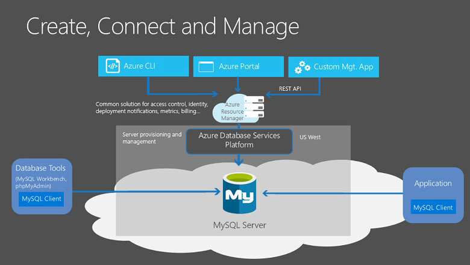
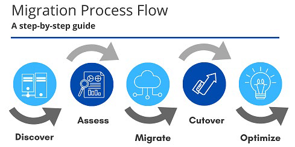

# Службы баз данных Azure

## Azure Cosmos DB

Azure Cosmos DB — это глобально распределенная служба баз данных с несколькими моделями. Вы можете гибко и неуровно масштабировать пропускную способность и хранилище в любом количестве регионов Azure по всему миру. Вы можете воспользоваться преимуществами быстрого доступа к данным с однозначными миллисекундами, используя любой из нескольких популярных API. Azure Cosmos DB предоставляет комплексные соглашения об уровне обслуживания для обеспечения пропускной способности, задержки, доступности и согласованности.

Azure Cosmos DB поддерживает данные без схемы, что позволяет создавать высокочувствительные приложения для поддержки постоянно изменяющихся данных. Эту функцию можно использовать для хранения данных, которые обновляются и поддерживаются пользователями по всему миру.

Azure Cosmos DB является гибкой. На самом низком уровне Azure Cosmos DB хранит данные в формате ARS. Затем данные абстрагированы и проецируемы в виде API, который указывается при создании базы данных. Вы можете выбрать SQL, MongoDB, Cassandra, Tables и Gremlin. Этот уровень flexibili-ty означает, что при переносе баз данных компании в Azure Cosmos DB ваши разработчики могут использовать API, который им наиболее удобен.

## База данных Azure SQL

База данных SQL Azure — это реляционная база данных, основанная на последней стабильной версии ядра СУБД Microsoft SQL Server. База данных SQL — это высокопроизводительная, надежная, полностью управляемая и безопасная база данных. Вы можете использовать его для создания управляемых данными приложений и веб-сайтов на выбранном вами языке программирования без необходимости управления инфраструктурой.

### Преимущества

База данных SQL Azure — это ядро СУБД как PaaS (платформа как услуга). Он выполняет большинство функций управления базами данных, таких как обновление, исправление, резервное копирование и мониторинг, без участия пользователя. База данных SQL обеспечивает доступность на 99,99 процента. Возможности PaaS, встроенные в базу данных SQL, позволяют сосредоточиться на действиях по администрированию и оптимизации базы данных в зависимости от предметной области, которые имеют решающее значение для вашего бизнеса. База данных SQL — это полностью управляемая служба со встроенной высокой доступностью, резервным копированием и другими распространенными операциями обслуживания. Корпорация Майкрософт обрабатывает все обновления кода SQL и операционной системы. Вам не нужно управлять базовой инфраструктурой.
 
Вы можете создать высокодоступный и высокопроизводительный уровень хранения данных для приложений и решений в Azure. База данных SQL может быть правильным выбором для различных современных облачных приложений, поскольку она позволяет обрабатывать как реляционные данные, так и нереляционные структуры, такие как графы, JSON, пространственные и XML.

Можно использовать расширенные функции обработки запросов, такие как высокопроизводительные технологии в памяти и интеллектуальная обработка запросов. Фактически, новейшие возможности SQL Server выпускаются сначала в базу данных SQL, а затем и в сам SQL Server. Вы получаете новейшие возможности SQL Server без каких-либо накладных расходов на обновления или обновления, протестированные в миллионах баз данных.

### Миграция

Вы можете перенести существующие базы данных SQL Server с минимальным временем простоя с помощью службы миграции баз данных Azure. Помощник по миграции данных Майкрософт может создавать отчеты об оценке, содержащие рекомендации, помогающие вам выполнить необходимые изменения перед выполнением миграции. После оценки и устранения всех необходимых исправлений можно приступать к началу процесса миграции. Служба миграции баз данных Azure выполняет все необходимые действия. Вы просто изменяете строку подключения в своих приложениях.

## База данных Azure для MySQL

База данных Azure для MySQL — это служба реляционной базы данных в облаке, основанная на ядстве СУБД MySQL Community Edition версий 5.6, 5.7 и 8.0. Благодаря этому у вас есть соглашение об уровне обслуживания на 99,99% от Azure, управляемое глобальной сетью центров обработки данных, управляемых корпорацией Майкрософт. Это помогает поддерживать работу приложения 24/7. С каждым сервером базы данных Azure для MySQL вы можете воспользоваться преимуществами встроенной безопасности, отказоустойчивости и защиты данных, которые в противном случае пришлось бы покупать или проектировать, создавать и управлять. С помощью базы данных Azure для MySQL можно использовать восстановление на момент времени для восстановления сервера до более раннего состояния, начиная с 35 дней.

База данных Azure для MySQL обеспечивает:

- Встроенная высокая доступность без дополнительной платы.

- Предсказуемая производительность и инклюзивные цены с оплатой по мере использования.

- Масштабирование по мере необходимости, в течение нескольких секунд.

- Возможность защиты конфиденциальных данных в состоянии покоя и в движении.

- Автоматическое резервное копирование.

- Безопасность и соответствие требованиям корпоративного уровня.

Эти возможности практически не требуют администрирования, и все они предоставляются без дополнительных затрат. Они позволяют сосредоточиться на быстрой разработке приложений и ускорении времени вовлечения в рынок, а не на управлении виртуальными машинами и инфраструктурой. Кроме того, вы можете перенести существующие базы данных MySQL с минимальным временем простоя с помощью службы миграции баз данных Azure. После завершения миграции можно продолжить разработку приложения с помощью выбранных инструментов и платформы с открытым исходным кодом. Вам не нужно изучать новые навыки.
 


База данных Azure для MySQL предлагает несколько уровней служб, и каждый из них обеспечивает различную производительность и возможности для поддержки рабочих нагрузок баз данных с малым и тяжелым весом. Вы можете создать свое первое приложение на небольшой базе данных за несколько долларов в месяц, а затем настроить масштаб в соответствии с потребностями вашего решения.

Динамическая масштабируемость позволяет базе данных прозрачно реагировать на быстро меняющиеся потребности в ресурсах. Вы платите только за те ресурсы, которые вам нужны, и только тогда, когда они вам нужны.

## База данных Azure для PostgreSQL

База данных Azure для PostgreSQL — это служба реляционной базы данных в облаке. Серверное программное обеспечение основано на версии сообщества ядра СУБД PostgreSQL с открытым исходным кодом. Ваше знакомство с инструментами и опыт работы с PostgreSQL применимы при использовании базы данных Azure для PostgreSQL.
 
Кроме того, база данных Azure для PostgreSQL обеспечивает следующие преимущества.

- Встроенная высокая доступность по сравнению с локальными ресурсами. Для того, чтобы ваши приложения всегда были доступны, не требовались дополнительные настройки, репликация или затраты.

- Простое и гибкое ценообразование. Вы получаете предсказуемую производительность на основе выбранной ценовой категории, которая включает исправление программного обеспечения, автоматическое резервное копирование, мониторинг и безопасность.

- Масштабирование вверх или вниз по мере необходимости, в течение нескольких секунд. При необходимости можно масштабировать вычислительные ресурсы или хранилище независимо друг от друга, чтобы адаптировать службу в соответствии с использованием.

- Настраиваемое автоматическое резервное копирование и восстановление на момент времени на срок до 35 дней.

- Безопасность и соответствие требованиям корпоративного уровня для защиты конфиденциальных данных в состоянии покоя и в движении. Эта безопасность охватывает шифрование данных на диске и SSL-шифрование между взаимодействием клиента и сервера.

База данных Azure для PostgreSQL доступна в двух вариантах развертывания: односерверная  и  гипермасштабируемая (Citus).

### Один сервер

Вариант развертывания с одним сервером обеспечивает:

-Встроенная высокая доступность без дополнительных затрат (99,99% SLA).

- Предсказуемая производительность и цены с оплатой по мере использования.

- Вертикальнное масштабирование по мере необходимости, в течение нескольких секунд.

- Мониторинг и оповещение для оценки работоспособности вашего сервера.

- Безопасность и соответствие требованиям корпоративного уровня.

- Возможность защиты конфиденциальных данных в состоянии хранения и в обработке.

- Автоматическое резервное копирование и восстановление на момент времени на срок до 35 дней.

Все эти возможности почти не требуют администрирования, и все они предоставляются без дополнительных затрат. Вы можете сосредоточиться на быстрой разработке приложений и ускорении времени на рынке, а не на управлении виртуальными машинами и инфраструктурой. Вы можете продолжать разрабатывать свое приложение с помощью инструментов и платформы с открытым исходным кодом по вашему выбору, не изучая новые навыки.

Вариант развертывания с одним сервером предлагает три ценовые категории: базовая, общей целевой и оптимизированная память. Каждый уровень предлагает различные возможности ресурсов для поддержки рабочих нагрузок базы данных. Вы можете создать свое первое приложение на небольшой базе данных за несколько долларов в месяц, а затем настроить масштаб в соответствии с потребностями вашего решения. Динамическая масштабируемость позволяет базе данных прозрачно реагировать на быстро меняющиеся требования к ресурсам. Вы платите только за те ресурсы, которые вам нужны, и только тогда, когда они вам нужны.

### Гипермасштабирование

Параметр Hyperscale (Citus) горизонтально масштабирует запросы на нескольких компьютерах с помощью сегментирования. Его механизм запросов распараллеливает входящие SQL-запросы на этих серверах для более быстрого ответа на большие наборы данных. Он обслуживает приложения, требующие большего масштабирования и производительности, как правило, рабочие нагрузки, которые приближаются или уже превышают 100 ГБ данных.

Вариант развертывания Hyperscale (Citus) поддерживает мультитенантные приложения, оперативную аналитику в режиме реального времени и транзакционные рабочие нагрузки с высокой пропускной способностью. Приложения, созданные для PostgreSQL, могут выполнять распределенные запросы в Hyperscale (Citus) со стандартными библиотеками подключений и минимальными изменениями.

## Управляемый экземпляр SQL Azure

Управляемый экземпляр SQL Azure — это масштабируемая облачная служба данных, которая обеспечивает широчайшую совместимость ядра СУБД SQL Server со всеми преимуществами полностью управляемой платформы как услуги. В зависимости от сценария управляемый экземпляр SQL Azure может предложить дополнительные возможности для нужд базы данных.

### Преимущества

Как и База данных SQL Azure, управляемый экземпляр SQL Azure — это ядро базы данных PaaS , что означает, что ваша компания сможет воспользоваться лучшими функциями перемещения данных в облако в полностью управляемой среде. Например, вашей компании больше не нужно будет искать и управлять дорогостоящим оборудованием, и вам не придется поддерживать дополнительные накладные расходы на управление локальной инфраструктурой. С другой стороны, ваша компания получит выгоду от функций быстрой подготовки и масштабирования служб Azure, а также автоматического исправления и обновления версий. Кроме того, вы сможете быть уверены, что ваши данные всегда будут там, когда вам это нужно, благодаря встроенным функциям высокой доступности и соглашению об уровне обслуживания (SLA) 99,99% времени безотказной работы. Вы также сможете защитить свои данные с помощью автоматического резервного копирования и настраиваемого периода хранения резервных копий.

База данных SQL Azure и управляемый экземпляр SQL Azure предлагают многие из тех же функций; Однако управляемый экземпляр SQL Azure предоставляет несколько параметров, которые могут быть недоступны для базы данных SQL Azure. Например, Tailwind Traders в настоящее время использует несколько локальных серверов с SQL Server и хотели бы перенести свои существующие базы данных в базу данных SQL, работающую в облаке. Однако некоторые из их баз данных используют кириллические символы для сортировки. В этом сценарии Tailwind Traders следует перенести свои базы данных в управляемый экземпляр SQL Azure, поскольку База данных SQL Azure использует только параметры кодировки сервера ```SQL_Latin1_General_CP1_CI_AS``` по умолчанию.

### Миграция

Управляемый экземпляр SQL Azure упрощает перенос локальных данных на SQL Server в облако с помощью службы миграции баз данных Azure (DMS) или собственного резервного копирования и восстановления. После того как вы ограждаете все функции, которые использует ваша компания, необходимо оценить, какие локальные экземпляры SQL Server можно перенести в управляемый экземпляр SQL Azure, чтобы узнать, есть ли у вас какие-либо проблемы с блокировкой. Как только Вы решили все проблемы, вы можете перенести данные, а затем перейти с локального SQL Server на управляемый экземпляр SQL Azure, изменив строку подключения в приложениях.



## Знакомство с Azure Marketplace

Azure Marketplace позволяет клиентам находить, пробовать, приобретать и подготавливать приложения и службы от сотен ведущих поставщиков услуг, которые сертифицированы для работы в Azure.

- Контейнерные платформы с открытым исходным кодом.

- Образы виртуальных машин и баз данных.

- Программное обеспечение для сборки и развертывания приложений.

- Инструменты разработчика.

- И многое другое, с более чем 10 000 наименований!

Ответы на часто задаваемые вопросы по Marketplace, доступные на https://azure.microsoft.com/en-us/marketplace/faq/
