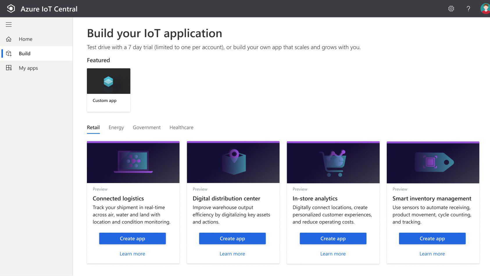
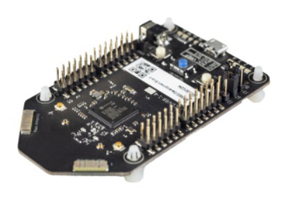

# Службы Интернета вещей Azure

IoT соединяет физический и цифровой миры, позволяя устройствам с датчиками и подключением к Интернету взаимодействовать с облачными системами через Интернет.

IoT позволяет устройствам собирать, а затем передавать информацию для анализа данных. Умные устройства оснащены датчиками, которые собирают данные. Несколько распространенных датчиков, которые измеряют атрибуты физического мира, включают:

- Датчики окружающей среды, которые фиксируют уровни температуры и влажности. 

- Сканеры штрих-кодов, QR-кодов или оптического распознавания символов (OCR). 

- Датчики геолокации и приближения. 

- Датчики света, цвета и инфракрасные датчики.

- Звуковые и ультразвуковые датчики.

- Датчики движения и касания. 

- Акселерометр и датчики наклона. 

- Датчики дыма, газа и алкоголя.

- Датчики ошибок для обнаружения, когда есть проблема с устройством. 

- Механические датчики, которые обнаруживают аномалии или деформации.

- Датчики потока, уровня и давления для измерения газов и жидкостей.

Используя службы Azure IoT, устройства, оснащенные такими датчиками и способные подключаться к Интернету, могут отправлять показания своих датчиков в определенную конечную точку. в Azure через сообщение. Затем данные сообщения собираются и агрегируются, и они могут быть преобразованы в отчеты и оповещения. Все устройства могут быть обновлены новым микропрограммным обеспечением для устранения проблем или добавления новых функций путем отправки обновлений программного обеспечения из служб Azure IoT на каждое устройство.

Предположим, ваша компания производит и эксплуатирует умные холодильные торговые автоматы. Какую информацию вы хотите отслеживать? Возможно, вы захотите убедиться, что:

- Каждая машина работает без каких-либо ошибок.

- Машины не были скомпрометированы.

- Холодильные системы машин сохраняют свое содержимое в определенном температурном диапазоне. 

- Вы будете уведомлены, когда продукты достигнут определенного уровня запасов, чтобы вы могли пополнить запасы машин.

Если аппаратное обеспечение ваших торговых автоматов может собирать и отправлять эту информацию в стандартном сообщении, то сообщения, которые отправляет каждая машина, могут быть получены, сохранены, организованы, и отображаться с помощью служб Интернета вещей Azure.

Данные, собираемые с этих устройств, могут быть объединены со службами Azure AI, чтобы помочь вам прогнозировать:

- Когда машины нуждаются в проактивном обслуживании.

- Когда запасы нужно будет пополнить и заказать новый продукт у поставщиков.

Многие службы могут помогать и управлять комплексными решениями для Интернета вещей в Azure.

## Azure IoT Hub

[Azure IoT Hub](https://azure.microsoft.com/services/iot-hub/?azure-portal=true) — это управляемая служба, размещенная в облаке и действующая как центр сообщений для двунаправленной связи между приложением Интернета вещей и устройствами, которыми он управляет. Вы можете использовать Azure IoT Hub для создания решений Интернета вещей с надежной и безопасной связью между миллионами устройств Интернета вещей и облачной частью решения. К Azure IoT Hub можно подключить практически любое устройство. 

Служба Azure IoT Hub поддерживает связь как с устройства с облаком, так и из облака с устройством. Он также поддерживает несколько шаблонов обмена сообщениями, таких как телеметрия «устройство-облако», загрузка файлов с устройств и методы запроса-ответа для управления вашими устройствами из облака. После того как Azure IoT Hub получит сообщения от устройства, он сможет направлять это сообщение в другие службы Azure. 

С точки зрения облака и устройства Azure IoT Hub позволяет выполнять команды и управлять. То есть, вы можете иметь как ручное, так и автоматизированное дистанционное управление с подключенными устройствами, поэтому вы можете проинструктировать устройство открывать клапаны, устанавливать целевые температуры, перезапускать зависшие устройства и так далее. 

Мониторинг Azure IoT Hub помогает поддерживать работоспособность решения, отслеживая такие события, как создание устройств, сбои устройств и подключения устройств. 

## Azure IoT Central

[Azure IoT Central](https://azure.microsoft.com/services/iot-central/?azure-portal=true) построен на основе Azure IoT Hub путем добавления панели мониторинга, которая позволяет подключать, отслеживать и управлять устройствами Интернета вещей. Визуальный пользовательский интерфейс позволяет быстро подключать новые устройства и наблюдать, как они начинают отправлять телеметрию или сообщения об ошибках. Вы можете наблюдать за общей производительностью всех устройств в совокупности, а также настраивать оповещения, которые отправляют уведомления, когда конкретное устройство нуждается в обслуживании. Наконец, вы можете отправить обновления прошивки на устройство.

Чтобы помочь вам быстро приступить к работе, IoT Central предоставляет начальные шаблоны для распространенных сценариев в различных отраслях, таких как розничная торговля, энергетика, здравоохранение и правительство. Затем вы настраиваете начальные шаблоны дизайна непосредственно в пользовательском интерфейсе, выбирая из существующих тем или создавая собственную пользовательскую тему, устанавливая логотип и т.д. С помощью IoT Central вы можете настроить начальные шаблоны для конкретных данных, отправляемых с ваших устройств, отчетов, которые вы хотите видеть, а также оповещений, которые вы хотите отправить.

Пользовательский интерфейс можно использовать для удаленного управления устройствами. Эта функция позволяет отправить обновление программного обеспечения или изменить свойство устройства. Вы можете, например, отрегулировать желаемую температуру для одного или всех ваших холодильных торговых автоматов непосредственно из IoT Central. 

Ключевой частью IoT Central является использование шаблонов устройств. С помощью шаблона устройства можно подключить устройство без какого-либо кодирования на стороне службы. IoT Central использует шаблоны для создания панелей мониторинга, оповещенийи и т.д. Разработчикам устройств по-прежнему необходимо создавать код для запуска на устройствах, и этот код должен соответствовать спецификации шаблона устройства. 

## Azure Sphere

[Azure Sphere](https://azure.microsoft.com/services/azure-sphere/?azure-portal=true) создает комплексное, высокозащищеное решение Интернета вещей для клиентов, которое охватывает все: от оборудования и операционной системы на устройстве до безопасного метода отправки сообщений с устройства в накопитель сообщений. Azure Sphere имеет встроенные функции связи и безопасности для подключенных к Интернету устройств.

Azure Sphere поставляется в трех частях:

- Первая часть — это блок микроконтроллера Azure Sphere (MCU), который отвечает за обработку операционной системы и сигналов от подключенных датчиков. На следующем рисунке показан микроконтроллер Seeed Azure Sphere MT3620 Development Kit, один из нескольких начальных наборов, доступных для создания прототипов и разработки приложений Azure Sphere.

  

- Вторая часть представляет собой настраиваемую операционную систему (ОС) Linux, которая обрабатывает связь со службой безопасности и может запускать программное обеспечение поставщика. 

- Третья часть — служба безопасности Azure Sphere, также известная как AS3. Ее работа заключается в том, чтобы убедиться, что устройство не было злонамеренно скомпрометировано. Когда устройство пытается подключиться к Azure, оно сначала должно пройти проверку подлинности для каждого устройства на основе сертификатов. Если аутентификация прошла успешно, AS3 проверяет, чтобы устройство не было подделано. После того, как установлен безопасный канал связи, AS3 передает на устройство любые обновления ОС или одобренного клиентом программного обеспечения.

После того, как система Azure Sphere проверит подлинность устройства и выполнит его авторизацию, устройство сможет взаимодействовать с другими службами Интернета вещей Azure, отправляя данные телеметрии и ошибки информации.

## Анализ критериев принятия решений

В этом разделе мы проанализируем критерии, которые эксперты выбирают, когда решают, какой сервис IoT использовать для данной бизнес-потребности. Понимание критериев также может помочь вам лучше понять нюансы различий между каждым продуктом.

### Важно ли убедиться, что устройство не скомпрометировано? 

Ни один производитель или клиент не хочет, чтобы их устройства были злонамеренно скомпрометированы и использованы в плохих целях, но более важно обеспечить целостность банкомата, чем, скажем, стиральной машины. Когда безопасность является критически важным фактором при разработке вашего продукта, лучшим вариантом продукта является Azure Sphere, который предоставляет комплексное решение для устройств Интернета вещей.

Как мы упоминали в предыдущем разделе, Azure Sphere обеспечивает безопасный канал связи между устройством и Azure, контролируя все, от работы оборудования до процесса аутентификации. Это гарантирует, что целостность устройства бескомпромиссна. После того, как защищенный канал установлен, сообщения могут быть получены от устройства безопасно, а сообщения или обновления программного обеспечения могут быть отправлены на устройство удаленно.

### Нужна ли панель мониторинга для создания отчетов и управления?

Вашим следующим решением будет уровень услуг, которые вам требуются от вашего IoT-решения. Если вы просто хотите подключиться к удаленным устройствам для получения телеметрии или сделать обновления, вы можете использовать Azure IoT Hub. Программисты по-прежнему могут создавать настраиваемый набор средств управления и отчетов с помощью RESTful API Azure IoT Hub. 

Однако, если вам нужен предварительно созданный настраиваемый пользовательский интерфейс, с помощью которого вы можете просматривать и управлять своими устройствами удаленно, вы можете начать с IoT Central. С помощью этого решения вы можете управлять одним устройством или всеми устройствами одновременно, и вы можете настроить оповещения для определенных условий, таких как сбой устройства.

IoT Central интегрируется со многими различными продуктами Azure, включая Azure IoT Hub, для создания панели мониторинга с отчетами и функциями управления. Панель мониторинга основана на начальных шаблонах для распространенных отраслевых сценариев и сценариев использования. Вы можете использовать панель мониторинга, созданную начальным шаблоном как есть или настроить ее в соответствии с вашими потребностями. Вы можете иметь несколько панелей мониторинга и ориентировать их на различных пользователей.

## Большие данные и аналитика

Когда мы говорим о больших данных, мы имеем в виду большие объемы данных. Данные собираются с многих источников, которые генерируют большие объемы данных. Этот объем данных становится все труднее понять и использовать для решений. Объемы настолько велики, что традиционные формы обработки и анализа больше не уместны.

Кластерные технологии с открытым исходным кодом были разработаны чтобы попытаться справиться с этими большими наборами данных. Microsoft Azure поддерживает широкий спектр технологий и служб для предоставления больших данных и аналитических решений, включая Azure Synapse Analytics, Azure HDInsight, Azure Databricks и Azure Data Lake Analytics.
 
### Azure Synapse Analytics

[Azure Synapse Analytics](https://docs.microsoft.com/azure/sql-data-warehouse/?azure-portal=true) — это неограниченная аналитическая служба, объединяющая корпоративные хранилища данных и аналитику больших данных. Можно запрашивать данные по условиям, используя бессерверные или подготовленные ресурсы в нужном масштабе. У вас есть унифицированный интерфейс приема, подготовки, управления и обслуживания данных для непосредственных потребностей бизнес-аналитики и машинного обучения. 

### Azure HDInsight

[Azure HDInsight](https://azure.microsoft.com/services/hdin-sight/?azure-portal=true) — это полностью управляемая служба аналитики с открытым исходным кодом для предприятий. Это облачный сервис, который упрощает, ускоряет и экономичнее обрабатывает огромные объемы данных. Вы можете запускать популярные платформы с открытым исходным кодом и создавать типы кластеров, такие как [Apache Spark](https://docs.microsoft.com/azure/hdinsight/spark/apache-spark-overview?azure-portal=true), [Apache Hadoop](https://docs.microsoft.com/azure/hdinsight/hadoop/apache-ha-doop-introduction?azure-portal=true), [Apache Kafka](https://docs.microsoft.com/azure/hdinsight/kafka/apache-kafka-introduction?azure-portal=true), [Apache HBase](https://docs.microsoft.com/azure/hdinsight/hbase/apache-hbase-overview?azure-portal=true), [Apache Storm](https://docs.microsoft.com/azure/hdinsight/storm/apache-storm-overview?azure-portal=true), и [службы машинного обучения](https://docs.microsoft.com/azure/hdinsight/r-server/r-server-overview?azure-portal=true). HDInsight также поддерживает широкий спектр сценариев, таких как извлечение, трансформирование и загрузка (ETL), хранение данных, машинное обучение и IoT.
 
### Azure Databricks

[Azure Databricks](https://azure.microsoft.com/services/data-bricks/?azure-portal=true) помогает получать аналитические сведения обо всех данных и создавать решения для искусственного интеллекта. Вы можете настроить среду Apache Spark за минуту, а затем автоматически масштабировать и совместно работать над общими проектами в интерактивной рабочей области. Azure Databricks поддерживает Python, Scala, R, Java и SQL, а также платформы и библиотеки для обработки и анализа данных, включая TensorFlow, PyTorch и scikit-learn. 

### Azure Data Lake Analytics

[Azure Data Lake Analytics](https://azure.microsoft.com/services/data-lake-analytics/?azure-portal=true) — это служба аналитики по требованию, упрощающая работу с большими данными. Вместо развертывания, настройки оборудования вы пишете запросы для преобразования данных и извлечения ценных сведений. Служба аналитики может мгновенно обрабатывать задания любого масштаба. Вы платите за свою работу только тогда, когда она работает, что делает ее более экономически эффективной.
