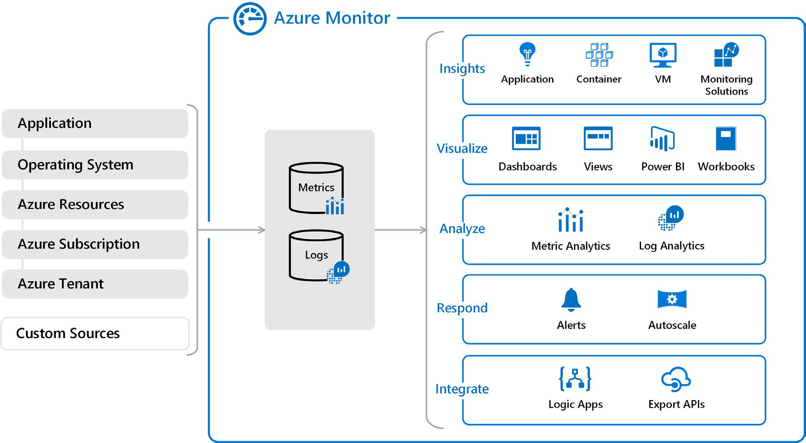

# Службы мониторинга Azure

Современные программные системы, работающие в облаке, сложны и получать представление о работоспособности и производительности среды размещения приложений на всех уровнях служб является сложным. К счастью, есть несколько решений от Microsoft, которые могут помочь вам быстро реагировать на сбои, исследовать периодические проблемы, оптимизировать использование и быть активными в обработке будущих запланированных простоев.

На высоком уровне существует три основных предложения мониторинга Azure, каждое из которых предназначено для определенной аудитории и вариантов использования и предоставляет разнообразный набор инструментов, служб, программные API и многое другое. 

## Помощник Azure

[Помощник Azure](https://azure.microsoft.com/services/advisor/?azure-portal=true) оценивает ресурсы Azure и дает рекомендации, помогающие повысить надежность, безопасность и производительность, добиться операционного совершенства и сократить расходы. Советник разработан, чтобы помочь вам сэкономить время на облачной оптимизации. Служба рекомендаций включает в себя предлагаемые действия, которые вы можете предпринять сразу, отложить или отклонить.

Рекомендации доступны на портале Azure и в API, и вы можете настроить уведомления, чтобы предупреждать вас о новых рекомендациях. 

Когда вы находитесь на портале Azure, на панели мониторинга Advisor отображаются персонализированные рекомендации для всех ваших подписок, и вы можете использовать фильтры для выбора рекомендаций для конкретных подписок, группы ресурсов или службы. Рекомендации подразделяются на пять категорий:

- **Надежность**: используется для обеспечения и улучшения непрерывности ваших критически важных для бизнеса приложений.

- **Безопасность**: используется для обнаружения угроз и уязвимостей, которые могут привести к нарушениям безопасности. 

- **Производительность**: используется для повышения скорости ваших приложений.

- **Стоимость**: используется для оптимизации и сокращения общих расходов Azure.

- **Эксплуатационная эффективность**: используется, чтобы помочь вам достичь эффективности процессов и рабочих процессов, ресурсной персоналии и лучших практик развертывания. 

## Azure Monitor

[Azure Monitor](https://azure.microsoft.com/services/monitor/?azure-portal=true) — это платформа для сбора, анализа, визуализации и потенциального принятия мер на основе метрик и данных журналов из всей Azure и локальной среды, среды окружения.

На следующей схеме показано, насколько всеобъемлющим является Azure Monitor. 
 

- Слева находится список источников логирования и метрических данных, которые могут быть собраны на каждом уровне архитектуры вашего приложения, от приложения до операционной системы.

- В центре вы можете увидеть, как данные журнала и метрик хранятся в центральных репозиториях.

- Справа данные используются несколькими способами. Вы можете просматривать производительность в реальном времени и за всю историю на каждом уровне архитектуры или агрегированную и подробную информацию. Данные отображаются на разных уровнях для разных аудиторий. Высокоуровневые отчеты можно просматривать на панели мониторинга Azure Monitor или создавать пользовательские представления с помощью запросов Power BI и Kusto. 

Кроме того, вы можете использовать данные, чтобы помочь вам реагировать на критические события в режиме реального времени, с помощью предупреждений, доставляемых командам через SMS, электронную почту и так далее. Или можно использовать пороговые значения для запуска функции автоматического масштабирования для масштабирования вверх или вниз в соответствии с требованиями. 

Некоторые популярные продукты, такие как Azure Application Insights, служба для отправки сведений телеметрии из исходного кода приложения в Azure, используют Azure Monitor под капотом. С помощью Application Insights разработчики приложений могут воспользоваться преимуществами мощной платформы анализа данных в Azure Monitor, чтобы получить глубокое представление об операциях приложения и диагностировать ошибки, не дожидаясь, пока пользователи сообщат о них.

## Служба работоспособности Azure

[Azure Service Health](https://azure.microsoft.com/features/service-health/?azure-portal=true) предоставляет персонализированное представление работоспособности служб Azure, регионов и ресурсов, на которые вы полагаетесь. На сайте status.azure.com отображаются только основные проблемы, которые в целом влияют на клиентов Azure, не дает полной картины. Но служба Azure Service Health отображает как основные, так и меньшие локализованные проблемы, которые влияют на вас. Проблемы с обслуживанием редки, но важно быть готовым к неожиданностям. Вы можете настроить оповещения, которые помогут вам сортировать простои и плановое обслуживание. После отключения Service Health предоставляет официальные отчеты об инцидентах, называемые анализом первопричин (RCA), которыми вы можете поделиться с заинтересованными сторонами.

Service Health помогает следить за несколькими типами событий: 

- **Проблемы со службами** — это проблемы в Azure, такие как сбои, которые влияют на вас прямо сейчас. Вы можете детализировать затронутые службы, регионы, обновления от ваших инженерных команд и найти способы обмена и отслеживания последней информации. 

- **Запланированные события технического обслуживания** могут повлиять на вашу доступность. Вы можете детализировать затронутые службы, регионы и сведения, чтобы показать, как событие повлияет на вас и что вам нужно сделать. Большинство из этих событий происходят без какого-либо влияния на вас и не показаны здесь. В редких случаях, когда требуется перезагрузка, Service Health позволяет выбрать, когда выполнять обслуживание, чтобы свести к минимуму время простоя. 

- **Рекомендации по работоспособности** - это вопросы, которые требуют от вас действий, чтобы избежать прерывания обслуживания, включая выход на пенсию и изменения в работе. Рекомендации по здоровью объявляются заранее, чтобы вы могли планировать.

## Анализ критериев принятия решений

В этом разделе вы проанализируете критерии, используемые экспертами при выборе службы мониторинга Azure для указанной бизнес-потребности. Понимая критерии, вы можете лучше оценить нюансы среди продуктов.

### Вам нужно проанализировать, как вы используете Azure для снижения затрат? Повысить устойчивость? Усилить свою безопасность?

Выберите советник Azure, когда вы ищете анализ развернутых ресурсов. Azure Advisor анализирует конфигурацию и использование ресурсов и предоставляет рекомендации по оптимизации надежности, безопасности, производительности, затрат и операции, основанные на лучших практиках экспертов.

### Вы хотите отслеживать службы Azure или использование Azure?

Если вы хотите следить за самой Azure, особенно за службами и регионами, от которых вы зависите, вы можете просмотреть текущее состояние служб Azure, на которые вы полагаетесь, предстоящие и запланированные простои и службы. Вы можете настроить оповещения, которые помогут вам оставаться в курсе инцидентов и предстоящих простоев без необходимости регулярно посещать панель мониторинга. 

Однако, если вы хотите отслеживать производительность или проблемы, связанные с конкретной виртуальной машиной или экземплярами контейнеров, базами данных, приложениями и т.д., используйте Azure Monitor и создавайте отчеты и уведомления, которые помогут вам понять, как работают ваши службы, или диагностировать проблемы, связанные с использованием Azure. 

### Вы хотите измерять пользовательские события наряду с другими метриками использования? 

Выберите Azure Monitor, если вы хотите измерять пользовательские события вместе с другими собранными данными телеметрии. Пользовательские события, например, добавленные в исходный код программных приложений, могут помочь определить и диагностировать, почему ваше приложение ведет себя определенным образом.

### Вам нужно настроить оповещения о простоях или когда автоматическое масштабирование собирается развернуть новые экземпляры?

Здесь вам снова нужно использовать Azure Monitor для настройки оповещений для ключевых событий, связанных с вашими конкретными ресурсами. 
