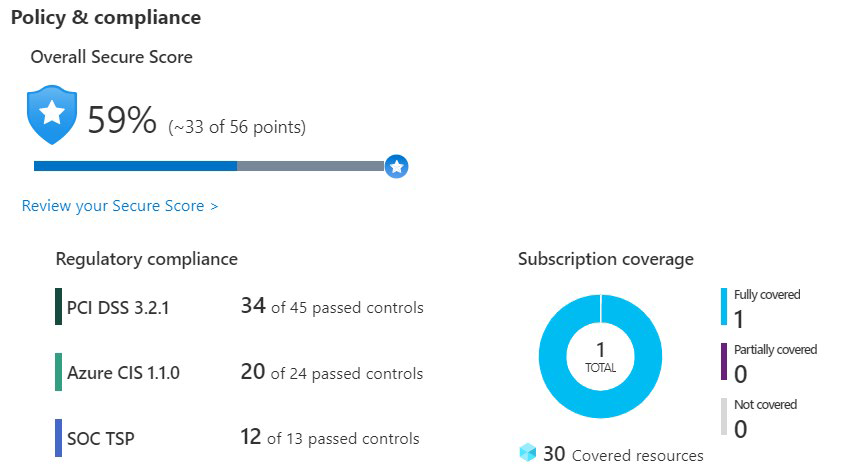
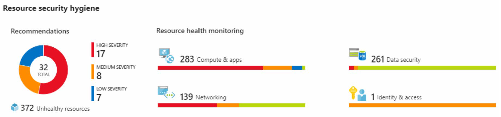
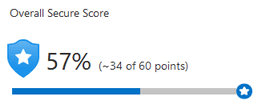
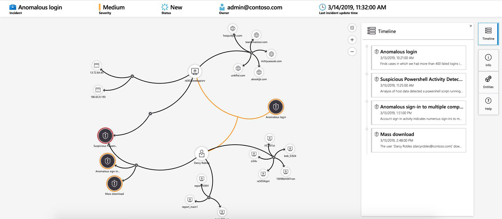
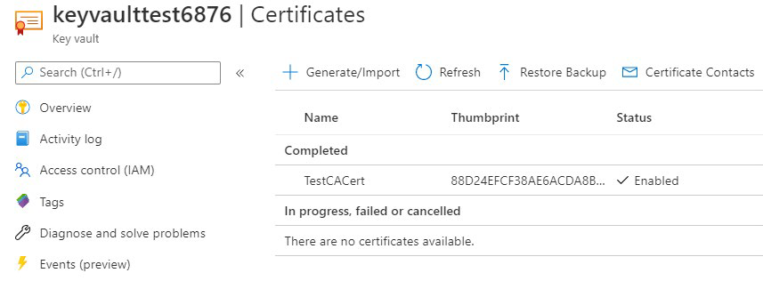
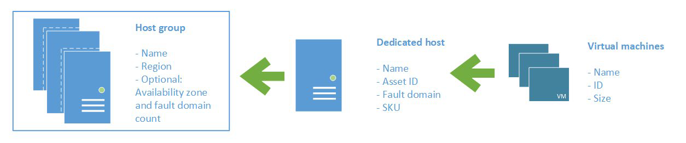

Безопасность - это достаточно значимое понятие. Существует так много факторов, которые следует учитывать, чтобы защитить ваши приложения и ваши данные. Как Azure помогает защитить рабочие нагрузки, которые выполняются в облаке и локальном центре обработки данных?

## Центр безопасности Azure

[Центр безопасности Azure](https://azure.microsoft.com/services/security-center?azure-portal=true) — это служба мониторинга, которая обеспечивает видимость состояния безопасности во всех службах, как в Azure, так и в локальной среде. Термин *безопасность* относится к политикам и средствам управления кибербезопасности, а также к тому, насколько хорошо вы можете прогнозировать, предотвращать и реагировать на угрозы безопасности. 

Центр безопасности позволяет:

- Выполнять мониторинг настроек безопасности в локальных и облачных рабочих нагрузках.

- Автоматически применять необходимые настройки безопасности к новым ресурсам по мере их внесения в Интернет.

- Предоставлять рекомендации по безопасности, основанные на ваших текущих конфигурациях, ресурсах и сетях.

- Постоянно отслеживать свои ресурсы и выполнять автоматическую оценку безопасности для выявления уязвимостей, прежде чем эти уязвимости могут быть использованы.

- Использовать машинное обучение для обнаружения и блокировки вредоносных программ, установленных на виртуальных машинах (ВМ) и других ресурсах. Можно также использовать адаптивные элементы управления приложениями для определения правил, в которых перечислены разрешенные приложения, чтобы гарантировать, что только разрешенные приложения могут запускать.

- Обнаруживать и проводить анализ потенциальных входящих атак и угроз любой деятельности после взлома, которая могла произойти. 

- Обеспечивать контроль доступа точно в срок для сетевых портов. Это уменьшает поверхность атаки, гарантируя, что сеть разрешает только тот трафик, который вам нужен в то время, когда он вам нужен.

### Понимание вашей безопасности 

Используйте Security Center для получения детального анализа среды окружения. Поскольку ресурсы компании анализируются в соответствии с элементами управления любыми назначенными политиками управления, она может просматривать свое соответствие нормативным требованиям с помощью настройки системы безопасности.

Ознакомьтесь со следующим примером того, что вы можете увидеть в центре безопасности Azure.

Предположим, что компания должна соответствовать стандарту безопасности данных индустрии платежных карт (PCI DSS). Отчет безопасности покажет, что у компании есть ресурсы, на которые стоит обратить внимание.
 
В разделе **Гигиена безопасности ресурсов** компания может видеть состояние своих ресурсов с точки зрения безопасности. Чтобы помочь определить приоритеты действий по исправлению, рекомендации классифицируются как низкие, средние и высокие. 

### Что такое оценка безопасности?

[Оценка безопасности](https://docs.microsoft.com/azure/security-center/secure-score-security-controls/?azure-portal=true) — это измерение уровня безопасности организации. 

Оценка безопасности основана на элементах управления безопасностью или группах связанных рекомендацией по безопасности. Оценка основана на проценте элементов управления безопасностью, которым вы удовлетворяете. Чем больше элементов управления безопасностью вы удовлетворяете, тем выше балл получаете. Оценка улучшается при исправлении всех рекомендаций для каждого ресурса в элементе управления.

Вот пример с портала Azure, показывающий оценку 57 процентов, или 34 из 60 баллов.

Следование рекомендациям по безопасной оценке может помочь защитить вашу организацию от угроз. С помощью централизованной панели мониторинга в центре безопасности Azure организации могут отслеживать и работать над безопасностью своих ресурсов Azure, таких как удостоверения, данные, приложения, устройства и инфраструктура.

Безопасная оценка поможет вам:

- Получить отчет о текущем состоянии безопасности вашей организации. 

- Улучшить безопасность, обеспечивая обнаруживаемость, видимость, управление и контроль. 

- Провести сравнение с бенчмарками и установить ключевые показатели эффективности (KPI). 

### Защита от угроз

Центр безопасности включает расширенные возможности облачной защиты для виртуальных машин, сетевую безопасность и целостность файлов. 

Давайте рассмотрим некоторые из этих возможностей:

- **Доступ к виртуальной машине точно в срок** настроит «точно в срок» доступ к виртуальным машинам. Этот доступ блокирует трафик по умолчанию к определенным сетевым портам виртуальных машин, но разрешает трафик в течение определенного времени, когда администратор запрашивает и утверждает его.

- **Адаптивное управление приложениями** поможет контролировать, какие приложения разрешено запускать на своих виртуальных машинах. В фоновом режиме центр безопасности использует машинное обучение для просмотра процессов, выполняемых на виртуальной машине. Он создает правила исключений для каждой группы ресурсов, которая содержит виртуальные машины, и предоставляет рекомендации. Этот процесс предоставляет оповещения, которые информируют компанию о неавторизованных приложениях, запущенных на ее виртуальных машинах.

- Центр безопасности **адаптивной защиты сети** может отслеживать шаблоны интернет-трафика виртуальных машин и сравнивать эти шаблоны с текущими настройками группы безопасности сети (NSG) компании. Оттуда центр безопасности может давать рекомендации о том, следует ли дополнительно блокировать группы безопасности сети, и предоставлять шаги по исправлению. 

- **Мониторинг целостности файлов** помогает настроить мониторинг изменений важных файлов как в Windows, так и в Linux, настройки реестра, приложения и другие аспекты, которые могут указывать на атаку безопасности.

## Azure Sentinel

Управление безопасностью в больших масштабах может извлечь выгоду из специализированной системы управления информацией и событиями безопасности (SIEM). Система SIEM агрегирует данные безопасности из множества различных источников (при том, что эти источники поддерживают формат ведения журнала открытого стандарта). Он также предоставляет возможности для обнаружения угроз и реагирования на них.

[Azure Sentinel](https://azure.microsoft.com/services/azure-sentinel/?azure-portal=true) — это облачная SIEM-система Microsoft. Она использует интеллектуальную аналитику безопасности и анализ угроз. 

### Возможности Azure Sentinel

Azure Sentinel позволяет: 

- **Сбор облачных данных в масштабе** Сбор данных по всем пользователям, устройствам, приложениям и инфраструктуре, как локально, так и из нескольких облаков.

- **Обнаружение ранее не обнаруженных угроз** Минимизация ложных срабатываний с помощью комплексной аналитики и анализа угроз Microsoft. 

- **Исследуйте угрозы с помощью искусственного интеллекта** Изучайте подозрительные действия в масштабе, используя многолетний опыт кибербезопасности от Microsoft.

 - **Быстрое реагирование на инциденты** Используйте встроенную оркестровку и автоматизацию общих задач.

### Подключение источников данных

Azure Sentinel поддерживает ряд источников данных, которые он может анализировать на наличие событий безопасности. Эти соединения обрабатываются встроенными соединителями или стандартными отраслевыми форматами журналов и API.

- **Подключение решений Microsoft** Соединители обеспечивают интеграцию в режиме реального времени для таких служб, как решения Microsoft Threat Protection, источники Microsoft365 (включая Office 365), Azure Active Directory и брандмауэр Windows.

- **Подключение других сервисов и решений** Коннекторы доступны для распространенных сервисов и решений сторонних производителей, включая AWS CloudTrail, Citrix Analytics (Security), Sophos XG Firewall, VMware Carbon Black Cloud, и т.д. 

- **Подключение стандартных отраслевых источников данных** Azure Sentinel поддерживает данные из других источников, использующих стандартный формат обмена сообщениями CEF, системный журнал или REST API.

### Обнаружение угроз

**Встроенная аналитика** использует шаблоны, разработанные командой экспертов и аналитиков Microsoft по безопасности на основе известных угроз, общих векторов атак и цепочек эскалации для подозрительной активности. Эти шаблоны можно настраивать и искать в среде любые действия, которые выглядят подозрительно. Некоторые шаблоны используют поведенческую аналитику машинного обучения, основанную на собственных алгоритмах Microsoft. 

**Пользовательская аналитика** — это правила, которые создаются для поиска определенных критериев в среде. Можно просмотреть количество результатов, которые будет генерировать запрос (на основе прошлых событий журнала), и задавать расписание выполнения запроса. Можно также задать пороговое значение оповещения. 

### Расследования и реагирование

Когда Azure Sentinel обнаруживает подозрительные события, компания может расследовать определенные оповещения или инциденты (группа связанных оповещений). С помощью графика расследования компания может просматривать информацию от объектов, непосредственно связанных с оповещением, и выполнять запросы, помогающие расследованию.

Ниже приведен пример, в котором показано, как выглядит график расследования в Azure Sentinel.

Компания также будет использовать [Azure Monitor Workbooks](https://docs.microsoft.com/azure/azure-monitor/platform/workbooks-overview/?azure-portal=true) для автоматизации реагирования на угрозы. Например, можно установить оповещение, которое ищет вредоносные IP-адреса, обращающиеся к сети, и создавать книгу, которая выполняет следующие действия:

1.	Когда сработает оповещение, откройте тикет в системе IT ticketing. 

2.	Отправьте сообщение в канал операций безопасности в Microsoft Teams или Slack, чтобы убедиться, что аналитики безопасности знают об инциденте. 

3.	Отправьте всю информацию в оповещении старшему сетевому администратору и администратору безопасности. Сообщение электронной почты содержит две пользовательские переключатели: **Блокировать** или **Игнорировать**. 

Когда администратор выбирает **Блокировать**, IP-адрес блокируется в брандмауэре, а пользователь отключается в Azure Active Directory. Если администратор выбирает **Игнорировать**, оповещение закрывается в Azure Sentinel, а инцидент закрывается в системе ИТ-билетов. 

Мастер-файл продолжает выполняться после получения ответа от администраторов.

Мастер-файлы можно запускать вручную или автоматически, когда правило инициирует оповещение. 

## Хранилище ключей Azure

[Azure Key Vault](https://azure.microsoft.com/services/key-vault?azure-portal=true) — это централизованная облачная служба для хранения секретов приложения в едином центральном расположении. Он обеспечивает безопасный доступ к конфиденциальной информации, предоставляя возможности управления доступом и ведения журнала. 
 
### Что может делать хранилище ключей Azure? 

Хранилище ключей Azure может помочь вам:

- **Управление секретами** Вы можете использовать Key Vault для безопасного хранения и жесткого контроля доступа к токенам, секретным словам, сертификатам, ключам API и другим секретам. 

- **Управление ключами шифрования** Вы можете использовать Key Vault в качестве решения для управления ключами. Key Vault упрощает создание и управление ключами шифрования, используемыми для шифрования данных.

- **Управление сертификатами SSL/TLS** Хранилище ключей позволяет подготавливать, управлять и развертывать общедоступные и частные сертификаты SSL/TLS, Azure ресурсы и ваши внутренние ресурсы.

- **Храните секреты, поддерживаемые аппаратными модулями безопасности (HSM)** Эти секреты и ключи могут быть защищены либо программным обеспечением, либо проверенными HSM FIPS 140-2 level 2. 

Ниже приведен пример сертификата, используемого для тестирования в Key Vault.

### Каковы преимущества хранилища ключей Azure? 

Преимущества использования Key Vault включают в себя:

- **Централизованные секреты приложений** Централизация хранилища секретов приложений позволяет контролировать их распространение и снижает вероятность случайной утечки секретов. 

- **Безопасно хранимые секреты и ключи** Azure использует стандартные алгоритмы, длины ключей и HSM. Доступ к Key Vault требует надлежащей аутентификации и авторизации.

- **Мониторинг доступа и контроль доступа** С помощью Key Vault вы можете отслеживать и контролировать доступ к секретам вашего приложения. 

- **Упрощенное администрирование секретов приложений** Key Vault упрощает регистрацию и обновление сертификатов из публичных центров сертификации (ЦС). Можно также масштабировать и реплицировать контент в регионах и использовать стандартные средства управления сертификатами. 

- **Интеграция с другими службами Azure** Вы можете интегрировать Key Vault с учетными записями хранения, реестрами контейнеров, концентраторами событий и многими другими службами Azure. Эти службы могут безопасно ссылаться на секреты, хранящиеся в Key Vault. 

## Azure Dedicated Host

В Azure виртуальные машины (ВМ) работают на общем оборудовании, которым управляет корпорация Microsoft. Несмотря на то, что недостаточно используемое оборудование является общим, рабочие нагрузки виртуальных машин изолированы от рабочих нагрузок, которые выполняют другие клиенты Azure. 

Некоторые организации должны соблюдать нормативные требования, которые требуют, чтобы они были единственным клиентом, использующим физическую машину, на которой размещены их виртуальные машины. 

[Выделенный узел Azure](https://azure.microsoft.com/services/virtual-machines/dedicated-host/?azure-portal=true) предоставляет выделенные физические серверы для размещения виртуальных машин Azure для Windows и Linux.

Ниже приведена схема, показывающая, как виртуальные машины связаны с выделенными узлами и группами узлов. Выделенный узел сопоставляется с физическим сервером в центре обработки данных Azure. Группа узлов — это коллекция выделенных хостов.

### Каковы преимущества выделенного узла Azure? 

Выделенный узел Azure:

- Дает вам видимость и контроль над инфраструктурой сервера, в котором работают виртуальные машины Azure. 

- Помогает удовлетворить требования соответствия путем развертывания рабочих нагрузок на изолированном сервере. 

- Позволяет выбрать количество процессоров, возможности сервера, серию виртуальных машин и размеры виртуальных машин на одном хосте. 

### Вопросы доступности для выделенного хоста

После подготовки выделенного узла Azure назначает его физическому серверу в облачном центре обработки данных Microsoft. 

Для обеспечения высокой доступности можно подготовить несколько узлов в группе узлов и развернуть виртуальные машины в этой группе. Виртуальные машины на выделенных узлах также могут использовать преимущества управления обслуживанием. Эта функция позволяет контролировать, когда происходят регулярные обновления обслуживания в течение 35-дневного скользящего окна.

### Вопросы ценообразования

Плата взимается за выделенный узел независимо от того, сколько виртуальных машин вы развертываете на нем. Цена узла зависит от семейства виртуальных машин, типа (размера оборудования) и региона.

Лицензирование программного обеспечения, хранение и использование сети оплачиваются отдельно от узла и виртуальных машин. Для получения дополнительной информации. Ознакомьтесь со статьей [Цены на выделенный узел Azure](https://aka.ms/ADHPricing/?azure-portal=true). 
