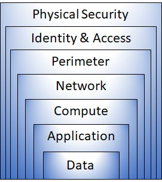
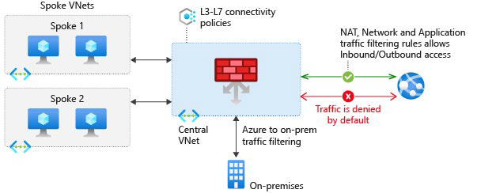
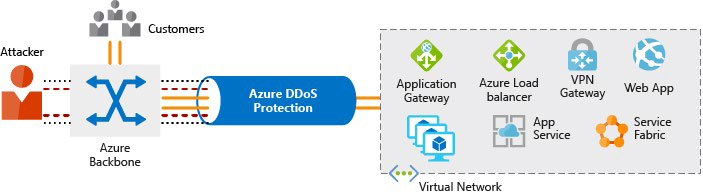

Каждое приложение и служба, как локальные, так и облачные, должны быть спроектированы с учетом безопасности. Слишком много риска. Например, атака типа «отказ в обслуживании» может помешать клиентам дать доступ на веб-сайт или к конкретной службе, и заблокировать ведение бизнеса. Или ваш сайт может быть испорчен, что нанесет ущерб вашей репутации. Утечка данных будет еще хуже, потому что она может разрушить с трудом заработанное доверие, нанеся значительный личный и финансовый ущерб.

## Что такое защита в глубину 

Целью глубокой защиты является защита информации и предотвращение ее кражи теми, кто не уполномочен получать к ней доступ. 

Стратегия глубокой защиты использует ряд механизмов для замедления атаки, направленной на получение несанкционированного доступа к данным.

### Слои обороны в глубине 

Вы можете визуализировать защиту в глубине как набор слоев, с данными, которые должны быть защищены в центре. 

Каждый слой обеспечивает защиту таким образом, что в случае нарушения одного слоя последующий слой уже находится на месте, чтобы предотвратить дальнейшее воздействие. Такой подход устраняет зависимость от какого-либо одного уровня защиты. Он замедляет атаку и предоставляет телеметрию оповещений, на которую группы безопасности могут действовать автоматически или вручную.

Вот краткий обзор роли каждого слоя:

- *Уровень физической безопасности* является первой линией защиты для защиты вычислительного оборудования в центре обработки данных.

- *Уровень идентификации и доступа* контролирует доступ к инфраструктуре и управление изменениями.

- *Уровень периметра* использует распределенную защиту от отказа в обслуживании (DDoS) для фильтрации крупномасштабных атак, прежде чем они могут вызвать отказ в обслуживании для пользователей.

- *Сетевой уровень* ограничивает связь между ресурсами посредством сегментации и доступа. 

- *Вычислительный уровень* защищает доступ к виртуальным машинам.

- *Прикладной уровень* помогает гарантировать, что приложения безопасны и свободны от уязвимостей безопасности.

- *Уровень данных* контролирует доступ к бизнес-данным и данным клиентов, которые вам нужно защитить.
 
Эти уровни помогают принимать решения о конфигурации безопасности на всех уровнях приложений. 

Azure предоставляет средства и функции безопасности на всех уровнях концепции углубленной защиты. Давайте подробнее рассмотрим каждый слой:

### Физическая безопасность

Физическая защита доступа к зданиям и контроль доступа к вычислительной технике в центре обработки данных являются первой линией обороны.

При физической безопасности цель состоит в том, чтобы обеспечить физическую защиту от доступа к активам. Это гарантирует, что другие слои нельзя обойти, а потеря или кража обрабатываются соответственно. Корпорация Microsoft использует различные механизмы физической безопасности в своих облачных центрах обработки данных.

### Идентификация и доступ

На этом уровне важны: 

- Контроль доступа к инфраструктуре и контроль изменений. 

- Использование единого входа (SSO) и многофакторной аутентификации. 

- Аудит событий и изменений.

Уровень идентификации и доступа заключается в обеспечении безопасности удостоверений, доступ предоставляется только к тому, что необходимо, а события входа и изменения регистрируются. 

### Периметр

На этом уровне: 

- Используйте защиту от DDoS-атак для фильтрации крупномасштабных атак, прежде чем они могут повлиять на доступность системы для пользователей.

- Используйте брандмауэры периметра для выявления и оповещения о вредоносных атаках на вашу сеть.

На периметре сети речь идет о защите от сетевых атак на ваши ресурсы. Идентификация этих атак, устранение их воздействия и предупреждение о них, когда они происходят, являются важными способами обеспечения безопасности вашей сети. 
 
### Сеть

На этом уровне: 

- Ограничьте связь между ресурсами.

- Установите запреты по умолчанию.

- Ограничьте входящий доступ в Интернет и ограничьте исходящий доступ, где применимо.

- Обеспечьте реализацию безопасного подключения к локальным сетям.

На этом уровне основное внимание уделяется ограничению сетевого подключения ко всем вашим ресурсам, чтобы разрешить только то, что требуется. Ограничивая эту связь, вы снижаете риск распространения атаки на другие системы в вашей сети.

### Вычисления

На этом уровне важны: 

- Безопасный доступ к виртуальным машинам.

- Реализация защиты конечных точек на устройствах и сохранение систем в актуальном состоянии. 

Вредоносные программы, неисправленные системы и неправильно защищенные системы открывают вашу среду для атак. Основное внимание на этом уровне уделяется обеспечению безопасности вычислительных ресурсов и надлежащих средств управления для минимизации проблем безопасности. 

### Приложение

Для обеспечения безопасности на этом уровне: 

- Убедитесь, что приложения безопасны и свободны от уязвимостей. 

- Храните конфиденциальные секреты приложений на безопасном носителе данных. 

- Сделайте безопасность требованием для всех разработок приложений. 

Интеграция безопасности в жизненный цикл разработки приложений помогает уменьшить количество уязвимостей в программном коде. Каждая команда разработчиков должна убедиться, что ее приложения безопасны по умолчанию.
 
### Данные

Практически во всех случаях злоумышленники преследуют данные, которые:

- Хранятся в базе данных.

- Хранятся на диске внутри виртуальных машин.

- Хранятся в программном обеспечении как услуга (SaaS), например, Office 365.

- Управляются через облачное хранилище.

Те, кто хранит и контролирует доступ к данным, несут ответственность за обеспечение их надлежащей защиты. Часто нормативные требования диктуют условия и процессы, которые должны быть на месте для обеспечения конфиденциальности, целостности и доступности данных.

### Положения безопасности

У вас есть возможность защиты от угроз безопасности и реагирования на них. Общими принципами, используемыми для определения позиции безопасности, являются конфиденциальность, целостность и доступность.

- **Конфиденциальность** Принцип наименьших привилегий означает ограничение доступа к информации только для отдельных ролей, которым явно предоставлен доступ, только на том уровне, необходимом для выполнения своей работы. Эта информация включает защиту паролей пользователей, содержимого электронной почты и уровней доступа к приложениям и базовой инфраструктуре.

- **Целостность** Предотвращение несанкционированных изменений информации: 

  - В состоянии покоя: когда он хранится.

  - В пути: когда он переносится из одного места в другое, в том числе с локального узла в облако.

  Общий подход, используемый при передаче данных, заключается в том, что отправитель создает уникальный отпечаток данных с помощью одностороннего алгоритма хеширования. Хэш отправляется получателю вместе с данными. Получатель пересчитывает хэш данных и сравнивает его с оригиналом, чтобы убедиться, что данные не были потеряны или изменены при передаче.

- **Доступность** Убедитесь, что сервисы функционируют и могут быть доступны только авторизованным пользователям.

Атаки типа «отказ в обслуживании» предназначены для снижения доступности системы, затрагивая ее пользователей.

## Группы безопасности сети (NSG) 

Хотя брандмауэр Azure и защита от DDoS-серверов Azure могут помочь контролировать трафик, который может поступать из внешних источников, необходимо защитить свой внутренний трафик сетей в Azure.

### Что такое группы безопасности сети? 

[Группа безопасности сети](https://docs.microsoft.com/azure/virtual-network/security-overview#network-security-groups?azure-portal=true) позволяет фильтровать сетевой трафик в ресурсы Azure и из ресурсов в виртуальной сети Azure. Вы можете думать о NSG как о внутреннем брандмауэре. NSG может содержать несколько правил безопасности для входящих и исходящих подключений, которые позволяют фильтровать трафик в ресурсы и из них по IP-адресу источника и назначения, порту и протоколу.

### Как указать правила NSG? 

Группа безопасности сети может содержать столько правил, сколько необходимо, в пределах ограничений подписки Azure. Каждое правило определяет следующие свойства:

| Свойство | Описание |
| --- | --- |
| Имя | Уникальное имя для NSG |
| Приоритет | Число от 100 до 4096. Правила обрабатываются в порядке приоритета, с меньшими числами	обрабатывается раньше, чем с более высокими числами. |
| Источник или назначение | Один IP-адрес или диапазон IP-адресов, служба или группа безопасности приложения |
| Протокол | **TCP**, **UDP** или **Any** |
| Направление | Применяется ли правило к входящему или исходящему трафику |
| Диапазон портов | Один порт или диапазон портов |
| Действие | **Разрешить** или **Запретить** |

При создании группы безопасности сети Azure создает ряд правил по умолчанию для обеспечения базового уровня безопасности. Вы не можете удалить правила по умолчанию, но вы можете переопределить их, создав новые правила с более высокими приоритетами.

## Брандмауэр Azure

Брандмауэр — это устройство сетевой безопасности, которое отслеживает входящий и исходящий сетевой трафик и решает, разрешать или блокировать определенный трафик на основе определенного набора безопасности. Можно создать правила брандмауэра, определяющие диапазоны IP-адресов. Только клиенты, которым предоставлены IP-адреса из этих диапазонов, могут получить доступ к конечному серверу. Правила брандмауэра также могут включать определенные сведения о сетевом протоколе и порте.

[Брандмауэр Azure](https://azure.microsoft.com/services/azure-firewall?azure-portal=true) — это управляемая облачная служба сетевой безопасности, которая помогает защитить ресурсы в виртуальных сетях Azure. Виртуальная сеть похожа на традиционную сеть, в которой вы будете работать в собственном дата-центре. Это фундаментальный строительный блок для вашей частной сети, который позволяет виртуальным машинам и другим вычислительным ресурсам безопасно взаимодействовать друг с другом, с Интернетом и локальными сетями.

Ниже приведена схема, показывающая базовую реализацию брандмауэра Azure.

Брандмауэр Azure — это брандмауэр с отслеживанием состояния. Брандмауэр с отслеживанием состояния анализирует полный контекст сетевого связующего, а не только отдельный пакет сетевого трафика. Брандмауэр Azure отличается высокой доступностью и настраиваемой облачной масштабируемостью.

Брандмауэр Azure предоставляет центральное расположение для создания, применения и регистрации политик приложений и сетевых подключений в подписках и виртуальных сетях. Брандмауэр Azure использует статический (неизменный) общедоступный IP-адрес для ресурсов виртуальной сети, что позволяет внешним брандмауэрам идентифицировать трафик, поступающий от виртуальной сети. Служба интегрирована с Azure Monitor для включения ведения журнала и аналитики.

Брандмауэр Azure предоставляет множество функций, в том числе:

- Встроенная высокая доступность.

- Неограниченная масштабируемость облака. 

- Правила фильтрации входящих и исходящих подключений. 

- Поддержка трансляции входящих сетевых адресов назначения (DNAT). 

- Ведение журнала Azure Monitor.

Обычно брандмауэр Azure развертывается в центральной виртуальной сети для управления общим доступом к сети. 

### Что можно настроить с помощью брандмауэра Azure? 

С помощью брандмауэра Azure можно настроить:

- Правила приложения, определяющие полные доменные имена (FQDN), к которым можно получить доступ из подсети. 
 
- Сетевые правила, определяющие адрес источника, протокол, порт назначения и адрес назначения.

- Правила преобразования сетевых адресов (NAT), которые определяют IP-адреса и порты назначения для преобразования входящих запросов.

[Шлюз приложений Azure](https://azure.microsoft.com/services/application-gateway?azure-portal=true) также предоставляет брандмауэр, который называется брандмауэром веб-приложений (WAF). WAF обеспечивает централизованную входящую защиту веб-приложений от распространенных эксплойтов и уязвимостей. [Azure Front Door](https://azure.microsoft.com/services/frontdoor/?azure-portal=true) и [Azure Content Delivery Network](https://azure.microsoft.com/services/cdn/?azure-portal=true) также предоставляют службы WAF. 

## Защита от атак DDoS в Azure

Любая крупная компания может стать объектом масштабной сетевой атаки.

Распределенная атака типа [«отказ в обслуживании»](https://azure.microsoft.com/services/ddos-protection?azure-portal=true) пытается перегрузить и исчерпать ресурсы приложения, что делает приложение медленным или не отвечает на запросы законных пользователей. DDoS-атаки могут быть нацелены на любой ресурс, который является общедоступным через Интернет, включая веб-сайты.

### Что такое защита от DDoS-данных Azure? 

[Защита от DDoS-атак Azure](https://azure.microsoft.com/services/ddos-protection/?azure-portal=true) (стандартная) помогает защитить ресурсы Azure от DDoS-атак. 

Сочетание защиты от DDoS-атак с рекомендуемыми методами проектирования приложений помогает обеспечить защиту от DDoS-атак. Защита от DDoS-атак использует масштабируемость и эластичность глобальной сети Microsoft, чтобы обеспечить возможности по снижению уровня DDoS в каждом регионе Azure. Служба защиты от DDoS-систем помогает защитить приложения Azure, анализируя и отбрасывая трафик DDoS на границе сети Azure, прежде чем он может повлиять на работу службы.

На этой схеме показан сетевой трафик, поступающий в Azure как от клиентов, так и от злоумышленников. 

Защита от DDoS-сообщений выявляет попытку злоумышленников перегрузить сеть и блокирует дальнейший трафик от них, гарантируя, что трафик никогда не достигнет ресурсов Azure. Законный трафик от клиентов по-прежнему поступает в Azure без прерывания обслуживания. 

Защита от DDoS-данных также может помочь вам управлять потреблением облака. При локальном запуске имеется фиксированное количество вычислительных ресурсов. Но в облаке эластичные вычисления означают, что вы можете автоматически масштабировать свое развертывание в соответствии с требованиями. Грамотно спроектированная DDoS-атака может привести к увеличению распределения ресурсов, что влечет за собой ненужные расходы. Стандарт защиты от DDoS-данных помогает гарантировать, что обрабатываемая нагрузка на сеть отражает использование клиентом. Вы также можете получить кредит на любые расходы, начисленные за горизонтально масштабируемые ресурсы во время DDoS-атаки. 

### Какие уровни служб доступны для защиты от DDoS-данных? 

Защита от DDoS-данных предоставляет следующие уровни обслуживания: 

- **Базовый** Уровень служб "Базовый" автоматически включается бесплатно в рамках подписки Azure. Постоянный мониторинг трафика и смягчение распространенных атак на уровне сети в режиме реального времени обеспечивают ту же защиту, что и онлайн-службы Microsoft. Уровень служб "Базовый" гарантирует, что сама инфраструктура Azure не пострадает во время крупномасштабной DDoS-атаки. Глобальная сеть Azure используется для распределения и смягчения трафика атак между регионами Azure. 

- **Стандартный** Уровень служб "Стандартный" предоставляет дополнительные возможности смягчения последствий, которые настроены на указанный вызов ресурсов виртуальной сети Azure. Стандарт защиты от DDoS-систем относительно прост в использовании и не требует изменений в приложениях. Уровень "Стандартный" обеспечивает постоянный мониторинг трафика и предотвращение распространенных атак на уровне сети в режиме реального времени. Он обеспечивает ту же защиту, что и онлайн-службы Microsoft. Политики защиты настраиваются с помощью выделенных алгоритмов мониторинга трафика и машинного обучения. Политики применяются к общедоступным IP-адресам, которые связаны с ресурсами, развернутыми в виртуальных сетях, таких как подсистема балансировки нагрузки Azure и шлюз приложений. Глобальная сеть Azure используется для распределения и смягчения трафика атак между регионами Azure. 

### Какие виды атак может помочь предотвратить защита от DDoS-атак? 

Уровень служб "Стандартный" помогает предотвратить:

- **Объемные атаки** Целью этой атаки является заполнение сетевого слоя значительным количеством, казалось бы, законного трафика.

- **Протокольные атаки** Эти атаки делают цель недоступной, используя слабость в стеке протоколов уровня 3 и уровня 4. 

- **Атаки ресурсного уровня (прикладного уровня) (только с брандмауэром веб-приложения)** Эти атаки нацелены на пакеты веб-приложений, чтобы нарушить передачу данных между хостами. Для защиты от атак L7 необходим брандмауэр веб-приложений (WAF). Стандарт защиты от DDoS защищает WAF от объемных и протокольных атак.

## Объединение служб Azure для создания комплексного решения для сетевой безопасности 
 
Когда вы рассматриваете решение безопасности Azure, подробно рассмотрите все элементы защиты. 

Ниже приведены некоторые рекомендации по объединению служб Azure для создания полного решения для сетевой безопасности. 

### Защита уровня периметра 

Уровень периметра предназначен для защиты ресурсов организации от сетевых атак. Выявление этих атак, оповещение соответствующих групп безопасности и устранение их воздействия, важны для обеспечения безопасности вашей сети. Для этого:

- Используйте защиту от DDoS-атак Azure для фильтрации крупномасштабных атак, прежде чем они могут привести к отказу в обслуживании для пользователей.

- Используйте брандмауэры периметра с брандмауэром Azure firewall для выявления и оповещения о вредоносных атаках на вашу сеть.

### Защита сетевого уровня

На этом уровне основное внимание уделяется ограничению сетевого подключения ко всем вашим ресурсам, чтобы разрешить только то, что требуется. Сегментируйте ресурсы и используйте элементы управления сетевого уровня, чтобы ограничить обмен данными только тем, что необходимо.

Ограничивая возможности подключения, вы снижаете риск бокового перемещения по всей сети от атаки. Используйте группы безопасности сети для создания правил, определяющих разрешенные входящие и исходящие сообщения на этом уровне. Вот некоторые рекомендуемые практики:

- Ограничьте связь между ресурсами, обеспечьте сегментирование вашей сети и настройку доступа. 

- Установите запреты по умолчанию.

- Ограничьте входящий доступ в Интернет и ограничьте исходящий доступ, где это необходимо.

- Обеспечьте реализацию безопасного подключения к локальным сетям.

### Комбинирование сервисов

Вы можете комбинировать службы сети и безопасности Azure для управления сетевой безопасностью и обеспечения многоуровневой защиты. Вот два способа объединения услуг:

- **Группы безопасности сети и брандмауэр Azure** Брандмауэр Azure дополняет функциональность групп безопасности сети. Вместе они обеспечивают лучшую защиту в глубине сетевой безопасности. Группы безопасности сети обеспечивают распределенную фильтрацию трафика на сетевом уровне для ограничения трафика к ресурсам в виртуальных сетях в каждой подписке. Брандмауэр Azure — это сетевой брандмауэр с отслеживанием состояния как услуга. Он обеспечивает защиту на уровне сети и приложений для различных подписок и виртуальных сетей. 

- **Брандмауэр веб-приложений шлюза приложений Azure и брандмауэр веб-приложений** брандмауэр Azure (WAF) — это функция шлюза приложений Azure, которая предоставляет веб-приложениям централизованный входящий трафик, защиту от распространенных эксплойтов и уязвимостей. Брандмауэр Azure предоставляет следующие услуги:

  - Входящая защита для протоколов, не являющихся HTTP/S (например, RDP, SSH и FTP). 

  - Защита на уровне исходящей сети для всех портов и протоколов.

  - Защита на уровне приложения для исходящих HTTP/S.

Их объединение обеспечивает больше уровней защиты.
