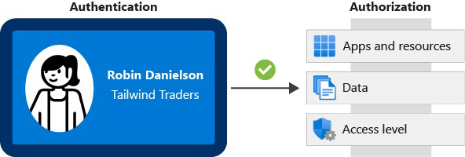
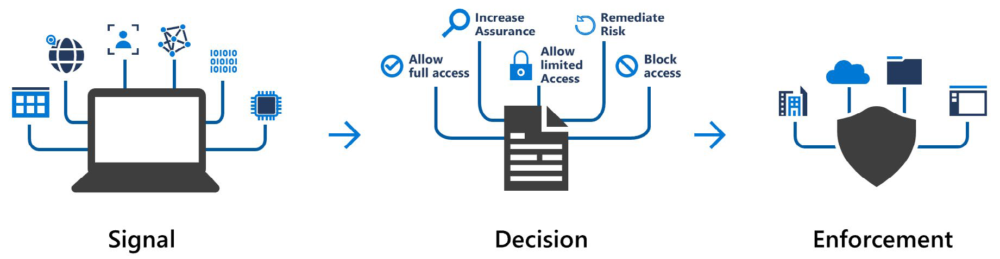
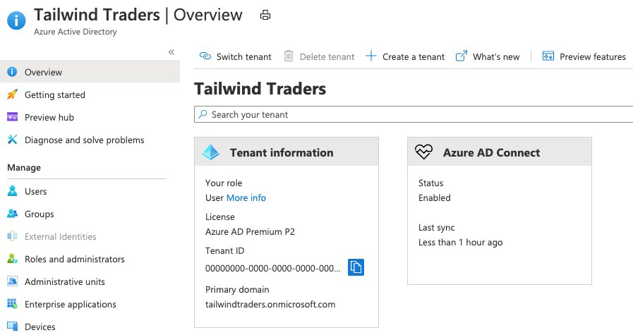
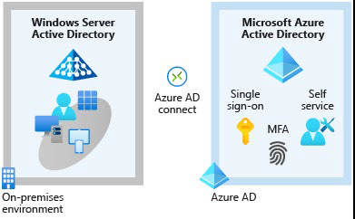

Традиционно защита доступа к системам и данным включала локальный периметр сети и контроль физического доступа.

Благодаря тому, что люди все чаще могут работать из любого места, а также с ростом стратегий «принеси свое собственное устройство» (BYOD), мобильных приложений и облачных приложений, многие из этих точек доступа теперь находятся за пределами физических сетей компании.

Идентичность стала новой основной границей безопасности. Точное доказательство того, что кто-то является действительным пользователем вашей системы с соответствующим уровнем доступа, имеет решающее значение для поддержания контроля над вашими данными. Этот уровень идентификации теперь чаще становится объектом атаки, чем сеть.

## Сравнение аутентификации и авторизации

Две фундаментальные концепции, которые вам нужно понимать, когда речь идет об идентификации и доступе — это аутентификация (AuthN) и авторизация (AuthZ).

Аутентификация и авторизация происходят последовательно в процессе идентификации и доступа.

### Что такое аутентификация?

Проверка подлинности — это процесс установления личности или службы, которые хотят получить доступ к ресурсу. Он устанавливает, является ли пользователь тем, за кого себя выдает.

### Что такое авторизация?

Аутентификация устанавливает личность пользователя, тогда как авторизация — это процесс установления уровня доступа лица или службы, прошедших проверку подлинности. Он определяет, к каким данным им разрешен доступ и что они могут с ними делать.

### Как связаны аутентификация и авторизация?

Вот схема, показывающая связь между проверкой подлинности и авторизацией.

Идентификационная карта представляет учетные данные, которые пользователь должен подтвердить как личность (подробнее о типах учетных данных вы узнаете позже в этом модуле). После проверки подлинности, авторизация определяет, к каким типам приложений, ресурсам и данным пользователь может получить доступ.

## Многофакторная аутентификация и условный доступ

Существует два процесса, обеспечивающих безопасную проверку подлинности: Многофакторная идентификация Azure AD и условный доступ. Начнем с краткого взгляда на то, что такое многофакторная аутентификация в целом.

### Что такое многофакторная аутентификация?

Многофакторная проверка подлинности — это процесс, при котором в процессе входа пользователю предлагается дополнительная форма идентификации. Примеры включают код на их мобильном телефоне или сканирование отпечатков пальцев.

Подумайте о том, как вы входите на веб-сайты, электронную почту или другие онлайн-сервисы. В дополнение к вашему имени пользователя и паролю, вам иногда предлагают ввести дополнительный код, который отправляется на ваш телефон? Если это так, вы использовали многофакторную аутентификацию для входа.

Многофакторная проверка подлинности обеспечивает дополнительную безопасность удостоверений, требуя двух или более элементов для полной проверки подлинности.
 
Эти элементы делятся на три категории:

- **Что-то, что пользователь знает** Это может быть адрес электронной почты и пароль.

- **Что-то, что есть у пользователя** Это может быть код, который отправляется на мобильный телефон пользователя.

- **Что-то от пользователя** Это, как правило, какое-то биометрическое свойство, такое как отпечаток пальца или сканирование лица, которое используется на многих мобильных устройствах.

Многофакторная проверка подлинности повышает безопасность удостоверений, ограничивая влияние раскрытия учетных данных (например, украденных имен пользователей и паролей). При включенной многофакторной проверке подлинности злоумышленнику, у которого есть пароль пользователя, также необходимо иметь при себе телефон или отпечаток пальца, чтобы полностью получить доступ.

Сравним многофакторную аутентификацию с однофакторной аутентификацией. При однофакторной проверке подлинности злоумышленнику потребуются только имя пользователя и пароль для проверки подлинности. Многофакторная проверка подлинности должна быть включена везде, где это возможно, поскольку она добавляет огромные преимущества безопасности.

### Что такое многофакторная идентификация Azure AD?

Многофакторная идентификация Azure AD — это служба Microsoft, предоставляющая возможности многофакторной проверки подлинности. Многофакторная идентификация Azure AD позволяет пользователям выбирать дополнительную форму проверки подлинности во время входа, например телефонный звонок или уведомление мобильного приложения.

Эти службы предоставляют возможности многофакторной идентификации Azure AD.

- **Azure Active Directory** Бесплатный выпуск Azure Active Directory предоставляет многофакторную идентификацию Azure AD для администраторов с глобальным уровнем доступа администратора с помощью приложения Microsoft Authenticator, телефонного звонка или SMS-кода. Вы также можете применить Многофакторную идентификацию Azure AD для всех пользователей только через приложение Microsoft Authenticator, включив параметры безопасности по умолчанию в клиенте Azure AD. Azure Active Directory Premium (лицензии P1 или P2) обеспечивает комплексную и детальную настройку Многофакторной идентификации Azure AD с помощью политик условного доступа (см. краткое объяснение).

- **Многофакторная проверка подлинности для Office 365** Подмножество возможностей Многофакторной идентификации Azure AD является частью вашей подписки на Office 365.

Дополнительные сведения о лицензиях и возможностях Многофакторной идентификации Azure AD см. в статье [Доступные версии Многофакторной идентификации Azure AD](https://docs.microsoft.com/azure/active-directory/authentication/concept-mfa-licensing#available-versions-of-azure-multi-factor-authentication?azure-portal=true).

### Что такое условный доступ?

Условный доступ — это средство, которое Azure Active Directory использует для разрешения (или запрета) доступа к ресурсам на основе сигналов удостоверения. Эти сигналы включают в себя, кто является пользователем, где находится пользователь и с какого устройства пользователь запрашивает доступ.

Условный доступ помогает ИТ-администраторам:

- Предоставьте пользователям возможность быть продуктивными, где бы и когда бы они ни находились.

- Защита активов организации.

Условный доступ также обеспечивает более детальную многофакторную проверку подлинности для пользователей. Например, пользователь может быть допущен для второго фактора проверки подлинности, если он находится на доверенном устройстве. Могут быть не допущены до второго фактора аутентификации, если их сигналы входа необычны или они находятся на другом устройстве.

Во время входа в систему условный доступ собирает сигналы от пользователя, принимает решения на основе этих сигналов, а затем обеспечивает выполнение этого решения, разрешая или отклоняя запрос на доступ или оспаривая ответ проверки подлинности при многофакторности.

Вот схема, иллюстрируя этот поток:

Здесь сигналом может быть местоположение пользователя, устройство пользователя или приложение, к которым пользователь пытается получить доступ.

Основываясь на этих сигналах, решение может заключаться в том, чтобы разрешить полный доступ, если пользователь входит в систему из своего доверенного устройства. Если пользователь входит в систему с устройства, которое помечено как место с высоким риском, то доступ может быть полностью заблокирован или, возможно, предоставлен после того, как пользователь предоставит вторую форму подлинности.

Принудительное исполнение - это действие, которое выполняет решение. Например, действие заключается в том, чтобы разрешить доступ или потребовать от пользователя предоставить вторую форму проверки подлинности.

### Когда можно использовать условный доступ?

Условный доступ полезен, когда:

- Требуется многофакторная аутентификация для доступа к приложению. Можно настроить, требуется ли многофакторная проверка подлинности всем пользователям или только определенным ролям, таким как администраторы. Можно также настроить, будет ли многофакторная проверка подлинности использоваться для доступа из всех сетей или только из ненадежных сетей.

- Требовать доступ к услугам только через одобренные клиентские приложения. Например, может потребоваться разрешить пользователям доступ к службам Office 365 с мобильного устройства, если они используют утвержденные клиентские приложения, например мобильное приложение Outlook.

- Требовать, чтобы пользователи обращались к вашему приложению только с управляемых устройств. Управляемое устройство — это устройство, которое соответствует вашим стандартам безопасности и соответствуют требованиям.

- Блокировка доступа из ненадежных источников, таких как доступ с неизвестных устройств.

Условный доступ поставляется с инструментом «Что если», которое помогает планировать и устранять неполадки политик условного доступа. Это средство можно использовать для моделирования предлагаемых политик условного доступа в ходе недавних попыток входа пользователей, чтобы увидеть, какими были бы последствия, если бы эти политики были включены. Средство «Что если» позволяет протестировать предлагаемые политики условного доступа перед их реализацией.

### Где доступен условный доступ?

Чтобы использовать условный доступ, вам потребуется лицензия Azure AD Premium P1 или P2. Если у вас есть лицензия Microsoft 365 бизнес премиум, у вас также есть доступ к функциям условного доступа.

## Azure Active Directory (AAD)

Начнем с сравнения Azure AD с Active Directory.

### Сравнение Azure AD с Active Directory?

Active Directory связана с Azure AD, но у них есть некоторые ключевые отличия.

Корпорация Microsoft представила Active Directory в Windows 2000, чтобы дать организациям возможность управлять несколькими локальными компонентами инфраструктуры и системами с помощью одного удостоверения для каждого пользователя.

Для локальных сред Active Directory, работающая на Windows Server, предоставляет службу управления удостоверениями и доступом вашей организацией. Azure AD — это облачная служба управления удостоверениями и доступом Microsoft. С помощью Azure AD вы управляете учетными записями удостоверений, но корпорация Microsoft гарантирует, что служба доступна глобально. Если вы работали с Active Directory, Azure AD будет вам знакома.

При локальной защите удостоверений с помощью Active Directory корпорация Microsoft не отслеживает вход в систему. При подключении Active Directory к Azure AD может защитить вас, обнаружив подозрительные попытки входа без дополнительной платы. Например, Azure AD может обнаруживать попытки входа с неизвестных устройств.

### Кто использует Azure AD?

Azure AD предназначен для:

- **ИТ-администраторы** Администраторы могут использовать Azure AD для управления доступом к приложениям и ресурсам в соответствии со своими бизнес-требованиями.

- **Разработчики приложений** Разработчики могут использовать Azure AD, чтобы обеспечить основанный на стандартах подход к добавлению функциональных возможностей в создаваемые ими приложения, например добавление функций единого входа в приложение или предоставление приложению возможности работать с существующими учетными данными пользователя.

- **Пользователи** Пользователи могут управлять своей личностью. Например, самостоятельный сброс пароля позволяет пользователям изменять или сбрасывать свой пароль без участия ИТ-администратора или службы поддержки.

- **Подписчики онлайн-служб** Microsoft 365, Microsoft Office 365, Azure и Microsoft Dynamics CRM Online уже используют Azure AD. Арендатор является представителем организации. A виртуальный образ предприятия обычно отделен от других клиентов и имеет свой собственный идентификатор. Каждый клиент Microsoft 365, Office 365, Azure и Dynamics CRM Online автоматически становится клиентом Azure AD.

Вот снимок экрана, который ИТ-администратор может видеть на портале Azure при работе с Active Directory.

### Какие службы предоставляет Azure AD?

Azure AD предоставляет такие службы, как:

- **Аутентификация** Включает в себя проверку личности для доступа к приложениям и ресурсам. Он также включает в себя предоставление таких функций, как самостоятельный сброс пароля, многофакторная аутентификация, пользовательский список запрещенных паролей и службы интеллектуальной блокировки.

- **Единый вход** SSO позволяет запомнить только одно имя пользователя и один пароль для доступа к нескольким приложениям. Одно удостоверение привязано к пользователю, что упрощает модель безопасности. Когда пользователи меняют роли или покидают организацию, изменения доступа привязаны к этому удостоверению, что значительно снижает затраты, необходимые для изменения или отключения учетных записей.

- **Управление приложениями** Вы можете управлять облачными и локальными приложениями с помощью Azure AD. Такие функции, как прокси приложения, приложения SaaS, портал My Apps (также называемый панелью доступа) и единый вход обеспечивают лучшее взаимодействие с пользователем.

- **Управление устройствами** Наряду с учетными записями для отдельных пользователей Azure AD поддерживает регистрацию устройств. Регистрация позволяет управлять устройствами с помощью таких средств, как Microsoft Intune. Он также позволяет политикам условного доступа на основе устройств ограничивать попытки доступа только тем, которые поступают с известных устройств, независимо от запрашивающей учетной записи пользователя.

### Какие типы ресурсов может помочь защитить Azure AD?

Azure AD помогает пользователям получать доступ как к внешним, так и к внутренним ресурсам.

Внешние ресурсы могут включать Microsoft Office 365, портал Azure и тысячи других приложений SaaS и т.д.
 
Внутренние ресурсы могут включать приложения в корпоративной и интрасети, а также любые облачные приложения, разработанные в вашей организации.

### Что такое единый вход?

Единый вход позволяет пользователю выполнять вход один раз и использовать эти учетные данные для доступа к нескольким ресурсам и приложениям от разных поставщиков.

Больше удостоверений означает больше паролей для запоминания и изменения. Политики паролей могут различаться в зависимости от приложения. По мере увеличения требований к сложности пользователям становится все труднее их запоминать. Чем большим количеством паролей пользователь должен управлять, тем выше риск инцидента безопасности, связанного с учетными данными.

Рассмотрим процесс управления всеми этими удостоверениями. Дополнительная нагрузка на службы поддержки, поскольку они имеют дело с блокировкой учетных записей и запросами на сброс пароля. Если пользователь покидает организацию, отслеживание всех этих удостоверений и обеспечение их отключения может быть сложной задачей. Если удостоверение пропущено, это может привести к нежелательному доступу данных.

При едином входе необходимо запомнить только один идентификатор и один пароль. Доступ между приложениями предоставляется одному удостоверению, привязанному к пользователю, что упрощает модель безопасности. Когда пользователи меняют роли или покидают организацию, доступ привязан к одному удостоверению. Это изменение значительно сокращает усилия, необходимые для изменения или отключения учетных записей. Использование SSO для учетных записей упрощает пользователям управление своими удостоверениями и повышает возможности безопасности.

### Как подключить Active Directory к Azure AD?

Подключение Active Directory к Azure AD позволяет обеспечить согласованное взаимодействие с удостоверениями для пользователей.

Существует несколько способов подключения существующей установки Active Directory к Azure AD. Возможно, самым популярным методом является использование Azure AD Connect.

Azure AD Connect синхронизирует удостоверения пользователей между локальной службой Active Directory и Azure AD. Azure AD Connect синхронизирует изменения между обеими системами удостоверений, поэтому вы можете использовать такие функции, как SSO, многофакторная проверка подлинности и самостоятельный сброс пароля в обеих системах. Самостоятельный сброс пароля не позволяет пользователям использовать известные скомпрометированные пароли.

Ниже приведена схема, на которой показано, как Azure AD Connect вписывается между локальной службой Active Directory и Azure AD.
 

