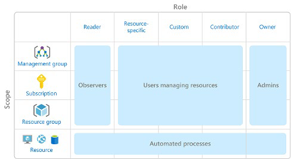
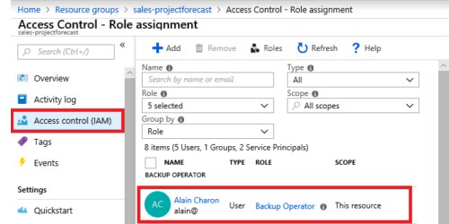
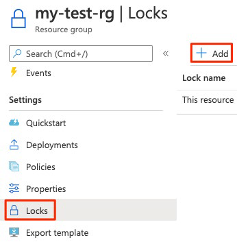
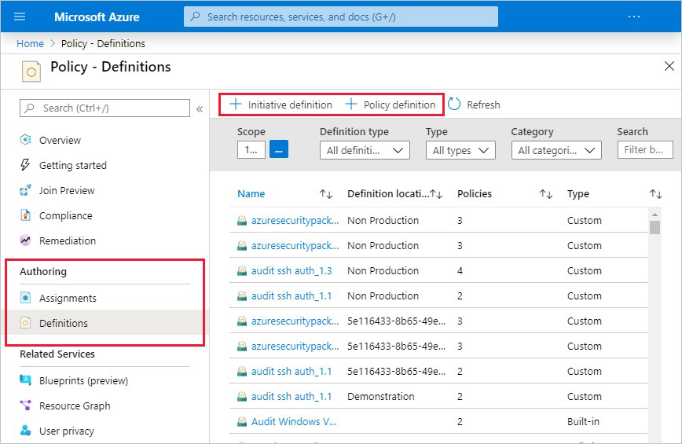
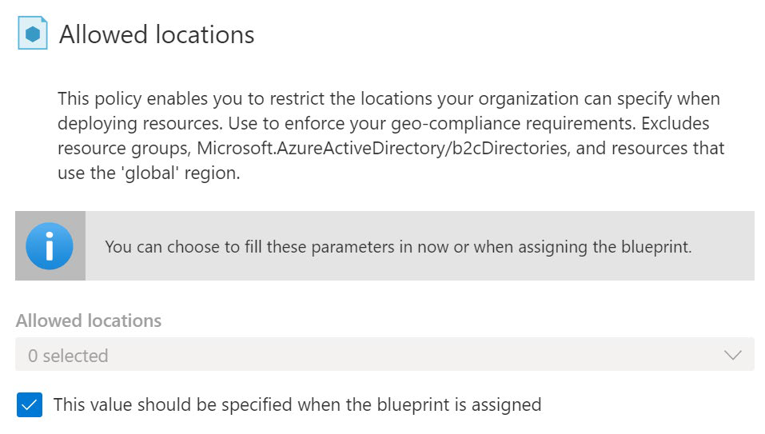
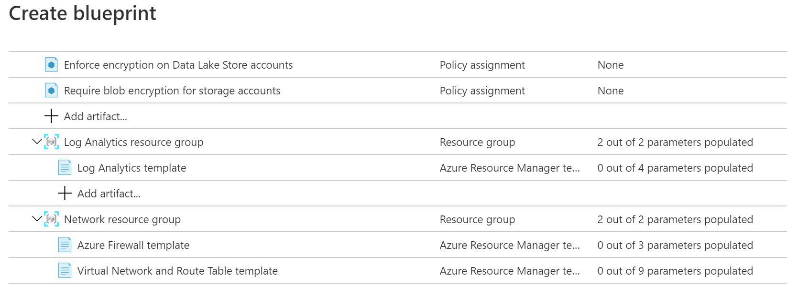

Термин «управление» описывает общий процесс установления правил и политик и обеспечения соблюдения этих правил и политик.

При работе в облаке стратегия эффективного управления помогает сохранить контроль над приложениями и ресурсами, которыми вы управляете в облаке. Сохранение контроля над средой гарантирует соответствие требованиям:

- Отраслевые стандарты, такие как PCI DSS3.

- Корпоративные или организационные стандарты, такие как обеспечение шифрования сетевых данных.

Управление наиболее выгодно, когда у вас есть:

- Несколько инженерных команд, работающих в Azure.

- Несколько подписок для управления.

- Нормативные требования, которые должны соблюдаться.

- Стандарты, которые должны соблюдаться для всех облачных ресурсов.

## Обзор управления доступом на основе ролей (RBAC)

Если у вас есть несколько ИТ- и инженерных команд, как вы можете контролировать, какой доступ они имеют к ресурсам в вашей облачной среде? Хорошей практикой безопасности является предоставление пользователям прав, необходимых только для выполнения их работы, и только к соответствующим ресурсам.

Вместо того чтобы определять подробные требования к доступу для каждого отдельного человека, а затем обновлять требования к доступу при создании новых ресурсов, Azure позволяет управлять доступом с помощью [управления доступом на основе ролей Azure](https://docs.microsoft.com/azure/role-based-access-control/overview?azure-portal=true) (Azure RBAC).

Azure предоставляет встроенные роли, описывающие общие правила доступа к облачным ресурсам. Вы также можете определить свои собственные роли. Каждая роль имеет связанный набор разрешений доступа, связанных с этой ролью. При назначении отдельным пользователям или группам, одной или нескольких ролей они получают все связанные разрешения доступа.

### Как управление доступом на основе ролей применяется к ресурсам?

Управление доступом на основе ролей применяется к области, которая является ресурсом или набором ресурсов, к которым применяется этот доступ.

Ниже приведена схема, показывающая связь между ролями и областями.
 

Области применения включают в себя:

- Группа управления (коллекция из нескольких подписок).

- Единая подписка.

- Группа ресурсов.

- Единый ресурс.

*Наблюдатели, Пользователи, управляющие ресурсами, Администраторы и Автоматизированные процессы* иллюстрируют типы пользователей или учетных записей, которым обычно назначается каждая из различных ролей.

При предоставлении доступа к родительской области эти разрешения наследуются всеми дочерними областями. Для примера:

- Когда вы назначаете роль [Owner](https://docs.microsoft.com/azure/role-based-access-control/built-in-roles?azure-portal=true#owner) пользователю в области группы управления, этот пользователь может управлять всем во всех подписках в группе управления.

- При назначении роли [Reader](https://docs.microsoft.com/azure/role-based-access-control/built-in-roles?azure-portal=true#reader) группе в области подписки члены этой группы могут просматривать каждую группу ресурсов и ресурс в рамках подписки.

- При назначении роли [Contributor](https://docs.microsoft.com/azure/role-based-access-control/built-in-roles?azure-portal=true#contributor) приложению в области группы ресурсов приложение может управлять ресурсами всех типов в этой группе ресурсов, но не другими группами ресурсов в рамках подписки.

### Когда следует использовать Azure RBAC?

Используйте Azure RBAC, когда вам нужно:

- Разрешить одному пользователю управлять виртуальными машинами в подписке, а другому — виртуальными сетями.

- Разрешить группе администраторов баз данных управлять базами данных SQL в подписке.

- Разрешить пользователю управлять всеми ресурсами в группе ресурсов, такими как виртуальные машины, веб-сайты и подсети.

- Разрешить приложению доступ ко всем ресурсам в группе ресурсов.

### Как применяется Azure RBAC?

Azure RBAC применяется к любому действию, инициированное в отношении ресурса Azure, проходящей через диспетчер ресурсов Azure. Resource Manager — это служба управления, которая предоставляет способ организации и защиты облачных ресурсов.

Обычно доступ к диспетчеру ресурсов осуществляется с портала Azure, Azure Cloud Shell, Azure PowerShell и интерфейса командной строки Azure. Azure RBAC не применяет разрешения доступа на уровне приложения или данных. Безопасность приложения должна обрабатываться приложением.

RBAC использует разрешающую модель. Когда вам назначена роль, RBAC позволяет выполнять определенные действия, такие как чтение, запись или удаление. Если одно назначение ролей предоставляет разрешения на чтение группе ресурсов, а другое назначение ролей предоставляет разрешения на запись в одну и ту же группу ресурсов, у вас есть разрешения на чтение и запись в этой группе ресурсов.

### К кому применяется Azure RBAC?

Вы можете применить Azure RBAC к отдельному лицу или группе. Вы также можете применить Azure RBAC к другим специальным типам удостоверений, таким как субъекты-службы и управляемые удостоверения. Эти типы удостоверений используются приложениями и службами для автоматизации доступа к ресурсам Azure.

Например:

- ИТ-администраторы - эта команда управления технологическими активы, как локально, так и в облаке. Команде требуется полный контроль над всеми ресурсами.

- Резервное копирование и аварийное восстановление - эта команда отвечает за управление работоспособностью регулярных резервных копий и вызов любых данных или восстановления системы.

- Затраты и выставление счетов - люди в этой команде отслеживают и сообщают о расходах, связанных с технологиями. Они также управляют внутренними бюджетами организации.

- Операции безопасности - эта команда отслеживает и реагирует на любые инциденты безопасности, связанные с технологиями.

Группе требуется постоянный доступ к файлам журналов и оповещениям системы безопасности.

### Как управлять разрешениями RBAC Azure?

Управление разрешениями доступа осуществляется на панели Управление доступом (IAM) на портале Azure. На этой панели показано, кто имеет доступ к какой области и какие роли применяются. Вы также можете предоставить или удалить доступ из этой панели.

На следующем рисунке показан пример панели Управления доступом (IAM) для группы ресурсов. В этом примере сотруднику (Alain Charon) назначена роль оператора архивации для этой группы ресурсов.
 
 

## Блокировки ресурсов

[Блокировка ресурсов](https://docs.microsoft.com/azure/azure-resource-manager/management/lock-resources?azure-portal=true) предотвращает случайное удаление или изменение ресурсов.

Даже при наличии политик управления доступом на основе ролей Azure (Azure RBAC) по-прежнему существует риск того, что люди с нужным уровнем доступа могут удалить критически важные облачные ресурсы. Думайте о блокировке ресурса как о системе предупреждений, которая напоминает вам, что ресурс не должен быть удален или изменен.

### Как управлять блокировками ресурсов?

Блокировками ресурсов можно управлять с помощью портала Azure, PowerShell, интерфейса командной строки Azure или шаблона диспетчера ресурсов Azure.

Чтобы просмотреть, добавить или удалить блокировки на портале Azure, перейдите в раздел Параметры панели - Параметры любого ресурса на портале Azure.

Ниже приведен пример, в котором показано, как добавить блокировку ресурсов на портале Azure. Аналогичная блокировка ресурса будет применена в следующей части.

### Какие уровни блокировки доступны?

Блокировки можно применять к подписке, группе ресурсов или отдельному ресурсу. Можно установить для уровня блокировки значение CanNotDelete или ReadOnly.

- **CanNotDelete** означает, что авторизованные пользователи по-прежнему могут читать и изменять ресурс, но они не могут удалить ресурс без предварительного снятия блокировки.

- **ReadOnly** означает, что авторизованные люди могут читать ресурс, но они не могут удалить или изменить повторный источник. Применение этой блокировки равнозначно тому, чтобы ограничить всех авторизованных пользователей разрешениями, предоставляемыми ролью читателя в Azure RBAC.
 
### Как удалить или изменить заблокированный ресурс?

Хотя блокировка помогает предотвратить случайные изменения, вы все равно можете вносить изменения, выполнив двухэтапный процесс.

Чтобы изменить заблокированный ресурс, необходимо сначала снять блокировку. После снятия блокировки можно применить любое действие, на выполнение которого у вас есть разрешения. Этот дополнительный шаг позволяет выполнить действие, но помогает защитить администраторов от выполнения действий, которые они, возможно, не намеревались делать.

Блокировки ресурсов применяются независимо от разрешений RBAC. Даже если вы являетесь владельцем ресурса, вы все равно должны снять блокировку, прежде чем сможете выполнить заблокированное действие.

### Объединение блокировок ресурсов с помощью схем элементов Azure

Что делать, если администратор облака случайно удаляет блокировку ресурса? Если блокировка ресурса снята, связанные с ней ресурсы могут быть изменены или удалены.

Чтобы сделать процесс защиты более надежным, можно объединить блокировки ресурсов со схемами элементов Azure. Схемы элементов Azure позволяют определить набор стандартных ресурсов Azure, необходимых вашей организации. Например, можно определить схему элементов, указывая, что должна существовать определенная блокировка ресурсов. Схемы элементов Azure могут автоматически заменить блокировку ресурсов, если она будет удалена.

## Теги

По мере роста использования облака становится все более важным оставаться организованным. Хорошая стратегия организации поможет вам понять использование облака и может помочь вам управлять затратами.

Одним из способов организации связанных ресурсов является размещение их в собственных подписках. Группы ресурсов также можно использовать для управления связанными ресурсами. Теги ресурсов — это еще один способ организации ресурсов. Теги предоставляют дополнительную информацию или метаданные о ваших ресурсах. Эти метаданные полезны для:

- **Теги управления ресурсами** позволяют находить ресурсы, связанные с конкретными рабочими нагрузками, средами, бизнес-подразделениями и владельцами, и работать с ними.

- **Теги управления затратами** и оптимизации позволяют группировать ресурсы, чтобы вы могли отчитываться о затратах, распределять внутренние центры затрат, отслеживать бюджеты и прогнозировать ориентировочные затраты.

- **Теги управления операциями** позволяют группировать ресурсы в соответствие с тем, насколько важна их доступность для вашего бизнеса. Эта группировка помогает формулировать соглашения об уровне обслуживания (SLA). SLA — это гарантия бесперебойной работы или производительности между вами и вашими пользователями.

- **Теги безопасности** позволяют классифицировать данные по уровню безопасности, например, общедоступные или конфиденциальные.

- **Теги соответствия нормативным требованиям** позволяют идентифицировать ресурсы, которые соответствуют требованиям управления или соответствия нормативным требованиям, таким как ISO 27001. Теги также могут помочь при соблюдении стандартов. Например, может потребоваться, чтобы все ресурсы были помечены именем владельца или отдела.

- **Теги оптимизации рабочей нагрузки и автоматизации** могут помочь вам визуализировать все ресурсы, участвующие в сложных развертываниях. Например, можно пометить ресурс соответствующим именем рабочей нагрузки или приложения и использовать программное обеспечение, такое как Azure DevOps, для выполнения автоматизированных задач на этих ресурсах.

### Как управлять тегами ресурсов?

Вы можете добавлять, изменять или удалять теги ресурсов с помощью PowerShell, Azure CLI, шаблонов Azure Resource Manager, REST API или портала Azure.

Вы также можете управлять тегами с помощью политики Azure. Например, можно применить теги к группе ресурсов, но эти теги не применяются автоматически к ресурсам в этой группе ресурсов. Вы можете использовать политику Azure, чтобы гарантировать, что ресурс наследует те же теги, что и его родительская группа ресурсов. Дополнительные сведения о политике Azure вы узнаете позже в этом модуле.

Вы также можете использовать политику Azure для применения правил и соглашений о тегах. Например, можно потребовать, чтобы определенные теги добавлялись к новым ресурсам по мере их подготовки. Можно также определить правила, которые повторно применяют удаленные теги.

## Политики Azure

Теперь, когда вы определили свои требования к управлению и бизнесу, как вы гарантируете, что ваши ресурсы соответствуют требованиям? Как получить предупреждение, если конфигурация ресурса изменилась?

[Политика Azure](https://azure.microsoft.com/services/azure-policy?azure-portal=true) — это служба в Azure, которая позволяет создавать, назначать и управлять политиками, а также контролем или анализом ресурсов. Эти политики применяют различные правила и эффекты к конфигурациям ресурсов, чтобы эти конфигурации соответствовали корпоративным стандартам.

### Как Azure определяет политики?

Azure позволяет определять как отдельные политики, так и группы связанных политик, называемых инициативами. Azure оценивает ресурсы и выделяет ресурсы, которые не соответствуют созданным вами политикам. Azure также может предотвратить создание ресурсов, несоответствующих определенной политике.

Политика Azure поставляется с рядом встроенных определений политик и инициатив, которые можно использовать в таких категориях, как хранилище, сеть, вычислительные ресурсы, центр безопасности и мониторинг.

Предположим, что вы определяете политику, которая позволяет использовать в среде только определенный размер единицы хранения (SKU) виртуальных машин (ВМ). После включения этой политики она применяется при создании новых виртуальных машин или изменения размера существующих виртуальных машин. Политика Azure также оценивает все текущие виртуальные машины в вашей среде.

В некоторых случаях политика Azure может автоматически освободить несовместимые ресурсы и конфигурации, чтобы обеспечить целостность состояния ресурсов. Например, если все ресурсы в определенной группе ресурсов должны быть помечены тегом AppName и значением "SpecialOrders", политика Azure может автоматически повторно применить этот тег, если он был удален.

Политика Azure также интегрируется с Azure DevOps, применяя все политики конвейера непрерывной интеграции и доставки, которые применяются к этапам приложений до и после развертывания.

### Политика Azure в действии

Реализация политики в Azure включает в себя следующие три шага.

1. Создайте определение политики.

2. Присвойте определение ресурсам.

3. Просмотрите результаты оценки.

Рассмотрим каждый шаг более подробно.

#### 1. Создание определения политики

Определение политики выражает что оценивать и какие действия предпринимать. Например, можно запретить развертывание виртуальных машин в определенных регионах Azure. Вы также можете провести аудит учетных записей хранения, чтобы убедиться, что они принимают подключения только из разрешенных сетей.

Каждое определение политики имеет условия, при которых оно применяется. Определение политики также имеет кумулятивный эффект, который имеет место при выполнении условий. Вот несколько примеров определений политик:

- Разрешенные номера SKU виртуальных машин - эта политика позволяет указать набор номеров SKU виртуальных машин, которые могут развертываться вашей организацией.

- Разрешенные расположения - эта политика позволяет ограничить местоположения, которые организация может указать при развертывании ресурсов. Его эффект используется для обеспечения соблюдения ваших требований к географическому соответствию.

- MFA должна быть включена для учетных записей с разрешениями на запись в вашу подписку - эта политика требует, чтобы многофакторная аутентификация (MFA) была включена для всех учетных записей подписки с правами на запись, чтобы предотвратить нарушение учетных записей или ресурсов.

- CORS не должен разрешать каждому ресурсу доступ к вашим веб-приложениям. Обмен ресурсами между ресурсами (CORS) — это функция HTTP, которая позволяет веб-приложению, работающему под одним доменом, получать доступ к ресурсам в другом домене. По соображениям безопасности современные веб-браузеры по умолчанию ограничивают межсайтовые сценарии. Эта политика позволяет взаимодействовать с веб-приложением только необходимым доменам.
 
- Системные обновления должны быть установлены на компьютерах - эта политика позволяет центру безопасности Azure рекомендовать отсутствующие обновления системы безопасности на серверах.

#### 2. Присвойте определение ресурсам

Для реализации определений политики вы назначаете определения ресурсам. Назначение политики — это определение политики, которое имеет место в определенной области. Эта область может быть группой управления (коллекция из нескольких подписок), одной подпиской или группой ресурсов.

Назначения политик наследуются всеми дочерними ресурсами в этой области. Если политика применяется к группе повторного источника, эта политика применяется ко всем ресурсам в этой группе ресурсов. Можно исключить подобласти из назначения политики, если есть определенные дочерние ресурсы, которые необходимо исключить из назначения политики.

#### 3. Обзор результатов оценки

При оценке условия по существующим ресурсам каждый ресурс помечается как соответствующий или несоответствующий. Вы можете просмотреть результаты политики несоответствия и предпринять любые необходимые действия.

Оценка политики происходит примерно раз в час. Если вы вносите изменения в определение политики и создаете назначение политики, эта политика оценивается по ресурсам в течение часа.

### Что такое инициативы политики Azure?

Инициатива политики Azure — это способ группировки связанных политик в один набор. Определение инициативы содержит все определения политик, помогающих отслеживать состояние соответствия для более широкой цели.

Например, политика Azure включает инициативу с именем **Enable Monitoring in Azure Security Center**. Его цель — отслеживать все доступные рекомендации по безопасности для всех типов ресурсов Azure в центре безопасности Azure.

В рамках этой инициативы включены следующие определения политики:

- **Monitor unencrypted SQL Database in Security Center** Эта политика отслеживает незашифрованные базы данных и серверы SQL.

- **Monitor OS vulnerabilities in Security Center** Эта политика отслеживает серверы, которые не соответствуют настроенной базовой линии уязвимости ОС.

- **Monitor missing Endpoint Protection in Security Center** Эта политика отслеживает серверы, на которых не установлен агент защиты конечных точек.

Фактически, инициатива **Enable Monitoring in Azure Security Center** содержит более 100 отдельных определений политик.

Политика Azure также включает инициативы, поддерживающие соответствие нормативным стандартам, таким как HIPAA и ISO 27001.

### Как определить инициативу?

Инициативы определяются с помощью портала Azure или средств командной строки. На портале Azure можно выполнить поиск по списку встроенных инициатив, которые уже предоставлены Azure. Можно также создать собственное определение пользовательской политики.

На следующем рисунке показано несколько примеров инициатив политики Azure на портале Azure.
 
 

### Как назначить инициативу?

Как и назначение политики, назначение инициативы — это определение инициативы, назначенное определенной области группы управления, подписки или группы ресурсов.

Даже если у вас есть только одна политика, инициатива позволяет со временем увеличить количество политик. Поскольку связанная инициатива остается назначенной, проще добавлять и удалять политики без необходимости изменения назначения политики для ресурсов.

## Azure Blueprints

Вы уже изучили ряд функций Azure, которые могут помочь вам реализовать решения по управлению, отслеживать соответствие облачных ресурсов, а также контролировать доступ и защищать критически важные ресурсы от случайного удаления.

Что произойдет, если ваша облачная среда начнет расти за пределы одной подписки? Как вы можете масштабировать конфигурацию этих функций, зная, что они должны быть применены для ресурсов в новых подписках?

Вместо того чтобы настраивать такие функции, как политика Azure, для каждой новой подписки, с помощью [Azure Blueprints](https://azure.microsoft.com/services/blueprints?azure-portal=true) вы можете определить повторяемый набор средств управления и стандартных ресурсов Azure, необходимых вашей организации. Таким образом, команды разработчиков могут быстро создавать и развертывать новые среды, которые ускоряют этапы разработки и развертывания.

Azure Blueprints организует развертывание различных шаблонов ресурсов и других артефактов, таких как:

- Назначение ролей

- Назначение политики

- Шаблоны диспетчера ресурсов Azure

- Группы ресурсов

### Azure Blueprints в действии

При формировании группы специалистов облачного центра передового опыта или группы хранителей облачных вычислений эта группа может использовать Azure Blueprints для масштабирования своих методов управления в масштабах всей организации.

Реализация схемы элементов в Azure Blueprints включает следующие три этапа.

1. Создайте схему элементов Azure.

2. Назначьте схему.

3. Проверяйте справочные схемы.

В Azure Blueprints сохраняется связь между определением схемы элементов (что должно быть развернуто) и назначением схемы элементов (то, что было развернуто). Другими словами, Azure создает запись, которая связывает ресурс со схемой элементов, которая его определяет. Это подключение помогает отслеживать и проводить аудит развертываний.

Справочные схемы также являются версионируемыми. Управление версиями позволяет отслеживать и комментировать изменения в схеме элементов.

### Что такое артефакты в схеме элементов?

Каждый компонент в определении схемы элементов называется артефактом.

Артефакты могут не иметь дополнительных параметров (конфигураций). Примером может быть политика Развертывание обнаружения угроз на серверах SQL, которая не требует дополнительной настройки.

Артефакты также могут содержать один или несколько параметров, которые можно настроить. На следующем снимке экрана показана политика Разрешенные расположения. Эта политика включает параметр, указывающий разрешенные расположения.
 

Значение параметра можно указать при создании определения схемы элементов или при назначении определения схемы элементов области. Таким образом, можно поддерживать одну стандартную схему элементов, но иметь гибкий подход для указания соответствующих параметров конфигурации в каждой области, где назначено определение.

## Платформа внедрения облака Azure

Платформа [Cloud Adoption Framework для Azure](https://docs.microsoft.com/azure/cloud-adoption-framework/?azure-portal=true) предоставляет проверенные рекомендации, которые помогут вам в освоении облака. Cloud Adoption Framework помогает создавать и реализовывать бизнес- и технологические стратегии, необходимые для успеха в облаке.

### Что такое платформа внедрения облачных технологий?

Платформа _Cloud Adoption Framework_ состоит из инструментов, документации и проверенных практик. Платформа внедрения облака включает в себя следующие этапы:

1. Определите свою стратегию.

2. Составьте план.

3. Подготовьте свою организацию.

4. Перейдите в облако.

5. Управляйте облачными средами и управляйте ими.
 

Этап управления фокусируется на управлении облаком. Вы можете обратиться к платформе Cloud Adoption Framework для получения рекомендаций при построении стратегии управления облаком.

Чтобы помочь в построении стратегии внедрения, Cloud Adoption Framework разбивает каждый этап на дальнейшие упражнения и шаги. Давайте кратко рассмотрим каждый этап.

### Определите свою стратегию

Здесь вы отвечаете, почему вы переходите в облако, и что вы хотите получить от миграции в облако. Вам нужно масштабироваться, чтобы удовлетворить спрос или выйти на новые рынки? Снизит ли это затраты или повысит гибкость бизнеса?

Вот шаги на этом этапе.

1. **Определите и задокументируйте свои мотивы**: встреча с заинтересованными сторонами и руководством может помочь вам ответить, почему вы переходите в облако.
 
2. **Документируйте бизнес-результаты**: встречайтесь с руководством ваших групп по финансам, маркетингу, продажам и персоналу, чтобы помочь вам задокументировать свои цели.

3. **Разработайте бизнес-кейс**: убедитесь, что переход в облако дает вам правильную отдачу от инвестиций (ROI) за ваши усилия.
 
4. **Выберите правильный первый проект**: выберите проект, который достижим, а также показывает прогресс в достижении ваших целей миграции в облако.

### Составьте план

Здесь вы строите план, который сопоставляет ваши амбициозные цели с конкретными действиями. Хороший план помогает гарантировать, что ваши усилия соответствуют желаемым бизнес-результатам.

Вот шаги на этом этапе.

1. **Цифровое имущество**: создайте инвентаризацию существующих цифровых активов и рабочих нагрузок, которые планируется перенести в облако.
 
2. **Первоначальное организационное выравнивание**: убедитесь, что в ваших усилиях по миграции участвуют нужные люди, как с технической точки зрения, так и с точки зрения управления облаком.

3. **План готовности к навыкам**: создайте план, который поможет людям развить навыки, необходимые для работы в облаке.
 
4. **План внедрения облака**: создайте комплексный план, объединяющий команды разработчиков, операций и бизнеса для достижения цели внедрения общего облака.

### Подготовьте свою организацию

Здесь вы создаете среду в облаке, чтобы начать размещение рабочих нагрузок.

Вот шаги на этом этапе.

1. **Руководство по установке Azure**: ознакомьтесь с руководством по настройке Azure, чтобы ознакомиться со средствами и подходами, которые необходимо использовать для создания целевой зоны.
 
2. **Целевая зона Azure**: начните создавать подписки Azure, которые поддерживают каждую из основных областей вашего бизнеса. Зона посадки включает в себя облачную инфраструктуру, а также возможности управления, учета и безопасности.

3. **Расширение зоны посадки**: уточните зону посадки, чтобы она соответствовала вашим потребностям в операциях, управлении и безопасности.
 
4. **Рекомендации**: начните с рекомендуемых и проверенных практик, которые помогут обеспечить масштабируемость и поддержку миграции в облако.

### Внедрение облака

Здесь вы начнете переносить свои приложения в облако. По пути вы можете найти способы модернизации своих приложений и создания инновационных решений, использующих облачные сервисы.

Cloud Adoption Framework разбивает этот этап на две части: миграция и инновации.

**Миграция**: вот шаги в части миграции на этом этапе.

1. **Перенос первой рабочей нагрузки**: используйте руководство по миграции Azure для развертывания первого проекта в облаке.
 
2. **Сценарии миграции**: используйте дополнительные подробные руководства для изучения более сложных сценариев миграции.

3. **Рекомендации**: ознакомьтесь с контрольным списком рекомендаций по миграции в облако Azure, чтобы убедиться, что вы следуете рекомендациям.
 
4. **Усовершенствования процессов**: определите способы масштабирования процесса миграции, требуя при этом меньших усилий.

**Инновации**: Вот шаги в инновационной части этого этапа.

1. **Консенсус по ценности бизнеса**: убедитесь, что инвестиции в новые инновации повышают ценность бизнеса и отвечают потребностям клиентов.
 
2. **Руководство по инновациям Azure**: используйте это руководство для ускорения разработки и создания минимально жизнеспособного продукта (MVP) для вашей идеи.

3. **Рекомендации**: перед переходом к работе убедитесь, что ход выполнения соответствует рекомендациям.
 
4. **Петли обратной связи**: постоянно уточняйте требования своих клиентов, чтобы убедиться, что вы создаете то, что им нужно.

### Регулирование облачных сред и управление ими

Здесь вы начинаете формировать свои стратегии управления облаком. По мере изменения облачного имущества с течением времени меняются процессы и политики управления облаком. Необходимо создавать отказоустойчивые решения, которые постоянно оптимизируются.

**Регулирование**: Вот шаги в управляющей части этого этапа.

1. **Методология**: рассмотрите решение конечного состояния. Затем определите методологию, которая постепенно проведет вас от первых шагов до полного управления облаком.
 
2. **Контрольный показатель**: используйте инструмент сравнения управления (https://cafbaseline.com/?azure-portal=true) для оценки вашего текущего состояния и будущего состояния, чтобы установить видение применения структуры.

3. **Первоначальная основа управления**: создайте MVP, который фиксирует первые шаги вашего плана управления.
 
4. **Улучшите первоначальную основу управления**: итеративно добавьте элементы управления, которые устраняют ощутимые риски по мере продвижения к решению конечного состояния.

**Управление**: Вот шаги в части управления на этом этапе.

1. **Установите базовый уровень управления**: определите свою минимальную приверженность управлению операциями. Базовый уровень управления — это минимальный набор инструментов и процессов, которые должны применяться к каждому активу в среде.

2. **Определение бизнес-обязательств**: документирование поддерживаемых рабочих нагрузок для установления операционных обязательств с бизнесом и согласования инвестиций в управление облаком для каждой рабочей нагрузки.

3. **Разверните базовый уровень управления**: примените рекомендации для итерации по исходному базовому плану управления.
 
4. **Расширенные принципы работы и проектирования**: для рабочих нагрузок, требующих высокого уровня бизнес-обязательств, выполните более глубокий анализ архитектуры, чтобы выполнить свои обязательства по отказоустойчивости и надежности.

## Создание стратегии управления подпиской

В начале любой реализации облачного управления вы определяете структуру облачной организации, которая соответствует потребностям вашего бизнеса. Этот шаг часто включает в себя формирование команды облачного центра передового опыта (также называемой командой поддержки облака или командой хранителей облака). Эта группа уполномочена внедрять методы управления из централизованного расположения для всей организации.

Команды часто начинают свою стратегию управления Azure на уровне подписки. При создании подписок и управлении ими необходимо учитывать три основных аспекта: выставление счетов, управление доступом и ограничения подписки.

Рассмотрим каждый из этих аспектов более подробно.

### Выставления счетов

Для каждой подписки можно создать один отчет о выставлении счетов. Если у вас несколько отделов и вам нужно сделать «возвратный платеж» затрат на облако, одним из возможных решений является организация подписок по отделам или проектам.

Теги ресурсов также могут помочь. Вы изучите теги позже в этом модуле. Определяя, сколько подписок вам нужно и как их назвать, учитывайте внутренние требования к выставлению счетов.

### Управление доступом

Подписка — это граница развертывания ресурсов Azure. Каждая подписка связана с клиентом Azure Active Directory. Каждый клиент предоставляет администраторам возможность задать детальный доступ с помощью определенных ролей с помощью управления доступом на основе ролей Azure.

При проектировании архитектуры подписки учитывайте фактор границ развертывания. Например, нужны ли вам отдельные подписки для разработки и для рабочих сред? С помощью отдельных подписок вы можете управлять доступом к каждой из них отдельно и изолировать их ресурсы.
 
### Лимиты подписки

Подписки также имеют некоторые ограничения ресурсов. Например, максимальное количество сетевых каналов Azure ExpressRoute на подписку составляет 10. Эти ограничения следует учитывать на этапе проектирования. Если вам нужно превысить эти ограничения, вам может потребоваться добавить дополнительные подписки. Если вы достигли предела, то, скорее всего, нет никакой возможности для увеличения ресурсов.

Группы управления также доступны для помощи в управлении подписками. Группа управления управляет доступом, политиками и соответствием требованиям для нескольких подписок Azure. Дополнительные сведения о группах управления будут позже в этом модуле.
