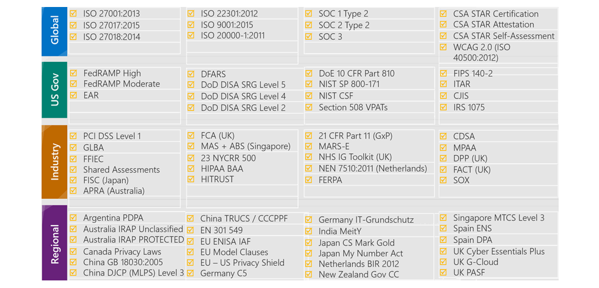
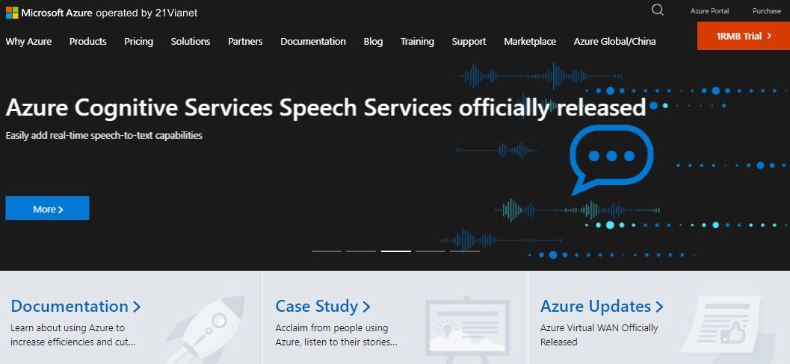

Если ваша организация является государственным департаментом или агентством, или вам необходимо выполнить развертывание в регионах Китая, вы также узнаете о некоторых особенностях, которые не относятся к другим пользователям Azure.

В целом, соблюдение означает соблюдение закона, стандарта или набора руководящих принципов. Соблюдение нормативных требований относится к дисциплине и процессу обеспечения того, чтобы компания соблюдала законы, которые применяют руководящие органы.

## Условия и требования соответствия

В этом блоке вы узнаете о типах предложений соответствия, доступных в Azure.

Важно понимать как Azure соблюдает применимые нормативные требования. Каждую компанию интересует:

- Насколько Azure совместима с обработкой персональных данных?

- Насколько совместимы каждая из отдельных служб Azure?

Веб-службы Microsoft основаны на общем наборе нормативных элементов управления. Элемент управления - хорошо известный стандарт, с которым можно сравнить свое решение для обеспечения безопасности. 

### Какие категории соответствия доступны в Azure?

Хотя их гораздо больше, на следующем рисунке показаны некоторые из наиболее популярных предложений соответствия требованиям, доступных в Azure. Эти предложения сгруппированы по четырем категориям: глобальные, правительственные, отраслевые и региональные.
 
 

Чтобы получить представление о разнообразии предложений по обеспечению соответствия требованиям, доступных в Azure, давайте подробнее рассмотрим некоторые из них.

Хотя не все из этих предложений по соответствию будут актуальны для вас или вашей команды, они показывают, что приверженность Microsoft соответствию является всеобъемлющей, постоянной и независимо проверенной.

### Информационная служба уголовного правосудия

Любое государственное или местное агентство США, которое хочет получить доступ к базе данных Информационных служб уголовного правосудия ФБР (CJIS), обязано придерживаться политики безопасности CJIS.

Azure — единственный крупный поставщик облачных услуг, который по контракту обязуется соблюдать политику безопасности CJIS. Корпорация Microsoft придерживается тех же требований, которым должны соответствовать правоохранительные органы и органы общественной безопасности.

### Сертификация STAR Альянса по облачной безопасности

Azure, Intune и Microsoft Power BI получили сертификат STAR Cloud Security Alliance (CSA), который включает в себя строгую независимую оценку состояния безопасности поставщика облачных услуг.

Сертификация STAR основана на получении сертификата Международной организации стандартов / Международной электротехнической комиссии (ISO / IEC) 27001 и соответствии критериям, указанным в Матрице управления облаком (CCM). Эта сертификация демонстрирует, что поставщик облачных услуг:

- Соответствует применимым требованиям ISO/IEC 27001.

- Решены вопросы, критически важные для облачной безопасности, как описано в СКК.

- Была оценена по модели зрелости возможностей STAR для управления деятельностью в контрольных зонах СКК.

### Типовые положения Европейского союза

Корпорация Microsoft предлагает клиентам стандартные договорные условия Европейского союза (ЕС), которые предоставляют договорные гарантии в отношении передачи персональных данных за пределы ЕС.
 
Microsoft является первой компанией, получившей совместное одобрение рабочей группы ЕС по статье 29 о том, что договорная защита конфиденциальности, которую Azure предоставляет своим корпоративным облачным клиентам, соответствует текущим позициям ЕС для международной передачи данных. Соответствие этому стандарту гарантирует, что клиенты Azure могут использовать службы Microsoft для свободного перемещения данных через облако Microsoft из Европы в остальной мир.

### Закон о переносимости и подотчетности медицинского страхования

Закон о переносимости и подотчетности медицинского страхования (HIPAA) является федеральным законом США, который регулирует защищенную медицинскую информацию о пациентах (PHI).

Azure предлагает клиентам соглашение HIPAA Business Associate Agreement (BAA), в котором предусматривается соблюдение определенных положений о безопасности и конфиденциальности в HIPAA и Hitech Act. Чтобы помочь клиентам в их индивидуальных усилиях по обеспечению соответствия требованиям, корпорация Microsoft предлагает клиентам Azure BAA в качестве дополнительного соглашения к контракту.

### Международная организация стандартов/Международная электротехническая комиссия 27018

Microsoft является первым облачным провайдером, принявшим кодекс практики ISO/IEC 27018, который охватывает обработку личной информации поставщиками облачных услуг.

### Многоуровневая облачная безопасность Сингапур

После тщательной оценки, проведенной органом по сертификации многоуровневой облачной безопасности (MTCS), облачные службы Microsoft получили сертификацию MTCS 584:2013 по всем трем классификациям услуг:

- Инфраструктура как услуга (IaaS)

- Платформа как услуга (PaaS)

- Программное обеспечение как услуга (SaaS)

Корпорация Microsoft является первым глобальным поставщиком облачных решений, получившим эту сертификацию по всем трем классификациям.

### Элементы управления организации обслуживания 1, 2 и 3

Облачные службы, охватываемые корпорацией Microsoft, проверяются не реже одного раза в год на соответствие структуре отчетов По контролю организации служб (SOC) независимыми сторонними аудиторами.

Аудит облачных служб Microsoft охватывает средства управления безопасностью данных, доступностью, целостностью обработки и конфиденциальностью, применимыми к принципам доверия в области для каждой службы.

### Национальный институт стандартов и технологий Cybersecurity Framework

Национальный институт стандартов и технологий (NIST) Cybersecurity Framework (CSF) является добровольной структурой, которая состоит из стандартов, руководящих принципов и лучших практик для управления рисками, связанными с кибербезопасностью.

Облачные службы Microsoft прошли независимые сторонние аудиты Федеральной программы управления рисками и авторизацией (FedRAMP) Moderate and High Baseline. Облачные сервисы Microsoft сертифицированы в соответствии со стандартами FedRAMP.
 
Кроме того, благодаря валидированной оценке, проведенной Альянсом доверия медицинской информации (HI-TRUST), ведущей организацией по разработке и аккредитации стандартов безопасности и конфиденциальности, Office 365 сертифицируется для целей, указанных в NIST CSF.

### G-Cloud для государственных организаций Великобритании

G-Cloud для государственных учреждений Соединенного Королевства (Великобритания) — это сертификация облачных вычислений для услуг, используемых государственными учреждениями в Соединенном Королевстве. Azure получила официальную аккредитацию от правительства Великобритании.

## Заявление о конфиденциальности Microsoft, условия использования веб-служб и дополнительное приложение о защите данных

В этой части вы узнаете, как в Заявлении о конфиденциальности Microsoft, Условиях использования веб-служб и Дополнительном соглашении о защите данных описываются собираемые корпорацией Microsoft персональные данные, как корпорация Microsoft использует их и для каких целей.

### Что говорится в заявлении о конфиденциальности Microsoft?

В [заявлении о конфиденциальности Microsoft](https://privacy.microsoft.com/privacystatement?azure-portal=true) объясняется, какие персональные данные собирает корпорация Microsoft, как корпорация Microsoft использует их и для каких целей.

Заявление о конфиденциальности распространяется на все службы, веб-сайты, приложения, программное обеспечение, серверы и устройства корпорации Microsoft. Этот список варьируется от корпоративных и серверных продуктов до устройств, которые вы используете в своем доме, до программного обеспечения, которое учащиеся используют в школе.

Заявление о конфиденциальности Microsoft также содержит информацию, относящуюся к конкретным продуктам, таким как Windows и Xbox.

### Что есть в условиях использования веб-служб?

[Условия использования веб-служб](https://www.microsoft.com/licensing/terms/product/ForallOnlineServices?azure-portal=true) (OST) — это юридическое соглашение между корпорацией Microsoft и клиентом. OST детализирует обязательства обеих сторон в отношении обработки и безопасности данных клиентов и персональных данных. OST применяется конкретно к веб-службам Microsoft, которые вы лицензируете по подписке, включая Azure, Dynamics 365, Office 365 и Bing Maps.

### Что такое Дополнение о защите данных?

В Дополнительном документе по защите данных (DPA) определяются условия обработки данных и безопасности для онлайн-сервисов. Эти условия включают в себя:

- Соблюдение законов.

- Раскрытие обработанных данных.

- Безопасность данных, которая включает в себя методы и политики безопасности, шифрование данных, доступ к данным, обязанности клиентов и соблюдение аудита.

- Передача, хранение и удаление данных.

Чтобы получить доступ к DPA:

1. Перейдите к [Условиям лицензирования и документации](https://www.microsoftvolumelicensing.com/DocumentSearch.aspx?azure-portal=true).

2. В строке поиска введите DPA.

3. В результатах поиска найдите ссылку на DPA на предпочитаемом вами языке. Кроме того, в появившейся строке поиска введите предпочитаемый язык для фильтрации результатов. Ниже приведен пример, в который извлекается английская версия DPA.
   

Прозрачность важна, когда речь идет о том, как поставщик облачных услуг сообщает о своей политике конфиденциальности и как он обрабатывает ваши данные. В Заявлении о конфиденциальности Microsoft, OST и DPA подробно описываются обязательства корпорации Microsoft по защите данных и конфиденциальности в облаке.

## Центр управления безопасностью

[Центр управления безопасностью](https://www.microsoft.com/trust-center?rtc=1?azure-portal=true) демонстрирует принципы корпорации Microsoft по поддержанию целостности данных в облаке, а также то, как корпорация Microsoft реализует и поддерживает безопасность, конфиденциальность, соответствие требованиям и прозрачность во всех облачных продуктах и службах Microsoft. Центр управления безопасностью является важной частью инициативы Microsoft Trusted Cloud Initiative и предоставляет поддержку и ресурсы для сообщества юристов и соответствия требованиям.

Центр управления безопасностью обеспечивает:

- Подробные сведения о безопасности, конфиденциальности, предложениях соответствия, политиках, функциях и методах использования облачных продуктов Microsoft.

- Дополнительные ресурсы по каждой теме.

- Ссылки на блоги о безопасности, конфиденциальности и соответствии требованиям и предстоящие события.

Центр управления безопасностью — это отличный ресурс для людей в организации, которые могут играть роль в обеспечении безопасности, конфиденциальности и соответствия требованиям. К таким людям относятся бизнес-менеджеры, сотрудники по оценке рисков и конфиденциальности, а также команды по соблюдению правовых норм.

## Документация по соответствию требованиям Azure

Здесь вы узнаете, как получить доступ к подробной документации о правовых и нормативных стандартах и соблюдении нормативных норм в Azure.

Электронная коммерция занимает большую часть рынка ПО. Интернет-магазин позволяет клиентам легко просматривать и заказывать продукты. Клиенты обычно платят кредитной картой, поэтому компания электронной коммерции несет ответственность в соответствии со стандартом безопасности данных индустрии платежных карт (PCI) (DSS). Этот глобальный стандарт, известный как PCI DSS, направлен на предотвращение мошенничества путем усиления контроля над данными кредитных карт. Стандарт применяется к любой организации, которая хранит, обрабатывает или передает платежные данные и данные о держателях карт.

Вам нужно изучить, будет ли размещение приложения электронной коммерции компании в Azure соответствовать стандарту PCI DSS. Начните с документации по соответствию требованиям Azure.

### Что такое документация по соответствию требованиям Azure?

[Документация по соответствию требованиям Azure](https://docs.microsoft.com/azure/compliance/?azure-portal=true) содержит подробную документацию о правовых и нормативных стандартах и соответствии требованиям Azure.

Здесь вы найдете предложения по соответствию в следующих категориях:

- Глобальный

- Правительство США

- Финансовые услуги

- Здоровье

- Медиа и производство

- Региональные

Существуют также дополнительные ресурсы соответствия, такие как отчеты об аудите, сведения о конфиденциальности, реализации и соответствия, а также технические документы и аналитические отчеты. Для доступа к некоторым ресурсам может потребоваться вход в облачную службу.

### Проверка соответствия стандарту PCI DSS

Команда юристов может узнать больше о том, как PCI DSS связан с приложением электронной коммерции компании в Azure.

В качестве дополнительного упражнения можно посмотреть:

1. [Перейдите к документации по соответствию требованиям Azure](https://docs.microsoft.com/azure/compliance/?azure-portal=true).

2. В разделе Финансовые услуги выберите PCI DSS.

   

   Вот вы видите:

   - Обзор стандарта PCI DSS.

   - Как PCI DSS применяется к Microsoft.

   - Какие облачные сервисы находятся в сфере применения.

   - Обзор цикла аудита.

   - Ответы на часто задаваемые вопросы.

   - Дополнительные ресурсы и официальные документы.

### Доступ к дополнительным ресурсам по соответствию требованиям

Из [документации по соответствию требованиям Azure](https://docs.microsoft.com/azure/compliance/?azure-portal=true) можно получить доступ к дополнительным ресурсам соответствия требованиям.

Например, в разделе Аудиторские отчеты можно найти ссылку на [аудиторские отчеты для PCI DSS](https://servicetrust.microsoft.com/ViewPage/MSComplianceGuideV3?docTab=7027ead0-3d6b-11e9-b9e1-290b1eb4cdeb_PCI_DSS?azure-portal=true).

Оттуда вы можете получить доступ к нескольким различным файлам, включая отчеты об аттестации соответствия и матрицу общей ответственности PCI DSS.

В разделе Схемы элементов соответствия требованиям вы найдете справочные схемы элементов или определения политик для общих стандартов, которые можно применить к подписке Azure. [Схема элементов PCI DSS](https://docs.microsoft.com/azure/governance/blueprints/samples/pci-dss-3.2.1/?azure-portal=true) развертывает основной набор политик, которые соответствуют требованиям PCI DSS и помогают управлять рабочими нагрузками Azure в соответствии с этим стандартом.

Затем можно увидеть, правильно ли настроены ресурсы Azure в архитектуре приложения для соответствия требованиям PCI DSS или какие ресурсы необходимо исправить.

Поскольку стандарты развиваются, ИТ-команда компании может периодически проверять отчет аудита, чтобы убедиться, что в Azure есть какие-либо последние изменения.

### Azure Sovereign Regions (us Government services)

[Azure для государственных организаций](https://azure.microsoft.com/global-infrastructure/government?azure-portal=true) — это отдельный экземпляр службы Microsoft Azure. Он учитывает потребности в безопасности и соответствии требованиям федеральных агентств США, правительств штатов и местных органов власти, а также их поставщиков решений. Azure для государственных организаций предлагает физическую изоляцию от развертываний за пределами США.

Службы Azure для государственных организаций обрабатывают данные, на которые распространяются определенные правительственные нормативные акты и требования.

- Федеральная программа управления рисками и авторизацией (FedRAMP)

- Национальный институт стандартов и технологий (NIST) 800.171 Оборонная промышленная база (DIB)

- Правила международной торговли оружием (ITAR)

- Служба внутренних доходов (IRS) 1075

- Министерство обороны (DoD) L4

- Информационная служба уголовного правосудия (CJIS)

Чтобы обеспечить высочайший уровень безопасности и соответствия требованиям, Azure для государственных организаций использует физически изолированные центры обработки данных и сети, расположенные только в США. Клиенты Azure для государственных организаций, такие как федеральные, государственные и местные органы власти США или их партнеры, подлежат проверке соответствия требованиям.

Azure для государственных организаций обеспечивает максимально широкое соответствие требованиям и утверждение DoD уровня 5. Azure для государственных организаций доступна в восьми [географических регионах](https://azure.microsoft.com/global-infrastructure/geographies/#geographies?azure-portal=true) и предлагает наибольшее соответствие требованиям любого поставщика облачных услуг.

### Суверенные регионы Azure (Azure China)

[Azure China 21Vianet](https://docs.microsoft.com/azure/china?azure-portal=true) управляется компанией 21Vianet. Это физически разделенный экземпляр облачных сервисов, расположенных в Китае. Azure China 21Vianet независимо управляется и осуществляется компанией Shanghai Blue Cloud Technology Co., Ltd. («21Vianet»), дочерней компанией Beijing 21Vianet Broadband Data Center Co., Ltd.

Согласно Китайскому регламенту о телекоммуникациях, поставщики облачных услуг, инфраструктуры как услуги (IaaS) и платформы как услуги (PaaS) должны иметь разрешения на телекоммуникации с добавленной стоимостью. Только местные зарегистрированные компании с менее чем 50 процентами иностранных инвестиций имеют право на получение этих разрешений. 

В соответствии с этим правилом служба Azure в Китае управляется 21Vianet на основе технологий, лицензированных корпорацией Microsoft.

Будучи первым иностранным поставщиком общедоступных облачных услуг, предлагаемым в Китае в соответствии с правительственными нормами, Azure China 21Vianet обеспечивает безопасность мирового класса, как описано в [Центре управления безопасностью](https://www.trustcenter.cn/compliance/default.html?azure-portal=true), в соответствии с требованиями китайских правил для всех систем и приложений, построенных на его архитектуре.

### Продукты и службы Azure, доступные в Китае

Службы Azure основаны на тех же технологиях Azure, Office 365 и Power BI, которые составляют глобальную облачную службу Microsoft, с сопоставимыми уровнями обслуживания. Соглашения и контракты Azure в Китае, где это применимо, подписываются между клиентами и 21Vianet.

Azure включает основные компоненты IaaS, PaaS и программного обеспечения как услуги (SaaS). Эти компоненты включают в себя сеть, хранилище, управление данными, управление идентификацией и многие другие службы.

Azure China 21Vianet поддерживает большинство тех же служб, что и глобальная Azure, таких как геосинхронная репликация данных и автоматическое масштабирование. Даже если вы уже используете глобальные службы Azure, для работы в Китае может потребоваться повторное размещение или рефакторинг некоторых или всех приложений или служб.
