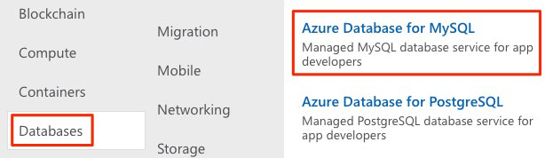
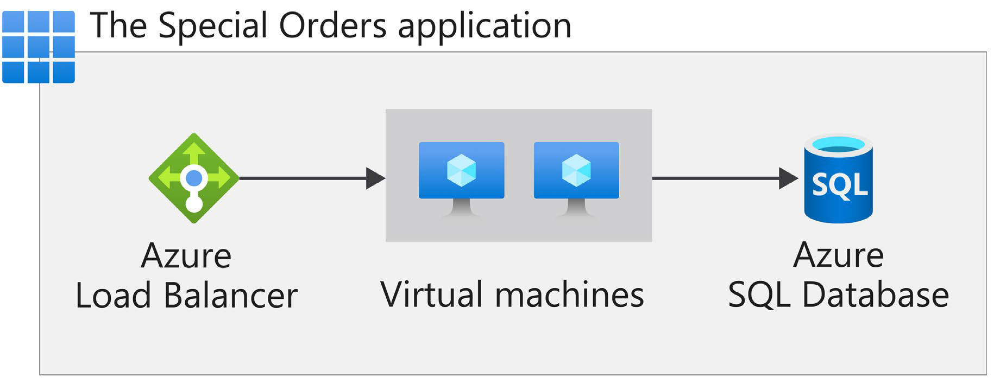
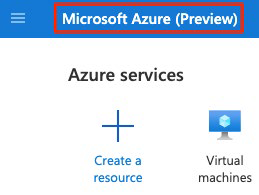
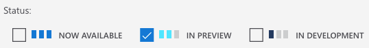

# Соглашения об уровнях обслуживания Azure и жизненных циклах служб

В этом модуле вы узнаете о соглашениях об уровне обслуживания (SLA) в Azure и о том, как они могут повлиять на решения по проектированию приложений. Вы также узнаете о жизненном цикле новых служб Azure от предварительной версии до общедоступной версии.

## Соглашения об уровне обслуживания(SLA) 

Соглашение об уровне обслуживания (SLA) — это официальное соглашение между сервисной компанией и клиентом. Для Azure это соглашение определяет стандарты производительности, которые корпорация Microsoft обязуется соблюдать для вас и ваших заказчиков.

В этой части вы узнаете больше об условиях SLA Azure, в том числе о том, почему SLA важны, где можно найти SLA для конкретной службы Azure и что вы будете делать. 

### Почему важны SLA? 

Понимание соглашений об УКЛ для каждой службы Azure, которую вы используете, помогает понять, на какие гарантии можно рассчитывать.

При построении приложений в Azure доступность используемых служб влияет на производительность приложения. Понимание соглашений об услуге может помочь вам установить SLA.

Далее в этом модуле вы узнаете о некоторых стратегиях, которые можно использовать, когда Azure SLA не соответствует вашим потребностям.

### Где можно получить доступ к службам SLA для служб Azure? 

Доступ к соглашениям об уровне обслуживания можно получить из [соглашений об уровне обслуживания](https://azure.microsoft.com/support/legal/sla/?azure-portal=true).

**Прим.**: Для просмотра соглашения об обслуживании служб подписка Azure не требуется. 

Каждая служба Azure определяет собственное соглашения об обслуживании. Службы Azure организованы по категориям.

Откройте SLA для базы данных Azure для MySQL, управляемой базы данных, которая упрощает разработчикам работу с базами данных MySQL. 

Для этого: 

1. Перейдите в [соглашение об уровне обслуживания](https://azure.microsoft.com/support/legal/sla/?azure-portal=true).

2. В категории Базы данных выберите База данных Azure для MySQL.
 

 
### Что есть в типовом SLA? 

Типовое SLA разбивается на следующие разделы:

- **Введение** В этом разделе объясняется, чего ожидать в соглашении об уровне sla, включая его область применения и то, как продление подписки может повлиять на условия.

- **Общие термины** Этот раздел содержит термины, которые используются во всем соглашении об УКЛ, чтобы обе стороны (вы и Корпорация Microsoft) имели согласованный словарный запас. Например, в этом разделе может быть определено, что подразумевается под временем простоя, инцидентами и кодами ошибок. Этот раздел также определяет общие условия соглашения, в том числе как подать претензию, получить кредит за любые проблемы с исполнением или доступностью, а также лимиты договора.

- **Сведения об SLA** В этом разделе определяются конкретные гарантии для службы. Обязательства по результатам обычно измеряются в процентах. Этот процент обычно колеблется от 99,9 процента («три девятки») до 99,99 процента («четыре девятки»). Основное обязательство по производительности обычно фокусируется на времени безотказной работы или проценте времени, в которое продукт или услуга успешно функционируют. Некоторые SLA также фокусируются на других факторах, включая задержку или скорость ответа службы на запрос. В этом разделе также определяются любые дополнительные условия, относящиеся к данной службе.

Вы видите, что это SLA фокусируется в основном на времени безотказной работы. База данных Azure для MySQL гарантирует 99,99% или «четыре девятки», время безотказной работы. Это означает, что служба гарантированно работает и доступна для обработки запросов в 99,99% случаев.

### Как проценты соотносятся с общим временем простоя?

_Время простоя_ относится к продолжительности недоступности службы. 

Разница между 99,9% и 99,99% может показаться незначительной, но важно понизить, что эти цифры означают с точки зрения общего времени простоя.

Вот таблица, которая даст вам представление о том, как общее время простоя уменьшается по мере увеличения процента SLA с 99% до 99,999%: 

| Процент SLA | Время простоя в неделю | Время простоя в месяц | Время простоя в год |
| --- | --- | --- | --- |
| 99 | 1.68 часов | 7.2 час | 3.65 дней | 
| 99.9 | 10.1 мин.| 43.2 мин | 8.76 часы | 
| 99.95 | 5 минуты | 21.6 минуты | 4.38 часы |
| 99.99 | 1.01 мин. | 4.32 мин. | 52 мин.56 |
| 99.999 | 6 секунд | 25.9 секунды | 5.26 минут |

Эти суммы являются кумулятивными, что означает, что продолжительность нескольких различных отключений услуг будет объединена или суммирована вместе.

### Что такое сервисные кредиты?

_Кредит на обслуживание_ - это процент от уплаченных вами сборов, которые зачисляются вам обратно в соответствии с процессом утверждения претензии. 

Соглашения об узле описывают, как корпорация Microsoft реагирует, когда служба Azure не выполняет свою спецификацию. Например, вы можете получить скидку на счет Azure в качестве компенсации, если служба не выполняет работу в соответствии с ее SLA. 
 
Кредиты обычно увеличиваются по мере уменьшения времени безотказной работы. Ниже приведено применение кредитов для базы данных Azure MySQL в соответствии с временем безотказной работы: 

| Ежемесячный процент безотказной работы | Процент кредита на обслуживание |
| --- | --- |
| < 99,99 | 10 |
| < 99 | 25 |
| < 95 | 100 |

### Что такое SLA для бесплатных услуг?

Бесплатные продукты обычно не имеют соглашения об узле. 

Например, многие службы Azure предоставляют бесплатный или общий уровень, который предоставляет более ограниченные функциональные возможности. Такие службы, как Советник Azure, всегда бесплатны. В [SLA для Azure Advisor](https://azure.microsoft.com/support/legal/sla/advisor/?azure-portal=true) говорится, что, поскольку он бесплатный, он не имеет финансово обеспеченного SLA.

### Как узнать, что произошел сбой? 

[Состояние Azure](https://status.azure.com/status?azure-portal=true) предоставляет глобальное представление работоспособности служб и регионов Azure. Если вы подозреваете, что произошел сбой, это часто повод для начала расследования.

Состояние Azure предоставляет RSS-канал изменений в работоспособности служб Azure, на которые можно подписаться.

Вы можете подключить этот канал к коммуникационному программному обеспечению, такому как Microsoft Teams или Slack. 

На странице состояния Azure вы также можете получить доступ к работоспособности службы Azure. Это обеспечивает персонализированное представление работоспособности служб Azure и регионов, которые вы используете, непосредственно на портале Azure. 

### Как запросить кредит на обслуживание в корпорации Microsoft?

Как правило, для получения кредита на обслуживание необходимо подать претензию в корпорацию Microsoft. Если вы приобретаете службы Azure у партнера поставщика облачных решений (CSP), ваш CSP обычно управляет процессом утверждений. 

Каждое состояние SLA определяет сроки, по которым вы должны отправить свою претензию, и когда корпорация Microsoft обрабатывает вашу претензию. Для многих услуг вы должны подать свою заявку к концу календарного месяца, следующего за месяцем, в котором произошел инцидент. 

## Определение соглашения об узле на узле приложения 

Соглашения об узле приложения определяют требования для конкретного приложения. Этот термин обычно относится к приложению, построенному на Azure. 

Существует множество проектных решений, которые можно принять для повышения доступности и отказоустойчивости применений и служб, создаваемых в Azure. Эти решения выходят за рамки только SLA для конкретной службы. 

Для начала обсудите с вашей командой, насколько важна доступность каждого приложения для вашего бизнеса. 

### Влияние на бизнес

Если приложение выйдет из строя, каково будет влияние на бизнес? В этом случае клиенты не могут использовать сервисы компании. Клиентам нужно будет либо повторить попытку позже, либо, возможно, перейти к конкуренту. 

### Шаблоны использования

Шаблоны использования определяют, когда и как пользователи получают доступ к приложению. 

Один из вопросов, который следует рассмотреть, заключается в том, отличается ли требование доступности между критическими и некритичными периодами времени.  

## Действия, влияющие на SLA

Допустим, что SLA в размере 99,9% является приемлемым для приложения Специальные ордера. 

Напомним, что это дает компании расчетное время простоя в 10,1 минуты в неделю. 

Теперь вам нужно разработать эффективное и надежное решение для этого приложения в Azure, помня о соглашении об УКЛ этого приложения. Вы выберете необходимые продукты и службы Azure и подготовите облачные ресурсы в соответствии с этими требованиями.

В реальности неудачи будут случаться. Аппаратное обеспечение может выйти из строя. Сеть может иметь нестабильное соединение. Хотя для целой службы или региона редко возникают сбои, вам все равно нужно планировать такие события.

### Определение рабочих нагрузок

_Рабочая нагрузка_ — это отдельная возможность или задача, которая логически отделена от других задач с точки зрения бизнес-логики и требований к хранению данных. Каждая рабочая нагрузка определяет набор требований к доступности, масштабируемости, согласованности данных и аварийному восстановлению.

Например, в Azure для приложения требуется: 

- Две виртуальные машины.

- Один экземпляр базы данных SQL Azure. 

- Один экземпляр подсистемы балансировки нагрузки Azure. 

Вот схема, которая показывает базовую архитектуру: 

 

### Объединение SLA для вычисления составного SLA

После того как вы определили SLA для отдельных рабочих нагрузок, вы можете заметить, что эти SLA не все одинаковы. Как это влияет на общее SLA в размере 99,9%? Чтобы решить эту задачу, нужно будет выполнить некоторые математические расчеты. 

Процесс объединения SLA помогает вычислить составное SLA для набора служб. Для вычисления составного SLA необходимо умножить SLA каждой отдельной службы.

Из [соглашений об уровне обслуживания](https://azure.microsoft.com/support/legal/sla/?azure-portal=true) вы найдете соглашение об уровне обслуживания для каждой необходимой службы Azure. Это: 

| Служба | SLA |
| --- | --- |
| Виртуальные машины Azure | 99,9% | 
| База данных SQL Azure | 99,99% | 
| Балансировщик нагрузки Azure | 99,99% | 

Поэтому для применения специальных заказов составное SLA будет вытекать:

`(99.9% × 99.9%) × 99.99% × 99.99% = (0.999 × 0.999) × 0.9999 × 0.9999 = 0.9978 = 99.78%`

Напомним, что вам понадобятся две виртуальные машины. Таким образом, в формулу включается средняя стоимость виртуальных машин в размере 99,9%. 

Обратите внимание, что, несмотря на то, что все отдельные службы имеют соглашения об уровнях обслуживания, равных или превышающих SLA приложения, их объединение приводит к общему числу, которое ниже, чем 99,9 процента. Почему? Потому что использование нескольких сервисов добавляет дополнительный уровень сложности и немного увеличивает риск сбоя.

Здесь вы видите, что составное SLA 99,78% не соответствует требуемому SLA 99,9%. Вы можете вернуться в команду и спросить, приемлемо ли это. Или вы можете внедрить некоторые другие стратегии в свое проектное решение, чтобы улучшить это SLA.

### Что происходит, когда составное SLA не соответствует вашим потребностям?

Для приложения составное SLA не соответствует требуемому SLA в размере 99,9%. 

#### Выберите параметры настройки, которые соответствуют требуемому SLA

Каждая из рабочих нагрузок, определенных ранее, имеет собственное SLA, и выбор настройки, который вы делаете при подготовке каждой рабочей нагрузки, влияет на это SLA. Например:

- **Диски** с виртуальными машинами, вы можете выбрать стандартный управляемый жесткий диск, стандартный управляемый диск SSD или SSD класса Premium или Ultra Disk. SLA для одной виртуальной машины будет составлять 95%, 99,5% или 99,9% в зависимости от выбора диска. 

- **Уровни** Некоторые службы Azure предлагаются как продукт уровня бесплатного пользования, так и как стандартная платная служба. Например, служба автоматизации Azure предоставляет 500 минут выполнения задания в бесплатной учетной записи Azure, но не поддерживается соглашения об узле. Уровень SLA уровня "Стандартный" для службы автоматизации Azure составляет 99,9 процента.

Убедитесь, что при принятии решений о покупке учитывается влияние на условия SLA для выбираемых служб Azure. Это гарантирует, что SLA поддерживает требуемое SLA приложения. 

#### Встройте требования к доступности в свой проект

Существуют рекомендации по проектированию приложений, которые можно использовать и которые относятся к базовой облачной инфраструктуре. 

Например, чтобы улучшить доступность приложения, избегайте наличия каких-либо единичных точек отказа. Таким образом, вместо добавления дополнительных виртуальных машин можно развернуть один или несколько дополнительных экземпляров одной и той же виртуальной машины в разных зонах доступности в тот же регион Azure.

Зона доступности — это уникальное физическое расположение в регионе Azure. Каждая зона состоит из одного или нескольких центров обработки данных, оснащенных независимым питанием, охлаждением и сетью. Эти зоны используют разные расписания обслуживания, поэтому если затронута одна зона, экземпляр виртуальной машины в другой зоне не будет затронут. 

Развертывание двух или более экземпляров виртуальной машины Azure в двух или более зонах доступности повышает SLA виртуальных машин до 99,99 процента. Пересчет составного SLA в таком случае будет следующим: 

`(99.99% × 99.99%) × 99.99% × 99.99% = 99.96%`

Это пересмотренное SLA в размере 99,96 процента превышает ваш целевой показатель в 99,9 процента.

Чтобы узнать больше об SLA для виртуальных машин, посетите страницу [SLA для виртуальных машин](https://azure.microsoft.com/support/legal/sla/virtual-machines?azure-portal=true).

#### Включение избыточности для повышения доступности

Чтобы обеспечить высокую доступность, можно запланировать дублирование компонентов приложения в нескольких регионах, называемое избыточностью. И наоборот, чтобы свести к минимуму затраты в некритических периодах, приложение можно запускать только в одном регионе. 

Чтобы обеспечить максимальную доступность в приложении, добавьте избыточность к каждой части приложения. Эта избыточность включает в себя само приложение, а также базовые службы и инфраструктуру. Имейте в виду, что это может быть сложно и дорого, и часто приводит к решениям, которые являются более сложными, чем они должны быть.

Подумайте, насколько важна высокая доступность для ваших требований, прежде чем добавлять избыточность. Могут быть более простые способы выполнения SLA приложения. 

#### Очень высокую производительность трудно достичь

Целевые показатели выше 99,99 процента очень трудно достичь. SLA 99,99% означает 1 минуту простоя в неделю. Людям трудно реагировать на сбои достаточно быстро, чтобы достичь целевых показателей производительности SLA выше 99,99 процента. Вместо этого ваше приложение должно иметь возможность самостоятельной диагностики и самовосстановления во время отключения.

## Предварительная версия программы Azure, службы мониторинга и обновлений компонентов 

Одним из вариантов изучения новых возможностей является просмотр предварительных версий сервисов. В этой части вы узнаете, как службы Azure переходят от этапа предварительной версии к общедоступности. 

### Каков жизненный цикл службы? 

Жизненный цикл службы определяет, как каждая служба Azure выпускается для общедоступного использования.

Каждая служба Azure запускается на этапе разработки. На этом этапе группа Azure собирает и определяет свои требования и начинает построение службы. 

Затем служба выходит на стадию общедоступной предварительной версии. На этом этапе общественность может получить доступ и экспериментировать с ним, чтобы она могла обеспечить обратную связь. Ваши отзывы помогают корпорации Microsoft улучшить службы. Что еще более важно, предоставление обратной связи дает вам возможность запрашивать новые или другие возможности, чтобы услуги лучше соответствовали вашим потребностям.
 
После проверки и тестирования новой службы Azure она выпускается для всех клиентов как готовая к работе служба. Это называется общедоступной доступностью (GA).

### На какие условия я могу рассчитывать?

Каждая предварительная версия Azure определяет свои собственные условия и положения. Все условия и положения, относящиеся к предварительной версии, дополняют существующее соглашение об обслуживании Azure. 

Некоторые предварительные версии не охватываются службой поддержки клиентов. Поэтому предварительные версии не рекомендуются для критически важных рабочих нагрузок.

### Как получить доступ к службам предварительного просмотра?

Доступ к службам предварительной версии можно получить на портале Azure. 

Как узнать, какие службы предварительной версии доступны? Вы можете следить за этим, если у вас есть подписка Azure.

1. Перейдите на [портал Azure](https://portal.azure.com?azure-portal=true) и войдите в систему.

2. Выберите **Создать ресурс**.

3. Введите _preview_ в поле поиска и выберите **Ввод**.

4. Выберите услугу, чтобы узнать о ней больше. Вы также можете запустить сервис, если хотите его попробовать. 

### Как получить доступ к новым функциям для существующей службы? 

Некоторые функции предварительной версии относятся к определенной области существующей службы Azure. Например, служба вычислений или базы данных, используемая ежедневно, может предоставлять расширенные функциональные возможности. Эти функции предварительной версии доступны при развертывании, настройке и управлении службой. 

Хотя вы можете использовать функцию предварительной версии Azure в рабочей области, убедитесь, что вы знаете о любых ограничениях, окружающих ее использование, прежде чем развертывать ее в рабочей области.

### Как получить доступ к функциям предварительной версии портала Azure? 

Доступ к функциям предварительной версии, относящимся к порталу Azure, можно получить из [Microsoft Azure (preview)](https://preview.portal.azure.com?azure-portal=true).

Типичные функции предварительной версии портала обеспечивают повышение производительности, навигации и специальных возможностей интерфейса портала Azure. 

Вы видите Microsoft Azure (предварительная версия) рядом со строкой меню, чтобы напомнить вам, что вы работаете с предварительной версией портала Azure. 
 

 
Как оставить отзыв на портале Azure? 

Вы можете оставить отзыв:

- На вкладке **Отзывы** на портале Azure. 
 
- На [форуме отзывов портала Azure](https://feedback.azure.com/forums/223579-azure-portal?azure-portal=true). 

### Как я могу быть в курсе последних объявлений?

На странице [Обновлений Azure](https://azure.microsoft.com/updates?azure-portal=true) содержатся сведения о последних обновлениях продуктов, служб и функций Azure, а также о планах и объявлениях о продуктах. 

На странице обновлений Azure вы можете: 

- Просмотреть сведения обо всех обновлениях Azure. 

- Посмотреть какие обновления находятся в общедоступной версии, предварительном просмотре или разработке. 

  

- Просмотреть обновления по категории продукта или типу обновления. 

- Осуществить поиск обновлений по ключевому слову.

- Подписаться на RSS-канал для получения уведомлений.

- Перейти на страницу Microsoft Connect, чтобы прочитать новости и объявления о продуктах Azure. 
